[00:00:01](https://10pearls.udemy.com/course/mlops-zero-to-hero/learn/lecture/53700691#overview)

### MLOps Model Deployment vs. Manual Serving

- **Manual Deployment Process** (previously covered):
    - Use `git clone` to download the repository
    - Run `train.py` to create the model
    - Run `app.py` to create the API for model serving
- **Model Serving Flow**:
    - User sends a request to the API
    - API sends the request to the model
    - Model returns the response back to the user
- **Transition to MLOps**:
    - While manual commands work for simple setups, MLOps implements a more complex architecture to handle professional-grade model deployment and solving using virtual machines.

### Challenges with Manual Deployment Architecture

- **Lack of Concurrency in Development Servers**
    - Running `python app.py` triggers a development server (e.g., via the Flask framework)
    - **[The Problem]** Development servers are not designed for concurrency
        - They work fine for a few users (2-3 users)
        - They fail to handle high loads (100 to 1000+ concurrent requests)
    - **[Real-world Impact]** In an enterprise setting (like Netflix), services must handle thousands of simultaneous requests from users globally; a development server would act as a roadblock/blocker in this scenario.

### Additional Deployment Challenges

- **Short Lifespan of the Running Process**
    - When running `python app.py`, the process runs as a **foreground process**
    - **[The Problem]** If the terminal or session (e.g., via Putty) is closed, the API stops working immediately
    - **[Even with Background Processes]** Even if run as a background process, the API will not automatically restart if the Linux virtual machine restarts
- **Single Virtual Machine Limitations**
    - A single virtual machine cannot handle the scale required in real-time production environments

### Single Virtual Machine Resource Exhaustion

- **Resource Limits**
    - Even a powerful VM (e.g., 32 CPU, 32 GB RAM) has finite capacity
    - **[The Problem]** High volumes of requests (e.g., 10,000 to 40,000 requests) can exhaust all available CPU and RAM
- **Scaling Requirements**
    - Once resources are exhausted, additional virtual machines are required to handle the load
    - The number of machines needed depends on the scale of the operation
        - A startup might only need 2 VMs
        - An enterprise like Netflix might need 10 or more
- **Static vs. Dynamic Scaling**
    - **[Why Dynamic?]** Demand is often non-linear and fluctuates throughout the day
        - Example: A service might need only 2 VMs in the morning but 5 VMs during evening peak hours
    - **[Benefit]** Dynamic scaling allows the infrastructure to expand during peak times and contract during low-use periods to prevent excessive costs

### The Role of a Load Balancer

- **[Why use it?]** Because when you have multiple instances (from dynamic scaling), you need a way to distribute incoming traffic
- **Functionality**: It balances the load between different virtual machines to ensure no single machine is overloaded
    - Example: If you receive 3,000 requests, a load balancer can distribute them evenly (e.g., 1,000 requests to the first VM, 1,000 to the second, and 1,000 to the third)

### Summary of Previous Architecture Drawbacks

- **Single Machine Limitation**: Relying on one machine is insufficient for production scale
- **Lack of Networking Control**: The previous setup lacked implementation of:
    - Custom networking
    - Subnets

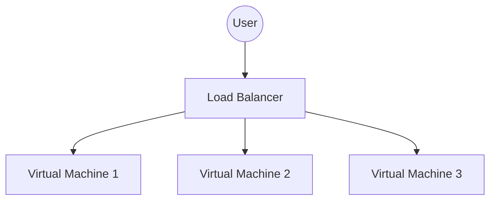

### Transitioning to Production Architecture

To resolve the limitations of the manual deployment model, three key areas must be addressed:

#### 1. Custom Networking via VPC

- **[Solution]** Implement a Virtual Private Cloud (VPC) on the cloud platform
    - A VPC provides a logically isolated section of the cloud where you can launch resources
    - This involves setting up foundational networking components:
        - Subnets
        - Route tables
        - Internet gateways

#### 2. Production-Grade Web Serving with WSGI

- **[The Problem]** The previous architecture relied on a development server, which lacks the concurrency needed for production
- **[Solution]** Use **WSGI** (Web Server Gateway Interface)
    - WSGI converts a development server into a production-ready web server
    - **[How it works]** It allows for parallelism by running multiple workers based on the expected user load
        - Example: Running WSGI with a parallelism of 3, 4, or 5 to handle concurrent requests

#### 3. Dynamic Scaling via Auto Scaling Groups

- **[The Problem]** Manual scaling is inefficient and cannot react to fluctuating traffic
- **[Solution]** Implement **Auto Scaling Groups**
    - This automates the process of adding or removing virtual machines to match real-time demand

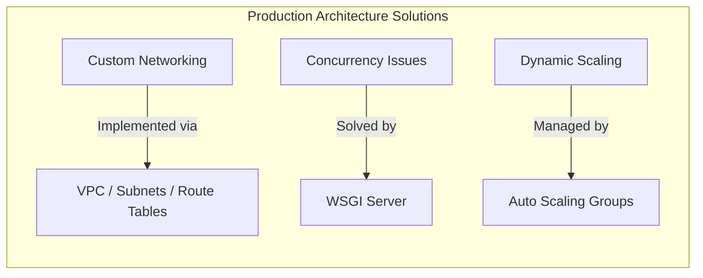

### Implementation of Auto Scaling and Load Balancing

#### Auto Scaling Groups (ASG)

- **[How it works]** Automatically manages the number of virtual machines based on real-time demand
    - The group monitors resource usage (CPU and memory)
    - When resources are exhausted (e.g., traffic jumps from 1,000 to 5,000 users), the ASG triggers the creation of new instances
- **[The Automation Loop]** Uses a **Launch Template** to automate setup:

    1. **Launch Template**: A predefined configuration for the new instance
    2. **Script**: A script provided within the template that runs automatically upon startup
    3. **Configuration**: The script ensures everything is ready immediately (e.g., the model, the API, and all necessary dependencies)

#### Load Balancers (LB)

- **[Role]** Acts as the entry point for requests to ensure no single instance is overwhelmed
- **[Integration]** Cloud providers allow easy integration between the LB and the ASG:
    - The Load Balancer is configured with a **Target Group (TG)**
    - The Auto Scaling Group is added as the target for the Load Balancer, so new instances are automatically included in the traffic distribution

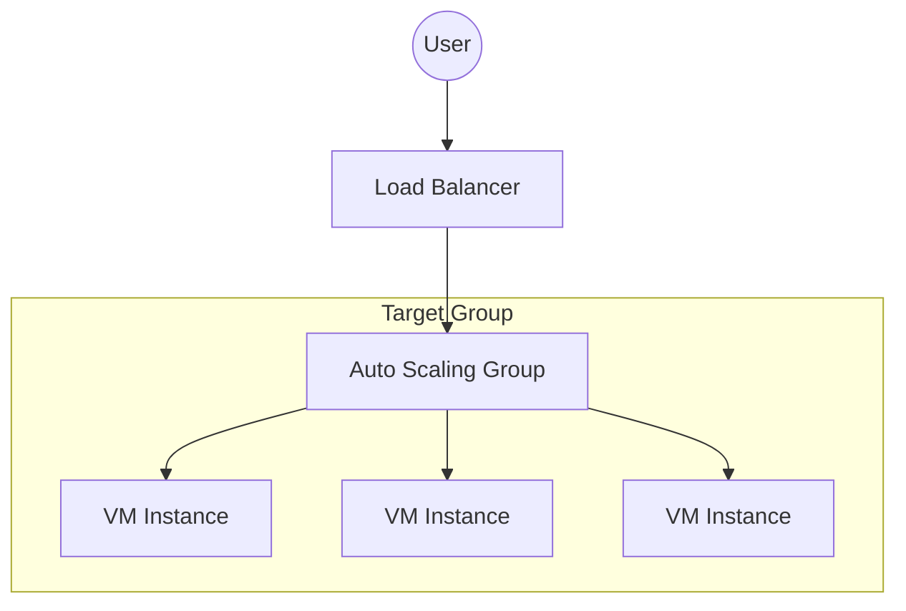

### Production MLOps User Flow

- **[Request Path]** A user request does not hit a single machine directly; it follows a structured path through the cloud infrastructure:

    1. **Internet Gateway (IGW)**: The entry point from the internet into the VPC
    2. **Load Balancer (LB)**: Receives the request from the IGW
    3. **Target Group (TG)**: The Load Balancer directs traffic to a configured Target Group
    4. **Auto Scaling Group (ASG)**: The Target Group contains the ASG, which manages the active virtual machines

- **[Traffic Distribution]** The Load Balancer ensures high availability by spreading the load:
    - If the LB receives 300 requests, it might distribute them equally (e.g., 100 requests to each of 3 virtual machines)
- **[Instance Readiness]** Every new virtual machine provisioned by the ASG is automatically prepared for production:
    - The ASG handles downloading the necessary code
    - It runs the application (e.g., `app.py`)
    - It ensures the API is ready to serve requests using a WSGI interface

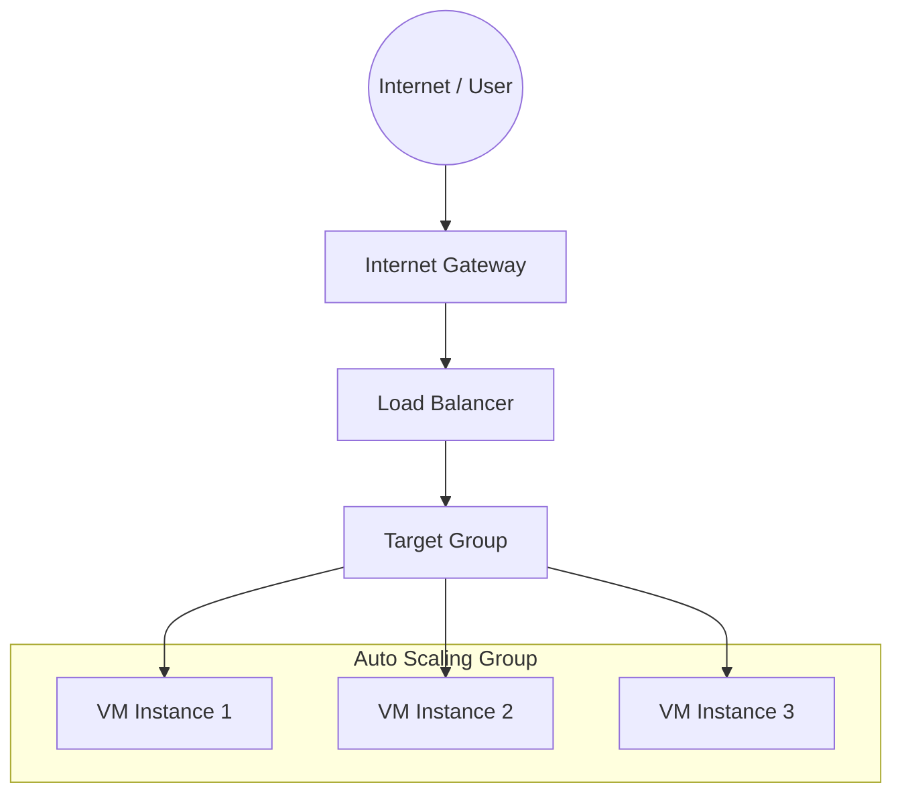

#### Detailed Component Configuration

| Component | Configuration Detail |
| --- | --- |
| Internet Gateway | Attached to the VPC |
| Application Load Balancer (ALB) | Internet-facing; Listener on HTTP 80 |
| Target Group | HTTP 80; Health check: /predict |
| EC2 Instance | Located in a Public Subnet |
| Web Server Layer | Nginx (listening on :80) \rightarrow proxy_pass \rightarrow Gunicorn (127.0.0.1:8000) \rightarrow WSGI app (/predict) |

### Summary of Production MLOps User Flow

- **[End-to-End Request Path]** The journey of a user request through the production infrastructure:

    1. **Internet (Client)**: The source of the request.
    2. **Internet Gateway (IGW)**: Attached to the VPC to allow communication between the VPC and the internet.
    3. **Application Load Balancer (ALB)**: An internet-facing component listening on HTTP 80.
    4. **Target Group (TG)**: Configured with HTTP 80 and a health check at `/predict`.
    5. **Auto Scaling Group (ASG)**: Added as the Target Group; it manages the creation and lifecycle of virtual machines.
    6. **EC2 Instance (in a Public Subnet)**: The final destination where the model is hosted.

- **[From Development to Production]** The internal stack on each EC2 instance ensures the environment is robust enough for production:
    - **Nginx**: Listens on port 80 and acts as a reverse proxy.
    - **Gunicorn**: Receives the proxied request (e.g., via `proxy_pass`) and manages the application server process.
    - **WSGI App**: The interface that connects the web server to the actual Python application (e.g., `/predict` endpoint).

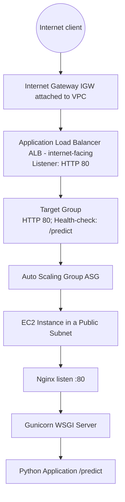

### Summary of the Production Architecture Flow

- **[End-to-End Request Lifecycle]** Once the virtual machine is fully provisioned and configured, the process is completed as follows:
    - The **Load Balancer** forwards the incoming request to the ready **Virtual Machine**
    - The request is served by the local web server stack (Nginx $\rightarrow$ Gunicorn $\rightarrow$ WSGI app)
    - This enables real-time model deployment and model serving at scale

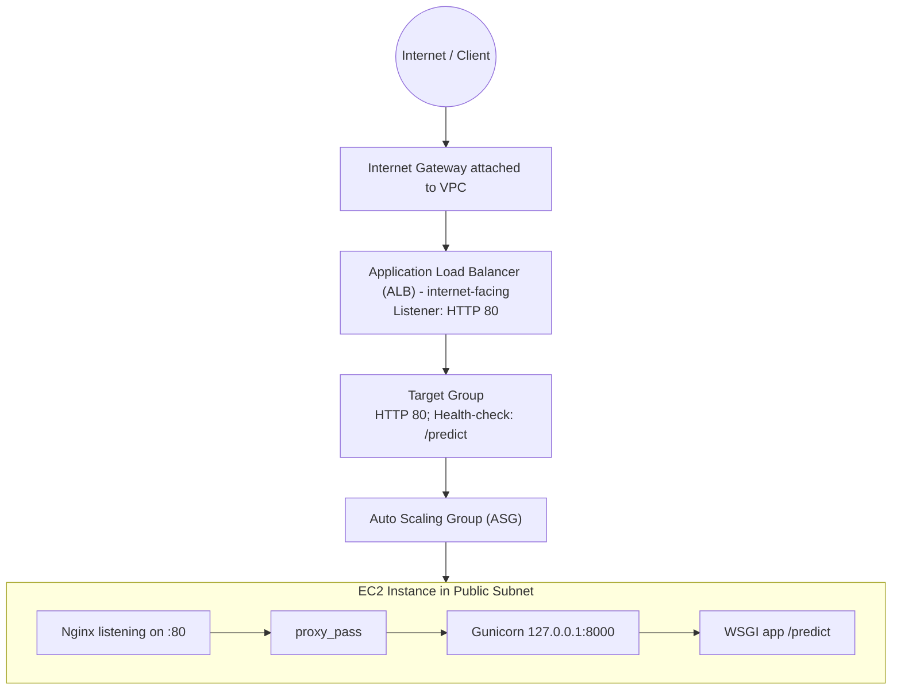

### Deploying the Intent Classifier to EC2

- **[Initial Environment Setup]** To transition from local execution to a remote server, an EC2 instance (Ubuntu) is used:
    - **SSH Access**: Connection is established via the terminal using a `.pem` key file
    - Command pattern: `ssh -i <path_to_pem_file> ubuntu@<public_ip_address>`
    - **Repository Setup**: The project code is brought onto the instance via Git
    - Create a dedicated directory for the application (e.g., `cd /opt`)
    - Clone the repository using the GitHub URL

```bash

# Example workflow on the EC2 instance
cd /opt
git clone https://github.com/iam-veeramalla/Intent-classifier-model.git
cd Intent-classifier-model
```

### Environment and WSGI Configuration

- **[Virtual Environment Setup]** To ensure project dependencies are isolated and don't conflict with system-level packages, a virtual environment is created and activated:
    - Create the environment: `python3 -m venv venv`
    - Activate it: `source venv/bin/activate`
- **[WSGI Entry Point]** Because a WSGI server (like Gunicorn) needs a specific entry point to communicate with the Flask application, a `wsgi.py` file is created:
    - This file imports the existing Flask `app` object and assigns it to a variable named `application`
    - The WSGI server specifically looks for this `application` variable to serve the web requests

```python
from app import app

application = app
```

### WSGI and Dependency Management

- **[Adding Gunicorn]** To enable the application to handle production-level traffic, `gunicorn` is added as a dependency in `requirements.txt`
    - Gunicorn (Green Unicorn) is a WSGI implementation for Python that simplifies the interface between the web server and the application
- **[Installing Dependencies]** Once the `wsgi.py` file and `requirements.txt` are updated, all necessary packages are installed within the virtual environment:

```bash
python3 install -r requirements.txt
```

### Model Artifact Generation

- **[Generating the Model]** Before the API can serve predictions, the machine learning model must be trained/generated on the instance
    - This is done by running the training script located in the model directory

```bash
python3 model/train.py
```

    - Running this command creates an `artifacts` folder containing the trained model files

### Running the API with Gunicorn

- **[Verifying Artifacts]** After training, the `artifacts` folder contains the trained model file (e.g., `intent_model.pkl`)
- **[Switching from Development Server to Gunicorn]** Instead of using the Flask development server (`python3 app.py`), Gunicorn is used to serve the application
    - **[Why Gunicorn?]** Gunicorn brings parallelism to the setup. By using multiple workers, the server can handle many concurrent requests simultaneously
    - The number of `--workers` determines the level of parallelism

```bash
sudo /opt/intent-classifier-model/.venv/bin/gunicorn --workers 3 --bind 127.0.0.1:6000 wsgi:app
```

- **[Command Breakdown]**
    - `sudo /opt/intent-classifier-model/.venv/bin/gunicorn`: Executes the Gunicorn binary from the virtual environment with root privileges
    - `--workers 3`: Spawns 3 worker processes to enable parallel request handling
    - `--bind 127.0.0.1:6000`: Binds the server to the local IP address on port 6000
    - `wsgi:app`: Tells Gunicorn to look for the `application` object inside the `wsgi.py` file

### Verifying the Gunicorn API

- **[Testing the Endpoint]** To verify the API is active and serving requests, a `curl` command can be used to send a POST request to the `/predict` endpoint
    - The request can be directed to the instance's public IP address or to `localhost` (127.0.0.1) since the command is being run directly on the virtual machine

```bash
curl -X POST http://127.0.0.1:6000/predict \
     -H "Content-Type: application/json" \
     -d '{"text": "Hi, what's up?"}'
```

- **[Verifying the Server]** Upon executing the command, the API returns the predicted intent (e.g., `"intent": "greedy"`)
    - This confirms that the request is being processed by the Gunicorn WSGI server configured in the previous steps, rather than the Flask development server

### API Service Execution

- **[Gunicorn vs. Python]** When running a production-grade server, you execute the Gunicorn command directly instead of using the standard `python3` command
- **[Future Step: Linux Service]** To ensure the API remains running and restarts automatically, the next stage of deployment involves configuring the application to run as a formal Linux service

## User Data Scripts

- A script used to automate tasks during the initialization of a resource
- This lecture focuses on a deep dive into how to write these scripts

### The Need for Auto Scaling Groups (ASG)

- ASGs are used to manage workloads, whether they are traditional applications or ML-specific
- **[The Problem]** User traffic is difficult to predict
    - A single Virtual Machine (VM) has dedicated, fixed resources (e.g., 16 CPU, 16 GB RAM)
    - Every incoming request to the API utilizes these underlying resources
    - High volumes of concurrent requests can exhaust the fixed resources of a single machine

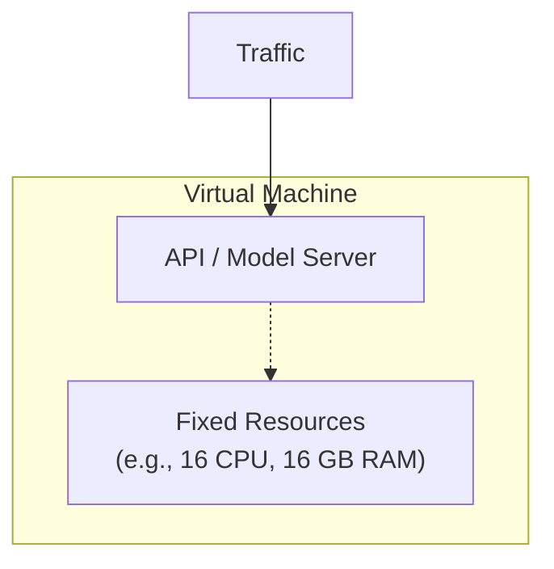

### Scaling Beyond a Single VM

- **[The Problem]** When requests increase significantly (e.g., from 200 to 1000 requests)
    - A single VM with fixed resources cannot handle the load
    - This results in API slowness or the API appearing to be down
- **[The Solution]** Deploying multiple, identical Virtual Machines
    - Each VM has the model deployed and the API configured in the exact same way
    - This allows the system to distribute a higher volume of traffic (e.g., 10,000 requests) across multiple units
- **[The Inefficiency]** Over-provisioning leads to wasted resources
    - If an organization sets up 10 VMs to prepare for a maximum expected traffic of 10,000
    - These VMs remain active even if the actual traffic is much lower
    - This results in "huge" costs due to running unnecessary capacity

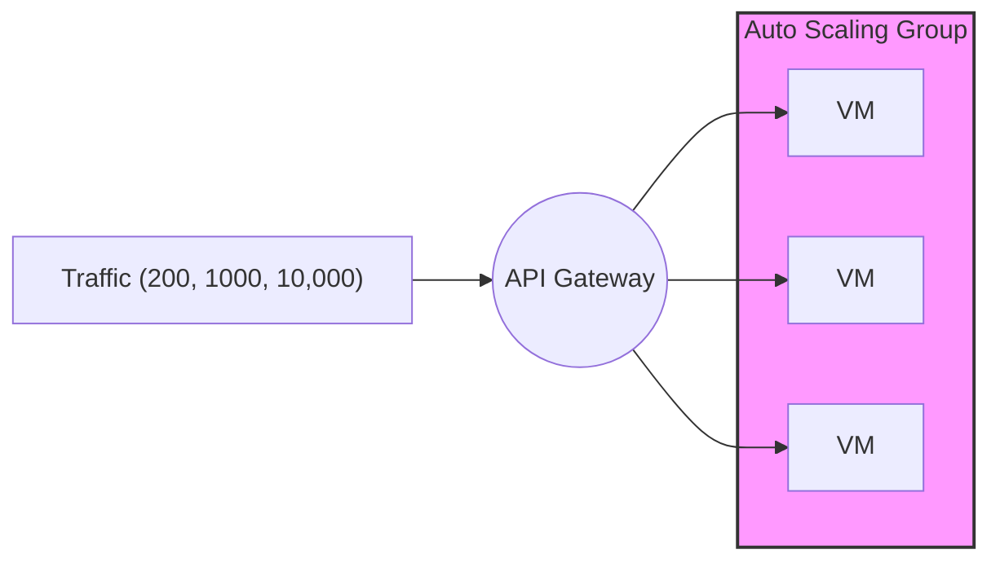

### Auto Scaling Groups (ASG) as a Cost Solution

- **[The Problem]** High cloud costs from over-provisioning
    - Keeping many VMs running during low-traffic periods (e.g., 3 am or 6 am when requests are only \~100) leads to wasted money
- **[The Solution]** ASGs dynamically adjust capacity based on demand
    - The group increases or decreases the number of active VMs according to user traffic
- **How ASG Scaling Works**
    - **Scaling Up**: If resource utilization reaches a defined threshold (e.g., 80% CPU/RAM), the ASG automatically creates new VMs
    - **Capacity Limits**: You can define a maximum threshold (e.g., a limit of 10 VMs) to prevent uncontrolled scaling
    - **Scaling Down**: As user traffic decreases, the ASG automatically reduces the number of active VMs to save costs

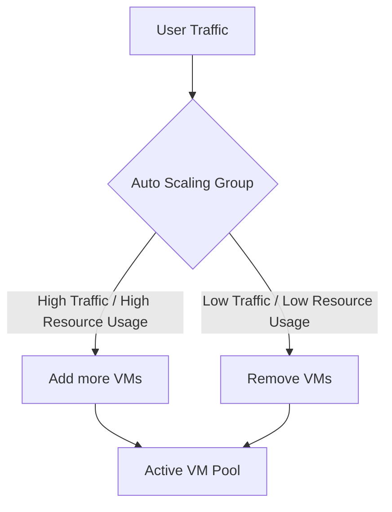

### The Need for VM Configuration in ASGs

- **[The Gap]** An ASG by itself only creates raw Virtual Machines
    - A standard VM lacks the specific model, running API, and required software packages
    - Without these, the VM is useless for the intended workload
- **[The Consequence]** Unconfigured VMs cause request failures
    - When a Load Balancer forwards a request to a fresh, unconfigured VM, the VM cannot process it
    - This results in the VM returning a `404` error or a vague error message back to the Load Balancer
- **[The Solution]** Launch Templates
    - A Launch Template is used to provide the necessary configuration to the ASG
    - It ensures that every new instance created by the ASG is automatically set up with the correct environment and software

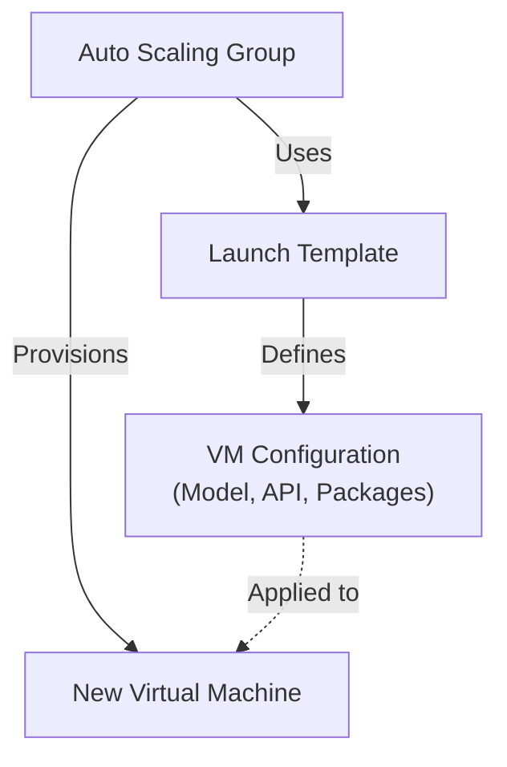

### The Role of User Data Scripts in Launch Templates

- A Launch Template contains critical configuration parameters, including:
    - OS distribution
    - Image name
    - **User data script**
- **[How it works]** The user data script is executed automatically during the creation and startup process of a new Virtual Machine
    - The ASG follows the Launch Template's instructions to provision the VM
    - As the VM starts, the script runs to install required components like models and APIs
- **[The Goal]** To ensure the VM is "absolutely ready" to receive requests from the Load Balancer immediately after it is provisioned

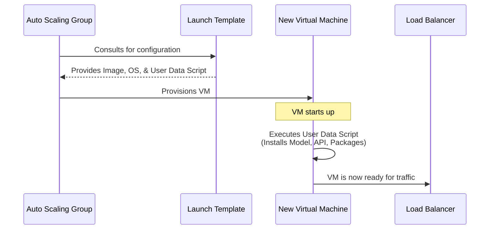

### Specific Configuration Tasks in User Data

- The script automates the following setup steps:
    - Running the machine learning model
    - Creating the API
    - Setting up a Python virtual environment
    - Installing necessary dependencies
    - Running the WSGI server
    - Running Nginx as a web server

### Using Nginx as a Reverse Proxy

- While not strictly mandatory, it is highly recommended to front-face the API with Nginx
- **[Benefits of Nginx]** It provides a layer for essential production features:
    - **SSL/TLS Implementation**: Managing secure connections
    - **Rate Limiting**: Controlling the frequency of incoming requests
    - **DDoS Protection**: Mitigating distributed denial-of-service attacks
    - **Security**: Providing an additional layer of security features

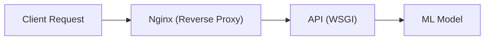

### Writing the User Data Script

- The script is a simple shell script
- It will be developed in Visual Studio Code and tested before being integrated into an Auto Scaling Group

### Repository Organization and Branching Strategy

- The project uses different Git branches to manage different deployment environments
- **`main`&#32;branch**: Contains common code required to run the model on a local machine
    - `train.py`
    - `app.py`
    - `wsgi.py`
- **`virtual-machines`&#32;branch**: Contains all details specific to the virtual machine deployment strategy
    - The User Data script
    - Step-by-step instructions for deploying and serving the model on AWS

### Initial Steps of the User Data Script

- The script is a shell script named `userdata.sh` created in Visual Studio Code
- **[Initial Setup Logic]** Since new VMs are freshly provisioned, the script must first prepare the environment before any application code can run

```bash
#!/bin/bash

# Directory

# update packages

# Git clone
```

- The first three steps in the automation process are:
    - **Create a directory**: To provide a specific location for the project files
    - **Update packages**: To ensure the newly created machine has the latest security updates and package lists
    - **Git clone**: To download the necessary source code and model files into the newly created directory

### Complete User Data Script Workflow

The automation process consists of nine distinct steps to move from a fresh VM to a fully operational, resilient API service:

1.  **Directory**: Create a dedicated project directory
2.  **Update packages**: Update the system package lists and security updates
3.  **Git clone - Download**: Clone the source code repository
4.  **Python Virtual Env**: Set up a Python virtual environment
5.  **Install the Python Dependencies**: Install required libraries via `pip install` using `requirements.txt`
6.  **Run Model**: Execute the model to generate the necessary `.pkl5` file
7.  **WSGI&#32;**$\rightarrow$**&#32;Linux systemd service**: Execute the WSGI application as a Linux systemd service
8.  **Nginx&#32;**$\rightarrow$**&#32;Linux systemd service**: Install and configure Nginx as a Linux systemd service
9.  **Enable services**: Enable both services so they automatically start upon system boot/restart

**[Why enable services?]**

- This ensures that if the machine restarts for any reason, the services will automatically return to a running state, allowing the API to continue serving requests without manual intervention.
- **[Repository Location]** The completed `userdata.sh` script can be found in the `virtual-machines` branch of the GitHub repository

#### Step 1: Directory Setup

- To keep the script organized and avoid hardcoding paths multiple times, an environment variable is used to define the application directory
- The `mkdir -p` command is used to create the directory, as the `-p` flag allows for the creation of nested parent directories if they do not already exist
- After creating the directory, the script changes the current working directory to that new path

```bash
#!/bin/bash

# Directory
export APP_DIR=/opt/intent-app
mkdir -p $APP_DIR
cd $APP_DIR

# update packages
apt update -y
apt install -y git
```

#### Step 2: Update Packages and Install Dependencies

- **[System Preparation]** Since these are newly provisioned machines, it is essential to update the package lists and upgrade existing software
- Common system dependencies, such as `git`, are installed in the same step to ensure the subsequent `git clone` command works correctly
    - `apt update -y`: Updates the local package index
    - `apt install -y git`: Installs the Git version control tool

#### Step 2: Update Packages and Install Dependencies (Continued)

- **[Ensuring Portability]** Even though some dependencies might be pre-installed on specific AWS AMIs, they are explicitly included in the script to ensure it works on other environments, such as local Ubuntu machines or Debian distributions
    - `apt install -y git python3 python3-venv python3-pip nginx`: Installs Git, Python 3, the virtual environment module, the Python package manager, and the Nginx web server

#### Step 3: Clone the Source Code

- The application source code is pulled from a remote repository using `git clone` into the current application directory

```bash
git clone https://github.com/iam-veeramalla/Intent-classifier-model.git .
```

#### Step 4: Python Virtual Environment Setup

- A Python virtual environment is created to isolate the application's dependencies from the system-wide Python installation
- The environment is then activated so that subsequent `pip` commands affect only this isolated environment

```bash
python3 -m venv venv
source venv/bin/activate
```

#### Step 5: Upgrade Pip and Install Dependencies

- **[Ensuring Up-to-date Tools]** After activating the virtual environment, it is good practice to upgrade `pip` to the latest version to avoid compatibility issues with newer packages
- The application-specific dependencies are installed using the `requirements.txt` file

```bash
pip install --upgrade pip
python3 -m pip install -r requirements.txt
```

#### Step 6: Run the Machine Learning Model

- Once the environment is ready, the script executes the model training or execution script
- In this case, `train.py` is located within the `model` directory

```bash
python3 model/train.py
```

#### Step 7: Configure WSGI as a System Service

- To ensure the application runs continuously and can be managed by the operating system, the WSGI server (Gunicorn) should be configured as a Linux system-based service
- Running it manually for testing would look like:

```bash
gunicorn --bind 0.0.0.0:5000 app:app
```

- Instead of running Gunicorn manually, it should be configured as a `systemd` service to ensure it runs continuously in the background
- A service file (e.g., `gunicorn.service`) is created within the `/etc/systemd/system/` directory
- The service configuration defines how the operating system should manage the process

```bash
cat <<EOF > /etc/systemd/system/gunicorn.service
[Unit]
Description=Gunicorn instance for Intent Classifier
After=network.target

[Service]
User=ubuntu
Group=ubuntu
WorkingDirectory=/opt/intent-app
Environment="PATH=/opt/intent-app/venv/bin"
ExecStart=/opt/intent-app/venv/bin/gunicorn --workers 3 --bind 127.0.0.1:5000 wsgi:app
Restart=always

[Install]
WantedBy=multi-user.target
EOF
```

- **[Key Service Components]**
    - `User` & `Group`: Specifies the Linux user and group that will execute the process (e.g., `ubuntu`)
    - `WorkingDirectory`: The directory where the application files are located
    - `Environment`: Sets the `PATH` to include the virtual environment's `bin` directory, ensuring the correct Python and Gunicorn binaries are used
    - `ExecStart`: The most critical part; it defines the exact command to start the application
        - In this case, it runs `gunicorn` with 3 workers, binding to `127.0.0.1:5000`, and pointing to the `wsgi:app` entry point
    - `Restart=always`: Ensures that if the service crashes, `systemd` will automatically attempt to restart it

#### Step 8: Configure Nginx as a Reverse Proxy

- Nginx is configured to act as a reverse proxy, sitting in front of the application server
- **[Why use Nginx?]** It handles incoming web traffic on standard ports (like port 80) and forwards those requests to the specific internal address where the API is actually running
- A configuration file is created in `/etc/nginx/conf.d/intentapp.conf` using a heredoc (`cat <<EOF`)

```bash
cat <<EOF > /etc/nginx/conf.d/intentapp.conf
server {
    listen 80;
    server_name _;

    location / {
        proxy_pass http://127.0.0.1:5000/predict;
        proxy_set_header Host \$host;
        proxy_set_header X-Real-IP \$remote_addr;
        proxy_set_header X-Forwarded-For \$proxy_add_x_forwarded_for;
        proxy_connect_timeout 60s;
        proxy_read_timeout 120s;
    }
}
EOF
```

- **[Proxy Logic Flow]**
    - An external request hits Nginx on `localhost:80/`
    - Nginx intercepts the request
    - Nginx forwards the request to the internal API at `http://127.0.0.1:5000/predict`

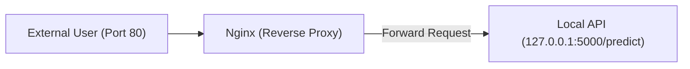

### Nginx as a Reverse Proxy

- Nginx is configured to act as a reverse proxy, intercepting incoming traffic and forwarding it to the application API
- **[The Flow]**
    - A user sends a request to the default HTTP port (`localhost:80/`)
    - Nginx receives this request and forwards it to the internal address where the API is listening (`127.0.0.1:5000/predict`)

```nginx

# Inside /etc/nginx/conf.d/intent_app.conf
server {
    listen 80;
    server_name _;
    location / {
        proxy_pass http://127.0.0.1:5000/predict;
        proxy_set_header Host $Host;
        proxy_set_header X-Real-IP $remote_addr;
        proxy_set_header X-Forwarded-For $proxy_add_x_forwarded_for;
        proxy_connect_timeout 60s;
        proxy_read_timeout 120s;
    }
}
```

- **[Proxy Logic Visualization]**

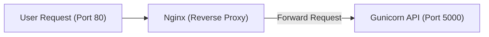

#### Step 8: Enable and Start Services

- Once the configuration files for both Gunicorn and Nginx are created, the services must be enabled and started to ensure they run automatically upon system boot
- Using `systemctl enable` ensures the services start after a machine restart, while `systemctl start` initiates them immediately

```bash

# Enable and start the Gunicorn service
systemctl enable intent_gunicorn
systemctl start intent_gunicorn

# Enable and start the Nginx service
systemctl enable nginx
systemctl start nginx
```

### Testing the User Data Script

- **[Testing Strategy]** Because the script will eventually be part of a Launch Template, it must be tested on a clean environment to ensure it works from scratch
    - Launch a fresh virtual machine with no prior configuration (no models, no APIs)
    - Manually copy the `userdata.sh` script to the new VM
    - Execute the script
    - Verify the end-to-end flow: check if the API is running and if Nginx can successfully forward requests to it

### Launching a Fresh Test Instance

- A new EC2 instance is provisioned on AWS to perform the verification
    - **Instance Name**: `server`
    - **AMI (Amazon Machine Image)**: Ubuntu (chosen because the script is written for Ubuntu)
    - **Instance Type**: `t3.micro`
    - **Security Group**: Configured to allow HTTP traffic (Port 80) to enable Nginx access

### Executing the Test Script on the New Instance

- Once the new EC2 instance is launched, connect to it via SSH using its public IP address
- Copy the `userdata.sh` script from the local development environment to the instance
- Create a test file on the instance:

```bash
nano test.sh
```

  *(Paste the script content and save)*

- **[Execution Command]** Run the script with elevated privileges:

```bash
chmod +x test.sh
  sudo ./test.sh
```

    - **[Why use&#32;`sudo`?]** Because when an Auto Scaling Group uses a Launch Template, the User Data script is executed as the **root** user. Running it with `sudo` during manual testing ensures the environment matches the actual deployment behavior.

### Verifying the User Data Script Execution

- **[Execution Time]** The script is expected to take approximately one to two minutes to complete
    - It must perform several heavy tasks: installing system dependencies, installing Python packages, downloading/installing the model, and configuring system services
- **[Verification Steps]** Once the script finishes, the following must be verified:
    - **Service Status**: Ensure services like Nginx are enabled and running
    - **API Functionality**: Confirm the API is reachable and responding to requests

#### Testing the API with `curl`

To verify that the Gunicorn service is running and the API is functional, a `curl` command is used to send a POST request to the local endpoint:

```bash
curl -X POST http://127.0.0.1:6000/predict \
     -H "Content-Type: application/json" \
     -d '{"intent": "hey, good morning"}'
```

- **[Expected Result]** A successful response indicates the automation worked correctly:
    - **Output**: `{"intent": "greeting"}`
    - This confirms the API is live and correctly processing the input payload.

### Verifying Service and Proxy Functionality

#### Confirming Gunicorn Service Status

Using `systemctl` to check the status of the Gunicorn service confirms that the WSGI server is active and running:

```bash
systemctl status intent_gunicorn
```

- **[Output Analysis]** The terminal shows the service is in the `active (running)` state:
    - `Active: active (running) since Mon 2025-12-01 17:17:59 UTC; 1min 17s ago`
    - The logs indicate that Gunicorn is listening on `http://127.0.0.1:6000` and has spawned multiple workers (e.g., `pid 3395`, `pid 3445`, `pid 3446`, `pid 3447`).
- **[Why this matters]** Because the service is active and listening on port 6000, the API is ready to receive requests at the `/predict` endpoint.

#### Testing Nginx as a Reverse Proxy

To ensure Nginx is correctly acting as the entry point and forwarding traffic to the Gunicorn backend, a `curl` request is sent to port 80 (the standard HTTP port) instead of port 6000:

```bash
curl -X POST http://127.0.0.1:80/predict \
     -H "Content-Type: application/json" \
     -d '{"text":"hey, good morning"}'
```

- **[Expected Result]** Receiving the expected JSON response (e.g., `{"intent":"greeting"}`) via port 80 confirms that:
        - Nginx is running and listening on port 80.
        - The Nginx configuration is correctly forwarding requests to the Gunicorn service at `127.0.0.1:6000`.

### Verifying Nginx via Public IP

- **[Testing Method]** Instead of using `localhost`, the API can be tested using the EC2 instance's \*\*Public IPv4 address
    - This confirms that Nginx is correctly acting as a reverse proxy for external traffic
- **[Execution]** Use a `curl` command targeting the public IP on port 80:

```bash
curl -X POST http://<PUBLIC_IP_ADDRESS>/predict \
     -H "Content-Type: application/json" \
     -d '{"intent": "i want to cancel my subscription"}'
```

- **[Validation]** If the User Data script worked as expected, the request sent to the public IP is received by Nginx and forwarded to the internal API, returning the correct response (e.g., `{"intent": "complaint"}`).
- **[Conclusion]** Successful responses via the public IP confirm the User Data script automation is fully functional for the core architecture.

### Model Deployment via AWS CLI

- **[Deployment Strategy]** Use automation via AWS CLI commands instead of manual creation in the AWS Console
    - Manual creation is considered an anti-pattern
    - The AWS Console will be used only for verification of created resources and their communication
- **[Documentation]** Complete steps are documented in the `Intent Classifier model` GitHub repository under the `virtual-machines` branch
    - `complete-model-deployment.md`: Contains the end-to-end deployment steps
    - `delete-resources.md`: Contains the exact steps and required order for deleting resources to avoid cloud costs

### Resource Management and Cleanup

- **[Cost Control]** It is critical to delete all resources after the lecture to prevent incurring cloud charges
- **[Cleanup Order]** Resources must be deleted in a specific sequence to ensure a clean teardown

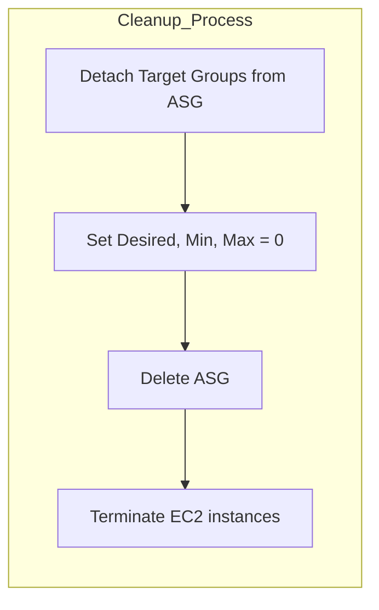

- **[ASG Deletion Logic]** Because the Auto Scaling Group (ASG) creates and manages EC2 instances, the ASG must be handled first to terminate the instances it manages

### Resource Creation Sequence

- **[First Step]** The deployment process begins with the creation of the Virtual Private Cloud (VPC)

### VPC and Network Foundation

- **[Deployment Order]** The resource creation follows standard AWS best practices to ensure dependencies are met (e.g., networking must exist before compute resources can be attached).
- **[Prerequisite Knowledge]** This sequence aligns with established AWS architectural patterns for building scalable, secure environments.

### VPC Networking Configuration

- **[VPC Setup]** Establish the base network where all subsequent resources will reside
    - CIDR block: `10.0.0.0/16`
- **[Subnet Strategy]** Create multiple subnets rather than a single one
    - **[Why multiple subnets?]** An Application Load Balancer (ALB) must be associated with at least two different subnets located in different Availability Zones
    - **[Public Access]** Subnets will be configured as "public" to allow connectivity to the instances
- **[Making Subnets Public]** In AWS, subnets are not public by default
    - To make a subnet public, you must associate its destination route with an Internet Gateway (IGW)
- **[Connectivity Components]** The network foundation requires the following sequence of creation:

    1. Virtual Private Cloud (VPC)
    2. Subnets
    3. Internet Gateway (IGW)
    4. Route Table (RT) and associated routes

### Completing the Network Foundation

- **[Making Subnets Public]** To establish public connectivity, the route table must be configured with a route where the destination is the Internet Gateway (IGW)
    - Once the route is created, the route table is attached to the subnet

### Security and Compute Deployment Sequence

- **[Security Groups]** Used to control inbound traffic for troubleshooting and access
    - **[Ports to Open]** Port 22 (SSH) and Port 80 (HTTP) are opened to allow connection to virtual machines for debugging model development issues
- **[Compute & Scaling Workflow]** Once networking and security are established, resources are created in this specific order:

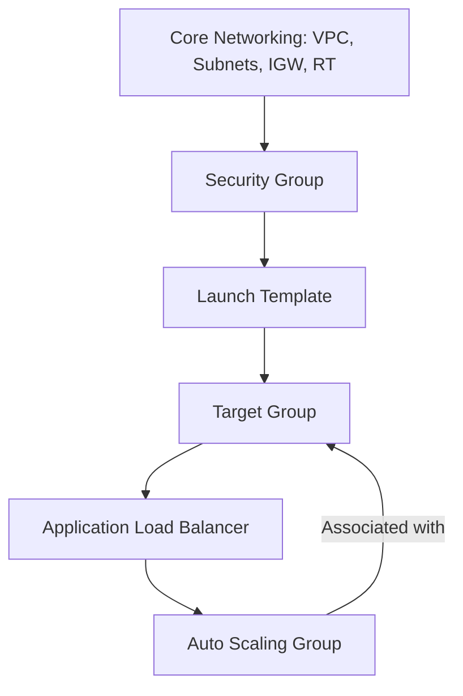

- **[Resource Dependencies]**
    - The **Launch Template** is a mandatory prerequisite for creating the **Auto Scaling Group**
    - The **Auto Scaling Group** must be associated with a **Target Group** to work with the **Load Balancer**

### Request Routing Flow

- **[Traffic Flow]** The Load Balancer acts as the entry point for requests and directs them through the following hierarchy:
    - The **Load Balancer** forwards requests to the **Target Group**
    - The **Target Group** is associated with the **Auto Scaling Group**
    - The **Auto Scaling Group** manages and forwards requests to the actual **Virtual Machines**

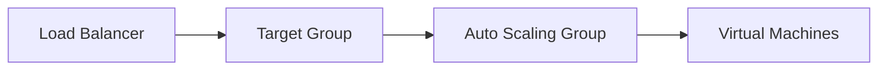

### AWS CloudShell

- A browser-based shell that allows for executing AWS CLI commands without local configuration
- **[Automatic Authentication]** CloudShell is pre-configured with the credentials of the logged-in AWS user
    - Because it is already authenticated, commands like `aws s3 ls` work immediately to list resources (e.g., S3 buckets) without needing to manually set up access keys or secret keys

### Retrieving the AMI ID

- **[Why it is necessary]** An AMI (Amazon Machine Image) ID is required to create virtual machines (EC2 instances)
    - AMI IDs are unique to each AWS region, so a specific command must be run to find the correct one for the current location
- **[Finding Ubuntu 20.04]** To find the ID for an Ubuntu Focal 20.04 image, the following command is used in CloudShell:

```bash
aws ec2 describe-images --filters "Name=name,Values=ubuntu/images/hvm-ssd/ubuntu-focal-20.04-amd64-server-*" --query "Images | sort_by(Data[].ImageId, &CreationDate) | [0].ImageId" --output text --region us-east-1
```

    - The command filters for the specific Ubuntu version and name pattern
    - It uses a query to sort by creation date and pick the most recent ID
    - The `--output text` flag ensures the result is a clean string for use in further commands

### Resource Creation Checklist

To implement the deployment plan, the following components must be provisioned in order:

1. **VPC** ($10.0.0.0/16$)
2. **Subnets** (Public)
3. **IGW** (Internet Gateway), **RT** (Route Table), and **Routes**
4. **SG** (Security Group for ports 22 and 80)
5. **Launch Template**
6. **TG** (Target Group)
7. **ALB** (Application Load Balancer)
8. **ASG** (Auto Scaling Group)

### Deployment Workflow Strategy

- Use a dual-tab approach to streamline the process:
    - **Tab 1 (CloudShell)**: Used for executing all resource creation commands.
    - **Tab 2 (AWS Console)**: Used to verify and view the resources as they are being created.

### Automating AMI ID Retrieval

- **[Why use a variable]** Because AMI IDs are unique to each region, hardcoding an ID can lead to failures if the deployment is run in a different location
    - Exporting the ID to a variable (e.g., `AMI_ID`) makes the subsequent resource creation commands reusable and less error-prone

### Creating the VPC

- **[Source of Truth]** Deployment steps are documented in the GitHub repository under the `virtual-machines` branch in `complete-deployment.md`
- **[Execution]** The VPC is created using the AWS CLI with a specific CIDR block

```bash
aws ec2 create-vpc --cidr-block 10.0.0.0/16 --query "Vpc.VpcId" --output text --region $AWS_REGION
```

- **[Verification]** After running the command, the new VPC can be verified in the AWS Console by refreshing the VPC dashboard

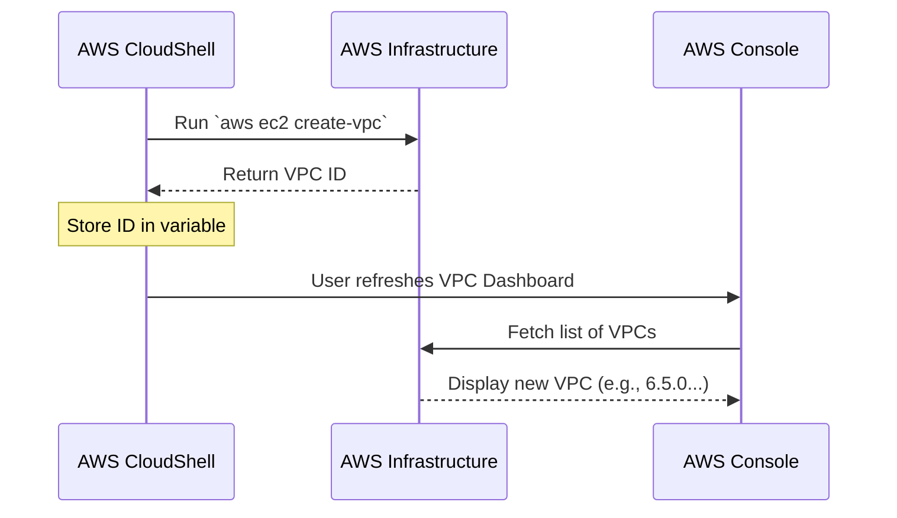

### Managing the VPC ID

- **[Why use a variable]** Because the VPC ID will be required for almost every subsequent resource creation step (like subnets or security groups)
    - Storing it in a variable avoids manual copying and prevents errors

```bash
export VPC_ID=$(aws ec2 create-vpc --cidr-block 10.0.0.0/16 --query "Vpc.VpcId" --output text --region $AWS_REGION)
```

### Creating Subnets

- Instead of a single subnet, two subnets are created to provide high availability across different availability zones
- **Subnet 1 Configuration**
        - **VPC ID**: Uses the `$VPC_ID` variable
        - **CIDR Block**: `10.10.1.24/24`
- **Subnet 2 Configuration**
        - **VPC ID**: Uses the `$VPC_ID` variable
        - **CIDR Block**: `10.10.2.24/24`

```bash

# Creating the first subnet
aws ec2 create-subnet --vpc-id $VPC_ID --cidr-block 10.10.1.24/24 --availability-zone $AWS_REGION:a --query "Subnet.SubnetId" --output text --region $AWS_REGION
```

### Creating Subnets (Continued)

- **Subnet 1 Configuration**
    - **Availability Zone**: `us-east-1a` (or equivalent for the specific region)
    - **CIDR Block**: `10.10.1.24/24`
    - **[Execution]** The subnet ID is captured and exported to a variable for reuse

```bash
export SUBNET_ID1=$(aws ec2 create-subnet --vpc-id $VPC_ID --cidr-block 10.10.1.24/24 --availability-zone us-east-1a --query "Subnet.SubnetId" --output text --region $AWS_REGION)
```

- **Subnet 2 Configuration**
    - **Availability Zone**: `us-east-1b` (to ensure high availability across different zones)
    - **CIDR Block**: `10.10.2.24/24`
    - **[Execution]** The second subnet ID is also exported to a unique variable

```bash
export SUBNET_ID2=$(aws ec2 create-subnet --vpc-id $VPC_ID --cidr-block 10.10.2.24/24 --availability-zone us-east-1b --query "Subnet.SubnetId" --output text --region $AWS_REGION)
```

### Enabling Public Access

- **[Next Step]** To make these subnets "public" (allowing internet access), an Internet Gateway must be created and attached to the VPC

### Internet Gateway and Routing

- **[Step 1] Create and Export Internet Gateway**
    - An Internet Gateway (IGW) is required to allow communication between the VPC and the internet
    - The ID is captured in a variable for subsequent attachment and routing steps

```bash
export IGW_ID=$(aws ec2 create-internet-gateway --query "InternetGateway.InternetGatewayId" --output text --region $AWS_REGION)
```

- **[Step 2] Attach Internet Gateway to VPC**
    - Creating the gateway isn't enough; it must be explicitly attached to the specific VPC

```bash
aws ec2 attach-internet-gateway --internet-gateway-id $IGW_ID --vpc-id $VPC_ID --region $AWS_REGION
```

- **[Step 3] Create Route Table**
    - A route table is created within the VPC to manage traffic direction

```bash
export RTB_ID=$(aws ec2 create-route-table --vpc-id $VPC_ID --query "RouteTable.RouteTableId" --output text --region $AWS_REGION)
```

- **[Next Step] Configure Routing**
    - Once the route table is created, a route must be added to point a specific destination (the internet) to the Internet Gateway

### Configuring Routing and Public Access

- **[Step 1] Create and Export Route Table ID**
    - The route table ID is captured for use in creating routes and associating it with subnets

```bash
export RTB_ID=$(aws ec2 create-route-table --vpc-id $VPC_ID --query "RouteTable.RouteTableId" --output text --region $AWS_REGION)
```

- **[Step 2] Create a Default Route to the Internet**
    - A route is added to the route table to allow traffic to reach the internet
    - **Destination**: `0.0.0.0/0` (refers to all IP addresses/anywhere)
    - **Gateway**: The Internet Gateway (`$IGW_ID`)

```bash
aws ec2 create-route --route-table-id $RTB_ID --destination-cidr-block 0.0.0.0/0 --gateway-id $IGW_ID --region $AWS_REGION
```

- **[Step 3] Associate Route Table with Subnets**
    - Once the route is created, the route table must be associated with the subnets to make them "public"
    - This connects the subnets to the routing logic that leads to the Internet Gateway

```bash

# Associate with Subnet 1
aws ec2 associate-route-table --route-table-id $RTB_ID --subnet-id $SUBNET_ID1 --region $AWS_REGION

# Associate with Subnet 2
aws ec2 associate-route-table --route-table-id $RTB_ID --subnet-id $SUBNET_ID2 --region $AWS_REGION
```

- **Summary of Completed Networking Foundation**
    - VPC created
    - Two subnets created
    - Internet Gateway created and attached to VPC
    - Route table created with a route to the Internet Gateway
    - Subnets associated with the route table (making them public)

### Configuring Subnet and Security Group

- **[Optional] Enable Auto-assign Public IP**
    - This setting ensures that any new EC2 instance launched within these specific subnets is automatically assigned a public IP address
    - This is useful for ensuring connectivity to the internet for instances in public subnets

```bash
aws ec2 modify-subnet-attribute --subnet-id $SUBNET_ID1 --map-public-ip-on-launch --region $AWS_REGION
aws ec2 modify-subnet-attribute --subnet-id $SUBNET_ID2 --map-public-ip-on-launch --region $AWS_REGION
```

- **[Step 1] Create a Security Group**
    - A security group acts as a virtual firewall to control inbound and outbound traffic
    - The group is created with a description specifying that it will allow traffic on port 80 (HTTP) and the SSH port

```bash
export SG_ID=$(aws ec2 create-security-group --group-name sg --description "Allow app and ssh" --vpc-id $VPC_ID --query "GroupId" --output text --region $AWS_REGION)
```

### Attaching the Internet Gateway

- Before creating routes, the Internet Gateway must be attached to the VPC
- This step establishes the link between the VPC and the gateway

```bash
aws ec2 attach-internet-gateway --internet-gateway-id $IGW_ID --vpc-id $VPC_ID --region $AWS_REGION
```

### Creating the Route Table

- Once the gateway is attached, a route table can be created within the VPC to manage traffic routing

```bash
export RTB_ID=$(aws ec2 create-route-table --vpc-id $VPC_ID --query "RouteTableId" --output text --region $AWS_REGION)
```

### Configuring the Route Table

- **[Step 2] Create a Route**
    - A route is added to the route table to direct traffic to the Internet Gateway
    - The destination is set to `0.0.0.0/0`, which represents all possible IP addresses (the entire internet)
    - This allows any resource in an associated subnet to communicate with the outside world

```bash
export RTB_ID=$(aws ec2 create-route-table --vpc-id $VPC_ID --query "RouteTableId" --output text --region $AWS_REGION)

aws ec2 create-route --route-table-id $RTB_ID --destination-cidr-block 0.0.0.0/0 --gateway-id $IGW_ID --region $AWS_REGION
```

- **[Step 3] Make Subnets Public**
    - Simply creating a route is not enough; the route table must be associated with the subnets
    - Once associated, the subnets are considered "public" because they follow the routing rules of this table

```bash
aws ec2 associate-route-table --route-table-id $RTB_ID --subnet-id $SUBNET_ID1 --region $AWS_REGION
```

```bash

# Associate the route table with the second subnet
aws ec2 associate-route-table --route-table-id $RTB_ID --subnet-id $SUBNET_ID2 --region $AWS_REGION
```

With the route table associated with both subnets, the networking foundation is complete, establishing the public connectivity required for the deployment.

### Configuring Subnet Settings

- **[Optional] Enable Public IP Assignment**
    - You can configure a subnet to automatically assign a public IP address to any new virtual machine created within it
    - While often enabled by default, this command ensures the setting is active for the region

### Creating a Security Group

- A security group acts as a virtual firewall to control inbound and outbound traffic for your instances
- Using the AWS CLI, a security group can be created with a specific name and description defining allowed traffic

```bash
aws ec2 create-security-group \
    --group-name intent-sg \
    --description "allow app and ssh" \
    --vpc-id $VPC_ID \
    --query "GroupId" \
    --output text \
    --region $AWS_REGION
```

- **[Post-creation] Export Security Group ID**
    - Once created, the unique ID of the security group is captured in a shell variable for use in subsequent deployment steps

```bash
export SG_ID=$(aws ec2 create-security-group --group-name intent-sg --description "allow app and ssh" --vpc-id $VPC_ID --query "GroupId" --output text --region $AWS_REGION)
```

### Configuring Security Group Ingress Rules

- Creating a security group is only the first step; you must explicitly authorize inbound traffic rules to allow specific services to communicate with your instances
- **[Rule 1] Allow HTTP Traffic**
    - Opens port 80 to allow web traffic from any source (`0.0.0.0/0`)

```bash
aws ec2 authorize-security-group-ingress \
    --group-id $SG_ID \
    --protocol tcp \
    --port 80 \
    --cidr 0.0.0.0/0 \
    --region $AWS_REGION
```

- **[Rule 2] Allow SSH Traffic**
    - Opens port 22 to allow secure shell access for management

```bash
aws ec2 authorize-security-group-ingress \
    --group-id $SG_ID \
    --protocol tcp \
    --port 22 \
    --cidr 0.0.0.0/0 \
    --region $AWS_REGION
```

### Preparing User Data for Launch Template

- User data is required for the launch template to automate the configuration of the virtual machines upon startup
- There are two efficient ways to get the `userdata.sh` script into AWS CloudShell:

    1. **Manual Copy-Paste**

        - Open the script file in a web browser on GitHub
        - Click on "Raw" mode to get the plain text
        - Use a terminal editor like `nano` in CloudShell to create a file and paste the content

    1. **Git Clone**

        - Since CloudShell has Git pre-installed, you can clone the entire repository directly into your environment

```bash
git clone <repository_url>
```

### Accessing User Data via Git

- After cloning the repository, you may need to switch to a specific branch to find the required deployment scripts
    - Use `git checkout origin/<branch_name>` to switch to the desired branch

```bash

# Example: Switching to the virtual-machines branch
git checkout origin/virtual-machines
```

- Once on the correct branch, verify the file exists using `ls` (e.g., `userdata.sh`)

### Preparing User Data for Launch Templates

- **[Encoding Requirement]** Because user data is embedded within template files (like JSON or YAML), the script content must be Base64 encoded to prevent syntax errors or parsing issues
- The process involves taking the raw script and transforming it into a Base64 string before placing it into the template configuration

### The Importance of Base64 Encoding

- **[Why encode?]** When placing a `.sh` script inside a template file (such as JSON or YAML), raw script content can cause formatting issues
    - Indentation and multiple spaces in the script can mess up the template structure
    - This makes the configuration very tricky to debug and troubleshoot
- **[The Solution]** Converting the script to a Base64 string transforms it into a single, continuous "paragraph" format
    - This removes the risk of indentation errors within the template
    - This is a standard practice not just for AWS Launch Templates, but also when working with Kubernetes or Terraform resources

#### Encoding the User Data Script

- The script can be encoded using the `base64` command in the terminal

```bash

# Example of encoding the userdata.sh file
cat userdata.sh | base64
```

- Once encoded, the resulting string can be safely pasted into the `UserData` field of a JSON/YAML template
- Verifying the encoded content can be done with `echo`:

```bash
echo $USER_DATA
```

### Preparing Launch Template Variables

To automate the creation of a Launch Template via the CLI, several configuration values should be exported as shell variables first:

- **Launch Template Name**: A unique identifier for the template
    - Example: `export LAUNCH_TEMPLATE_NAME=mlops-template`
- **Instance Type**: Defines the hardware specifications of the EC2 instance
    - **[Selection Tip]** While `t2.micro` is available, `t2.medium` is recommended if the model needs to handle multiple concurrent queries
    - Example: `export INSTANCE_TYPE=t2.medium`
- **Other required parameters**: The template will also eventually require the AMI ID and a Key Pair name.

### Creating an EC2 Key Pair

A key pair is required to establish secure access (SSH) to the virtual machines once they are launched.

- **Process**: Navigate to the EC2 dashboard and select **Key pairs**
- **Configuration**:
    - **Name**: `mlops-keypair`
    - **Key pair type**: `RSA`
    - **Private key file format**: `.pem` (used for OpenSSH)

### Finalizing Launch Template Variables

With the key pair created and downloaded, the final set of variables can be exported to prepare for the Launch Template command:

- **Key Pair Name**: The name of the downloaded `.pem` file
    - Example: `export KEY_NAME=MLOps-KeyPair.pem`
- **AMI ID**: The unique identifier for the machine image (retrieved in an earlier step)
    - Example: `echo $AMI_ID`

#### Summary of Mandatory Instance Parameters

When creating a new EC2 instance, these three components are the fundamental requirements:

| Parameter | Purpose |
| --- | --- |
| AMI ID | Defines the Operating System and software pre-installed on the instance |
| Instance Type | Defines the hardware capacity (CPU, RAM, etc.) |
| Key Pair | Provides secure access for SSH (primarily used for troubleshooting) |

### Creating the Launch Template

The Launch Template is created using the `aws ec2 create-launch-template` command. This command consolidates all the previously exported variables into a single configuration.

**[Command Structure]**

```bash
aws ec2 create-launch-template \
    --launch-template-name $LAUNCH_TEMPLATE_NAME \
    --version-description "$VERSION_DESCRIPTION" \
    --launch-template-data "{\n        \"ImageId\":\"$AMI_ID\",\n        \"InstanceType\":\"$INSTANCE_TYPE\",\n        \"KeyName\":\"$KEY_NAME\",\n        \"SecurityGroupIds\":["$SG_ID"],\n        \"UserData\":\"$USER_DATA\"\n    }" \
    --region $AWS_REGION
```

- **Key Data Components**:
    - `ImageId`: The AMI ID for the OS and software.
    - `InstanceType`: The hardware capacity.
    - `KeyName`: For secure SSH access.
    - `SecurityGroupIds`: To control network traffic.
    - `UserData`: The base64-encoded script that runs on instance startup.

---

### Creating an ELB Target Group

Once the Launch Template is ready, the next step in the deployment sequence is creating a Target Group for the Load Balancer.

**[Command]**

```bash
aws elbv2 create-target-group \
    --name mlops-target-group \
    --protocol HTTP \
    --port 80 \
    --vpc-id $VPC_ID \
    --health-check-protocol HTTP \
    --health-check-path /health-check \
    --region $AWS_REGION
```

- **Configuration Details**:
    - **Port 80**: Chosen because Nginx is configured on the instances to listen on this port.
    - **Protocol**: Set to `HTTP` to match the Nginx service.
    - **VPC ID**: Ensures the target group is associated with the correct network foundation.

### Target Group Creation Success

- The Target Group has been successfully created
- **[Action Required]** Capture the `TargetGroupArn` from the output
    - This ARN is essential for the next step: configuring the Load Balancer to recognize this group

### Managing the Target Group ARN

- The `TargetGroupArn` is exported to a shell variable for use in the Load Balancer configuration
    - **[Command]**

```bash
export TARGET_GROUP_ARN=arn:aws:elasticloadbalancing:us-west-2:769857562917:targetgroup/mlops-target-group/582f8c3a7a6b9d5
```

### Creating the Elastic Load Balancer

- The Load Balancer is created using the `aws elbv2 create-load-balancer` command
- **[Command]**

```bash
aws elbv2 create-load-balancer \
        --name model-deployment \
        --subnets $SUBNET_1_ID $SUBNET_2_ID \
        --security-groups $SG_ID \
        --scheme internet-facing \
        --type application \
        --region $AWS_REGION
```

- **Configuration Details**:
        - **Name**: Set to `model-deployment`
        - **Subnets**: Associated with two subnets (one in each availability zone) to ensure high availability
        - **Security Groups**: Uses the previously created security group to control traffic
        - **Scheme**: Set to `internet-facing` so the load balancer can receive traffic from the public internet
        - **Type**: Set to `application` (ALB)

### Load Balancer Creation Status

- The command initiates the creation process
- The status initially shows as `provisioning` while AWS sets up the underlying infrastructure

### Managing the Load Balancer ARN

- Similar to the Target Group, the Load Balancer ARN must be captured for subsequent configuration
    - **[Command]**

```bash
export ALB_ARN=arn:aws:elasticloadbalancing:us-west-2:769857562917:loadbalancer/app/model-deployment/5b27447c6d4e4
```

### Creating the ALB Listener

- A listener is necessary to allow the Load Balancer to receive and process incoming requests
- **[The Role of a Listener]** It listens for user requests and forwards them to the designated Target Group
- **[Command]**

```bash
aws elbv2 create-listener \
        --load-balancer-arn $ALB_ARN \
        --protocol HTTP \
        --port 80 \
        --default-actions Type=forward,TargetGroupArn=$TARGET_GROUP_ARN \
        --region $AWS_REGION
```

- **Configuration Details**:
        - **Load Balancer ARN**: Uses the `$ALB_ARN` variable captured previously
        - **Protocol/Port**: Set to `HTTP` on port `80` to handle standard web traffic
        - **Default Action**: Set to `Type=forward` to direct the traffic to the `$TARGET_GROUP_ARN`

### Creating the Auto Scaling Group

- The final step in this sequence is to create the Auto Scaling Group (ASG) to manage the fleet of instances
- **[Command]**

```bash
aws autoscaling create-auto-scaling-group \
    --auto-scaling-group-name mlops-autoscaling \
    --launch-template LaunchTemplateName=mlops-template,Version=$LT_VERSION \
    --min-size 1 \
    --max-size 3 \
    --vpc-zone-identifier "$SUBNET_1,$SUBNET_2" \
    --region $AWS_REGION
```

- **Configuration Details**:
    - **Name**: `mlops-autoscaling`
    - **Launch Template**: Uses `mlops-template` at a specific version
    - **Scaling Limits**: Set to a minimum of `1` and a maximum of `3` instances to balance availability and cost
    - **Network**: Distributed across the previously defined subnets

### Troubleshooting ASG Validation Errors

- **Error Encountered**: `An error occurred (ValidationError) when calling the CreateAutoScalingGroup operation: You must use a valid fully-formed launch template. The key pair 'mlops-keypair.pem' does not exist.`
- **Root Cause**: A mismatch between the variable value and the actual resource name in AWS.
    - The variable was exported as `mlops-keypair.pem` (including the file extension).
    - The actual EC2 Key Pair name is `MLOps-KeyPair` (case-sensitive with different hyphenation).
- **[Resolution]** Verify resource names in the AWS Management Console (e.g., EC2 > Key Pairs) to ensure the CLI command uses the exact string required by AWS.

### Updating the Launch Template via AWS Console

- **[Problem]** The ASG creation failed because the Launch Template contained the wrong key pair name (`mlops-keypair.pem` instead of `MLOps-KeyPair`).
- **[Resolution]** Manually modify the template to point to the correct resource.

#### Modifying the Template

1. Navigate to **EC2 > Launch Templates** in the AWS Console.
2. Select the existing template (`mlops-template`).
3. Choose **Actions > Modify template (Create new version)**.
4. Locate the **Key pair name** field and select the correct key pair from the dropdown (e.g., `MLOps-KeyPair`).
5. Click **Create template version**.

#### Setting the Default Version

- After creating a new version, AWS does not automatically switch the default version to the latest one.
- **[Why this matters]** If the ASG is configured to use the "Default version," it will continue to use the old, broken configuration unless the default is updated.
- **[Action]**
    - Go to the **Versions** tab of the Launch Template.
    - Identify the new version (e.g., `Version 2`).
    - Select **Set default version** for the new version.

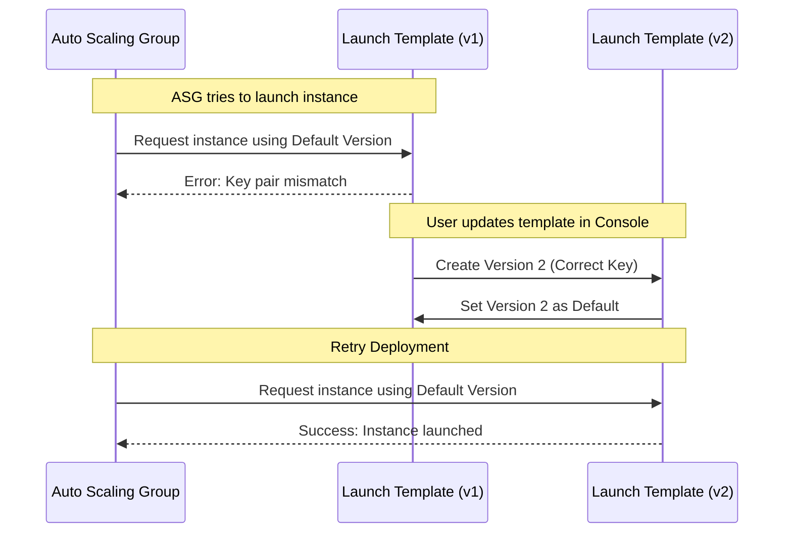

### Auto Scaling Group Creation Success

- The ASG creation command is re-run after setting the corrected Launch Template version as the default.
- **[Observation]** Even with a complete set of steps, manual errors (like incorrect variable values) are common during deployment and require troubleshooting.

### Finalizing Resource Association

- The final step in the deployment sequence is to link the Load Balancer's Target Group to the Auto Scaling Group.
- This ensures that the instances launched by the ASG are automatically registered with the Load Balancer to receive traffic.

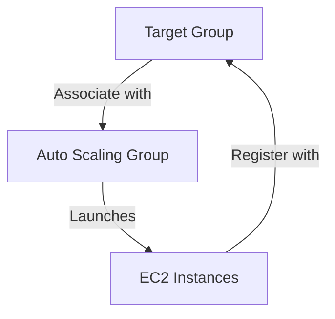

### Completing the Auto Scaling Group (ASG) Setup

- **[Action]** Associate the Target Group with the Auto Scaling Group to allow the ASG to register new instances into the load balancer's rotation.
- Once associated, the ASG is considered successfully created and configured.

### Verifying the Architecture

- **[Goal]** Confirm that the entire request flow (User $\rightarrow$ Load Balancer $\rightarrow$ Target Group $\rightarrow$ ASG $\rightarrow$ Instances) is functional.
- **[Verification Step]** Check the status of the Load Balancer in the EC2 console.

#### Load Balancer Status

- Navigate to **EC2 > Load Balancers**.
- Locate the `model-deployment` load balancer.
- **[Success Criteria]** The load balancer must be in an **Active** state.
- **[Next Step]** Retrieve the DNS name or IP address of the load balancer to send test HTTP requests.

```mermaid
flowchart TD
    User((User)) -->|HTTP Request| ALB["Elastic Load Balancer<br/>Port 80"]
    ALB -->|Forwards to| TG[Target Group]
    TG -->|Routes to| ASG[Auto Scaling Group]
    ASG -->|Launches| EC2[EC2 Instances]
```

### Verifying Target Group Registration

- **[Status Check]** The `mlops-target-group` contains the instance created by the Auto Scaling Group.
- **[Unhealthy Status Note]** The instance may appear as `Unhealthy` in the console.
    - **[Reason]** This occurs because the health check API was not enabled on the model; only the `predict` API was implemented.
    - **[Implication]** For this specific deployment, the `Unhealthy` status can be ignored as long as the `predict` endpoint is functional.

### Testing the End-to-End Request Flow

- **[Goal]** Confirm that the Load Balancer correctly receives requests and forwards them to the backend instances.
- **[Workflow]**

    1. Copy the **DNS name** of the Load Balancer from the EC2 console.
    2. Use a local terminal to send an HTTP POST request via `curl`.

#### Test Command Structure

```bash
curl -X POST <ALB_DNS_NAME>/predict \
     -H "Content-Type: application/json" \
     -d '{"whats_up": "??"}'
```

- **[Details]** The request is sent to the Load Balancer's DNS, which listens on port 80 and forwards the traffic to the `mlops-target-group`.

### Successful End-to-End Test

- **[Execution]** A `curl` command was used to send a POST request to the Load Balancer's DNS name.

```bash
curl -X POST http://model-deployment-1065327747.us-west-2.elb.amazonaws.com/predict \
     -H "Content-Type: application/json" \
     -d '{"whats_up": "Hi, Whats up??"}'
```

- **[Result]** The request was successfully processed, returning the expected JSON response:
    - `"intent": "greeting"`

### Request Routing and Scaling Logic

- **[Request Flow]** When a request is sent to the Load Balancer's DNS, the following chain occurs:

    1. **Load Balancer Listener**: Receives the request on a configured port (e.g., port 80).
    2. **Target Group**: The listener forwards the request to the associated Target Group.
    3. **EC2 Instance**: The Target Group routes the request to a registered virtual machine.

- **[ASG Role in Scaling]** The Auto Scaling Group manages the instances within the Target Group:
    - **Instance Registration**: The ASG provides the Target Group with instances to handle traffic.
    - **Monitoring & Scaling**: The ASG monitors instance utilization.
    - **Scaling Trigger**: If an instance reaches a specific threshold (e.g., 80% utilization), the ASG automatically launches and adds new instances to the Target Group to distribute the load.

```mermaid
flowchart TD
    User((User)) -->|DNS Request| ALB[ALB Listener]
    ALB -->|Forwards to| TG[Target Group]
    TG -->|Routes to| EC2[EC2 Instance]

    subgraph ASG_Management [Auto Scaling Group]
        ASG[ASG] -->|Monitors Load| EC2
        ASG -->|"Adds New Instance if Load > 80%"| TG
    end
```

---

## Tutoring Notes: Networking Fundamentals Explained From Zero

*(Written for the "no networking background" ground-up walkthrough of everything above, ahead of translating this same architecture to Azure + Terraform + AKS.)*

### The core idea: an IP address is a street address, a port is a room number

A computer on a network has an **IP address** (like `10.0.1.5`) — a unique location. A single machine can run many different services at once (a web server, an SSH server, a database), so each service listens on a **port** — a number from 0–65535 that says which "room" at that address to knock on. Port `80` is the standard door for HTTP web traffic; port `22` is the standard door for SSH (remote terminal access). "The server is listening on port 80" just means: a program on that machine is sitting there waiting for HTTP requests.

A **CIDR block** like `10.0.0.0/16` is just a way of saying "a range of IP addresses" — `/16` means the first 16 bits of the address are fixed and the rest can vary, giving you 65,536 addresses (`10.0.0.0` through `10.0.255.255`) to hand out to things inside that range. A `/24` (e.g. `10.0.1.0/24`) is a smaller slice — 256 addresses. Smaller number after the `/` = bigger range.

### Running analogy: an office campus

- **VPC** = the campus. A private plot of land with its own address system, isolated from the public street grid unless you deliberately connect it.
- **Subnets** = buildings/wings on campus, each with their own address range carved out of the campus's total range.
- **Availability Zone (AZ)** = a genuinely separate physical location — a different city block entirely, with its own power and connectivity. Building the same wing in two AZs means one location catching fire doesn't take down the whole company.
- **Internet Gateway** = the campus's one connection point to the public highway.
- **Route Table** = the campus's internal road signage telling traffic where to go.
- **Security Group** = the guard posted at each building's door with a specific guest list.
- **Launch Template + userdata.sh** = the onboarding kit and instructions given to every new employee (VM) on day one.
- **Target Group** = the current roster of on-duty, healthy employees.
- **ALB (Load Balancer) + Listener** = the receptionist at the one public entrance, who checks the roster and walks visitors to an available desk.
- **ASG (Auto Scaling Group)** = HR policy that hires/fires employees automatically based on how busy the office is.

Now, piece by piece, in the exact order this document built them.

#### 1. VPC — the campus itself

**What it is:** an isolated, private network you fully control, defined by a CIDR block (`10.0.0.0/16` in these notes).

**Why:** without a boundary, there's no such thing as "inside" vs "outside" — you can't decide what's reachable from the internet and what isn't. The VPC is the container everything else lives in.

**What if you skipped it:** you can't — every VM has to live in some network. The real risk of getting this step wrong is picking too small a CIDR range and running out of addresses later, or picking a range that collides with a network you'll eventually need to connect to (like your office VPN) — `10.0.0.0/16` is a safe, conventional private range.

#### 2. Subnets — buildings on campus

**What it is:** a subdivision of the VPC's address range. These notes created two: `10.10.1.0/24` and `10.10.2.0/24`, deliberately in two different AZs.

**Why two, in two AZs:** an Application Load Balancer in AWS *requires* at least two subnets in two different AZs to even be created — that's a hard rule, not a suggestion. The reason is resilience: if one data center has a power outage, traffic automatically continues through the surviving AZ's instances.

**What if you skipped it (used just one subnet/one AZ):** the ALB creation would fail outright in AWS. Even where it wouldn't be a hard block, a single AZ means a single point of failure — one outage takes your whole service down.

**Public vs private subnets:** a subnet is only "public" if its route table sends internet-bound traffic to an Internet Gateway (see #3). The subnets here are public because the EC2 instances need direct internet access to `git clone` and to receive traffic. In a more hardened setup, a database would sit in a *private* subnet with no route to the internet at all — reachable only from inside the VPC.

#### 3. Internet Gateway (IGW) — the campus's road connection

**What it is:** a single resource attached to the VPC that acts as the door between your private network and the public internet.

**Why:** a private IP like `10.0.1.5` is meaningless outside your VPC — the public internet has no idea how to route to it. The IGW is what allows traffic to cross that boundary at all.

**What if you skipped it:** total isolation. Instances can't reach the internet (so `git clone` in `userdata.sh` fails immediately) and the internet can't reach them (so the ALB itself couldn't be internet-facing). This is a binary on/off switch — no IGW, no internet, period, regardless of anything else you configure.

#### 4. Route Table — the road signage

**What it is:** a set of rules saying "traffic addressed to X, send it via Y." These notes created one route: destination `0.0.0.0/0` (meaning "anywhere not in this VPC," i.e. the whole internet) → gateway = the IGW, then associated that route table with both subnets.

**Why this is a separate step from the IGW — the single most common beginner trap:** attaching an IGW to the VPC is **not enough on its own**. The IGW is just a door that exists; nothing tells traffic to walk through it until a route table says so. Subnets aren't "public" because an IGW exists somewhere in the VPC — they're public only if *their specific route table* points `0.0.0.0/0` at that IGW.

**What if you skipped it:** you'd have an IGW attached and fully functional, and instances would *still* have no internet access, because nothing in the subnet's routing rules ever sends traffic toward it. This is a very common real-world bug: "I attached an IGW, why is my instance still unreachable?" — because the route table wasn't updated.

#### 5. Security Group — the guard at the door

**What it is:** a virtual firewall attached to instances, allowing specific inbound traffic. These notes opened port 80 (HTTP, for the app) and port 22 (SSH, for admin access), both from `0.0.0.0/0` (anywhere).

**Why:** by default, a new instance denies all inbound traffic. Even with a perfect IGW and route table (the instance *can* reach the internet), the instance itself refuses to accept connections on any port until you explicitly permit it.

**What if you skipped it:** the request never even reaches your application code — it's rejected at the network layer before your Gunicorn/Nginx process ever sees it. This is a different failure mode than "no IGW" — with no IGW, packets have no path to travel; with no security group rule, packets arrive at the door and get turned away.

**Nuance:** security groups are *stateful* — if you allow inbound on port 80, the reply traffic going back out is automatically allowed, no separate outbound rule needed.

#### 6. Launch Template + `userdata.sh` — the onboarding kit

**What it is:** a reusable instance configuration (OS image/AMI, instance size, SSH key, security group) plus a shell script that runs automatically the moment a new VM boots.

**Why it exists at all:** an Auto Scaling Group creates *raw, blank* VMs. A blank Ubuntu VM has no idea it's supposed to be running your model API. The userdata script is what turns "generic empty VM" into "a VM correctly running Nginx→Gunicorn→your model" — automatically, with zero human involvement, every single time the ASG launches a new instance.

**What if you skipped it:** exactly what happened with this project's own health check — the ASG creates new instances that come up completely unconfigured. They can't serve `/predict`, so they show as "Unhealthy" in the Target Group forever. Worst case, this creates a doom loop: ASG notices the instance is unhealthy, terminates it, launches a replacement — which is *also* blank and unhealthy — repeat forever, burning money and serving nothing.

**Base64 encoding, briefly:** the script gets base64-encoded before being embedded in the Launch Template's JSON/YAML config, purely so multi-line shell script text (with its own quotes, indentation, special characters) doesn't break the template's own syntax. It's decoded back to a real script automatically when the VM boots.

#### 7. Target Group — the on-duty roster

**What it is:** a named list of backend targets (instances) plus a health check definition (these notes checked `/predict` via HTTP on port 80 — though `/predict` isn't actually a real health-check endpoint, which is why it showed unhealthy — a **mistake** worth learning from, not repeating).

**Why:** the load balancer doesn't talk to instances directly by IP — it talks to a Target Group, which tracks *which* instances currently exist and *whether they're currently healthy enough to receive traffic.* This indirection is what lets instances come and go (via the ASG) without anyone having to manually reconfigure the load balancer.

**What if you skipped it:** the ALB would have no concept of which backends exist at all — there's nothing to route to.

#### 8. ALB (Application Load Balancer) + Listener — the receptionist

**What it is:** a single, stable, internet-facing entry point. The **Listener** is the specific rule: "requests arriving on port 80 → forward to this Target Group."

**Why:** the ASG can have anywhere from 1 to N instances at any moment, each with a changing IP address as instances get replaced. Users can't be expected to track individual instance IPs. The ALB gives you one fixed DNS name that always works, and internally spreads/redirects traffic to whichever healthy instances currently exist.

**What if you skipped it:** you'd have to expose raw instance IPs to your users directly — which break the moment the ASG scales up/down or replaces a failed instance. No single point of failure protection, no traffic distribution, no health-based routing.

#### 9. Auto Scaling Group (ASG) — the HR policy

**What it is:** the automation that decides how many instances should exist right now, using the Launch Template to configure each new one, and keeping the Target Group updated as instances are added/removed. These notes set min=1, max=3.

**Why:** traffic isn't constant. A fixed number of VMs is either wasteful (over-provisioned for 3am) or insufficient (under-provisioned for the evening peak). The ASG watches resource usage and scales the instance count to match, within your min/max bounds.

**What if you skipped it:** you'd run a fixed number of VMs manually. Traffic spikes cause timeouts/errors because there's no more capacity; quiet periods burn money on idle VMs nobody's using. You'd also lose self-healing — if a VM crashes, nothing replaces it until a human notices.

### The full request path, tied together

```
User → IGW (door into the VPC)
     → ALB (receptionist, on the public subnet)
     → Listener (port 80 rule)
     → Target Group (current healthy roster)
     → one instance in the ASG (Nginx → Gunicorn → model code)
```

Silently required underneath all of it: the **Route Table** (so packets know to use the IGW) and the **Security Group** (so the instance accepts the connection once it arrives).

### AWS → Azure translation (for the Docker/AKS/Terraform version of this project)

| Step | AWS (above) | Azure equivalent | Notes |
| --- | --- | --- | --- |
| 1 | VPC `10.0.0.0/16` | **VNet** `10.0.0.0/16` | Same CIDR concept |
| 2 | 2 subnets across AZs | **Subnets** | Azure subnets aren't AZ-pinned like AWS — zone redundancy comes from spreading AKS nodes/pods across Availability Zones instead, a different knob |
| 3 | Internet Gateway, explicitly created+attached | *(no direct equivalent)* | Azure VNets route to the internet by default; exposure is controlled via NSGs + which resources get a Public IP, not an attachable gateway object |
| 4 | Route Table + route to IGW | **Route Table (UDR)** | Usually left default for basic egress; explicit UDRs matter once a firewall/NAT gateway is added |
| 5 | Security Group (ports 22, 80) | **NSG** (Network Security Group) | Same idea, attached to subnet or NIC |
| 6 | Launch Template + `userdata.sh` (bootstraps a bare VM on every scale-out) | **Docker image** (built once) + **Kubernetes Deployment manifest** | Key pivot: model/API/deps get baked into an image once, pushed to ACR; scaling out just starts more containers from that image — no per-instance shell bootstrapping |
| 7 | Target Group | **Kubernetes Service** (ClusterIP, selects pods by label) | |
| 8 | ALB + Listener (internet-facing, port 80) | **Application Gateway** (with AGIC ingress controller) or NGINX Ingress behind a Standard Azure Load Balancer | AGIC integrates with AKS directly |
| 9 | ASG (min 1, max 3, scales on utilization) | **Two layers**: HPA (scales pod replicas) + Cluster Autoscaler (scales node VMSS) | AWS's ASG did both jobs at once (VM = unit of scale); k8s splits it into pod-level and node-level scaling |
| — | `/predict` had no real health check, showed "Unhealthy" | **readiness/liveness probes** | A gap in the AWS version to actually fix in the Azure build |
