### Open Source MLOps Stack

- Transitioning from Kubeflow Pipelines to a modular open-source approach
- **Core Components**:
    - **DVC**: Used for data version control
    - **KServe**: Used for model serving and inference
    - **Kubernetes**: The target platform for deployment
- **[Why KServe + Kubernetes?]** Because KServe introduces HPA (Horizontal Pod Autoscaler) for efficient model serving

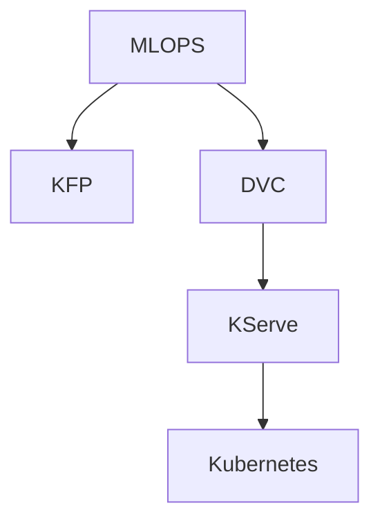

### Open Source MLOps Stack Expansion

- **[Expanded Stack]**
    - **GitHub Actions**: Used for automating data scientist activities, such as the training process
    - **Argo CD**: Used to deploy KServe or manifests to Kubernetes
- **[Why this stack?]**
    - It is easy to scale the model in the future for both performance and user load
    - This specific stack is gaining significant popularity in industry job descriptions

### Real-time Use Case: Customer Churn

- **Industry**: Telecom (e.g., AT&T, Verizon)
- **Context**: Service providers managing millions of users
- **Goal**: Use MLOps to improve the model and manage the scale of user data

### The Business Problem: Customer Churn

- **Market Dynamics**: Increased competition allows users to switch telecom providers easily if they are unsatisfied
- **Objective**: Companies need to identify and retain potential customers who are likely to leave
- **[The Limitation]** Neither support teams nor development teams can manually predict churn:
    - **Support Teams**: Usually come from non-technical backgrounds and cannot perform complex predictive analysis
    - **Development Teams**: Can implement logic and conditions, but they cannot inherently predict human behavior or dissatisfaction

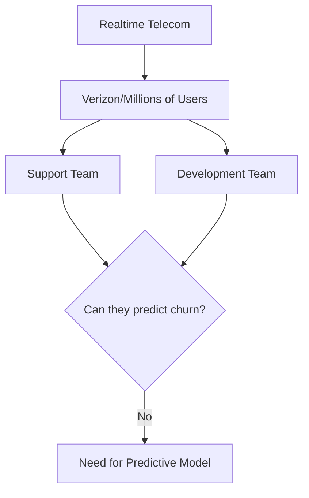

### The Role of Data Science in Churn Prediction

- **Definition of Churn**: The act of a user leaving or terminating a particular subscription
- **The Solution**: Data Scientists and ML Engineers are brought in to build predictive models
    - These models allow support teams to query specific users (e.g., "Is user XYZ happy with the service?")
    - The output provides a percentage or likelihood of churn
- **[Why DS/ML?]** Because predicting human behavior and calculating probabilities is their core expertise, bridging the gap between support's needs and development's logic-based systems

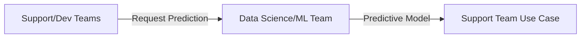

### Taking Action on Churn Predictions

- **[The Goal]** To prevent users from switching to competitors or alternatives
- **Proactive Retention Strategies**: Once the support team identifies a high-risk user (e.g., "XYZ user"), the company can intervene with targeted incentives
    - **SMS**: Sending an exclusive offer directly to the user's phone
    - **Website/App**: Displaying lucrative offers when the user logs in
- **[The Result]** These personalized offers aim to persuade the user to stick with their current provider rather than churning

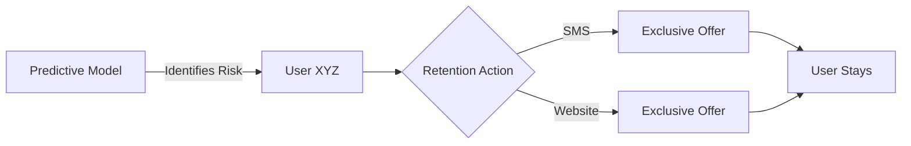

### Project Lifecycle and Data Preparation

- **Project Initiation**: The process begins at the management level
    - Management identifies the need for a solution (e.g., a churn model)
    - This decision triggers the formal project requirement
- **Data Science Responsibility**: Once the requirement is passed to the DS/ML team, their primary task is gathering and preparing the dataset
    - They rely on historical information to train the model
    - **[Data Sources]** They look back at users who have already churned over the last 3, 5, or 10 years
- **Feature Engineering Examples**: The dataset is built using specific customer attributes, such as:
    - **Age**: The age of the customer
    - **Tenure**: How many years the customer has been with the platform

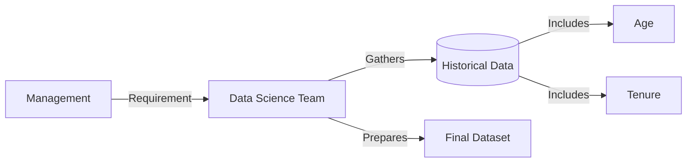

### Dataset Features and Predictive Value

- **[Feature Selection]** Data scientists build the dataset using various customer attributes to capture patterns in behavior
    - **Payment Details**: Monthly and yearly payment amounts
    - **Support Engagement**: The number of support calls or tickets raised by a user
- **[Why these features matter]**: Certain data points provide high predictive power because they correlate with user stability or dissatisfaction
    - **Age**: Acts as a proxy for flexibility
        - Younger customers (e.g., 19-year-olds/Gen Z) are often more flexible and can switch providers easily due to less brand loyalty or information
        - Older customers (e.g., 70-year-olds) are statistically less likely to switch providers once established
    - **Tenure**: Reflects established trust
        - Long-term customers (e.g., 10+ years) have built trust with the provider, making them less likely to churn
    - **Support Cases**: Serves as a signal for dissatisfaction
        - A high volume of support tickets in a short period (e.g., 15 cases in a month) is a critical indicator that a user is at risk

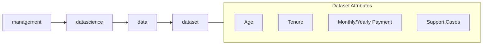

### From Dataset to Machine Learning Model

- **[The Workflow]** Once the dataset is prepared, the data science process moves into modeling
    - **Step 1: Algorithm Selection**: Choosing a mathematical approach, such as:
        - Logistic Regression (LG)
        - Random Forest Classifier (RF C)
    - **Step 2: Training**: The algorithm is trained using the prepared dataset
    - **Step 3: Pattern Recognition**: During training, the algorithm identifies patterns within the data points that might not be obvious to human developers
    - **Step 4: Model Development**: The result of identifying these patterns is a mathematical function, which is defined as the "model"

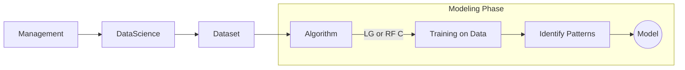

- **[Transition to MLOps]** After the model is prepared by the data scientist, the process hands off to MLOps (Machine Learning Operations) to manage the model's lifecycle.

### The Role of ML Engineers

- **[Model Deployment]** Once the model is ready, ML engineers take over to make it functional for the organization
    - They develop an **API** (Application Programming Interface) for the model
    - Common tools for this include:
        - `FastAPI` (widely used currently)
        - `Flask` (a traditional option)
- **[Optimization]** ML engineers also focus on the performance and scaling of the models
    - Using platforms like `KServe` can assist with these operational requirements

### Bridging the Gap: API to User Interface

- **[Why an API is necessary]** The API acts as the middle layer between the raw model and the end user
    - Support engineers and business users typically do not use terminals or manual code requests (like `curl`)
    - The API allows the model to be integrated into a user-friendly interface
- **[The User Interface (UI)]** To make the model actionable for non-technical staff, the development team builds a UI
    - This UI binds to the API, allowing support teams to interact with model predictions through standard web elements (like HTML files/pages)

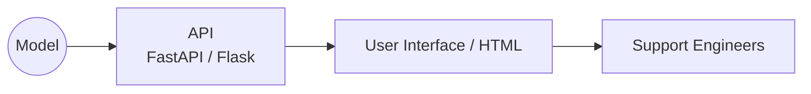

### End-to-End Project Flow

- **[User Interaction]** Support engineers interact with the model via a web interface (UI)
    - Users provide input data (e.g., age, tenure, month, year, and support history) on a webpage
    - The UI forwards this information as a request to the API
    - The API processes the request through the model and returns the prediction back to the UI

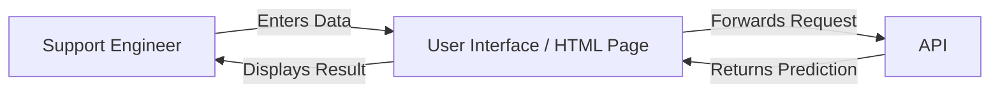

### The Role of MLOps Engineers

- **[Core Responsibility]** Automating manual activities and the deployment process
- **[Key Technologies & Focus Areas]**
    - **Data Version Control (DVC)**: Managing data lineage and versions
    - **KServe**: Implementing automatic scaling for models
    - **Kubernetes (HPA)**: Setting up namespaces, controllers, and Horizontal Pod Autoscaling (HPA)
    - **GitHub Actions (CI)**: Automating the continuous integration pipeline
    - **Argo CD**: Managing continuous deployment and manifests

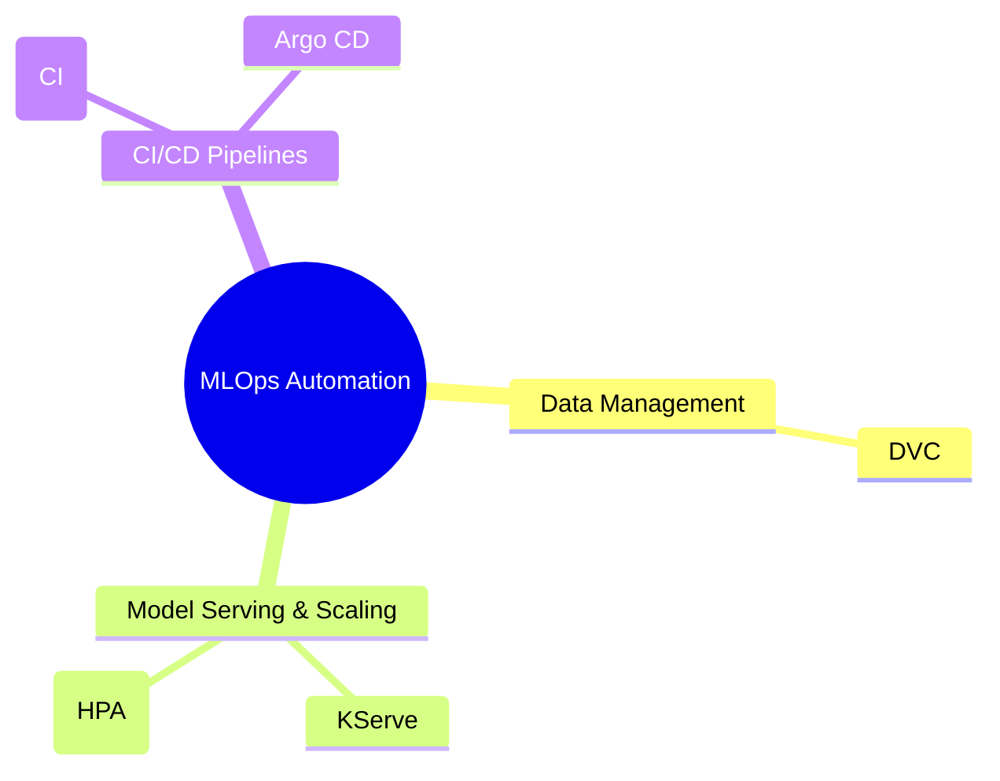

### Project Repository Structure

- The project is organized within the `mlops-zero-to-hero` repository
- **[CI/CD for Models]** Located in the `10-cicd-for-models` directory
    - This directory contains two primary sub-folders:
        - `01-kubeflow`: Focused on Kubeflow-based pipelines
        - `02-Realtime-MLOps-Project`: Focused on the real-time implementation
- **[Real-time MLOps Implementation]** The `02-Realtime-MLOps-Project` folder contains the core scripts and configurations, including:
    - Training scripts
    - MLOps automation scripts
    - CI/CD related scripts
- **[Note on Implementation]** Within the project directory, specific files (like `.md` files) act as entry points containing links to the full GitHub repositories required for the training and deployment steps.

```text
mlops-zero-to-hero/
└── 10-cicd-for-models/
    ├── 01-kubeflow/
    └── 02-Realtime-MLOps-Project/
        ├── 02-dvc-docker-kserve-argocd.md
        └── [Links to training/MLOps/CI scripts]
```

### Repository Branching Strategy

- The project is divided into two primary branches to separate core model development from automation workflows
- **Main Branch**: Contains the foundational work produced by Data Scientists and ML Engineers
    - **Training scripts**: Code used to train the models
    - **API scripts**: Code for model serving (e.g., FastAPI)
    - **Project documentation**: Explanations and READMEs describing the project logic
- **CI/CD Branch**: Dedicated to automation and deployment configurations (e.g., GitHub Actions, Argo CD manifests)

### Branching Roles and Responsibilities

- **Main Branch**: The source of core deliverables from Data Scientists and ML Engineers
    - Contains the foundational logic and documentation
    - **[Why it matters]** It provides the necessary context (how to run the project locally) for an MLOps engineer to implement automation successfully
- **CI/CD Branch**: The workspace for MLOps implementation
    - Contains the automation workflows, such as GitHub Actions and Argo CD manifests

### Navigating the Main Branch

- **README.md**: The primary entry point for understanding the project
    - Explains the real-time use case and model purpose
    - Provides essential steps for initial local setup
- **Core Project Files**:
        - `train.py`: Script for training the model
        - `api.py`: Script for the model's API (e.g., FastAPI)
        - `generate_data.py`: Script to create the dataset
        - `requirements.txt`: List of dependencies for local environment setup

```text
main branch contents:
├── README.md
├── api.py
├── generate_data.py
├── requirements.txt
├── train.py
└── [other project files]
```

### Local Project Setup

- Before implementing MLOps, the project must be understood and run locally
- **Initial Setup Steps**:
    - Install dependencies: `pip install -r requirements.txt`
    - Generate dataset: `python generate_data.py`
    - Train model: `python train.py`
    - Test API locally: `python api.py`
    - Visit documentation: `http://localhost:8000/docs`

### Core Training Logic (`train.py`)

- The `train.py` script is responsible for the model training phase
- **Workflow**:
    - Reads the dataset from a CSV file (`data/churn_data.csv`)
    - Implements a **Random Forest Classifier** as the machine learning algorithm
- **Key Code Implementation**:

```python
import pandas as pd
    import pickle
    from sklearn.model_selection import train_test_split
    from sklearn.ensemble import RandomForestClassifier
    from sklearn.metrics import accuracy_score, roc_auc_score

# Load data
    df = pd.read_csv('data/churn_data.csv')

# Features and target
    features = ['age', 'tenure_months', 'monthly_charges', 'total_charges', 'num_support_calls']
    X = df[features]
    y = df['churn']

# Split
    X_train, X_test, y_train, y_test = train_test_split(X, y, test_size=0.2, random_state=42)

# Train
    model = RandomForestClassifier(n_estimators=100, random_state=42)
    model.fit(X_train, y_train)

# Evaluate
    y_pred = model.predict(X_test)
    y_proba = model.predict_proba(X_test)[:, 1]
    accuracy = accuracy_score(y_test, y_pred)
    auc = roc_auc_score(y_test, y_proba)

# Save model
    with open('models/churn_model.pkl', 'wb') as f:
        pickle.dump(model, f)
```

### Detailed Script Functionality

- **`train.py`**: A simplified script designed to focus on MLOps implementation rather than complex modeling
    - **Workflow details**:
        - Splits data into training and testing sets
        - Calculates and prints model accuracy and AUC-ROC
        - Saves the trained model as a `.pkl` file in the `models/` directory
    - **Key Code Implementation**:

```python

# Evaluate
y_pred = model.predict(X_test)
y_proba = model.predict_proba(X_test)[:, 1]
accuracy = accuracy_score(y_test, y_pred)
auc = roc_auc_score(y_test, y_proba)

print(f"Accuracy: {accuracy:.4f}")
print(f"AUC-ROC: {auc:.4f}")

# Save model
with open('models/churn_model.pkl', 'wb') as f:
    pickle.dump(model, f)

print("Model saved to models/churn_model.pkl")
```

- **`api.py`**: Creates the interface for interacting with the model
    - Uses **FastAPI** because it provides a built-in user interface for documentation and acts as a REST API client
    - Implements a `/predict` endpoint to handle model requests
- **`generate_data.py`**: A utility script used to create the synthetic dataset for the project (not typically found in real-world production environments)

### Simulating Data with `generate_data.py`

- Used to simulate a synthetic churn dataset since real datasets aren't always available for development
- **[Logic]** The script generates random data and stores it in a CSV file to avoid relying on external internet datasets
- **Key Implementation Details**:
    - Uses `numpy` to generate random values for features like `age`, `tenure_months`, `monthly_charges`, etc.
    - Implements a simple churn logic based on feature values (e.g., higher charges and more support calls increase churn probability)

```python

# Simple churn logic: higher charges + more support calls = more churn
churn_prob = {
    'monthly_charges': 120 / 0.3 +
    'num_support_calls': 10 / 0.4 +
    1 - 'tenure_months': 72 / 0.3
}
data['churn'] = np.random.random(n_samples) < churn_prob.astype(int)
```

### Local Project Setup

- **1. Clone the Repository**
    - Use the GitHub URL to clone the `realtime-MLOps-project` into a local directory (e.g., `~/sandbox/`)
- **2. Navigate to Project Directory**
    - Use the `cd` command in the terminal to enter the project folder:

```bash
cd sandbox/realtime-MLOps-project
```

- **3. Initialize Virtual Environment**
    - **[Why?]** To isolate project dependencies and ensure a consistent environment
    - Create the environment using:

```bash
python3 -m venv venv
```

    - Activate the environment:

```bash
source venv/bin/activate
```

### Local Project Setup (continued)

- **4. Install Dependencies**
    - Use `pip` to install all required libraries listed in the `requirements.txt` file:

```bash
pip install -r requirements.txt
```

    - **[Note]** This process is standard for most machine learning projects to ensure all necessary libraries (like `numpy`, `pandas`, `scikit-learn`, etc.) are available.
- **5. Prepare Training Data**
    - Before executing the training script, the dataset must exist in the local environment.
    - Since this project uses a synthetic dataset, run the data generation script first:

```bash
python3 generate_data.py
```

    - **[Why?]** The `train.py` script expects a CSV file containing the training data to function; without running `generate_data.py` first, the training process will fail due to missing input files.

### Troubleshooting Data Generation

- **[Issue]** Running `python3 generate_data.py` results in an `OSError: Cannot save file into a non-existent directory: 'data'`
    - **[Reason]** The script is hardcoded to save the output CSV into a subdirectory named `data`, which does not exist in the project root by default.
- **[Fix]** Create the directory manually before re-running the script:

```bash
mkdir data
python3 generate_data.py
```

### Analyzing the Generated Dataset

- After successful execution, the script generates a `churn_data.csv` file containing 1,000 samples.
- **Key Features in&#32;`churn_data.csv`**:
        - `customer_id`: Unique identifier (can be ignored for modeling).
        - `age`: Customer age.
        - `tenure_months`: How many months the customer has been with the service.
        - `monthly_charges`: The amount charged to the customer monthly.
        - `total_charges`: The cumulative amount charged.
        - `num_support_calls`: Number of times the customer contacted support.
        - `churn`: The target variable (indicates if the customer stayed or left).

| Feature | Description |
| --- | --- |
| age | Age of the customer |
| tenure_months | Duration of customer relationship |
| monthly_charges | Monthly cost |
| total_charges | Total lifetime cost |
| num_support_calls | Frequency of support interactions |
| churn | Target: True (churned) or False (stayed) |

### Interpreting Data Patterns in `churn_data.csv`

By examining individual rows, we can see how the model is intended to weigh different features to predict the `churn` target.

- **Example 1: High Churn Risk**
    - **Data**: `age: 56`, `tenure_months: 15`, `monthly_charges: 55`, `total_charges: 25`, `num_support_calls: 5` (values approximate based on verbal description)
    - **[Observation]** Even without deep analysis, the high number of support calls (5) within a single month strongly suggests the customer is likely to churn.
- **Example 2: Low Churn Risk (High Loyalty)**
    - **Data**: `age: 70`, `tenure_months: 72` (6 years), `monthly_charges: 30`, `total_charges: 2933`, `num_support_calls: 7` (values approximate based on verbal description)
    - **[Observation]** Despite having a high number of support calls (7), the customer is marked as `0` (not churning).
    - **[Reasoning]** The combination of high age and long-term tenure (6 years) acts as a strong indicator of customer loyalty that outweighs the friction of support calls.

Once these patterns are established across the 1,000 samples, the next step is to execute the training script:

```bash
python3 train.py
```

### Executing Model Training

Running the training script initiates the process where the algorithm identifies patterns in the dataset to develop a mathematical function.

- **Initial Execution**: The first time a model is trained, it takes longer as the algorithm must learn the underlying patterns.
- **Subsequent Runs**: Training becomes faster on subsequent attempts as the process is repeated.

#### Resolving Training Errors

When running `python3 train.py`, a `FileNotFoundError` may occur if the script attempts to save the model to a non-existent directory.

```bash

# Error encountered:
FileNotFoundError: [Errno 2] No such file or directory: 'models/churn_model.pkl'
```

To fix this, create the necessary directory before rerunning the script:

```bash
mkdir models
python3 train.py
```

#### Model Output

Once training is complete, the model is saved as a serialized file in the `models` directory:

- `models/churn_model.pkl`
- **[Note]** This `.pkl` file contains the trained model logic but cannot be sent a request directly.

### Serving the Model via API

Because the model file itself isn't interactive, an API must be used to interface with it. In this project, an ML engineer has already provided `api.py` (using FastAPI) to serve the model.

Running the API:

```bash
python3 api.py
```

**Output indicating the API is live:**

```text
INFO: Waiting for application startup.
INFO: Application startup complete.
INFO: Uvicorn running on http://0.0.0.0:8000 (Press CTRL+C to quit)
```

### Interacting with the Model API

Once the API is running, it can be queried to get predictions for specific customer profiles.

#### Method 1: Using `curl` in the Terminal

You can send a POST request directly from the terminal using `curl`. This is useful for programmatic testing or integrating the model into other scripts.

**Example Request:**

```bash
curl -X POST http://localhost:8000/predict \
-H "Content-Type: application/json" \
-d '{
  "age": 45,
  "tenure_months": 24,
  "monthly_charges": 79.99,
  "total_charges": 1920.00,
  "num_support_calls": 3
}'
```

**Example Response & Analysis:**

```json
"churn": 1, "churn_probability": 0.53
```

- **[Analysis]** Even though the probability is relatively low (0.53), the model classifies this customer as `churn: 1` (likely to leave).
- **[Reasoning]** This prediction is driven by the combination of low tenure (24 months) and a high number of support calls (3) within a relatively short period.

#### Method 2: Using FastAPI Swagger UI

FastAPI automatically generates an interactive documentation interface, making it easy to test endpoints through a web browser without writing code.

1.  **Access the UI**: Navigate to `http://localhost:8000/docs` in a browser.
2.  **Select Endpoint**: Locate the `POST /predict` endpoint.
3.  **Test Manually**: Click the **"Try it out"** button to open an interactive form where you can input JSON parameters directly into the request body.

#### Testing with Different Customer Profiles via Swagger UI

Using the interactive interface, you can input specific customer data to see how the model's prediction changes based on different features.

**Example: Low-Risk Customer Profile**

By entering parameters for an older customer with high tenure and low support needs, the model predicts they are unlikely to churn.

- **Input Parameters:**
    - `age`: 70
    - `tenure_months`: 60
    - `monthly_charges`: 30
    - `total_charges`: 1000
    - `num_support_calls`: 1
- **Response:**

```json
"churn": 0, "churn_probability": 0.28
```

- **[Analysis]** The customer is classified as `churn: 0` (not likely to leave).
- **[Reasoning]** The high age and long tenure (5 years), combined with very few support calls, suggest a stable and loyal customer.

---

### CI/CD Branch Resources

- The `cicd` branch contains the full implementation details for the MLOps pipeline
    - Includes all required manifests and scripts
    - Contains a `README.md` file that serves as a step-by-step guide
- **[What is included in the CI/CD branch?]**
    - DVC (Data Version Control) configuration and steps
    - Instructions for pushing models to an S3 bucket
    - Kubernetes cluster creation and management steps
    - KServe deployment configurations
    - GitHub Actions workflow definitions

### Transitioning to MLOps Implementation

- The next phase of the project focuses on implementing the automated MLOps pipeline, starting with **DVC**.

### Data Version Control (DVC)

- **[The Problem]** Large datasets (like CSV files) cannot be stored directly in Git because Git is not designed to handle massive files efficiently.
- **[The Solution]** Use DVC to manage data versioning
    - **Git**: Stores the source code and lightweight metadata (checksums/information about the files).
    - **Remote Storage (e.g., S3)**: Stores the actual large CSV files or datasets.
- **[How it works]** This setup allows team members to sync with the same version of a dataset by looking at the metadata in Git and then downloading the corresponding version from the S3 bucket.

### Setting Up DVC

To begin using DVC in a project, install the core package and the S3 extension within your virtual environment:

```bash
python3 -m pip install dvc
python3 -m pip install dvc-s3
```

- **[Why&#32;`dvc-s3`?]** The base `dvc` package doesn't include all remote storage drivers; `dvc-s3` is required specifically to enable integration with Amazon S3.

### Initializing DVC

- To start using DVC in a project, run:

```bash
dvc init
```

- **[What happens?]** This creates a `.dvc` directory, similar to how `.git` works, which contains the necessary configuration files for DVC.

### Configuring Remote Storage with Amazon S3

- **[The Goal]** To use an S3 bucket as the remote storage for large datasets.
- **Step 1: Create an S3 Bucket**
    - Use the AWS Console or CLI to create a bucket.
    - **[Note]** Bucket names must be globally unique.
    - Example bucket name used: `churn-model-demo-abhi-bucket`
- **Step 2: Link DVC to the Remote Bucket**
    - Use the `dvc remote add` command to define the remote storage.
    - Syntax used:

```bash
dvc remote add -t s3 s3remote s3://churn-model-demo-abhi-bucket
```

        - `-t s3`: Specifies the storage type as S3.
        - `s3remote`: The name assigned to this specific remote configuration.
        - `s3://<bucket-name>`: The URI of the S3 bucket acting as the remote storage.

### Pushing Data to Remote Storage

- **[The Workflow]** Once a remote (like S3) is configured, you can track specific data files and upload them to the remote storage.
- **Step 1: Add the file to DVC tracking**
    - Use the `dvc add` command to tell DVC to start tracking a specific file.
    - Example:

```bash
dvc add data/churn_data.csv
```

    - **[What happens?]** DVC adds the file to its tracking system (creating/updating a `.dvc` file).
- **Step 2: Push the data to the remote**
    - Use the `dvc push` command to upload the actual data to the configured S3 bucket.
    - Example:

```bash
dvc push
```

- **[Why do this?]** In a large team, this prevents discrepancies. Without versioned data, one colleague might train a model on one version of a CSV while another uses a different version, leading to inconsistent results.
- **Verifying the upload in S3**
    - After running `dvc push`, the files appear in the S3 bucket.
    - The files are stored in a structured way, often under a folder named after the MD5 checksum (e.g., `md5/57...`) to ensure unique identification and integrity.

### The Relationship Between Data and .dvc Files

- When a file is added to DVC, a corresponding `.dvc` file is created in the same directory
    - Example: `churn_data.csv` $\rightarrow$ `churn_data.csv.dvc`
- **[What is inside the .dvc file?]** It acts as a pointer containing metadata for the remote storage
    - It stores the MD5 checksum (e.g., `57...`)
    - This checksum matches the folder structure used in the remote S3 bucket

### Verifying Data in Remote Storage

- **Step 1: Push the data**
        - Use the command to upload the tracked data to the configured remote

```bash
dvc push
```

- **Step 2: Confirm in AWS S3 Console**
        - After pushing, refresh the S3 bucket objects
        - The data is stored in a directory named after the MD5 hash
        - **[Structure]** `md5/<checksum>/<filename>`
        - Example path seen in S3: `files/md5/57/5e6135709bb27c0581acf6108148d6`

### Ensuring Team Consistency with `.dvc` Files

- **[The Role of the&#32;`.dvc`&#32;file]** It contains the specific S3 bucket information and metadata that links the local file to the remote version
    - The file includes the checksum (e.g., `57...`)
    - This checksum corresponds exactly to the folder name in the S3 bucket (e.g., `files/md5/57/...`)
    - **[Why this matters]** This mechanism ensures that every member of a team uses the exact same version of a dataset, preventing discrepancies during model training
- **Updating Data in DVC**
    - If the underlying data file (e.g., `churn_data.csv`) is updated, the tracking must be refreshed
    - **Process for updates:**

        1. `dvc add data/churn_data.csv` (to update the `.dvc` file with the new checksum)
        2. `dvc push` (to upload the new data version to S3)
        3. `git push` (to update the `.dvc` pointer file in the Git repository so others can pull the new version)

### Finalizing DVC with Git

- **[The Workflow]** After pushing data to remote storage with `dvc push`, the changes to the `.dvc` pointer files must be committed to Git
- **Deciding what to commit**
    - One can choose to commit the `.dvc` files to Git to keep the data versioning synchronized across the team
    - Alternatively, one can choose to ignore them
- **Using&#32;`.gitignore`&#32;to exclude DVC files**
    - If you prefer not to track `.dvc` files in your Git history, create a `.gitignore` file
    - Add the `.dvc` extension to the file to prevent Git from staging them
- **Committing and Pushing Changes**
    - Once the files are staged, use the standard Git workflow:

```bash
git add <files>
git commit -m "chore: DVC related files"
git push
```

> Note: The speaker mentions that in a professional setting, you might delay the final `git push` to keep your main branch clean while practicing or working on specific features.

### Model Storage and Registry

- **[The Need for a Model Registry]** Once a model is trained, it must be stored in a central, versioned repository (a model registry) so it can be retrieved for deployment or auditing
- **[Storage Strategy]** In this implementation, models are stored in the same Amazon S3 bucket used for data, but organized into a separate directory structure
    - **Data artifacts:** stored in the `files/` folder
    - **Model artifacts:** stored in a dedicated `model/` folder
- **Manual Setup Process**

    1. Access the existing S3 bucket (e.g., `churn-model-demo-abhi-bucket`)
    2. Create a new folder named `model/` to house model files like `churn_model.pkl`

> Note: While production environments might use separate S3 buckets for data and models to enhance security and isolation, using distinct folders within a single bucket is a valid and simpler approach for demonstration purposes.

### Manual Model Upload to S3

- **[Action]** After creating the `model/` directory, the `churn_model.pkl` file is uploaded manually via the AWS S3 console
- **[Result]** The S3 bucket now serves dual purposes:
    - **Remote storage for DVC:** Housing the data artifacts (e.g., in the `files/` folder)
    - **Model Registry:** Housing the trained model artifacts (e.g., in the `model/` folder)

---

### Setting Up the Kubernetes Environment

- **[Next Phase]** Transitioning from data and model management to orchestration and deployment using Kubernetes and KServe
- **Initializing a Kind Cluster**
    - Kind (Kubernetes in Docker) is used to create a local Kubernetes cluster
    - Command used to create a specific cluster named `churn-model-cluster`:

```bash
kind create cluster --name churn-model-cluster
```

> Note: While Kind is used here, other options like Minikube or managed services like Amazon EKS are also viable for Kubernetes environments.

### Installing KServe

- **[Installation Strategy]** Rather than using official documentation, use the pre-configured manifests and instructions from the project's repository to avoid known installation issues
- **[Initial Setup: Cert-Manager]** The first step in the KServe installation process is setting up `cert-manager` to manage certificates and CRDs
    - Command used to create a dedicated namespace for KServe:

```bash
kubectl create namespace kserve
```

    - The installation involves applying the `cert-manager` charts to the cluster to ensure all required Custom Resource Definitions (CRDs) are available

### Verifying KServe CRDs

- **[Verification]** After applying the KServe CRDs, use `kubectl get CRDs` to confirm they are correctly installed in the cluster
    - Note that checking `kubectl get pods -n kserve` immediately after installation might return "no resources found" because the controller has not yet been deployed into that namespace
- **[Helm Deployment Behavior]** When using the `--wait` flag during a `helm install` command:
    - The command will block execution until the controller is fully installed and running in the target namespace
    - The execution status will only show as "completed" once the controller reaches a ready state

### Verifying KServe Installation

- **[Verification]** Confirm the controller is active by checking the pods in the `kserve` namespace:

```bash
kubectl get pods -n kserve
```

- Successful installation is indicated by the `kserve-controller-manager` pod reaching a `Running` status

### Model Deployment Challenges

- **[The Goal]** Deploy the trained model to the Kubernetes cluster using an inference file (e.g., `inference.yaml`)
- **[The S3 Access Problem]** Providing a direct S3 bucket location in the `InferenceService` manifest often leads to failure
    - **[Why it fails]** By default, S3 buckets are not public (and should not be made public, even within an organization)
    - **[Result]** The KServe controller will be unable to authenticate and download the model resource from the private bucket

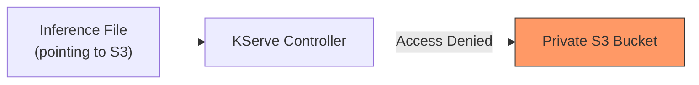

### Solving S3 Access for KServe

- **[The Problem]** Since S3 buckets in professional environments are kept private, the KServe controller cannot download the model directly via a simple S3 URI in the inference file.
- **[The Solution]** Use a Kubernetes Service Account to bridge the authentication gap
    - **Step 1: Create a Service Account** in the Kubernetes cluster
    - **Step 2: Create an AWS Secret** containing the required AWS credentials
    - **Step 3: Attach the Secret to the Service Account** so it has the necessary permissions to interact with S3
    - **Step 4: Reference the Service Account** in the `inference.yaml` manifest

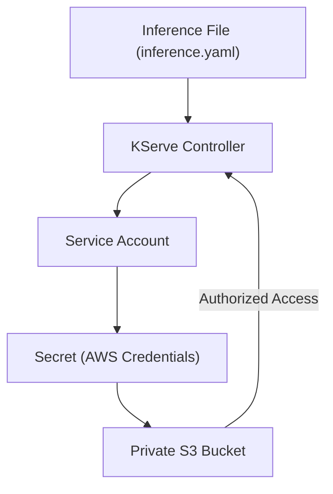

### Implementing Secure S3 Access in Kubernetes

- **[The Strategy]** To allow KServe to pull a model from a private S3 bucket, the deployment must have the correct identity and credentials.
- **Step 1: Create a dedicated Namespace**
    - This keeps the ML resources isolated from other cluster components
    - Command used: `kubectl create ns ml`
- **Step 2: Define a Service Account and Secret**
    - A `ServiceAccount` is created to act as the identity for the KServe deployment.
    - A `Secret` is created to store the sensitive AWS credentials needed to authenticate with S3.

#### Service Account and Secret Configuration

- The configuration is managed via a YAML manifest (e.g., `svc_account.yaml`).
- The Secret contains the following key-value pairs in `stringData`:
    - `AWS_ACCESS_KEY_ID`
    - `AWS_SECRET_ACCESS_KEY`

```yaml
apiVersion: v1
kind: Secret
metadata:
  name: s3-secret
  namespace: churn-model
  annotations:
    serving.kserve.io/s3-endpoint: s3.amazonaws.com
    serving.kserve.io/s3-usehttps: "1"
    serving.kserve.io/s3-region: us-east-1
type: Opaque
stringData:
  AWS_ACCESS_KEY_ID: "<YOUR_ACCESS_KEY>"
  AWS_SECRET_ACCESS_KEY: "<YOUR_SECRET_KEY>"
---
apiVersion: v1
kind: ServiceAccount
metadata:
  name: so-s3-access
  namespace: churn-model
secrets:
  - name: s3-secret
```

- **[The Connection]** The `ServiceAccount` references the `s3-secret` via the `secrets` field, effectively attaching the AWS credentials to that identity.

### Secure Model Retrieval Workflow

- **[The Problem]** In a professional organization, S3 buckets containing models are private and not accessible to the public.
- **[The Solution]** Instead of making the bucket public, we provide the KServe deployment with an identity that has the necessary AWS permissions.

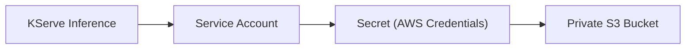

- **Implementation Steps**:
    - Create a **Service Account** in Kubernetes to serve as the deployment's identity.
    - Create a **Secret** containing the `AWS_ACCESS_KEY_ID` and `AWS_SECRET_ACCESS_KEY`.
    - Link the Secret to the Service Account.
    - Reference the **Service Account name** inside the `inference.yaml` manifest.
    - KServe will then use this identity to authenticate and pull the model from the private bucket.

### KServe Inference Configuration

- **[Integration]** To complete the deployment, the `inference.yaml` manifest must explicitly reference the newly created `ServiceAccount`.
- **[The Process]** Once the `ServiceAccount` name is provided in the inference file, KServe automatically handles the authentication handshake. The deployment uses the identity to pull the model from the private S3 bucket and execute it within the pod.
- **[Summary of Manifest Requirements]**
    - **Namespace**: Ensure the `ServiceAccount` and `Secret` are in the same namespace as the KServe deployment.
    - **ServiceAccount Name**: Must match the `metadata.name` defined in the `svc_account.yaml`.
    - **Permissions**: The credentials within the `Secret` must have sufficient IAM/S3 permissions to access the specific bucket path.

### Implementation: Namespace Setup

- To keep the MLOps components organized, a dedicated namespace is created before deploying the service account and manifests.
- **Command**:

```bash
kubectl create namespace ml
```

### Implementing Secure S3 Access via Manifests

- To provide the KServe deployment with the necessary AWS permissions, a combined manifest is used to define both the credentials and the identity.
- **[Note]** The `namespace` field is removed from the manifest if the namespace (e.g., `ml`) has already been created via `kubectl`.
- **Manifest:&#32;`svc-account.yaml`**
    - This file contains two primary resources: a `Secret` for the credentials and a `ServiceAccount` to use those credentials.

```yaml
apiVersion: v1
kind: Secret
metadata:
  name: s3-secret
  namespace: churn-model
  annotations:
    serving.kserve.io/s3-endpoint: s3.amazonaws.com
    serving.kserve.io/s3-usehttps: "1"
    serving.kserve.io/s3-region: us-east-1
type: Opaque
stringData:
  AWS_ACCESS_KEY_ID: "<YOUR_ACCESS_KEY_ID>"
  AWS_SECRET_ACCESS_KEY: "<YOUR_SECRET_ACCESS_KEY>"
---
apiVersion: v1
kind: ServiceAccount
metadata:
  name: so-s3-access
  namespace: churn-model
secrets:
  - name: s3-secret
```

- **Resource Breakdown**:
    - **`Secret`&#32;(`s3-secret`)**:
        - Uses `stringData` to securely store the `AWS_ACCESS_KEY_ID` and `AWS_SECRET_ACCESS_KEY`.
        - Includes annotations to tell KServe how to connect to the S3 endpoint, whether to use HTTPS, and which region to target.
    - **`ServiceAccount`&#32;(`so-s3-access`)**:
        - Acts as the identity for the KServe deployment.
        - The `secrets` field links this account to the `s3-secret`, allowing any pod using this service account to inherit the AWS credentials.

### Finalizing the ServiceAccount Manifest

- The `namespace` in the manifest must be updated to match the manually created namespace (`ml`) to ensure the resources are deployed to the correct location.
- **Manifest Updates**:
    - The `namespace` field for both the `Secret` and the `ServiceAccount` is changed from `churn-model` to `ml`.
    - Real AWS credentials are provided in the `stringData` section of the `Secret`.

```yaml
apiVersion: v1
kind: Secret
metadata:
  name: s3-secret
  namespace: ml
  annotations:
    serving.kserve.io/s3-endpoint: s3.amazonaws.com
    serving.kserve.io/s3-usehttps: "1"
    serving.kserve.io/s3-region: us-east-1
type: Opaque
stringData:
  AWS_ACCESS_KEY_ID: "<YOUR_ACCESS_KEY_ID>"
  AWS_SECRET_ACCESS_KEY: "<YOUR_SECRET_ACCESS_KEY>"
---
apiVersion: v1
kind: ServiceAccount
metadata:
  name: sa-s3-access
  namespace: ml
secrets:
  - name: s3-secret
```

- **Applying the Configuration**:
    - Use `kubectl apply -f svcaccount.yaml` to create the resources in the cluster.
    - **Verification**:
        - Run `kubectl get sa -n ml` to confirm the ServiceAccount (`sa-s3-access`) has been successfully created within the `ml` namespace.

### Creating the KServe Inference Manifest

To deploy the model, an `inference.yaml` file is created. This file instructs KServe on how to serve the model and which identity to use for accessing private storage.

- **Key Manifest Components**:
    - `apiVersion`: `serving.kserve.io/v1beta1` (the standard API version for KServe)
    - `kind`: `InferenceService`
    - `metadata.namespace`: `ml` (must match the namespace where the ServiceAccount and Secret reside)
    - `spec.predictor.serviceAccountName`: `sa-s3-access` (references the ServiceAccount created to provide S3 permissions)
    - `spec.predictor.storageUri`: The exact S3 path to the model file (e.g., `s3://churn-model-abhi-bucket/model/`)

```yaml
apiVersion: serving.kserve.io/v1beta1
kind: InferenceService
metadata:
  name: churn-predictor
  namespace: ml
spec:
  predictor:
    serviceAccountName: sa-s3-access
    sklearn:
      storageUri: s3://churn-model-abhi-bucket/model/
```

- **KServe Automation**:
    - Once applied, KServe automatically manages several infrastructure components:
        - Deployment of the model container
        - Creation of the Kubernetes Service
        - Configuration of the Horizontal Pod Autoscaler (HPA) for scaling based on demand
- **Deployment Workflow**:

    1. Create the manifest: `vim inference.yaml`
    2. Apply to the cluster: `kubectl apply -f inference.yaml`
    3. Monitor the status: `kubectl get pods -n ml` to verify when the model pods are running and ready.

### Deploying and Accessing the Inference Service

- **Applying the Manifest**:
    - Execute `kubectl apply -f inference.yaml` to trigger the KServe deployment process.
- **Monitoring Pod Status**:
    - Use `kubectl get pods -n ml -w` to watch the pods in real-time.
    - The pods typically transition through these states:

        1. `Init:0/1` (Initializing)
        2. `Running` (Ready to serve requests)

- **Accessing the Service Locally**:
    - Because local Kubernetes clusters (like `kind`) do not expose services to the external internet by default, `kubectl port-forward` is required to bridge the connection.
    - **Command Syntax**:

```bash
kubectl port-forward svc/<service-name> <local-port>:<cluster-port>
```

    - **Example Execution**:
    - To map the local port `6009` to the service's port `80`:

```bash
kubectl port-forward svc/churn-predictor-predictor 6009:80
```

    - *Note*: In some environments, you may need to append `--address` to the command to allow external access.

### Verifying the Model via `curl`

- **Accessing the Command**:
    - The `curl` command used for testing is located in the GitHub repository under the `cicd` branch, specifically in the KServe section.
- **Execution**:
    - Once the port-forwarding is established (e.g., to port `6009`), the `curl` command is executed in a new terminal tab to send a request to the local endpoint.

**Example&#32;`curl`&#32;command structure**:

```bash
curl -X POST http://localhost:6009/v1/models/churn-predictor:predict \
-H "Content-Type: application/json" \
-d '{"instances": [[45, 24, 79.99, 1920.00, 3]]}'
```

### Verifying Model Predictions

- **Testing Feature Sensitivity**:
    - After an initial prediction of `1`, the speaker modifies the input data (changing `support_cases` to `0`) to ensure the model still produces a valid output.
    - The model continues to function correctly, confirming that the deployment is stable and responsive to different input profiles.

### Automating the MLOps Pipeline

- **Transition to CI/CD**:
    - Having implemented DVC, KServe, and Kubernetes, the next step is to automate these processes.
    - **Tooling**: GitHub Actions will be used to create automated workflows.
- **Workflow Setup**:
    - A new directory is being created to house the workflow implementation files:
    - Directory name: `how_to_implement_the_workflow`

### Setting Up GitHub Actions Workflows

- **Directory Structure**: GitHub Actions requires a specific folder hierarchy to recognize and execute workflows.
    - Create a `.github` folder in the project root.
    - Inside `.github`, create a `workflows` folder.
- **Workflow Configuration File**:
    - A YAML file is created within the `workflows` directory to define the automation steps.
    - While commonly named `ci.yaml`, the name can be customized for clarity (e.g., `mlops_pipeline.yaml`).

**Example file path structure**:

```text
.github/
└── workflows/
    └── mlops_pipeline.yaml
```

### Defining the GitHub Actions Workflow

- **Workflow Name**:
    - Assigns a descriptive name to the automation process (e.g., `name: MLOps Pipeline`).
- **Trigger Configuration (`on`)**:
    - Determines what event causes the workflow to run.
    - Common triggers include `pull_request` or `push`.
    - In this setup, the workflow is configured to trigger on a `push` to a specific branch.

**Example&#32;`mlobs_pipeline.yaml`&#32;configuration**:

```yaml
name: MLOps Pipeline
on:
  push:
    branches: [cicd]
```

- **Environment Variables (`env`)**:
    - Used to declare variables that are accessible throughout the entire workflow.
    - **[Security Note]**: Sensitive information like AWS credentials should **not** be declared in `env` but should instead be stored in GitHub **Secrets** to prevent them from being exposed in the code.
    - The speaker defines two specific environment variables to separate CI/CD resources from manual ones:
        - `AWS_REGION`: e.g., `us-east-1`
        - `S3_BUCKET`: A dedicated bucket for the automated pipeline (e.g., `churn-model-bucket-cicd-abhi`).

**Example&#32;`env`&#32;configuration**:

```yaml
env:
  AWS_REGION: us-east-1
  S3_BUCKET: churn-model-bucket-cicd-abhi
```

- **Jobs Configuration**:
    - The `jobs` section defines the actual tasks the workflow will perform.
    - While a pipeline can be broken into multiple discrete jobs (e.g., one for `train` and one for `deploy`), the speaker starts with a single combined job.
    - **Job Name**: `train-and-deploy`.
    - **Runner/Virtual Machine (`runs-on`)**:
        - Every job must specify the type of virtual machine (runner) it needs to execute on.

**Workflow structure progression**:

```yaml
jobs:
  train-and-deploy:
    runs-on: ubuntu-latest # (Example runner selection)
```

### Configuring Job Permissions

- **Runner Selection**:
    - The `train-and-deploy` job is configured to run on `ubuntu-latest`.
- **Permissions Configuration**:
    - The `permissions` block defines what the GitHub Actions runner is allowed to do within the repository.
    - **[Why use it?]** To enable the workflow to automatically update the `inference.yaml` file with the location of a newly created model version.
    - Setting `contents: write` allows the job to edit or create files in the repository.

**Example&#32;`train-and-deploy`&#32;job configuration**:

```yaml
jobs:
  train-and-deploy:
    runs-on: ubuntu-latest
    permissions:
      contents: write
```

- **Workflow Steps**:
    - The next phase involves defining specific steps within the job, starting with checking out the code.

### Defining Workflow Steps

- **Checkout Code Step**:
    - The first step in the job is to pull the repository's code onto the runner.
    - This is achieved using the `actions/checkout` action.
    - **[Why use it?]** Without this step, the runner would have an empty environment and wouldn't be able to access the scripts or configuration files needed for the pipeline.

**Example&#32;`steps`&#32;configuration**:

```yaml
steps:
  - name: Checkout code
    uses: actions/checkout@v3
    with:
      token: ${{ secrets.GITHUB_TOKEN }}
```

- **Install Dependencies Step**:
    - After checking out the code, the next step is to install the required Python packages.
    - **[Why do this?]** This replicates the manual process of setting up a local environment to ensure the runner has all the libraries needed to execute the training scripts.

**Example&#32;`steps`&#32;configuration**:

```yaml
steps:
  - name: Checkout code
    uses: actions/checkout@v3
    with:
      token: ${{ secrets.GITHUB_TOKEN }}

  - name: Install dependencies
    run: pip install -r requirements.txt
```

- **Set up Python Step**:
    - Before installing dependencies, the specific Python runtime must be initialized.
    - This is done using the `actions/setup-python` action.
    - **[Why use it?]** To ensure the runner uses the exact Python version required by the project's dependencies and scripts.

**Example&#32;`steps`&#32;configuration with Python setup**:

```yaml
steps:
  - name: Checkout code
    uses: actions/checkout@v3
    with:
      token: ${{ secrets.GITHUB_TOKEN }}

  - name: Set up Python
    uses: actions/setup-python@v4
    with:
      python-version: '3.11'

  - name: Install dependencies
    run: pip install -r requirements.txt
```

- **Data Generation and Model Training Steps**:
    - Once the environment is ready, the pipeline executes the core ML tasks:
    - **Generate dataset**: Runs the `python generate_data.py` script.
    - **Train model**: Runs the `python train.py` script to produce the model file.
- **Configure AWS Credentials Step**:
    - To move the trained model to an S3 bucket, the runner needs permission to interact with AWS.
    - This is handled by the `aws-actions/configure-aws-credentials@v2` action.
    - **[What is required?]** The action needs three specific pieces of information provided via GitHub Secrets:
    - `aws-access-key-id`
    - `aws-secret-access-key`
    - `aws-region`

**Example&#32;`steps`&#32;configuration for AWS setup**:

```yaml
- name: Configure AWS credentials
    uses: aws-actions/configure-aws-credentials@v2
    with:
      aws-access-key-id: ${{ secrets.AWS_ACCESS_KEY_ID }}
      aws-secret-access-key: ${{ secrets.AWS_SECRET_ACCESS_KEY }}
      aws-region: ${{ env.AWS_REGION }}
```

### Automating Model Upload and Manifest Updates

- **Using GitHub Secrets for AWS Access**:
    - When configuring AWS credentials, the `secrets.` prefix is used to tell GitHub Actions to retrieve sensitive values from the repository's encrypted secrets store.
    - **[Why use it?]** This prevents hardcoding sensitive credentials like `AWS_ACCESS_KEY_ID` directly into the workflow file.
- **Pushing the Model to S3**:
    - After training, a step is added to upload the model file to a specific S3 bucket using the AWS CLI.
    - **Example&#32;`push model to S3`&#32;step**:

```yaml
- name: Push model to S3 directly
        run: |
          aws s3 cp models/churn_model.pkl s3://churn-model-demo-abhi-bucket/models/churn_model.pkl
          echo "Model pushed to S3 successfully"
```

- **Updating the Inference Manifest**:
    - Once the model is in S3, the `inference.yaml` file (used by KServe) must be updated to point to the new model URI.
    - This is automated using a `sed` command to replace the old S3 path with the new one within the repository.
    - **Example&#32;`update inference.yaml`&#32;step**:

```yaml
- name: Update inference.yaml with S3 model path
        run: |
          MODEL_URI="s3://churn-model-demo-abhi-bucket/models/churn_model.pkl"
          sed -i "s|storageUri:.*|storageUri: ${MODEL_URI}|" k8s/inference.yaml
```

- **Committing Changes Back to Git**:
    - After the manifest is updated locally in the runner, the changes are committed and pushed back to the repository to trigger the deployment.
    - **Example&#32;`commit updated inference.yaml`&#32;step**:

```yaml
- name: Commit updated inference.yaml
        run: |
          git config --local user.email "action@github.com"
          git config --local user.name "GitHub Action"
          git add k8s/inference.yaml
          git commit -m "Update S3 path [skip ci]"
          git push
```

    - **[Note]** The `[skip ci]` tag in the commit message is used to prevent an infinite loop of CI triggers caused by the automated commit.

### Prerequisites for Workflow Execution

- Before the automated pipeline can run successfully, certain manual setup steps are required:
    - **Create the S3 Bucket**: The target bucket (e.g., `churn-model-demo-abhi-bucket`) must exist in AWS to receive the trained model.
    - **Configure GitHub Secrets**: AWS credentials must be added to the GitHub repository settings so the workflow can authenticate with AWS.

### Summary of the Automated Workflow Steps

- The `mlops-pipeline.yaml` file (located in `.github/workflows/` on the `cicd` branch) executes the following sequence:

    1. **Update Inference Manifest**: Uses `sed` to replace the existing `storageUri` in `k8s/inference.yaml` with the newly uploaded model's S3 path.
    2. **Commit Changes**: Commits the updated `inference.yaml` back to the repository.

```yaml

# Example logic within the workflow
- name: Update inference.yaml with S3 model path
  run: |
    MODEL_URI="s3://churn-model-demo-abhi-bucket/models/churn_model.pkl"
    sed -i "s|storageUri:.*|storageUri: ${MODEL_URI}|" k8s/inference.yaml

- name: Commit updated inference.yaml
  run: |
    git config --local user.email "action@github.com"
    git config --local user.name "GitHub Action"
    git add k8s/inference.yaml
    git commit -m "Update S3 path [skip ci]"
    git push
```

### Configuring AWS Secrets in GitHub

- To allow the GitHub Actions runner to interact with AWS services (like S3), credentials must be stored as encrypted repository secrets
- **Steps to add secrets**:

    1. Navigate to the repository on GitHub
    2. Go to **Settings**
    3. In the left sidebar, locate the **CI/CD** section and select **Secrets and variables**
    4. Click on the **Actions** tab
    5. Under **Repository secrets**, click **New repository secret**

- **Required Secrets** (based on the workflow configuration):
    - `AWS_ACCESS_KEY_ID`: The unique identifier for your AWS account
    - `AWS_SECRET_ACCESS_KEY`: The secret key associated with the access key

> **Note**: When referencing these in a YAML workflow, use the `secrets` context, for example: `${{ secrets.AWS_ACCESS_KEY_ID }}`.

### Triggering the Automated Workflow

- To execute the defined workflow, perform a standard `git push` to the monitored branch (in this case, the `cicd` branch)
- **Testing the Pipeline**:
    - Make a minor, non-breaking change to the workflow file (e.g., updating an `echo` statement)
    - Commit and push the change to GitHub
    - Monitor the **Actions** tab in the GitHub repository to verify the status of the running jobs

```yaml

# Example change to trigger the workflow
- name: Push model to S3 directly
  run: |
    aws s3 cp models/churn_model.pkl s3://churn-model-bucket-cicd-abhi/models/churn_model.pkl
    echo "Model change to S3 is success" # Changed from "Model pushed to S3 successfully"
```

### Monitoring Workflow Execution

- **[Current Status]** The `Install dependencies` step is in progress
    - This step is expected to take significant time as the runner must download and install a large volume of packages and metadata
- **[Next Expected Step]** Once dependencies are successfully installed, the workflow will move to the `Generate dataset` step

### Successful Automated Pipeline Execution

- The GitHub Actions workflow completed its sequence of defined steps:
    - **Generate dataset**: Completed quickly.
    - **Generate model**: Completed.
    - **Push model to S3**: The trained model was automatically uploaded to the designated S3 bucket.

#### Verifying S3 Artifact Storage

- Upon checking the S3 bucket `churn-model-bucket-cicd-abhi`, a new `models/` folder was automatically created.
- The specific model file `churn_model.pkl` is now present within that folder.

#### Verifying Manifest Automation

- The most critical part of the automation is the automatic update of the deployment configuration.
- In the `cicd` branch, the `k8s/inference.yaml` file was automatically updated to reflect the new `storageUri` pointing to the newly uploaded model in S3:

```yaml

# Updated storageUri in k8s/inference.yaml
storageUri: s3://churn-model-bucket-cicd-abhi/models/churn_model.pkl
```

### Introduction to Argo CD

- **[Role in Pipeline]** Acts as the Continuous Deployment (CD) component to automate model serving updates
- **[Mechanism]**
        - Argo CD monitors the Git repository for changes to deployment manifests (e.g., `inference.yaml`)
        - When GitHub Actions updates the `storageUri` in the manifest to point to a new S3 model path, Argo CD identifies this change
        - Argo CD then automatically deploys the new version of the model to the Kubernetes cluster
- **[Deployment Flexibility]**
        - Can be deployed within the same Kubernetes cluster used for inference
        - Can also be deployed to a completely different cluster if configured accordingly

### Argo CD Workflow Integration

- The integration creates a seamless loop between code changes and live model updates:

    1. **GitHub Actions** updates the `inference.yaml` file in Git (specifically the `storageUri`).
    2. **Argo CD** detects the mismatch between the Git state and the cluster state.
    3. **Argo CD** synchronizes the cluster to match the new Git configuration, pulling the new model from S3.

### Accessing the Argo CD User Interface

- **[Accessing the Service]** Since a Kind cluster is being used, the Argo CD service is not automatically exposed to the host machine.
    - First, identify the service name using `kubectl get svc -n argocd`.
    - The specific service required for the UI is the `argocd-server`.
    - Use `kubectl port-forward` to expose the service locally:

```bash
kubectl port-forward svc/argocd-server 7003:80 --address 0.0.0.0
```

- **[Browser Access]**
    - Once forwarding is enabled, access the UI via `localhost:7003`.
    - **[Security Warning]** A "Potential Security Risk Ahead" warning will appear in the browser because Argo CD uses a self-signed certificate. To proceed, select "Advanced" and then "Accept the Risk and Continue".
- **[Authentication]**
    - To log in to the Argo CD UI, the User ID and Password must be retrieved from the Kubernetes secrets.
    - This can be done using the following command:

```bash
kubectl get secrets -n argocd
```

### Authenticating with Argo CD

- **[Retrieving the Password]** The initial admin password is stored in a Kubernetes secret named `argocd-initial-admin-secret`.
    - The secret value is Base64 encoded, so it must be decoded to be usable.
    - To retrieve the plain-text password, use `echo` with the `--decode` flag:

```bash
echo "<base64-encoded-string>" | base64 --decode
```

- **[Logging In]**
    - **Username**: `admin`
    - **Password**: The decoded string from the step above

### Creating a New Argo CD Application

- To start managing resources, a new application must be created in the UI with the following initial configuration:
    - **Application Name**: `KSERVE`
    - **Project Name**: `default`
    - **Sync Policy**: `Automatic`
        - **[Why use Automatic sync?]** This ensures that every time the underlying configuration files (like `inference.yaml`) are changed in Git, Argo CD identifies the change and automatically applies it to the cluster.

### Configuring the Argo CD Application Source

- **[Source Details]** To connect the application to the code repository, the following parameters are configured in the Argo CD UI:
    - **Repository URL**: The URL of the GitHub repository (e.g., `https://github.com/iam-veeramalla/Realtime-MLOps-Project.git`)
    - **Revision**: The specific branch to track. In this setup, the `cicd` branch is used.
    - **Path**: The specific directory within the repository containing the manifests. Here, the path is set to `k8s` because it contains the `inference.yaml` file.
- **[Destination Details]**
    - **Cluster URL**: The target Kubernetes cluster.
    - **Namespace**: The target namespace where the resources will be deployed. To demonstrate deployment in a different environment, the namespace is set to `churn-demo` instead of the existing `ml` namespace.

### Troubleshooting Deployment Failures

- **[The Issue]** After Argo CD attempts to sync the application, the pod enters a `CrashLoopBackOff` state.
    - Command used to check status:

```bash
kubectl get pods -n churn-model
```

    - Output observed:

```text
NAME                                READY   STATUS             RESTARTS   AGE
    churn-predictor-predictor-5d87f8f5cd-99r7r   0/1    Init:CrashLoopBackOff   5 (15s ago)   50s
```

- **[Root Cause Analysis]** There is a discrepancy between the manual configuration and the GitOps configuration:
    - **Manual Deployment (Success)**: The `serviceaccount.yaml` used during manual testing included the actual secret values (AWS credentials) via `stringData`.
    - **Git-based Deployment (Failure)**: The `serviceaccount.yaml` stored in the GitHub repository cannot contain these sensitive secret values.
    - **Result**: Because the repository version lacks the necessary credentials, the container fails to initialize and crashes repeatedly.

### Resolving Secret Discrepancies via Manual Update

- **[The Strategy]** Because sensitive AWS credentials cannot be committed to the GitHub repository, the Kubernetes secret must be updated directly in the cluster to provide the necessary authentication for the `CrashLoopBackOff` pod.
- **[Secret Management Approaches]**
    - **Production/Scalable Methods**:
        - Sealed Secrets operator
        - Inbuilt CSI Secret Store operator
    - **Demonstration Method**: Manual editing of the existing Kubernetes secret
- **[Execution]**
    - Command used to edit the secret:

```bash
kubectl edit secret s3-secret -n churn-model
```

    - The `AWS_ACCESS_KEY_ID` and `AWS_SECRET_ACCESS_KEY` are pasted into the secret's data field to restore access to the private S3 bucket.

### Verifying the Fixed Deployment

- **[Triggering Sync]** After manually updating the secret in the cluster, Argo CD needs to be notified to reconcile the application state.
    - Options to trigger a sync:
        - Press the **Resync** option in the Argo CD UI.
        - Delete the existing deployment and let Argo CD recreate it.
- **[Verifying Pod Status]** Once the resync is complete, verify that the pod has transitioned from `CrashLoopBackOff` to `Running`:

```bash
kubectl get pods -n churn-model
```

- **[Accessing the Pod Locally]** To interact with the running model, the pod can be exposed via port-forwarding:
    - Command syntax:

```bash
kubectl port-forward pod/<pod-name> <local-port>:<container-port>
```

    - *Note: The speaker demonstrates the command structure to ensure the correct pod name and ports are used for the connection.*

### Exposing the Service via Port-Forwarding

- **[Method]** Instead of port-forwarding directly to a specific pod, you can port-forward to the service itself to ensure traffic is routed correctly to the deployment.
- **[Command Syntax]**
        - Use `kubectl port-forward svc/<service-name> <local-port>`
        - Example command used:

```bash
kubectl port-forward svc/churn-predictor 8123
```

    - In this case, the service `churn-predictor` is being mapped to local port `8123`.

### Testing the KServe Endpoint

- **[Endpoint Difference]** KServe runs the model on a unique endpoint that is different from the one used during local model verification.
- **[Locating the Command]** The correct API usage command for KServe can be found in the project documentation under the `cicd` branch.
- **[API Usage Example]** Based on the documentation, the command structure for testing the KServe inference service involves a specific URL and payload:

```bash
curl -X POST http://localhost:8000/v1/models/churn-predictor:predict \
-H "Content-Type: application/json" \
-d '{
    "instances": [
        [45, 24, 79.99, 1928.00, 3]
    ]
}'
```

- **[Troubleshooting Port Mismatch]** When running the `curl` command, ensure the port matches the one used in the `kubectl port-forward` command.
    - If the port-forward was set to `8114`:

```bash
kubectl port-forward svc/churn-predictor-predictor 8114
```

    - The `curl` command must then target `localhost:8114` instead of the default `8000` to avoid connection errors.

### End-to-End MLOps Implementation Summary

- **[The CI/CD Combination]** The pipeline leverages a combination of GitHub Actions and Argo CD to achieve full automation:
    - **GitHub Actions (Continuous Integration/Automation)**
        - Automates the entire training process
        - Handles deployment-related steps, specifically updating the `inference.yaml` manifest with new model details
    - **Argo CD (Continuous Deployment)**
        - Monitors the updated manifest in the repository
        - Automatically deploys the changes to the Kubernetes cluster
- **[Argo CD Operational Workflow]**
    - **One-time Setup**: Creating the Argo CD instance and the initial application is a manual task that only needs to be performed once.
    - **Automated Synchronization**: Once configured, any future changes to the inference file in the repository are automatically identified by Argo CD and applied to the cluster.

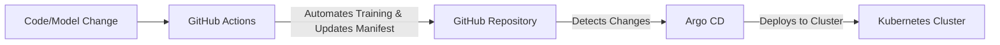

### Course Key Takeaways

- **[Core Concepts Covered]** The course provided a progression from foundational theory to real-world implementation:
    - Understanding the fundamental definition and purpose of MLOps
    - Exploring the professional scope and responsibilities of an MLOps engineer through a beginner-friendly project
    - Mastering Data Version Control (DVC) and its real-time implementation

### Additional Course Topics

- **[Experiment Tracking]** Utilizing MLflow to manage and monitor machine learning experiments:
    - Implementing production-grade MLflow setups
    - Visualizing and comparing differences between different experiments
- **[Deployment and Serving]** Focusing on the critical MLOps activity of making models available for use in production environments