[00:00:28](https://10pearls.udemy.com/course/mlops-zero-to-hero/learn/lecture/53846869#search)

## KServe Architecture

- **[Purpose]** To enable faster shipping of recommendation models from data scientists to production
- **Deployment Workflow**
    - Data scientists create recommendation models (e.g., for movie recommendations)
    - MLOps engineers deploy these models using KServe
- **Infrastructure Requirements**
    - Requires a Kubernetes cluster
    - MLOps engineers can reuse existing clusters or share them with DevOps engineers

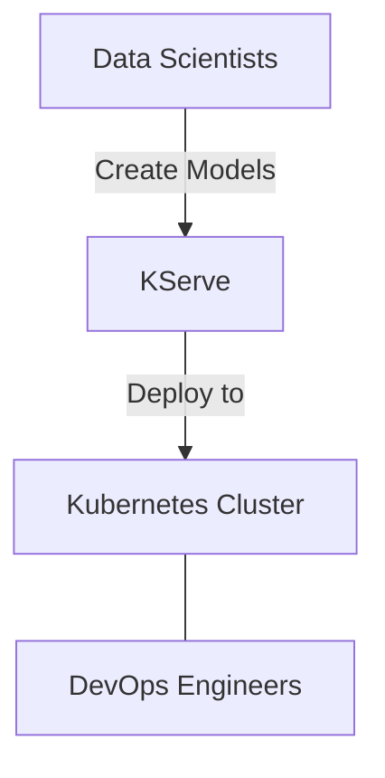

### KServe Initial Setup

- **Namespace Creation**
    - MLOps engineers create a dedicated namespace (e.g., `kserve-namespace`) within the Kubernetes cluster
- **KServe Controller Installation**
    - The KServe controller is an open-source component installed into the namespace
    - It can be deployed using Helm charts or Kubernetes manifests
    - This follows a similar pattern to other controllers like Argo CD, Istio, or Prometheus
- **Resource Scope**
    - The KServe controller is a cluster-scoped resource

### KServe Controller Scope and Inference Service

- **Cluster-wide Visibility**
    - Because the controller is cluster-scoped, it can watch all namespaces within the cluster
    - Example: It can monitor both a `recommendation` namespace and a `payments` namespace simultaneously
- **Inference Service**
    - A Custom Resource Definition (CRD) provided by the KServe project
    - It is the resource created by MLOps engineers within a specific namespace to manage model deployment

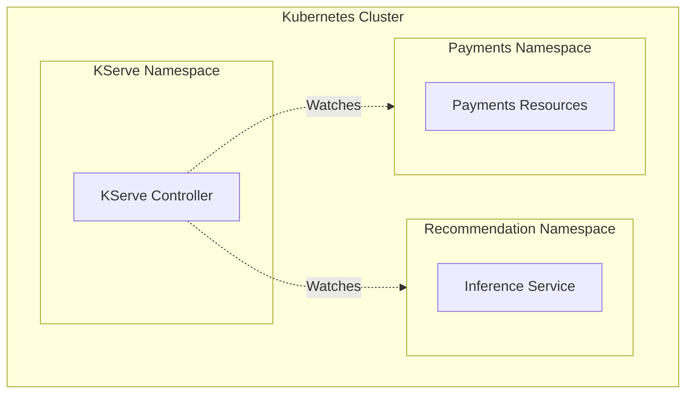

### Using the Inference Service (CRD)

- **Linking the Model**
    - The MLOps engineer uses the CRD to provide the specific location of the model file
    - This model is typically stored in a centralized registry created by the Data Scientist
- **Automated Orchestration**
    - As soon as the CRD is created, the KServe controller detects it
    - The controller reads the model location and automatically triggers the creation of resources like the Horizontal Pod Autoscaler (HPA)

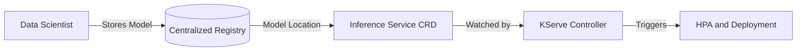

### Automated Deployment Workflow

- **Orchestration Chain**
    - Once the KServe controller watches and reads the model location from the Inference Service CRD, it triggers the following sequence:
        - Creation of a **Deployment**
        - Configuration of a **Horizontal Pod Autoscaler (HPA)**
        - Provisioning of **Pods**
- **The Role of the Pod**
    - The Pod serves as the runtime environment that contains the actual **model container**

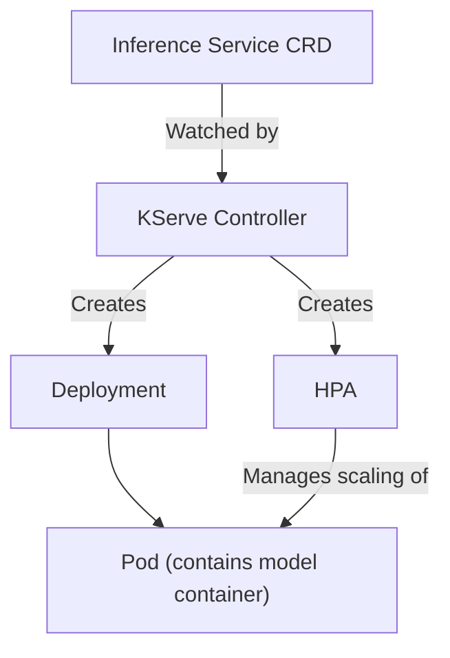

### Extended Automated Deployment

- **Networking Resources**
    - Beyond the compute layer, KServe automatically provisions:
        - A **Service** for the pod
        - An **Ingress** resource to manage external access
- **Gateway API Support**
    - KServe is capable of using the **Gateway API** instead of a standard Ingress
    - **[How to configure]** The choice between Ingress and Gateway API is determined during the KServe controller installation using Helm
    - This is managed by providing the desired setting in the `values.yaml` file

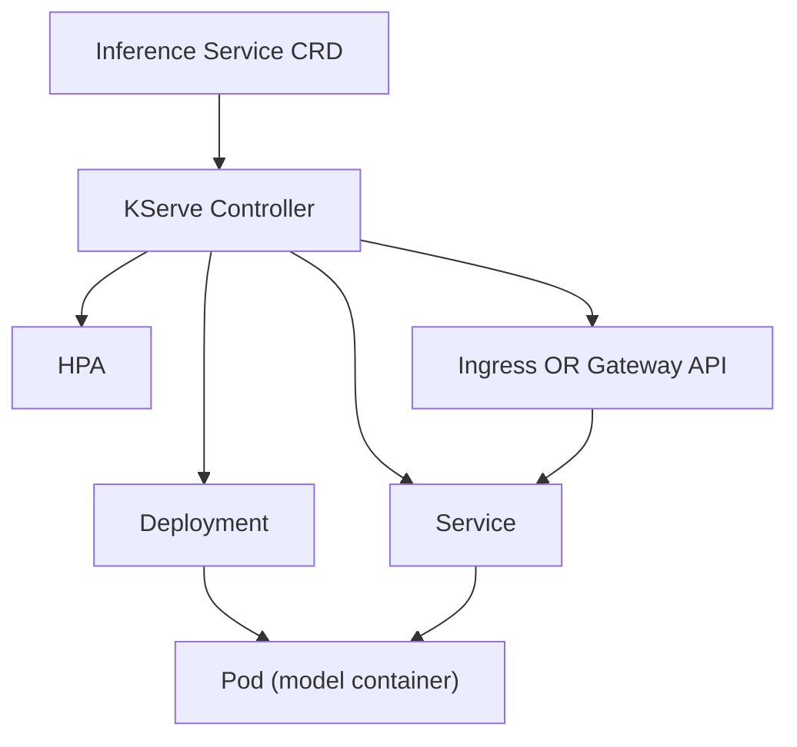

### End-to-End Request Flow

- **Request Path**
    - End users interact with the system via the **Ingress URL**
    - Requests sent to the Ingress are routed to the **Pod** where the model container is actively running
- **Model Framework Compatibility**
    - KServe supports various machine learning frameworks
    - **[Compatibility]** The model container can run diverse file types because KServe provides compatible model servers
        - Examples include `.pkl` files or `.joblib` files

### Summary of MLOps Responsibilities

- **Cluster Management**
    - The primary responsibility is to ensure a Kubernetes cluster is available (either by creating a new one or using an existing one)
    - Within that cluster, the engineer must set up the necessary namespaces to host the services

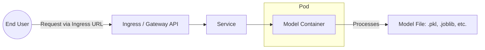

### KServe End-to-End Architecture

- **Deployment Lifecycle**
    - The MLOps engineer sets up the environment by:
        - Creating or using an existing Kubernetes cluster
        - Creating a dedicated namespace for KServe
        - Installing the KServe controller (typically via Helm)
    - Once the controller is running, it does not sit idle; it actively "watches" for specific resources
    - **[Trigger]** When an Inference Service (CRD) is created, the controller orchestrates the following:
        - Creates a **Deployment**
        - Configures a **Horizontal Pod Autoscaler (HPA)**
        - Provisions a **Pod** containing the model container
        - Sets up networking via a **Service** combined with either **Ingress** or **Gateway API**
- **Accessing the Model**
    - End users interact with the model through the provided **URL** (via the Ingress or Gateway API)

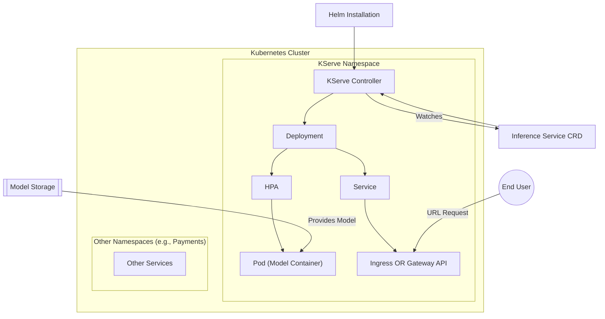

- **Resources and Documentation**
    - As an open-source project, configuration details and documentation are available via:
        - Official open-source documentation
        - The project's GitHub repository

### KServe Practical Demo Roadmap

- **Implementation Objectives**
    - Installing KServe on a Kubernetes cluster
    - Configuring the KServe environment
    - Observing the KServe controller's mechanism for watching Inference Service resources

### Cluster Setup and Verification

- **Prerequisites**
    - `kind` (Kubernetes in Docker)
    - `helm`
    - `trivy` (for security scanning/vulnerability detection)
- **Creating a local cluster with Kind**
    - Use the following command to create a cluster specifically named for the demo:

```bash
kind create cluster --name mlops-kserve-demo
```

    - This process typically takes between 60 seconds and 2 minutes
- **[Crucial Step] Verifying the active cluster**
    - Because MLOps engineers often manage multiple clusters, always verify that `kubectl` is pointing to the correct context before running deployment commands
    - Use `kubectl config current-context` to check the active cluster

### KServe Installation Prerequisites

- **[Safety Check] Context Verification**
    - Before installing any resources, verify which cluster `kubectl` is targeting
    - **[Why?]** In professional environments, engineers often manage both `dev` and `prod` clusters; accidentally deploying to `prod` can have severe consequences
    - Use the following command to confirm the active context:

```bash
kubectl config current-context
```

    - In this demo, the active context is `kind-mlops-kserve-demo`
- **Installing cert-manager**
    - A mandatory prerequisite for KServe installation
    - **[Why use it?]** KServe is used for model serving, and real-world applications require secure communication via HTTPS rather than unencrypted HTTP
    - cert-manager automates the process of:
        - Issuing SSL/TLS certificates
        - Managing certificate lifecycles
        - Eliminating the need to manually create or maintain self-signed certificates

### Cert-manager Installation

- Install cert-manager using the command provided in the project's GitHub repository
    - Example command structure:

```bash
kubectl apply -f https://github.com/cert-manager/cert-manager/releases/latest/download/cert-manager.yaml
```

- **[Crucial Check] Verify Pod Status**
    - After running the installation, you must verify that the cert-manager pods are in the `Running` state
    - **[Why?]** The KServe controller depends on cert-manager; if you attempt to install the controller before cert-manager is fully operational, the process may fail
    - Use the following command to check the status:

```bash
kubectl get pods -n cert-manager
```

### KServe CRDs Installation

- **[Mandatory Step] Install Custom Resource Definitions (CRDs)**
    - CRDs must always be installed *before* the controller itself
    - This is a universal requirement for Kubernetes controllers, including:
        - KServe
        - Istio
        - Rook
- The installation command for KServe CRDs follows this pattern:

```bash
helm install kserve-crd oci://ghcr.io/kserve/charts/kserve-crd --version v0.16.0
```

### KServe Controller Installation

- **[Step 1] Create a dedicated namespace**
    - It is best practice to isolate KServe resources within their own namespace
    - Command:

```bash
kubectl create namespace kserve
```

- **[Step 2] Install the KServe controller**
    - Once the CRDs are installed and the namespace is ready, use Helm to install the controller
    - The command specifies the OCI registry location and the desired version
    - Example command:

```bash
helm install kserve oci://ghcr.io/kserve/charts/kserve-crd --version v0.16.0 --namespace kserve
```

- **[Note on Startup Time]**
    - A Kubernetes controller runs as a pod and must transition to a `Running` state
    - This process typically takes between 60 seconds and 2 minutes to complete

### Deploying Inference Service

- **[Step 1] Create a dedicated MLOps namespace**
    - To isolate the inference services, create a new namespace (e.g., `ml`)
    - Command:

```bash
kubectl create namespace ml
```

- **[Step 2] Deploy the InferenceService Custom Resource**
    - Once the namespace is ready, deploy the `InferenceService` manifest to define the model serving instance
    - Command:

```bash
kubectl apply -n ml -f <EOF_file>
```

- **InferenceService Manifest Breakdown**
    - The manifest defines how the model is served, including its location and resource constraints
    - Key fields in the YAML structure:
    - `apiVersion`: `serving.kserve.io/v1beta1`
    - `kind`: `InferenceService`
    - `metadata`: Contains the name of the service (e.g., `sklearn-iris`)
    - `spec`:
        - `predictor`:
            - `model`:
                - `modelFormat`: The type of model being used (e.g., `sklearn`)
                - `storageUri`: The cloud storage path where the model artifacts are located
                    - Example: `gs://kfserving-examples/models/sklearn/1.0/model`
                - `resources`:
                    - `requests`:
                        - `cpu`: Amount of CPU requested (e.g., `100m`)
                        - `memory`: Amount of memory requested (e.g., `512Mi`)
                    - `limits`:
                        - `cpu`: Maximum CPU allowed (e.g., `1`)
                        - `memory`: Maximum memory allowed (e.g., `1Gi`)

```yaml
apiVersion: serving.kserve.io/v1beta1
kind: InferenceService
metadata:
  name: sklearn-iris
spec:
  predictor:
    model:
      modelFormat:
        name: sklearn
      storageUri: gs://kfserving-examples/models/sklearn/1.0/model
      resources:
        requests:
          cpu: "100m"
          memory: "512Mi"
        limits:
          cpu: "1"
          memory: "1Gi"
```

### Model Format and Storage

- The `modelFormat` field specifies the type of model being served
    - This must match the actual model type stored in the `storageUri` (e.g., `sklearn`, `TensorFlow`, `MLflow`, or `PyTorch`)
    - In this example, `sklearn` is used because the artifacts in `gs://kfserving-examples/models/sklearn/1.0/model` are scikit-learn models

### Deploying and Verifying the Service

- **[Step 3] Apply the manifest**
    - Execute the command to create the `InferenceService` in the `ml` namespace
    - Command:

```bash
kubectl apply -n ml -f <EOF_file>
```

- **[Step 4] Verify controller activity**
    - Once the resource is created, the KServe controller identifies the request and begins provisioning resources
    - You can observe the controller's response by checking the pods in the `kserve` namespace
    - Command:

```bash
kubectl get pods -n kserve
```

- **[Step 5] Inspect container logs**
    - To see the detailed operational logs of the controller, use the `logs` command with the specific pod name
    - Command:

```bash
kubectl logs <pod_name> -n kserve --all-containers
```

> Note: The logs will show the controller reconciling the `InferenceService` resource, which includes steps like resolving the container, checking resources, and managing the deployment mode.

### KServe Controller Reconciliation

- By inspecting the controller logs, you can see the reconciliation process in action for the `sklearn-iris` service
- **[What is reconciled?]** The controller identifies the `InferenceService` and automatically manages the following resources:
    - Deployment
    - Service
    - Horizontal Pod Autoscaler (HPA)

```text
reconciling inference service, apiVersion:serving.kserve/v1beta1, msg:Inference service deployment mode: "Standard"
reconciling inference service, apiVersion:serving.kserve/v1beta1, msg:Reconciling inference service
reconciling inference service, apiVersion:serving.kserve/v1beta1, msg:CubandConfigMapReconciler, msg:Reconciling CubandConfigMap
reconciling inference service, apiVersion:serving.kserve/v1beta1, msg:PredictorReconciler, msg:Resolved container, "name": "sklearn-iris", "model": "v0.18", "limits": {"cpu": "100m", "memory": "512Mi"}, "capabilities": {"drop": ["ALL"], "privileged": false, "runAsNonRoot": true}}
```

### Accessing the Service Locally

- **[Verify the Service]** Check that the service has been created in the `ml` namespace
    - Command:

```bash
kubectl get svc -n ml
```

- **[Local Access via Port-Forward]** Because this is a local cluster, standard Ingress is not used for external access
    - Instead, use `kubectl port-forward` to map the service to a local port
    - Command (mapping local port 8080 to the service):

```bash
kubectl port-forward svc/sklearn-iris-predictor 8080:80
```

### Accessing the Service Locally

- **[Step 6] Port-forwarding the service**
    - Because this is a local cluster, an Ingress is not available to route external traffic to the service
    - Use `kubectl port-forward` to map a local port to the service port
    - To allow access from other devices or virtual machines, bind to `0.0.0.0` instead of `127.0.0.1`

**Command Template:**

```bash
kubectl port-forward svc/<service-name> <local-port>:<service-port> -n <namespace> --address 0.0.0.0
```

**Troubleshooting Port Conflicts:**

- If you receive an error stating `unable to listen on any requested port, address is already in use`, it means another process is already using that local port
- **Solution:** Simply choose a different local port (e.g., change `8080` to `8089`)

**Execution Example:**

```bash

# Attempting to forward to port 8080
kubectl port-forward svc/sklearn-iris-predictor 8080:80 -n ml --address 0.0.0.0

# Error encountered:

# Error from server (NotFound): services "sklearn-iris-predictor" not found

# unable to listen on port 8080: Listen tcp 0.0.0.0:8080: bind: address already in use

# Using an alternative port to resolve the conflict
kubectl port-forward svc/sklearn-iris-predictor 8089:80 -n ml --address 0.0.0.0
```

- **[Create Cluster]** Using `kind` to create a new cluster named `mlops-kserve-demo`
    - Expected duration: 60 seconds to 2 minutes
    - Command:

```bash
kind create cluster --name mlops-kserve-demo
```

- **[Verify Kubectl Context]** It is vital to check which cluster `kubectl` is currently pointing to, as engineers often manage multiple environments (e.g., Dev vs. Prod)
    - Command to check current context:

```bash
kubectl config current-context
```

### Preventing Environment Misconfiguration

- **[Risk]** If `kubectl` is pointing to a production cluster instead of a development cluster, running commands will create or modify resources in the production environment
- **[Mitigation]** Always verify the active context before proceeding with installations or deployments
    - Command: `kubectl config current-context`

### KServe Prerequisites

- **Cert-manager Installation**
    - Must be installed before KServe
    - **[Why?]** KServe performs model serving and requires SSL/TLS to allow customers to access models via `https` rather than insecure `http`
- **[Purpose]** Automates SSL/TLS management for KServe
    - Eliminates the need to manually create, maintain, or manage self-signed certificates
- **[Installation Command]**

```bash
kubectl apply -f https://github.com/cert-manager/cert-manager/releases/latest/download/cert-manager.yaml
```

- **[Verification]** It is critical to wait for the cert-manager pods to reach a `Running` state before moving to the next step
    - **[Why?]** The KServe controller relies on cert-manager; if the pods aren't ready, the controller will fail to function correctly
    - Command to check status:

```bash
kubectl get pods -n cert-manager
```

### KServe Installation Sequence

- **[Step 1] Install Custom Resource Definitions (CRDs)**
    - CRDs must be installed before the controller
    - This applies not just to KServe, but is a general best practice in Kubernetes
- **[Step 2] Install KServe Controller**
    - Once CRDs are established, the controller can be deployed to manage the new resources

### KServe Installation

- **[Step 3] Create KServe Namespace**
    - Creates a dedicated namespace to isolate KServe resources
    - Command:

```bash
kubectl create namespace kserve
```

- **[Step 4] Install KServe CRDs**
    - **[Why?]** CRDs must be installed before the controller for any Kubernetes tool (e.g., Istio, Argo CD, or KServe) so the cluster understands the new resource types
    - Command:

```bash
helm install kserve-crd oci://ghcr.io/kserve/charts/kserve-crd
```

- **[Step 5] Install KServe Controller**
    - Deploys the actual controller logic to manage KServe resources
    - **[Expected Behavior]** Since it runs as a Kubernetes pod, it typically takes between 60 seconds and 2 minutes to reach the `Running` state
    - Command:

```bash
helm install kserve oci://ghcr.io/kserve/charts/kserve
```

    - **[Verification]** Check that the controller pod is running:

```bash
kubectl get pods
```

### Deploying Inference Services

- **[Context]** With the Kubernetes cluster, KServe controller, and dependencies installed, the focus shifts to deploying actual machine learning models.
- **[Step 1] Create an MLOps Namespace**
    - **[Why?]** To provide a dedicated environment for MLOps workloads and their associated InferenceServices.
    - Command:

```bash
kubectl create namespace ml
```

- **[Step 2] Deploy an InferenceService Custom Resource**
    - The InferenceService is the core KServe resource used to serve models.
    - It is deployed within the dedicated MLOps namespace.
    - **[Example Manifest Structure]**

```yaml
apiVersion: serving.kserve.io/v1beta1
      kind: InferenceService
      metadata:
        name: sklearn-iris
      spec:
        predictor:
          model:
            modelFormat:
              name: sklearn
            storageUri: "gs://kfserving-examples/models/sklearn/1.0/model"
          resources:
            requests:
              cpu: "1"
              memory: "512Mi"
            limits:
              cpu: "1"
              memory: "1Gi"
```

    - **[Key Components]**
        - `apiVersion` & `kind`: Identifies this as a KServe InferenceService.
        - `metadata.name`: The unique name for the service (e.g., `sklearn-iris`).
        - `spec.predictor.model.storageUri`: The remote location where the model artifacts are stored (e.g., a Google Cloud Storage bucket).
        - `resources`: Defines the CPU and memory requests and limits for the serving container.

### Deploying the InferenceService

- **[Step 3] Apply the Manifest**
    - Use `kubectl apply` to create the resource in the `ml` namespace.
    - Command:

```bash
kubectl apply -f <filename>.yaml -n ml
```

- **[Manifest Details: Model Configuration]**
    - `modelFormat`: Specifies the type of model being served (e.g., `sklearn`, `tensorflow`, `pytorch`, or `mlflow`).
    - `storageUri`: The remote path where the model artifacts reside. In this example, it points to a Google Cloud Storage bucket used for demonstrations:
    - `gs://kfserving-examples/models/sklearn/1.0/model`
- **[Verification] The Controller's Reaction**
    - Once the `InferenceService` is created, the KServe controller identifies the new custom resource and automatically manages the deployment.
    - **[Observation]** You can see the controller responding by starting new pods in the namespace.
    - Command to check the pods in the `kserve` namespace:

```bash
kubectl get pods -n kserve
```

- **[Workflow Summary]**

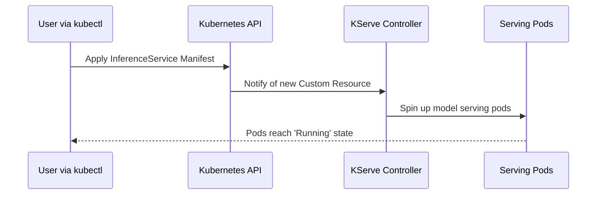

- **[The Reconciliation Loop]** Once the `InferenceService` is applied, the controller enters a reconciliation phase to match the cluster state to the manifest
    - It identifies the specific resource being reconciled (e.g., `Reconciling inference service, apiVersion: "serving.kserve.io/v1beta1", name: "sklearn-iris"`)
- **[Automated Resource Creation]** As part of the reconciliation process, the controller automatically spins up several underlying Kubernetes components:
    - **Deployment**: To manage the model serving pods
    - **Service**: To provide a stable network endpoint for the model
    - **Horizontal Pod Autoscaler (HPA)**: To handle automatic scaling based on demand
- **[Verifying Network Access]**
    - After reconciliation, a Service is created in the target namespace (e.g., `ml`)
    - Command to check services:

```bash
kubectl get svc -n ml
```

    - **[Note on Local Clusters]** Since this is a local cluster, standard Ingress might not be directly accessible; `kubectl port-forward` can be used to expose the service locally:

```bash
kubectl port-forward svc/<service-name> <local-port>:<remote-port> -n ml
```

### Exposing the Service Locally

- Since standard Ingress is often unavailable in local clusters, `kubectl port-forward` is used to map the cluster service to a local port
- **[Command Syntax]** The command requires the service name, local port, remote port, the address to bind to, and the correct namespace:

```bash
kubectl port-forward svc/sklearn-iris-predictor 8080:80 --address 0.0.0.0 -n ml
```

- **[Troubleshooting] Port Conflicts**
    - If the command fails with an error like `unable to listen on any requested port, address is already in use`, it means the chosen local port (e.g., 8080) is currently occupied by another process
    - **[Solution]** Simply select a different local port to avoid the conflict:

```bash
kubectl port-forward svc/sklearn-iris-predictor 8089:80 --address 0.0.0.0 -n ml
```

- **[Verification] Testing the Endpoint**
    - Once the port-forward is active, the service can be accessed via `curl` or a web browser on the specified local port
    - For example, to test the model via the terminal:

```bash
curl <local-address>:<local-port>
```

### Verifying the Model Prediction

- After setting up the port-forward, the model endpoint can be tested using `curl` with a JSON payload
- **[Example Test]** To predict flower species using the iris model:

```bash
curl -s localhost:8089 -d '{"data": {"inputs": [[5.1, 3.5, 1.4, 0.2]]}}'
```

- **[Result]** The model returns a JSON response containing the prediction (e.g., `"prediction": 2`), indicating the identified flower species

### KServe Workflow Simplification

- Once the initial infrastructure is established, the operational burden for MLOps engineers is significantly reduced
- **[Infrastructure Requirements]** The following must be pre-configured:
    - Kubernetes cluster
    - KServe controller
    - Custom Resource Definitions (CRDs)
    - cert-manager
- **[New Workloads]** With this setup, onboarding a new project or namespace only requires the creation of an `InferenceService` manifest for the specific model

### KServe Manifest Requirements

- To onboard a new model, a user only needs to provide a single `InferenceService` manifest containing key specifications:
    - `storageUri`: The location of the model artifacts
    - `resources`: Requested compute capacity (e.g., CPU and memory limits)
- **[Model Exposure]** KServe automatically manages the deployment and exposes the model to the external world through one of several methods:
    - Ingress
    - Gateway API
    - Port forwarding

```yaml
apiVersion: serving.kserve.io/v1beta1
kind: InferenceService
metadata:
  name: sklearn-iris
spec:
  predictor:
    model:
      modelFormat:
        name: sklearn
      storageUri: "gs://kfserving-examples/models/sklearn/1.0/model"
      resources:
        requests:
          cpu: "100m"
          memory: "512Mi"
        limits:
          cpu: "1"
          memory: "1Gi"
```

### Local Demo Environment Setup

- To save costs during the step-by-step demonstration, a local Kubernetes cluster will be used instead of a remote one
- **[Tooling]** The following tools are required for this local setup:
    - `kind` (Kubernetes in Docker) to create the demo cluster
    - `kubectl` for interacting with the cluster
    - `helm` for managing Kubernetes applications

### Creating the Local Kubernetes Cluster

- Use `kind` to create a cluster with a specific name for the demo
    - Command:

```bash
kind create cluster --name mlops-kserve-demo
```

    - The process typically takes between 60 seconds and two minutes
- **[Best Practice]** Always perform a simple check to verify your current Kubernetes context
    - Because it is easy to accidentally run commands against the wrong cluster when managing multiple environments
    - Use `kubectl config current-context` (or similar) to ensure you are targeting the intended cluster
- **[Context Safety]** Before proceeding with any installation, always verify that `kubectl` is pointing to the intended cluster
    - **[Why?]** To prevent accidentally creating or modifying resources in a production cluster if you have access to it
    - Command to verify:

```bash
kubectl config current-context
```

- **[Cert-manager]** Must be installed before KServe
    - **[Why use it?]** KServe performs model serving, and customers typically require access via HTTPS rather than HTTP
    - Cert-manager automates SSL/TLS certificate management on Kubernetes
    - It removes the need to manually create, maintain, or manage self-signed certificates
    - Installation command:

```bash
kubectl apply -f https://github.com/cert-manager/cert-manager/releases/latest/download/cert-manager.yaml
```

### Cert-manager Verification

- **[Critical]** After installing cert-manager, you must verify that its pods are in the `Running` state
    - Do not rush to the next steps until they are fully running
    - **[Why?]** The KServe controller looks for cert-manager to function; if it's not ready, the controller will fail
- Use `kubectl get pods -n cert-manager` to check the status

### KServe Installation: CRDs and Namespace

- **[Best Practice]** Always install Custom Resource Definitions (CRDs) before installing the controller
    - This applies to KServe, ArgoCD, or any other Kubernetes controller
- Steps for KServe setup:

    1. Create a dedicated namespace (e.g., `kserve`)
    2. Install the KServe CRDs
    3. Install the KServe controller via Helm

```bash

# Example of checking cert-manager pods
kubectl get pods -n cert-manager

# Create the namespace for KServe
kubectl create namespace kserve

# Install KServe CRDs (command details vary by version)
helm install kserve-crd ghcr.io/kserve/charts/kserve-crd
```

### Deploying an InferenceService

- **[Workflow]** Once the cluster, KServe controller, and dependencies are ready, the next step is to deploy the actual model using an `InferenceService` custom resource
- **[Setup Process]**

    1. Create a dedicated namespace for the MLOps instance (e.g., `ml`)
    2. Define the `InferenceService` configuration in a YAML file
    3. Apply the configuration using `kubectl apply`

#### Creating the MLOps Namespace

```bash
kubectl create namespace ml
```

#### InferenceService Configuration

An `InferenceService` resource defines how a model is served. Key components include:

- `apiVersion`: `serving.kserve.io/v1beta1`
- `kind`: `InferenceService`
- `metadata`: Contains the name of the service (e.g., `sklearn-iris`)
- `spec.predictor`: Defines the model details
    - `modelFormat`: The type of model being served (e.g., `sklearn`)
    - `model`: The name of the model
    - `storageUri`: The location where the model is stored (e.g., `gs://kfserving-examples/models/sklearn/1.0/model`)
- `resources`: Specifies the compute requirements for the pod
    - `requests`: Minimum guaranteed resources (e.g., `cpu: "100m"`, `memory: "512Mi"`)
    - `limits`: Maximum allowed resources (e.g., `cpu: "1"`, `memory: "1Gi"`)

```yaml
apiVersion: serving.kserve.io/v1beta1
kind: InferenceService
metadata:
  name: sklearn-iris
spec:
  predictor:
    model:
      modelFormat:
        name: sklearn
      storageUri: gs://kfserving-examples/models/sklearn/1.0/model
    resources:
      requests:
        cpu: "100m"
        memory: "512Mi"
      limits:
        cpu: "1"
        memory: "1Gi"
```

#### Verifying InferenceService Deployment

- **[Deployment]** Applying the configuration creates the service in the cluster

```bash
kubectl apply -f <filename>.yaml
```

- **[Reconciliation]** Once created, the KServe controller identifies the new custom resource and begins the reconciliation process to spin up the necessary pods
- **[Verification]** To confirm the controller is acting on the request, check the logs of the KServe pods

```bash

# Check pods in the kserve namespace
  kubectl get pods -n kserve

# View logs for a specific pod to see reconciliation activity
  kubectl logs <pod-name> -n kserve
```

- **[Log Output]** Successful reconciliation will show messages indicating the controller is processing the specific `InferenceService` name
    - Example log entry:

    `"msg":"Reconciling inference service","apiVersion":"serving.kserve.io/v1beta1","kind":"InferenceService","metadata":{"name":"sklearn-iris"}..."`

### Automated Resource Management via Reconciliation

- The KServe controller automates the creation of several Kubernetes resources as part of the reconciliation process:
    - **Deployment**: Manages the pods running the model
    - **Service**: Provides a stable network endpoint for the model
    - **Horizontal Pod Autoscaler (HPA)**: Manages scaling based on demand

### Accessing the Inference Service

- **[Verification]** Check the created services in the target namespace

```bash
kubectl get svc -n ml
```

- **[Local Access]** Since local clusters (like Kind) often lack a standard Ingress controller, `kubectl port-forward` is used to expose the service to the local machine

```bash
kubectl port-forward svc/<service-name> <local-port>:<remote-port>
```

### Model Format and Storage Mapping

- The `modelFormat` must match the type of model artifacts being loaded
    - For example, if using an `sklearn` model, the `modelFormat` is set to `sklearn`
    - Other supported formats include `TensorFlow`, `MLflow`, and `PyTorch`
- The `storageUri` points to the specific location where these artifacts are stored
    - In this demo, the model is pulled from: `gs://kfserving-examples/models/sklearn/1.0/model`

### Verifying Controller Reconciliation

- **[Deployment]** Applying the manifest triggers the controller

```bash
kubectl apply -n ml -f <filename>.yaml
```

- **[Detection]** Once applied, the KServe controller identifies the new custom resource. You can verify the controller's activity by checking the pods in the `kserve` namespace:

```bash
kubectl get pods -n kserve
```

- **[Log Verification]** To see the reconciliation process in real-time, inspect the logs of the KServe controller pod. Using the `--all-containers` flag provides a comprehensive view of the internal processes:

```bash
kubectl logs <kserve-controller-pod-name> -n kserve --all-containers
```

- **[Reconciliation Evidence]** Successful identification of the service will appear in the logs, confirming the controller is acting on the request in the target namespace (e.g., `ml`):
    - Example log activity:
    - `Reconciling inference service`
    - `sklearn-iris`

### KServe Reconciliation in Action

- **[Reconciliation Logic]** When an `InferenceService` is created, the KServe controller automatically orchestrates the creation of necessary Kubernetes components:
    - **Deployment**: To manage the model's pods
    - **Service**: To provide a stable network endpoint
    - **Horizontal Pod Autoscaler (HPA)**: To manage scaling based on demand
- **[Log Evidence]** Inspecting the controller logs (using `--all-containers`) confirms the identification of the specific resource and the subsequent creation of its components:
    - Example log pattern:
    - `Reconciling inference service`
    - `sklearn-iris`
    - `DeploymentReconciler ... started creating the deployment`
    - `ServiceReconciler ... started creating the service`
    - `HPAReconciler ... started creating the horizontal pod autoscaler`
- **[Service Verification]** After reconciliation, the service becomes available in the target namespace:

```bash
kubectl get svc -n ml
```

| NAME | TYPE | CLUSTER-IP | EXTERNAL-IP | PORT(S) | AGE |
| --- | --- | --- | --- | --- | --- |
| sklearn-iris-predictor | ClusterIP | 10.96.186.246 | <none> | 80/TCP | 73s |

### Accessing Services in a Local Cluster

- **[The Ingress Limitation]** Because this is a local cluster, standard Ingress cannot be used to route external traffic to the service
- **[Workaround]** Use `kubectl port-forward` to map the service port to a local port on your machine

```bash
kubectl port-forward svc/<service-name> <local-port>:<service-port> --address 0.0.0.0
```

- **[Handling Port Conflicts]** If you attempt to use a port that is already occupied by another process, you will encounter an error:
    - Error: `unable to listen on any requested port address is already in use`
    - **[Solution]** Change the local port number to an available one (e.g., from `8000` to `8089`)

```bash

# Example of port-forwarding with a different local port to avoid conflict
kubectl port-forward svc/sklearn-iris-predictor 8089:8000 --address 0.0.0.0
```

### Verifying Model Predictions via Curl

- **[Testing the Endpoint]** Once the port-forward is established (e.g., on port `8089`), the service can be verified by sending a `curl` request to the local address
- **[The Request Payload]** To get a prediction from the iris model, a JSON payload containing the flower measurements (instances) must be provided in the request body

```bash
curl -X POST -H "Content-Type: application/json" \
  -d '{"instances": [[5.9, 3.0, 5.1, 1.8]]}' \
  http://localhost:8089/v1/models/sklearn-iris:predict
```

- **[Expected Output]** The model returns the prediction results in a JSON format:

```json
{"predictions": [2]}
```

### KServe End-to-End Workflow

- **[Infrastructure Readiness]** The heavy lifting of MLOps is handled during the initial setup phase. Once the following are configured, the platform is ready for model deployment:
    - Kubernetes cluster
    - KServe controller
    - Custom Resource Definitions (CRDs)
    - cert-manager
- **[Simplified Deployment]** For a newly onboarded namespace or project, deploying a model becomes a trivial task
    - They only need to create an `InferenceService` resource
    - The primary requirement is providing the correct `storageUri` where the model artifacts are located
- **[Minimal Deployment Effort]** Once the infrastructure (Kubernetes, KServe controller, CRDs, and cert-manager) is configured, deploying a model is simplified to a single step:
    - Provide the `storageUri` for the model artifacts
    - Specify requested resources (e.g., CPU and memory)
- **[Automated Exposure]** KServe handles the underlying complexity to expose the model to the external world through several methods:
    - Ingress
    - Gateway API
    - Port forwarding

```yaml
apiVersion: serving.kserve.io/v1beta1
kind: InferenceService
metadata:
  name: sklearn-iris
spec:
  predictor:
    model:
      modelFormat:
        name: sklearn
      storageUri: gs://kfserving-examples/models/sklearn/1.0/model
      resources:
        requests:
          cpu: "100m"
          memory: "512Mi"
        limits:
          cpu: "1"
          memory: "1Gi"
```

### KServe Implementation Setup

- **[Implementation Guide]** A dedicated branch and documentation file are used to facilitate the demonstration
    - Repository branch: `kserve`
    - File: `KServe-implementation.md` (contains all commands required for the end-to-end process)
- **[Implementation Scope]** The process covers the full lifecycle, estimated to take roughly 10 minutes:

    1. Creating a Kubernetes cluster
    2. Installing necessary components
    3. Deploying the model

### Initializing the Environment

- **[Creating a Local Cluster]** To simulate an organization onboarding KServe from scratch, a Kubernetes cluster is created using `kind`

```bash
kind create cluster --name kserve-demo-intent
```

### Installing cert-manager

- **[Requirement]** cert-manager must be installed to support HTTPS for model serving
    - It automates the creation, maintenance, and rotation of certificates
- **[Installation]** The installation is performed via a command (details in the implementation repository)
- **[Verification]** Check that the pods are running in the `cert-manager` namespace:

```bash
kubectl get pods -n cert-manager
```

### Installing KServe CRDs

- **[Pre-requisite Order]** CRDs should be installed before the actual KServe controller
    - This is because the controller relies on these custom objects to function
- **[Deployment Steps]**

        1. Create a dedicated namespace for KServe:

```bash
kubectl create namespace kserve
```

        1. Install the CRDs using Helm:

```bash
helm install kserve-crd oci://ghcr.io/kserve/charts/kserve-crd --version v0.16.0 --namespace kserve --wait
```

### KServe Implementation Details

- **[Reference Material]** The `implementation.md` file in the `kserve` branch contains the complete set of commands for the demonstration
    - This ensures a flawless and reproducible experience for learners
- **[Implementation Goal]** To simulate an organization onboarding KServe from scratch
    - The workflow starts with creating a Kubernetes cluster using `kind`
    - The end goal is to deploy the intent classifier model onto that cluster

### Deployment Flexibility

- **[Cloud Alternatives]** While the demonstration utilizes a local `kind` cluster, the implementation steps are compatible with managed Kubernetes services such as:
    - Amazon EKS
    - Red Hat OpenShift
- **[Dependency: CRDs First]** It is critical to install CRDs before the actual KServe controller
    - The controller may attempt to watch or use objects that do not exist yet
    - For example, the KServe controller watches for `InferenceService` resources; if the CRD is missing, the controller cannot function
- **[Installation]** Once CRDs are ready, the controller is installed via Helm:

```bash
helm install kserve oci://ghcr.io/kserve/charts/kserve --version v0.16.0 --namespace kserve --set kserve.controller.deploymentMode=RawDeployment --wait
```

### Project Onboarding Workflow

- **[One-time Setup]** The initial steps (creating the cluster, installing cert-manager, and installing CRDs) are one-time activities for the environment
- **[Per-Project Deployment]** For every new project (e.g., an intent classifier or recommendation model), a simple three-step process is repeated within its specific namespace:

    1. Create the project-specific namespace
    2. Define the `InferenceService` resource
    3. Deploy the model via the `InferenceService`

```yaml

# Example InferenceService structure for a project
apiVersion: serving.kserve.io/v1beta1
kind: InferenceService
metadata:
  name: intent-classifier
spec:
  predictor:
    model:
      modelFormat:
        name: sstlearn
      storageUri: "downloadable location"
      resources:
        requests:
          cpu: "100m"
          memory: "512Mi"
        limits:
          cpu: "1"
          memory: "1Gi"
```

- **[The&#32;`storageUri`&#32;Field]** This is a critical field in the `InferenceService` specification
    - It defines the location where the model is hosted
    - The KServe controller uses this URI to download the model artifacts for deployment
- **[Supported Storage Options]** Models can be stored in various locations, including:
        - Google Cloud Storage
        - Amazon S3 buckets
        - Persistent Volumes

### Real-World Model Artifact Management

- **[The GitHub Approach]** In many professional environments, model artifacts are stored in the same GitHub repository as the source code
    - This keeps code and models closely coupled
    - Models are often pushed as release binaries via CI/CD pipelines
- **[Workflow for Deploying via GitHub Releases]**

        1. A model is trained and created (e.g., a `.pkl` file)
        2. A CI/CD pipeline triggers
        3. The model is pushed to the GitHub repository as a new release binary
        4. The `storageUri` in the `InferenceService` is then pointed to this release asset

### Manual GitHub Release for Model Artifacts

- **[Creating the Release]** To simulate a real-world CI/CD process, a new release is created manually in the GitHub repository
    - **Tag name**: `v3.0` (using semantic versioning conventions)
- **[Attaching the Artifact]** The model file must be uploaded as a binary asset to the release
    - The file `intent-model.pkl` is attached via the "Attach binaries by dropping them here or selecting them" section

### Locating Model Artifacts Locally

- **[File Path]** If the model file is not already present, it can be found within the cloned repository at the following location:
    - `intent-classifier-model/models/intent-classifier/artifacts/intent-model.pkl`
- **[Regenerating Artifacts]** If the `.pkl` file is missing, it can be recreated by installing dependencies and running the necessary setup commands within the repository

### Regenerating Model Artifacts

- **[Prerequisite: Dependencies]** If the `.pkl` file is missing, you must first ensure all environment dependencies are installed
    - Use the command: `python3 -m pip install -r requirements.txt`
- **[Training the Model]** Once dependencies are ready, execute the training script to generate the artifact
    - Run: `python3 model/train.py`
    - This produces the `intent-model.pkl` file inside the `model/artifacts/` directory

### Integrating the Model URL into KServe

- **[Retrieving the Asset Link]** After publishing the release on GitHub, the model file can be used as a downloadable source
    - Right-click the uploaded `intent-model.pkl` in the GitHub release assets section
    - Select "Copy link" to get the direct URL
- **[Updating the Configuration]** The copied URL must be pasted into the `InferenceService` manifest
    - In the `implementation.md` file (specifically within the `kserve` branch), update the `storageUri` field
    - **Example Update**:

```yaml
spec:
        predictor:
          model:
            modelFormat:
              name: sklearn
            storageUri: "<PASTE_GITHUB_RELEASE_URL_HERE>"
```

- **[Next Steps]** Once the `storageUri` is correctly set, the deployment process can proceed to create the necessary Kubernetes namespace.
- **[Namespace Creation]** Before applying the manifest, a dedicated namespace must be created for the service
    - Command: `kubectl create namespace intent`
- **[Applying the Manifest]** The updated `InferenceService` manifest, containing the correct `storageUri`, is applied to the cluster
    - Command: `kubectl apply -n intent -f <EOF>` (where `<EOF>` represents the manifest content)

### Verifying Deployment via KServe Logs

- **[Monitoring Reconciliation]** Once the manifest is applied, the KServe controller begins the reconciliation process to bring the desired state to life
- **[Observing Resource Creation]** By checking the logs of the KServe container, you can confirm that the controller has identified the `InferenceService` and is actively creating the required components

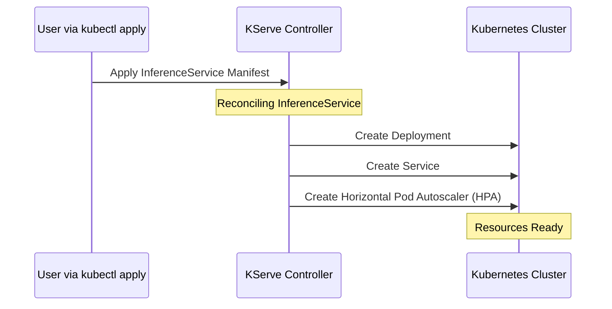

- **[Log Evidence]** Successful reconciliation is indicated in the logs by messages such as:
    - `Reconciling inference service`
    - `created deployment`
    - `created service`
    - `created horizontal pod autoscaler`

### Verifying Kubernetes Resources

- **[Resource Confirmation]** After the KServe controller reconciles the `InferenceService`, the underlying Kubernetes components can be verified using `kubectl` within the specific namespace (`intent`)
    - **Horizontal Pod Autoscaler (HPA)**: Confirmed via `kubectl get horizontalpodautoscalers.autoscaling -n intent`
    - **Deployment**: Confirmed via `kubectl get deployment -n intent`
    - **Service**: Confirmed via `kubectl get svc -n intent`

### Exposing and Testing the Model

- **[Port Forwarding]** Since the service is running inside the cluster, `kubectl port-forward` is used to map a local port to the cluster service for external access
    - **Command**: `kubectl port-forward svc/<service-name> <local-port>:<cluster-port>`
    - **Example**: `kubectl port-forward svc/intent-classifier-predictor 8080:80 -n intent`
        - This maps local port `8080` to the service's port `80` within the `intent` namespace.
- **[Inference Request]** Once the port is forwarded, a `curl` command can be used to send a POST request to the local endpoint to test the model's prediction capability
    - **Command**:

```bash
curl -X POST http://localhost:8080/v1/models/intent-classifier:predict \
  -H "Content-Type: application/json" \
  -d '{"instances": [{"I want to cancel my subscription"}]}'
```

    - **[What the request does]** It sends a JSON payload containing an instance (a text string) to the local endpoint, which the model then processes to return a classification.

### Testing Inference Results

- **[API Endpoint Pattern]** KServe implements the inference API using a specific path structure that differs slightly from standard expectations
    - **Pattern**: `/v1/models/<model-name>:predict`
    - **Example**: `http://localhost:8080/v1/models/intent-classifier:predict`
- **[Inference Verification]** Testing the model with different text inputs confirms it is correctly classifying intents
    - **Input**: `"I want to cancel my subscription"` $\rightarrow$ **Prediction**: `cancel`
    - **Input**: `"hello"` $\rightarrow$ **Prediction**: `greeting`

```bash
curl -X POST http://localhost:8080/v1/models/intent-classifier:predict \
  -H "Content-Type: application/json" \
  -d '{"instances": ["I want to cancel my subscription"]}'
```

- **[Cert-manager]** Required to enable HTTPS for model serving
    - It automates the creation, maintenance, and rotation of certificates
    - **Installation Command**:

```bash
kubectl apply -f https://github.com/cert-manager/cert-manager/releases/latest/download/cert-manager.yaml
```

    - **Verification**:

```bash
kubectl get pods -n cert-manager
```

### Installing KServe CRDs

- **[CRD Installation Order]** Custom Resource Definitions (CRDs) must be installed before the KServe controller
    - **[Why?]** The controller needs to watch for specific objects (e.g., `InferenceService`). If the controller starts before the CRDs exist, it won't recognize these objects on the cluster.
- **[Deployment Steps]**

    1. Create the dedicated namespace:

```bash
kubectl create namespace kserve
```

    1. Install the CRDs using Helm:

```bash
helm install kserve-crd ghcr.io/kserve/charts/kserve-crd --namespace kserve
```

### Installing KServe Controller

- **[Next Step]** Once CRDs are installed, the KServe controller itself is deployed via Helm
- **[Purpose]** The controller manages the lifecycle of inference services

### Project-Specific Deployment

- **[Workflow Distinction]** There is a clear divide between initial onboarding and individual project deployment
    - **Onboarding (One-time)**: Creating the cluster, installing cert-manager, installing CRDs, and installing the KServe controller
    - **Project Deployment (Recurring)**: For every new model or project (e.g., `intent-classifier` or `recommendations`), you repeat a simple set of commands to set up the `InferenceService` resource
- **[InferenceService Resource]** The core object used to deploy a model
    - **Key Field:&#32;`storageUri`**
        - **[Why it matters]** It specifies the location where the model files are stored
        - **[Function]** The KServe controller uses this URI to download the model (such as a `.pkl` file) so it can be served

```yaml
apiVersion: serving.kserve.io/v1beta1
kind: InferenceService
metadata:
  name: intent-classifier
spec:
  predictor:
    model:
      modelFormat:
        name: sklearn
      storageUri: "<downloadable location>"
      resources:
        requests:
          cpu: "100m"
          memory: "512Mi"
        limits:
          cpu: "1"
          memory: "1Gi"
```

### Model Artifact Management

- **[Storage Options]** There are several ways to host the model files required by the `storageUri` field:
    - Google Cloud Storage
    - Amazon S3 buckets
    - Persistent Volumes
- **[Production Best Practice]** A common real-time approach used by many companies is to store model artifacts within the same GitHub repository as the source code
    - **[Mechanism]** Models are pushed as release binaries to the repository
    - **[Automation]** This is typically handled by CI/CD or CI/CD-CT pipelines during the model creation process
- **[GitHub Release Workflow]**
    - Create a new release tag (e.g., `v3.0`)
    - Attach the model file (e.g., `intent_model.pkl`) as a binary asset to the release

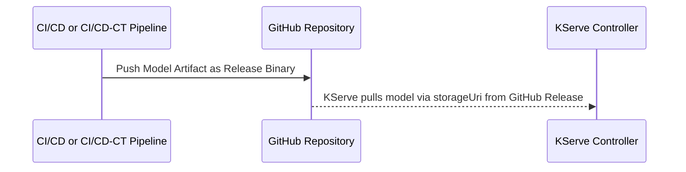

### Locating Model Artifacts

- **[File Path]** To find the existing `intent-model.pkl` file, navigate through the cloned repository as follows:
    - `intent-classifier-model` (root folder)
        - \`models/
            - cd model/
                - artifacts/
                    - intent-model.pkl\`

### Regenerating Model Artifacts

- **[When to do this]** If the `.pkl` file is missing from the `artifacts` folder, it can be recreated by installing the necessary dependencies in a Python virtual environment.
- **[Setup Steps]**

    1. Activate the virtual environment:

```bash
source venv/bin/activate
```

    1. Install the required dependencies:

```bash
pip install -r requirements.txt
```

### Completing the Model Artifact Workflow

- **[Regenerating the Model]** If the `.pkl` file is missing, run the training script within the virtual environment:
    - `python3 model/train.py`
    - This generates the `intent-model.pkl` file in the `model/artifacts/` directory.
- **[Finalizing the GitHub Release]**
    - Upload the newly generated `intent-model.pkl` to the GitHub repository release.
    - Click "Publish release".
    - **[Crucial Step]** Right-click the uploaded file in the GitHub release assets and select "Copy link" to obtain the direct downloadable URL.
- **[Updating the KServe Configuration]**
    - Open the `implementation.md` file (specifically in the `kserve` branch).
    - Locate the `storageUri` field within the `InferenceService` definition.
    - Paste the copied GitHub direct download link into the `storageUri` field:

```yaml
predictor:
  model:
    modelFormat:
      name: sklearn
    storageUri: "<PASTE_GITHUB_DIRECT_LINK_HERE>"
    resources:
      requests:
        cpu: "100m"
        memory: "512Mi"
      limits:
        cpu: "1"
        memory: "1Gi"
```

### Preparing the Kubernetes Environment

- **[Namespace Creation]** Before deploying the `InferenceService`, create a dedicated namespace for the intent classifier:

```bash
kubectl create namespace intent
```

- **[Applying the Manifest]** After updating the `storageUri` with the direct GitHub link, apply the configuration to the cluster:

```bash
kubectl apply -n intent -f <filename>.yaml
```

### Monitoring the Deployment

- **[Verifying Reconciliation]** To ensure the KServe controller has identified and is processing the new `InferenceService`, check the controller logs:

```bash
kubectl logs -n kserve <kserve-controller-pod-name>
```

- **[Expected Controller Activity]** The logs should indicate that the controller is:
    - Identifying the `InferenceService`
    - Starting reconciliation
    - Creating associated resources: `Deployment`, `Service`, and `HPA` (Horizontal Pod Autoscaler) via its internal reconcilers.
- **[Verifying Created Resources]** Once reconciliation is underway, confirm the existence of the underlying Kubernetes objects within the `intent` namespace:

| Resource Type | Command to Verify |
| --- | --- |
| Horizontal Pod Autoscaler (HPA) | kubectl get hpa -n intent |
| Deployment | kubectl get deployment -n intent |
| Service | kubectl get service -n intent |

### Exposing the Service via Port-Forwarding

- **[Port-Forwarding]** Once the service is created, it is not accessible from outside the cluster by default. Use `kubectl port-forward` to expose the service to your local machine:

```bash
kubectl port-forward svc/<service-name> <local-port>:<service-port> -n <namespace>
```

- **[Example Command]** To map the local port `8080` to the service port `80` in the `intent` namespace:

```bash
kubectl port-forward svc/intent 8080:80 -n intent
```

- **[Binding Address]** The service is exposed to `0.0.0.0`, making it reachable on the specified local port.

### Testing Inference with Curl

- **[Making a Prediction Request]** Use a `curl` command to send a `POST` request to the local endpoint to test the model's functionality.
- **[KServe API Endpoint Structure]** KServe implements a specific API path for predictions. Instead of a standard path, the URL follows this pattern:

`http://localhost:<local-port>/<service-name>/v1/models/<model-name>:predict`

- **[Example Curl Command]**

```bash
curl -X POST http://localhost:8080/v1/models/intent-classifier:predict \
  -H "Content-Type: application/json" \
  -d '{"instances": [{"I want to cancel my subscription"}]}' | jq
```

    - **[Request Breakdown]**
        - `-X POST`: Sends a POST request.
        - `-H "Content-Type: application/json"`: Sets the header to JSON.
        - `-d '...'`: Contains the JSON payload with the input data under the `instances` key.
        - `| jq`: Pipes the output to `jq` for readable JSON formatting.

### KServe Inference Results

- **[Testing Different Inputs]** The model's ability to classify different intents can be verified by changing the JSON payload in the `curl` request:
    - **Input:** `"I want to cancel my subscription"` $\rightarrow$ **Prediction:** `cancel`
    - **Input:** `"hello"` $\rightarrow$ **Prediction:** `greeting`

### Summary of the KServe Workflow

- **[The Core Process]** The deployment process is simplified into a few high-level steps:

    1. **Store Artifacts:** Copy the model file (e.g., `model.pkl`) to a registry (e.g., GitHub releases).
    2. **Define Service:** Create an `InferenceService` Custom Resource (CRD) pointing to the `storageUri` of the model.
    3. **Automated Orchestration:** Once the CRD is applied, the KServe controller automatically handles the underlying Kubernetes resources (Deployments, Services, HPAs, etc.) to serve the model.

- **[Key Benefit]** This abstraction allows developers to focus on model development and deployment without manually managing the complexities of serving infrastructure.

### Career Application and Skill Transfer

- **[Professional Value]** Proficiency with platforms like KServe is highly valuable for a resume
    - Practice with course demonstrations and various models (from previous sections or the internet) to solidify expertise
- **[MLOps to LLMOps Transition]** Learning MLOps via KServe serves as a direct precursor to LLMOps
    - The steps required to implement LLMOps are almost identical to those used in standard MLOps
    - Most tools learned in this context are equally applicable to Large Language Model operations

### Amazon SageMaker

Unlike open-source platforms such as MLflow or KServe, which are free in nature, SageMaker is a managed service with specific drawbacks:

- **[Costing]** Because it is a managed platform, costs are determined by Amazon and can escalate quickly
    - Users pay for two distinct components:
        - The SageMaker service itself
        - The underlying AWS infrastructure (e.g., ML instances consumed by data scientists)
- **[Vendor Lock-in]** Since SageMaker is not open-source, building an entire stack on it makes it difficult to migrate away
    - Organizations may want to leave due to AWS-specific issues such as:
        - Service Level Agreement (SLA) concerns
        - General issues with the AWS platform
        - Rising costs
    - Migration is difficult because the entire setup is integrated within the proprietary platform

### Challenges of Managed Platforms

- **[Migration Effort]** Moving from SageMaker to an open-source stack requires significant effort
    - An open-source stack might include components like Kubeflow, KServe, Kubeflow Pipelines, and MLflow
    - Because everything is integrated within Amazon SageMaker Studio, it cannot be transitioned to an open-source setup instantly
- **[Administrative Complexity]** Managing a managed service involves tedious operational tasks
    - Implementing RBAC (Role-Based Access Control) and ABAC (Attribute-Based Access Control)
    - Actively managing and optimizing costs to keep them low

### Amazon SageMaker AI Overview

- A unified ML platform designed for collaboration across different roles
    - Provides a single environment (SageMaker Studio) for data scientists, ML engineers, and MLOps engineers
- **[End-to-End Lifecycle]** Supports the entire machine learning workflow
    - Enables taking a model from the initial training phase all the way through to production (serving)

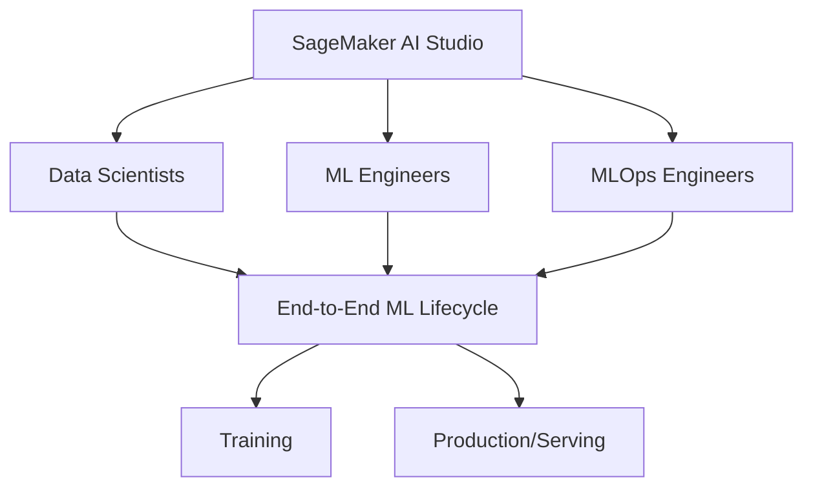

### SageMaker Studio Setup Preview

- Upcoming practical steps for configuring the SageMaker environment:
    - Setting up SageMaker Studio
    - Creating a domain
    - Creating user profiles

### Navigating to SageMaker AI

- Access the service via the AWS Console by searching for "SageMaker AI"
    - Note: Use "SageMaker AI" as it is the rebranded version of the original SageMaker service
- Key navigation options in the sidebar include:
        - Domains
        - Images
        - SageMaker Studio
        - Canvas
        - Notebooks

### SageMaker AI Organizational Structure

- To onboard an organization to the platform, two primary components must be configured:

| Component | Purpose |
| --- | --- |
| Domains | Created for specific teams (e.g., Payments, Transactions, or UI teams) |
| User Profiles | Created for individual members within a specific team |

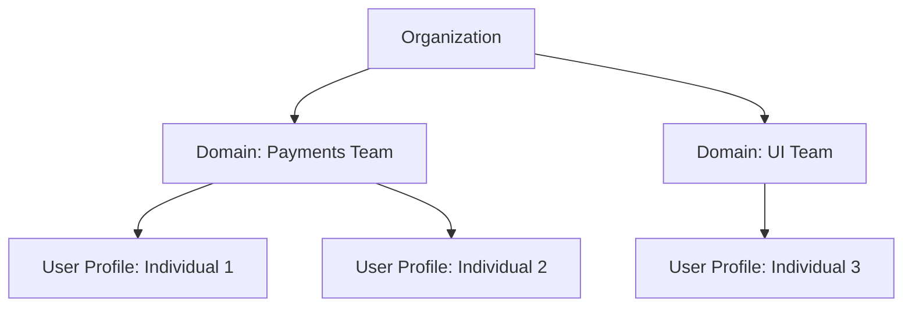

### Accessing SageMaker Studio

- User profiles access SageMaker Studio applications within a domain
- **[Included Applications]** SageMaker Studio provides several tools by default:
    - Jupyter Notebooks
    - Pipelines
    - MLflow
- **[Hierarchy of Access]** Applications are used by User Profiles, which are created inside Domains

### Setting Up a SageMaker Domain

- To begin using the studio, a domain must first be created via the dashboard
- There are two primary setup options:

| Option | Best For | Description |
| --- | --- | --- |
| Quick setup | Individuals, researchers, or freelancers | A cost-effective "Setup for single user" that ignores team-based configurations |
| Set up for organizations | Teams and larger groups | Allows for full control over account configuration, permissions, integrations, and encryption |

#### Organization Setup Details

- When setting up for organizations, you can configure:
    - Custom IAM roles with granular permissions and policies
    - IAM identity center authentication (successor to AWS SSO)
    - VPC networking and security group configurations
    - Custom KMS encryption keys for enhanced data protection
    - Custom SageMaker Studio interfaces
    - SageMaker MLflow configurations
    - EBS storage options for private and shared spaces

### Enterprise vs. Quick Setup

- **[Why use 'Set up for enterprises'?]** Because the 'Quick setup' lacks the enterprise-grade features required by organizations
    - Includes custom IAM role capabilities (essential for managing user profile permissions)
    - Provides VPC networking and security group configurations
    - Integrates SageMaker Studio interfaces and MLflow
- **[Target Audience]** While optimized for admins with large user groups, settings can be updated later

### Domain Provisioning Methods

- In professional MLOps workflows, domains are typically not set up via the user interface
- **[Infrastructure as Code (IaC)]** Environments are provisioned using tools to ensure consistency and automation:
        - AWS CLI
        - Terraform
        - Amazon CloudFormation templates

### Manual Domain Configuration

- When using the AWS Console, the setup process involves defining specific parameters
- **Domain Name Requirements**:
        - Maximum of 63 characters
        - Can only consist of letters, numbers, and hyphens (-)
        - Must be unique within the AWS region in your account

### SageMaker Studio Access Methods

- **[How to access Studio?]** You must choose an authentication method during domain setup; note that this cannot be changed once the domain is created
- **Authentication Options**:
    - **AWS Identity Center (formerly SSO)**
        - Best for organizations that already have AWS Identity Center implemented
    - **Login through IAM**
        - Recommended for mid-scale companies not using Identity Center
        - Users access the domain using their existing IAM users
- **[Why use IAM for access?]** It allows for granular RBAC (Role-Based Access Control)
    - You can restrict specific IAM users to certain resources
    - Example: A data scientist can be restricted to only accessing Jupyter notebooks, preventing them from accessing sensitive components like CI/CD pipelines

### Domain Permissions and Storage

- **[Permissions]** You must define the specific activities the domain is permitted to perform
    - Examples of selectable permissions include:
        - Access Required AWS Services (for S3, ECR, Cloudwatch, etc.)
        - Run Studio Applications
        - Manage ML Jobs
        - Manage Models
        - Manage Pipelines
        - S3 Bucket Access (to perform operations on specified buckets)
- **S3 Bucket Requirement**
    - A bucket must be provided for the domain or team
    - **[Why?]** This is used for storing various operational data and end-of-day outputs
    - You can either reuse an existing bucket or create a new one

### Customizing the Studio User Interface

- **[Application Selection]** You can choose which applications are enabled and visible in the SageMaker Studio interface
    - Available applications include:
        - Amazon Q Developer
        - Docker
        - SageMaker Studio
        - Jupyter Notebooks
        - Canvas
        - RStudio
        - MLflow
- **[UI Customization vs. Access]** Disabling an application in this menu only affects the user interface
    - It removes the application from the user's sidebar shortcuts
    - It does **not** prevent the user from accessing the application through other methods
    - This is similar to how a Google account might show or hide specific app shortcuts like Drive or Docs in a sidebar without revoking access to the services themselves

### Network Configuration

- **[VPC Selection]** To ensure connectivity, the domain must be associated with a Virtual Private Cloud (VPC)
    - You can use the default VPC or select a specific one
    - You must also select one or more subnets and a security group to define network access and isolation

### Creating a User Profile

- **[Hierarchy]** Once a Domain is created, you must create User Profiles within it
    - **Domain**: The top-level organizational container (the "team")
    - **User Profile**: The individual user account within that team
- **User Profile Setup**
    - After creating the profile, you must define which applications are enabled for that specific user
    - **[Granular Application Control]** Similar to domain-level customization, you can select specific tools for the user's environment, such as:
        - MLflow
        - JupyterLab
        - Other default applications

### Completing User Profile Setup

- **[UI Customization]** The final configuration steps allow for adjusting the "look and feel" of the user's environment
    - This includes customizing what appears in the side panel and navigation bar
- **[Review and Submit]** Once settings are configured, they must be reviewed before clicking **Submit** to finalize the profile

### Connecting User Profiles to IAM

- **[Critical Requirement]** A User Profile cannot be accessed in isolation
    - **[Why?]** Because AWS security is built on IAM, a User Profile must be tied to an IAM user or role to grant access permissions
    - Without this link, the user cannot log in to use the profile
- **[Access Mechanism]** The IAM user uses their credentials to authenticate, which then grants them access to the specific SageMaker User Profile and its associated Studio environment

### SageMaker Studio Interface

- **[Home Screen]** Upon entering Studio, users are presented with a dashboard to get started with their profiles
- **[Available Applications]** The interface provides access to various integrated development environments (IDEs) and tools, including:
    - JupyterLab
    - Code Editor
    - Canvas
    - RStudio
    - MLflow
    - Other specialized tools like Deepchecks or Fiddler

### SageMaker AI Unified Platform

- **[Core Concept]** SageMaker AI provides a single platform containing specialized services for different stages of the ML lifecycle:
    - **Experiment Tracking**: Tracking ML experiments
    - **Pipelines**: Orchestrating ML workflows
    - **Model Registry**: Storing and managing models
    - **Data Engineering Tools**: Services specifically for data preparation and management

### Persona-Based Workflows

- **Data Scientist Workflow**
    - Uses **JupyterLab** to write and run scripts in a more efficient environment
    - **[Process]**

        1. Select an instance type (e.g., `g4dn` or `g5` instances)
        2. Launch the instance
        3. Access the pre-installed Jupyter Notebook environment to write and train scripts

- **MLOps Engineer Workflow**
    - Focuses on automation and lifecycle management
    - Uses **MLflow** for experiment tracking and observability
    - Uses **Pipelines** to create and manage automated workflows, often using a visual editor to define steps

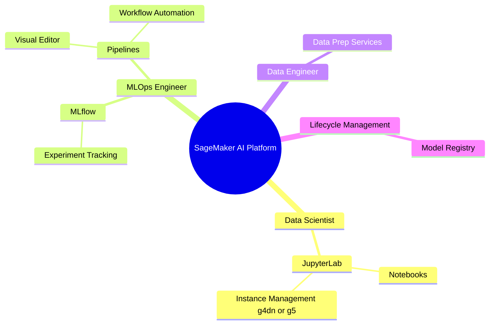

### Real-Time SageMaker Setup

- **[Implementation Scope]** The setup process involves managing the platform within an organizational context
    - Creating domains in real time
    - Creating user profiles
    - Tying user profiles to specific IAM users to manage access
- **[Example Scenario]** A practical walkthrough will be conducted using a hypothetical organization (e.g., `example.com`) in the e-commerce sector

### Model Onboarding Use Case

- **[Objective]** The goal is to onboard two machine learning models into a product
    - The first model to be addressed is the **user traffic model**

### Organizational Implementation Strategy

- **[Business Requirements]** The organization aims to deploy two distinct models:
    - **User Traffic (UT) Model**: Ensures the website remains operational 24/7
    - **Cost Prediction Model**: Allows end users to access predictions regarding future product costs
- **[Organizational Onboarding]** The first step in adopting SageMaker AI is engaging the appropriate technical team:
    - Companies typically approach their **MLOps team**
    - If an MLOps team does not exist, they approach their **DevOps team**
    - **[Context]** In the current landscape, companies may need to build dedicated MLOps teams or upskill existing DevOps personnel with MLOps practices

### MLOps Infrastructure Setup Strategy

- **[Preferred Methods]** To avoid the tediousness and potential errors of manual configuration (e.g., manually creating domains, Studio, or user profiles), MLOps teams use automation:
    - **Infrastructure as Code (IaC)**
    - **AWS CLI**
        - The AWS CLI is specifically recommended for SageMaker setup, as noted in official documentation
- **[Determining Domain Scale]** The number of SageMaker domains is not arbitrary; it is determined by consulting with management to understand business requirements:
    - **[Key Inputs]**
        - How many models are currently under development?
        - How many teams are working on the process?
    - **[Example Application]** In the `example.com` scenario:
        - **Requirements**: 2 models (User Traffic and Cost Prediction) and 2 teams
        - **Result**: MLOps engineers set up 2 domains to accommodate these needs

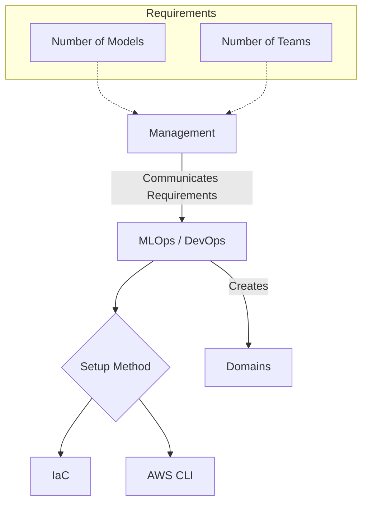

### SageMaker AI Initial Setup Steps

- **[Step 1] Domain and IAM Role Configuration**
    - Along with creating domains, MLOps must set up an **IAM role** with specific policies/permissions
    - **[Why?]** Applications within SageMaker Studio require a role to utilize underlying AWS resources
        - **Studio Applications**:
            - Jupyter Notebooks
            - MLflow
            - Pipelines
        - **[Example]**: For a Jupyter Notebook to utilize compute instances, it needs an IAM role to authorize that interaction
    - Typically, this is referred to as a **SageMaker execution role**, which is granted to the domain
- **[Step 2] User Profile Creation**
    - Once the domains and roles are configured, the next phase is creating user profiles

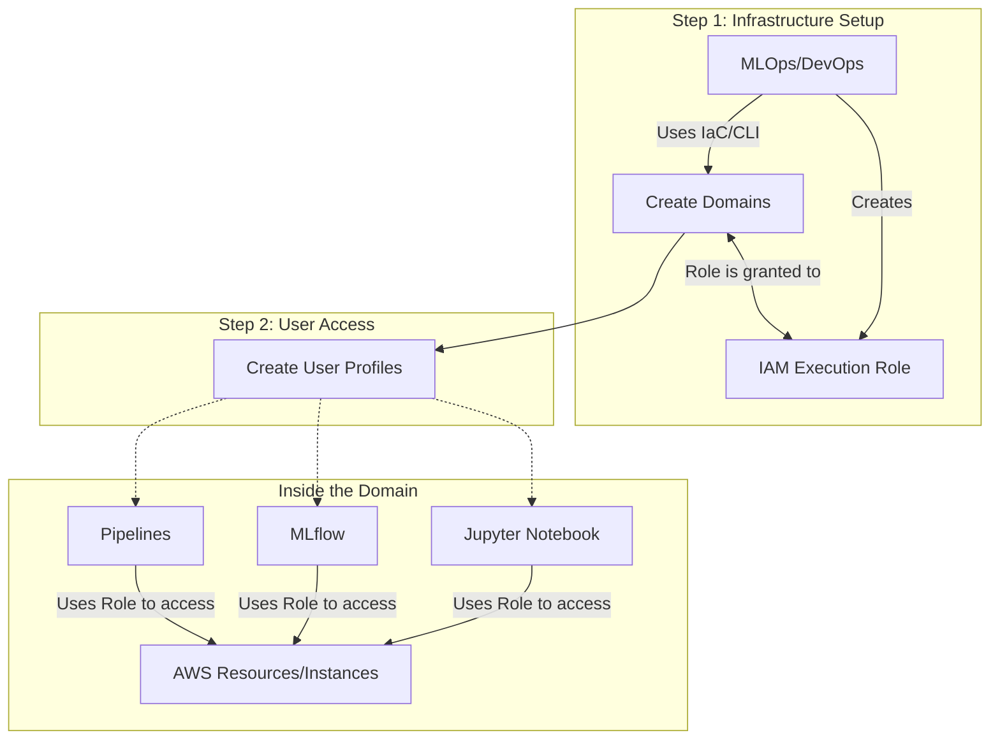

### SageMaker AI User Profile Configuration

- **[Step 2] User Profile Creation**
    - MLOps engineers determine the number of profiles by understanding the team structure within the business
    - **[Example]** For a single model team consisting of 2 Data Scientists, 1 ML Engineer, and 1 MLOps Engineer:
        - MLOps must set up **4 individual user profiles** to accommodate every person in that team
    - **Application Access Control**
        - While creating profiles, MLOps also configures which specific applications are allowed for that user
        - **[Why?]** This enforces principle of least privilege by ensuring users only see tools relevant to their job
            - **Data Scientist Profile**: Might only have access enabled for `Jupyter Notebooks` (no need for Pipelines or MLflow)
            - **ML Engineer/MLOps Profile**: Would have access to a broader suite of tools

### SageMaker AI Access Control and User Login

- **Granular Application Access**
    - While creating user profiles, MLOps engineers configure which specific applications within SageMaker Studio are permitted
    - **[Example]** To maintain security boundaries:
        - **MLOps Engineer Profile**: Might be granted access to `Pipelines` and `MLflow` but denied access to `Jupyter Notebooks` to prevent them from interacting with active Data Science work
- **[Step 3] User Authentication and Access**
    - Once infrastructure (Step 1) and user profiles (Step 2) are established, the focus shifts to how users actually enter the environment
    - Users log in via their IAM identity to access the AWS Console
    - From the console, they can then access the configured SageMaker domains and their specific user profiles

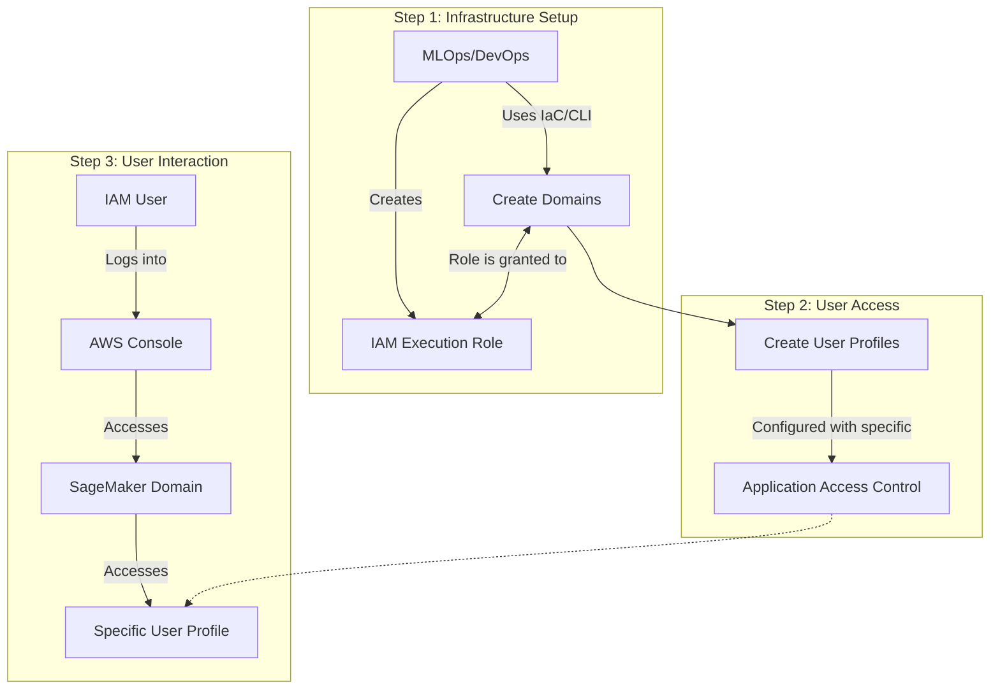

### Preventing Cross-Profile Interference

- Without proper controls, one user could potentially access another user's profile within the same domain
    - **[Risks]** An MLOps engineer could access and tweak a Data Scientist's pipelines
    - **[Risks]** A user could access a Data Scientist's profile to change their Jupyter Notebook training processes

### Attribute-Based Access Control (ABAC)

- A security method used to ensure users can only access their own assigned profiles
- **[How it works]** It is similar to RBAC (Role-Based Access Control) but uses attributes (tags) to define permissions
- **[Implementation Process]**

    1. **Tagging**: A specific tag is created for a user profile (e.g., a profile for "Alice" is tagged with `Alice`)
    2. **IAM Policy**: An IAM policy is configured for the user's identity
    3. **Matching**: The policy is written so that the user can only access the profile if the tags match

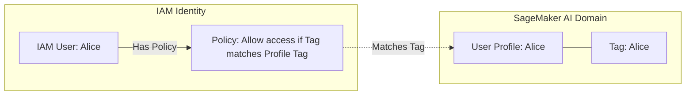

### ABAC Implementation Details

To enforce security boundaries, the system relies on a matching condition between the identity and the resource:

1. **Tagging the User Profile (Step 2)**

    - During profile creation, a specific tag is applied to the SageMaker User Profile
    - **Example**: `name: alice` or `Alice: xyz`

2. **Configuring the IAM Policy (Step 3)**

    - The MLOps engineer adds a condition to the user's IAM policy
    - This condition specifies that the user can only access SageMaker resources if the resource tags match the user's attributes
- **[The Result]** If a user (e.g., Alice) attempts to access a profile with a different tag (e.g., `ABC`), the system returns a `permission denied` error because the tag condition is not met.

### SageMaker AI Real-Time Setup Workflow

To set up SageMaker AI in a production environment, follow these three major steps:

1. **Create Domains**

    - The initial infrastructure layer

2. **Create User Profiles**

    - Setting up individual access points for team members

3. **Implement ABAC (Attribute-Based Access Control)**

    - Ensures users can only access their respective profiles to prevent them from interfering with others' work (e.g., modifying another user's Jupyter Notebook or pipelines)

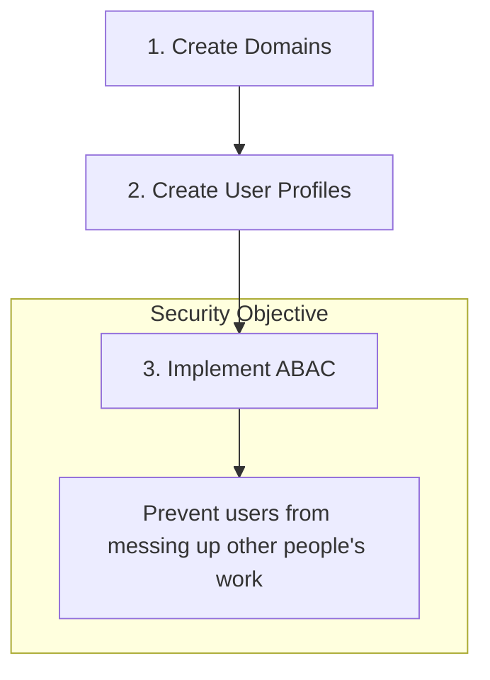

### Implementation Prerequisites

- **AWS CLI**
    - Must be installed and configured on your local terminal
    - Alternatively, **AWS Cloud Shell** can be used if local configuration is not preferred

### Networking Setup

- **VPC Requirement**
    - By default, every AWS resource must be created within a Virtual Private Cloud (VPC)
    - This applies to SageMaker as well as all other AWS services
    - While custom VPCs can be used, the implementation can start by retrieving the default VPC and subnet IDs

To identify the default VPC in a specific region, use the following command:

```bash
aws ec2 describe-vpcs \
    --filters "Name=isDefault,Values=true" \
    --query "Vpcs[].VpcId" \
    --output text \
    --region ap-south-1
```

### Retrieving Networking Details

- The VPC ID and subnet IDs are necessary because they are required parameters when creating the SageMaker domain
- **Retrieving Subnets**
    - To list the subnets within the default VPC, use the following command:

```bash
aws ec2 describe-subnets \
    --filters "Name=vpc-id,Values=vpc-05f62d8e55bc7d0bb" \
    --query "Subnets[].SubnetId" \
    --output text \
    --region ap-south-1
```

### Step 1: Domain Creation

- Before creating the domain itself, an IAM role must be established
- **[Why?]** The domain must be assigned an IAM role so that applications running within the SageMaker Studio domain have the necessary permissions to access internal AWS resources
- The first part of this process involves creating a policy document that will be assigned to this new role

### Creating the IAM Execution Role

- **Defining the Trust Policy**
    - Create a JSON file (e.g., `pass.json` or `trust.json`) to define which service is allowed to assume this role
    - **[Why?]** This establishes the trust relationship so the SageMaker service can actually use the permissions assigned to the role
    - The policy specifies the principal as `sagemaker.amazonaws.com`
- **Creating the Role**
    - Use the AWS CLI to create the role using the trust policy document:

```bash
aws iam create-role \
    --role-name SageMakerDomainExecutionRole \
    --assume-role-policy-document file://trust.json
```

    - *Note: If the role already exists, the command will return an&#32;`EntityAlreadyExists`&#32;error.*
- **Attaching Permissions**
    - Once the role is created, it needs permissions to perform tasks within SageMaker
    - Attach the `AmazonSageMakerFullAccess` policy to the role:

```bash
aws iam attach-role-policy \
    --role-name SageMakerDomainExecutionRole \
    --policy-arn arn:aws:iam::aws:policy/AmazonSageMakerFullAccess
```

- **Retrieving the Role ARN**
    - The Role ARN (Amazon Resource Name) is required for the subsequent domain creation step
    - Retrieve it using the following command:

```bash
aws iam get-role --role-name SageMakerDomainExecutionRole --query "Role.Arn" --output text
```

### Creating the SageMaker Domain

- Use the `aws sagemaker create-domain` command to initialize the domain
- **Key Parameters Required:**
    - `--domain-name`: A unique identifier for the domain (e.g., `mlobs-demo-domain`)
    - `--auth-mode`: Specifies the authentication method
        - Options include `IAM` or `SSO` (the example uses `IAM`)
    - `--vpc-id`: The ID of the VPC where the domain will reside
    - `--subnet-ids`: A list of subnet IDs within the VPC
        - **[Tip]** While a region might have many subnets, choosing two or more is sufficient for this setup
    - `--network-access-type`: Defines how the domain accesses the network (e.g., `VpcOnly`)
    - `--default-user-settings`: Contains configuration for users, specifically the `--execution-role`
        - This must be the ARN of the IAM role created in the previous step

**Example Command Structure:**

```bash
aws sagemaker create-domain \
    --domain-name mlobs-demo-domain \
    --auth-mode IAM \
    --vpc-id vpc-05f62d8c7b0b \
    --subnet-ids subnet-023acb62bf89fd84 subnet-072bd948e216b0d7 \
    --network-access-type VpcOnly \
    --default-user-settings '{"ExecutionRole": "<ROLE_ARN>"}' \
    --region <REGION>
```

### Finalizing Domain Creation

- The command is completed by specifying the target region:

```bash
aws sagemaker create-domain \
    --domain-name mlobs-demo-domain \
    --auth-mode IAM \
    --vpc-id vpc-05f62d8c7b0b \
    --subnet-ids subnet-023acb62bf89fd84 subnet-072bd948e216b0d7 \
    --network-access-type VpcOnly \
    --default-user-settings '{"ExecutionRole": "arn:aws:iam::76591917:role/SageMakerDomainExecutionRole"}' \
    --region ap-south-1
```

- **[Critical] Importance of the Execution Role**
    - The role must have `AmazonSageMakerFullAccess` permissions
    - Without these permissions, the domain cannot function properly
    - Specifically, Jupyter notebooks within the domain might fail to create computing steps or utilize compute resources

### Monitoring Domain Status

- Domain creation is not immediate and takes time to provision
- **[Process] Checking Status via AWS Console:**

    1. Navigate to the **SageMaker** service in the AWS Console
    2. Select **Domains**
    3. Monitor the status of the new domain

- **Status Transitions:**
    - **Pending**: The domain is currently being provisioned
    - **In-service**: The domain is ready for use (typically takes 2-3 minutes)

| Status | Description |
| --- | --- |
| Pending | Domain is being created; resources are being allocated |
| In-service | Domain is fully operational and ready for users |

### Creating the User Profile

- A user profile is created within an existing SageMaker domain
- **[Crucial Step] Tagging for ABAC**: When creating the profile, a tag (key and value) is assigned. This same key-value pair will be used for the IAM user to enable attribute-based access control (ABAC)

**Command Structure:**

```bash
aws sagemaker create-user-profile \
    --domain-id <DOMAIN_ID> \
    --user-profile-name alice-profile \
    --tags Key=studiouserid,Value=alice123 \
    --region ap-south-1
```

- **Parameters used:**
    - `--domain-id`: The unique identifier of the domain (can be retrieved from the AWS Console or via CLI)
    - `--user-profile-name`: The name assigned to the user profile (e.g., `alice-profile`)
    - `--tags`: Assigns the metadata necessary for identity mapping (e.g., `Key=studiouserid,Value=alice123`)
    - `--region`: The AWS region where the domain resides

**Example Execution Output:**

```json
{
    "UserProfileArn": "arn:aws:sagemaker:ap-south-1:76591917:user-profile/d-x8myiaxf0v/alice-profile"
}
```

### Verifying User Profiles

- After creation, user profiles can be verified within the SageMaker domain settings
- **[Verification] Console Navigation:**

    1. Navigate to the **SageMaker** service
    2. Select the specific **Domain** (e.g., `mlops-demo-domain`)
    3. Click on the **User profiles** tab

- The console displays a list of all profiles associated with that domain (e.g., `alice-profile`, `abhishek-user-profile`)

### Implementing ABAC (Attribute-Based Access Control)

- **[Goal]** The next step is to implement ABAC to control access based on user attributes
- To do this, an IAM user must exist that can be mapped to the SageMaker user profile

#### Creating an IAM User

- If an IAM user does not already exist in the organization, one must be created via the IAM service
- **Command/Process:**
    - Navigate to the **IAM** service in the AWS Console
    - Select **Users**
    - Use the **Create user** action to define a new username (e.g., `iam-user`)
    - Once created, the user will appear in the IAM Users list, ready for attribute assignment

### Assigning Tags to the IAM User

- **[Goal]** To facilitate ABAC, the IAM user must have the exact same tags as the SageMaker user profile
- **Command to assign tags:**

```bash
aws iam tag-user --user-name alice-iam-user --tags Key=studiouserid,Value=alice123
```

- **Verification:** After running the command, refreshing the IAM user in the console confirms the tags are present under the **Tags** tab (e.g., `studiouserid: alice123`)

### Preparing IAM Permissions

- **[Status]** A newly created IAM user has no permissions by default
    - Without a policy, the user cannot access the AWS Console, SageMaker Studio, or any other AWS services
- **Next Step:** Assign a policy to the IAM user by creating a JSON policy document
    - The speaker begins creating a policy file named `SageMaker.json`

### Creating a SageMaker User Profile

- **[Goal]** Create a user profile and assign the necessary tags in a single step to enable ABAC mapping
- **Command/Process:**
    - Use `aws sagemaker create-user-profile`
    - **Parameters required:**
        - `domain-id`: The ID of the existing SageMaker domain
        - `user-profile-name`: The name for the new profile (e.g., `alice-profile`)
        - `--tags`: A list of key-value pairs (e.g., `Key=studiouserid,Value=alice123`)
        - `--region`: The AWS region (e.g., `ap-south-1`)

```bash
aws sagemaker create-user-profile \
    --domain-id d-x8myiaxf0v \
    --user-profile-name alice-profile \
    --tags Key=studiouserid,Value=alice123 \
    --region ap-south-1
```

- **[Critical Detail]** The tags used here (Key and Value) must be identical to those assigned to the IAM user to allow the ABAC mechanism to function correctly.

### Verifying User Profiles in the Console

- Once created, profiles can be confirmed via the AWS Management Console:

    1. Navigate to **Amazon SageMaker**
    2. Select the domain (e.g., `mlops-demo-domain`)
    3. Click the **User profiles** tab

- The list should display the newly created profiles (e.g., `alice-profile`).
- **[Testing Note]** Creating multiple profiles (e.g., `abhishek-user-profile`) can be used to verify that ABAC correctly restricts access so that one IAM user cannot access another user's profile.
- **[Goal]** Create an IAM user and assign tags that match the SageMaker user profile to enable automated access control
- **Step 1: Create the IAM User**
    - Use the AWS CLI to create a new user
    - Command:

```bash
aws iam create-user --username alice-iam-user
```

- **Step 2: Assign Matching Tags**
    - **[Critical Step]** The IAM user must be tagged with the same key and value used during the SageMaker user profile creation (e.g., `studiouserid: alice123`)
    - Without these tags, the ABAC mechanism will not recognize the user's relationship to the SageMaker profile
    - Command:

```bash
aws iam tag-user --user-name alice-iam-user --tags Key=studiouserid,Value=alice123
```

- **[Critical Step]** The IAM user must be tagged with the same key and value used during the SageMaker user profile creation to enable ABAC
- Command:

```bash
aws iam tag-user --user-name alice-iam-user --tags Key=studiouserid,Value=alice123
```

- **[Verification]** After running the command, refreshing the IAM user in the AWS Console should show the assigned tags: `studiouserid: alice123`

### Creating the IAM Policy for SageMaker Access

- **[Problem]** A newly created IAM user has no permissions by default and cannot access the AWS Console or SageMaker Studio
- **[Solution]** Create a custom IAM policy using a JSON document to grant specific permissions
- The policy file is named `SageMaker.json` and contains multiple statements

#### Policy Statement 1: SageMaker Domain Access

- Grants the IAM user permission to list and describe SageMaker domains
- **Actions included:**
    - `sagemaker:ListDomains`
    - `sagemaker:ListUserProfiles`
    - `sagemaker:ListApps`
    - `sagemaker:DescribeDomain`
    - `sagemaker:DescribeUserProfile`
    - `sagemaker:ListTags`

```json
{
    "Version": "2012-10-17",
    "Statement": [
        {
            "Sid": "AllowConsoleListAndDescribe",
            "Effect": "Allow",
            "Action": [
                "sagemaker:ListDomains",
                "sagemaker:ListUserProfiles",
                "sagemaker:ListApps",
                "sagemaker:DescribeDomain",
                "sagemaker:DescribeUserProfile",
                "sagemaker:ListTags"
            ],
            "Resource": "*"
        },
        {
            "Sid": "AllowPresignedUrlWhenTagMatches",
            "Effect": "Allow",
            "Action": "sagemaker:CreatePresignedDomainUrl",
            "Resource": "*",
            "Condition": {
                "StringEquals": {
                    "sagemaker:ResourceTag/studiouserid": "${aws:PrincipalTag/studiouserid}"
                }
            }
        }
    ]
}
```

- **[ABAC Logic in Policy]** The second statement in the policy uses a `Condition` block to enforce access control:
    - It allows the `sagemaker:CreatePresignedDomainUrl` action
    - **Condition:** The `sagemaker:ResourceTag/studiouserid` must match the `${aws:PrincipalTag/studiouserid}`
    - This ensures that the user can only generate a URL for a domain/profile if their own IAM tag matches the resource's tag.

### Custom SageMaker ABAC Policy

- A JSON policy document is created to define permissions for the IAM user
- **Statement 1: General SageMaker Access**
    - Allows the user to perform discovery actions:
        - `sagemaker:ListDomains`
        - `sagemaker:ListUserProfiles`
        - `sagemaker:ListApps`
        - `sagemaker:DescribeDomain`
        - `sagemaker:DescribeUserProfile`
        - `sagemaker:ListTags`
- **Statement 2: ABAC Implementation (The Core Logic)**
    - Uses a `Condition` block to enforce Attribute-Based Access Control
    - **[How it works]** It restricts actions to only those resources where the resource tag matches the user's own tag
    - **Condition Logic:**

```json
"Condition": {
          "StringEquals": {
              "sagemaker:ResourceTag/studiouserid": "${aws:PrincipalTag/studiouserid}"
          }
      }
```

    - This ensures that if Alice has the tag `studiouserid: alice123`, she can only interact with SageMaker resources that also have `studiouserid: alice123`.

### Attaching the Policy to the IAM User

- **Step 1: Create the Policy**
    - Command:

```bash
aws iam create-policy --cli-input-json file://sagemaker-studio-abac.json
```

    - *Note:* If the policy already exists (as seen in the demonstration), this step will return an error, and you can proceed directly to attachment.
- **Step 2: Attach the Policy**
    - Once the policy exists, it must be linked to the specific IAM user
    - Command:

```bash
aws iam attach-user-policy --user-name alice-iam-user --policy-arn arn:aws:iam::[ACCOUNT_ID]:policy/SageMaker-Studio-ABAC
```

    - `[ACCOUNT_ID]` must be replaced with the actual AWS Account ID.

### Verifying ABAC Implementation

- **Step 1: Enable Console Access for the IAM User**
    - Navigate to the specific IAM user in the AWS Console (e.g., `alice-iam-user`).
    - Go to the **Security credentials** tab.
    - Locate the **Console access** section and select **Enable console access**.
    - Choose to generate an autogenerated password and save the credentials.
- **Step 2: Sign in to the AWS Management Console**
    - Open a private/incognito browsing window to ensure a clean session.
    - Use the specific AWS sign-in URL provided for the account.
    - Enter the IAM user's username and the newly generated password to log in and test the configured permissions.

### Verifying ABAC Functionality via AWS Console

- **[Handling Initial Access Errors]**
    - Upon logging in as the IAM user, multiple `Access Denied` errors will appear for services not included in the policy (e.g., Billing, SQS, or EC2)
    - These errors can be ignored if the goal is to test specific SageMaker permissions
- **Testing SageMaker Access**
    - **Domain and Profile Visibility:**
        - The IAM user can successfully list SageMaker domains and user profiles because of the `List` permissions granted in the policy
        - *Example:* In the `mlops-demo-domain`, both `abhishek` and `alice-profile` are visible in the list
    - **Enforcing Resource Restrictions (The ABAC Test):**
        - **Scenario 1: Accessing a non-matching profile**
            - Attempting to launch the `abhishek` profile results in an `Access Denied Exception`
            - **[Why?]** The `studiouserid` tag on the Abhishek profile does not match the `studiouserid` tag on the Alice IAM user
        - **Scenario 2: Accessing the matching profile**
            - Launching the `alice-profile` works successfully and redirects to SageMaker Studio
            - **[Why?]** The resource tag matches the user's principal tag, satisfying the `Condition` block in the IAM policy

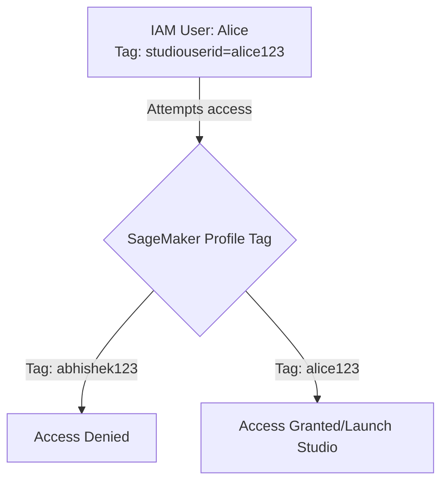

### Generating Pre-signed SageMaker Studio URLs

- A more direct way to grant access to a specific user profile is to generate a unique, pre-signed HTTPS link using the AWS CLI
    - This allows users to jump straight into their Studio environment without manually navigating the SageMaker console
    - The resulting link can be shared securely, such as via a secret file
- **Command to generate the URL:**

```bash
aws sagemaker create-presigned-domain-url \
      --domain-id <DOMAIN_ID> \
      --region <REGION>
```

    - `<DOMAIN_ID>`: The unique identifier for the SageMaker domain
    - `<REGION>`: The AWS region where the domain is hosted
- **Resulting Output:**
    - The command returns a long HTTPS URL (e.g., `https://studio-xy...`) that serves as a direct entry point to the user's Studio session

### Accessing SageMaker Studio Profiles

- **Comparing Access Methods:**
    - **Pre-signed URLs:** Provides a direct HTTPS link to a user's unique Studio environment
        - **[Risk]** These links can be lost or become difficult to manage over time
    - **Console Navigation (Recommended):** Users should navigate through the AWS Console to their specific user profile
        - **[Why?]** This is more convenient and reliable for organizational workflows
- **Verifying User Session:**
    - Once a profile is accessed, the interface displays the active user (e.g., `alice-profile` is signed in)
    - The SageMaker Studio Home screen provides access to various tools like JupyterLab, Code Editor, and AutoML once the session is active

## SageMaker Machine Learning Lifecycle

- The core workflow for using SageMaker AI consists of four key stages:

    1. **Creating the model**: Developing the actual model using SageMaker AI tools
    2. **Storing the model**: Saving the created model version in a Model Registry
    3. **Deploying the model**: Setting up the infrastructure to host the model
    4. **Serving the model**: Making the deployed model accessible to end users for making predictions (inference)

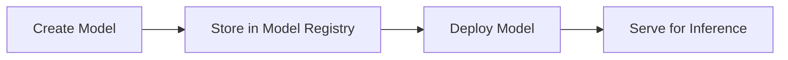

### Focus Areas

- This session specifically covers the first two stages:
    - How data scientists use SageMaker AI to create models
    - How to utilize the Model Registry to store those models

### Implementation Roadmap

- The goal is to achieve model creation and storage using a specific sequence of setup steps
- **[Model Registry]** An S3 bucket will be utilized as the model registry

#### Setup Steps

1. **Create S3 bucket**: This serves as the model registry
2. **Create the Domain**:

    - Requires an IAM Role
    - Process involves:
        - Creating a policy document
        - Creating the role
        - Attaching permissions (specifically `SageMakerFullAccess`)
    - The domain is then created using this role and a specific networking configuration

3. **Create a User Profile**: A single user profile will be created to access SageMaker Studio via the console
4. **Use Jupyter Labs**: An application within SageMaker Studio used for development

```mermaid
flowchart TD
    Step1[1. Create S3 Bucket] --> Step2[2. Create Domain]
    subgraph DomainSetup [Domain Setup]
        direction TB
        Role[Create IAM Role] --> Policy[Create Policy Document]
        Policy --> Attach[Attach SageMakerFullAccess]
        Attach --> Domain["Create Domain with Role and Networking"]
    end
    Step2 --> Step3[3. Create User Profile]
    Step3 --> Step4[4. Use Jupyter Labs]
```

### Data Scientist Workflow in Jupyter

- Using Jupyter notebooks to:
    - Write Python scripts
    - Execute Python scripts
- **[Goal]** Create a model and push it to the model registry (S3 bucket)

### Step 1: Create S3 Bucket

- The S3 bucket acts as the model registry
- **[Implementation]** Created via terminal/AWS CLI
- **[Tip]** Bucket names should be kept as unique as possible to avoid naming conflicts

```bash
aws s3 mb s3://my-sagemaker-demo-bucket-abhishek
```

### Step 2: Create the Domain

#### Create the Policy Document

- A policy document is required to define which service can assume the role
- **[Trust Relationship]** The policy must specify `sagemaker.amazonaws.com` as the principal that can assume the role

#### Create the IAM Role

- The role is created using the AWS CLI with the previously defined policy document
- **[Command]**

```bash
aws iam create-role --role-name SageMakerDemoExecutionRole --assume-role-policy-document file://trust.json
```

- **[Error Handling]** If the role already exists, the CLI will return an `EntityAlreadyExists` error

#### Attach Permissions to the Role

- Once the role is created, permissions must be attached to allow it to perform SageMaker actions
- **[Command]**

```bash
aws iam attach-role-policy --role-name SageMakerDemoExecutionRole --policy-arn arn:aws:iam::aws:policy/AmazonSageMakerFullAccess
```

#### Implementation Details & Refinements

- **[File Naming]** The policy document is saved as `trust.json` to facilitate the role creation process.
- **[Policy Content]** The `trust.json` must include the following structure to allow the service to assume the role:

```json
{
    "Version": "2012-10-17",
    "Statement": [
        {
            "Effect": "Allow",
            "Principal": {
                "Service": "sagemaker.amazonaws.com"
            },
            "Action": "sts:AssumeRole"
        }
    ]
}
```

- **[Expanded Permissions]** In addition to `AmazonSageMakerFullAccess`, the role also requires `AmazonS3FullAccess` to interact effectively with the S3 model registry.
- **[Command for S3 Access]**

```bash
aws iam attach-role-policy --role-name SageMakerDemoExecutionRole --policy-arn arn:aws:iam::aws:policy/AmazonS3FullAccess
```

### Network Configuration for SageMaker

- **[Prerequisite]** S3 Full Access is required for the role because it must be able to push models to the S3 bucket registry
- **[Networking]** Identifying the default VPC and subnets is necessary for domain networking
    - **[Command]** Query the default VPC:

```bash
aws ec2 describe-vpcs --filters Name=isDefault,Values=true
```

    - **[Command]** Query subnets within that VPC:

```bash
aws ec2 describe-subnets --filters Name=vpc-id,Values=VPC-ID
```

    - *Note: Replace&#32;`VPC-ID`&#32;with the actual ID retrieved from the previous command.*

### Creating the SageMaker Domain

- The SageMaker domain is the primary environment for SageMaker Studio
- **[Command]** Create the domain:

```bash
aws sagemaker create-domain \
    --domain-name demo-domain \
    --auth-mode IAM \
    --default-user-settings ExecutionRoleArn=arn:aws:iam::ACCOUNT-ID:role/SageMakerDemoExecutionRole \
    --subnet-ids "SUBNET-1" "SUBNET-2" \
    --vpc-id VPC-ID
```

    - `ACCOUNT-ID` must be replaced with the actual AWS account ID
    - Subnet IDs and VPC ID are required to define the network scope for the domain

### Finalizing SageMaker Domain Creation

- **[Networking Caution]** It is vital to ensure the correct VPC and subnets are used during domain creation
    - Using a non-default or incorrectly configured demo VPC can lead to networking issues during the inference stage
    - Specifically, security groups might not be properly opened, preventing successful communication
- **[Execution Status]** The domain creation process is initiated via the CLI and may take several minutes to complete in the background
    - Even if the browser is open, the process continues as long as the CLI command is running
    - Once the command finishes, the status can be verified in the SageMaker Dashboard within the AWS Console

### Creating a SageMaker User Profile

- Once the SageMaker domain is in the `InService` state, a user profile must be created to access the environment
- **[Command]** Create the user profile using the CLI:

```bash
aws sagemaker create-user-profile \
    --domain-id <DOMAIN-ID> \
    --user-profile-name demo-user-profile
```

    - `<DOMAIN-ID>` can be retrieved from the SageMaker Dashboard in the AWS Console
- **[Note]** In this demo, the profile is accessed directly via an admin user rather than creating separate IAM users or implementing ABAC (Attribute-Based Access Control)

### Accessing SageMaker Studio and JupyterLab

- After creating the user profile, you can enter the SageMaker Studio interface
- **[Application]** JupyterLab
    - One of the most widely used applications within SageMaker Studio
    - Provides data scientists with access to Jupyter Notebooks for developing, managing, and storing ML projects

### Selecting SageMaker Space Templates

- When launching a space, you can choose between different templates based on your model's complexity and resource requirements
- **[Template Options]**
    - **Quickstart**
        - Ideal for notebook prototyping, small datasets, and early experimentation
        - Uses specific instance types like `ml.p3.medium` (which provides 4GB RAM)
    - **General purpose CPU**
        - Balanced compute, memory, and networking resources
        - Suitable for everyday ML development and simple model experimentation
    - **Accelerated compute**
        - GPU-powered
        - Designed for heavy-duty tasks like deep learning, generative AI, model fine-tuning, computer vision, and NLP

### Launching a Jupyter Notebook Instance

- Once a template is selected and "Launch now" is clicked, SageMaker begins creating the instance
- **[Instance Lifecycle]**
    - The status transitions from `Starting` to `Available` in the JupyterLab interface
- **[What is a Jupyter Notebook?]**
    - It functions as a sophisticated Integrated Development Environment (IDE)
    - It allows data scientists to write and execute Python scripts easily
    - It supports executing inline commands directly within the notebook, facilitating seamless model training and experimentation

### Working with Jupyter Notebooks in SageMaker

- Once a workspace is opened, a `.ipynb` file (Jupyter Notebook) serves as the primary environment for writing and executing ML scripts
- **[Modular Execution]** Code is organized into discrete blocks (cells)
        - Each block can be executed independently
        - This allows for separating setup/dependencies from the actual model training logic

#### Example: Training a Decision Tree Classifier

- The workflow involves importing necessary libraries and then defining the training logic
- **[Dependency Block]**

```python
import pandas as pd
  from sklearn.datasets import load_iris
  from sklearn.tree import DecisionTreeClassifier
```

- **[Training Script Block]**
    - The script prepares the dataset and applies the algorithm
    - The goal is to create a mathematical function where the trained model is the output

```python
iris = load_iris()
  X = iris.data
  y = iris.target

  model = DecisionTreeClassifier()
  model.fit(X, y)
```

#### Saving and Storing the Model

- After training, the model must be saved to a file to be used later
- **[Local Saving]** Using `joblib` to dump the model object into a `.pkl` file

```python
import joblib

# ... (training code) ...

joblib.dump(model, 'iris-model.pkl')
print('Model saved as iris-model.pkl')
```

- **[S3 Upload via Boto3]** Once the model is saved locally, it needs to be moved to an S3 bucket for centralized storage and versioning
    - `boto3` is the AWS SDK for Python used to interact with AWS services like S3

```python
import boto3

s3 = boto3.client('s3')
bucket = 'my-sagemaker-demo-bucket'

s3.upload_file('iris-model.pkl', bucket, 'model-artifacts/iris-model.pkl')
print(f'Uploaded to {bucket}: model-artifacts/iris-model.pkl')
```

- **[Context: Why SageMaker Studio?]**
    - While tools like VS Code can be used, SageMaker Studio provides a managed environment specifically optimized for ML workloads
    - This is particularly important when working with large models that require high-performance compute resources not available on a local machine

### Executing Code in SageMaker Studio

- Notebooks are executed block by block or all at once
    - Individual blocks can be run using the triangle (play) symbol
    - All blocks can be run sequentially using the fast-forward icon
- **[Crucial] Monitoring Kernel Status**
    - Before running a subsequent block, verify the kernel status in the top right (e.g., `Python 3 (ipykernel)`)
    - **Idle state**: Execution of the current block is complete
    - **Busy state**: The kernel is currently processing a task
    - **[Why?]** When working with large models or intensive training processes, you must wait for the kernel to return to the idle state before starting the next step to avoid conflicts or errors.

### Verifying Model Storage in S3

- After executing the upload script in the Jupyter notebook, the model file can be verified directly in the S3 console
    - Navigate to the specific bucket (e.g., `my-sagemaker-demo-bucket`)
    - Locate the designated folder for artifacts (e.g., `model-artifacts/`)
    - Confirm the presence of the saved model file (e.g., `iris-model.pkl`)

### The ML Engineer's Focus

- While data scientists handle the complexities of the training process, the ML Engineer's core responsibility is the delivery of the model
    - **[Data Scientist's Role]** Choosing algorithms, preparing datasets, and writing the training scripts (which may involve many complex steps)
    - **[ML Engineer's Role]** Ensuring that the resulting model is successfully pushed to the model registry and is available for deployment

### The MLOps Engineer's Perspective

- While Data Scientists focus on the complexities of model creation (algorithm selection, data preparation, and scripting), the MLOps Engineer's primary concern is the outcome of that process
- **[Key Objective]** Ensuring that the model is successfully pushed to the model registry so it is available for deployment and serving
- **[Why learn the Data Scientist workflow?]**
    - To understand how they interact with the platform
    - To facilitate organizational onboarding (e.g., demonstrating how SageMaker enables the full lifecycle from data science experimentation to MLOps deployment)

### Model Deployment and Inference

- **[The Challenge]** SageMaker cannot natively deploy models in the `.pkl` (pickle) format
    - While scikit-learn creates models in `.pkl` format, SageMaker requires the `.tar.gz` file format for deployment
- **[The Solution]** To deploy a scikit-learn model, two additional steps are required:

    1. Convert the model into the correct format (`.tar.gz`)
    2. [Step 2 to be discussed]

### Preparing Models for SageMaker Deployment

- **[Step 1] Create an inference script**
    - Develop a Python script (`inference.py`) to explain to SageMaker how to perform inference and make the model available to end users
    - This is a common, one-time activity that can often be adapted from AWS documentation
- **[Step 2] Package files into&#32;`.tar.gz`**
    - Combine the `inference.py` script with the original `.pkl` file created by the data scientist
    - Compress these files into a `.tar.gz` format (a zipped archive)
    - Store this resulting `.tar.gz` file in an S3 bucket

### SageMaker Deployment Mechanism

- Once the `.tar.gz` file is provided, SageMaker automates the deployment process:
    - SageMaker places the `.tar.gz` archive into a container
    - This container is then deployed onto an EC2 instance

### SageMaker vs. KServe Deployment

- **[Key Difference]** SageMaker requires more manual preparation than KServe
    - KServe can automatically pick up and deploy `.pkl` files using its own model runners/servers
    - SageMaker cannot natively deploy `.pkl` files and requires the manual bundling process:

        1. Create `inference.py`
        2. Bundle `inference.py` + model file into a `.tar.gz` archive

- **[Infrastructure Abstraction]** SageMaker handles the underlying complexity via the UI
    - Users do not need to manually run commands to create instances
    - A single click provides:
        - An EC2 instance
        - A container pre-configured with all necessary dependencies to run the model

```mermaid
flowchart LR
    A[Pickle File] --> B{SageMaker Deployment}
    C[inference.py] --> D[Bundle into .tar.gz]
    B --> D
    D --> E[S3 Bucket]
    E --> F[SageMaker Container on EC2]
```

### Creating the `inference.py` Script

- **[Organization Methods]** There are two common ways to structure the files for deployment:
    - Create `inference.py` directly in the root directory
    - Create a `code/` folder and place `inference.py` inside it
- **[Required Function Structure]** The script must follow a specific format containing four predefined functions. These cannot be renamed because SageMaker expects this exact interface to handle the model lifecycle:

    1. `model_fn`: Responsible for loading the model file (e.g., the `.pkl` file)
    2. `input_fn`: Handles the incoming request data and converts it into a format the model can use
    3. `predict_fn`: Takes the loaded model and the processed input to generate predictions
    4. `output_fn`: Formats the model's predictions into a response that can be sent back to the user

```python
import joblib
import json
import os

def model_fn(model_dir):
    model_path = os.path.join(model_dir, "iris-model.pkl")
    model = joblib.load(model_path)
    return model

def input_fn(request_body, content_type):
    if content_type == "application/json":
        data = json.loads(request_body)
        return data["instances"]
    raise ValueError("Only application/json supported")

def predict_fn(input_data, model):
    predictions = model.predict(input_data)
    return predictions

def output_fn(prediction, content_type):
    return json.dumps({"predictions": prediction.tolist()})
```

### Packaging the Model for Deployment

- **[The Goal]** Combine the `inference.py` script and the model file (e.g., `iris-model.pkl`) into a single `.tar.gz` archive
- **[Methods of Creation]**
    - Using the Terminal: Running standard Linux commands to compress the files
    - Using a Python Script: Creating a dedicated script to automate the bundling process
- **[Automating with Python]** Using the `tarfile` library allows for a programmatic way to create the required archive

```python
import tarfile

with tarfile.open("model.tar.gz", "w") as tar:
    tar.add("iris-model.pkl")
    tar.add("inference.py")

print("model.tar.gz created")
```

### Uploading the Model to S3

- **[The Process]** Once the `model.tar.gz` file is created, it must be uploaded to an S3 bucket so SageMaker can access it
- **[Programmatic Upload]** Using the `boto3` library is a clean way to automate this within your existing workflow
- **[Integration]** Instead of writing a standalone script, you can add the upload logic to an existing file where the S3 client and dependencies are already defined

```python

# Example of uploading to S3 using boto3
import boto3

s3 = boto3.client('s3')
s3.upload_file("model.tar.gz", "my-sagemaker-bucket", "model-artifacts/iris-model.pkl")
```

### Verifying the S3 Upload

- **[Verification]** After running the upload cell in a Jupyter notebook, you can confirm the file exists by refreshing the S3 bucket in the AWS Console
- **[Success State]** The process is complete once the `.tar.gz` file is visible in the target S3 path (e.g., `s3://my-sagemaker-demo-bucket/model-artifacts/`)

### Transitioning to Model Deployment

- **[Deployment Readiness]** All necessary dependencies for SageMaker deployment have been satisfied:

    1. Created `inference.py` (the inference logic)
    2. Created `model.tar.gz` (the packaged archive)
    3. Uploaded the archive to S3

- **[Deployment Methods]** There are multiple ways to trigger deployment, such as writing a dedicated Python script (e.g., `deploy.py`) to handle the SageMaker API calls

### Deploying with SKLearnModel

- **[Using the SDK]** Deployment can be handled by invoking the `SKLearnModel` module from the SageMaker SDK. This is not "reinventing the wheel" but rather passing specific parameters to a pre-built module available in the SageMaker documentation.
- **[Required Parameters]** To initialize the model for deployment, you must provide:
    - `model_data`: The S3 URI pointing to the `.tar.gz` archive created earlier
    - `role`: The specific IAM execution role that allows SageMaker to access your resources

```python
from sagemaker.sklearn.model import SKLearnModel

model = SKLearnModel(
    model_data="s3://my-sagemaker-demo-bucket/model-artifacts/iris-model.tar.gz",
    role="arn:aws:iam::123456789012:role/demo-role"
)
```

- **[Critical Warning: IAM Roles]** It is essential to provide the exact, correct IAM execution role. Using an incorrect role can cause the entire deployment execution to fail.

### Configuring SKLearnModel Parameters

- **[IAM Role ARN]** Use the exact ARN for the execution role (e.g., `arn:aws:iam::766957561917:role/SageMakerDemoExecutionRole`) to ensure the SageMaker instance has the necessary permissions.
- **[Entry Point]** The `entry_point` parameter defines the script that serves as the entry point for the container within the EC2 instance.
    - **[Path Sensitivity]** If the `inference.py` script is located inside a `code/` folder within your archive, the path must reflect this:
        - `entry_point="code/inference.py"`
    - **[Failure Risk]** Providing an incorrect path will cause the container execution to fail.
- **[Framework Version]** Specify the version of scikit-learn being used to ensure the environment matches your model.
    - **[Example]** `framework_version="1.2"`
    - **[Note]** While SageMaker may come with a different default version (e.g., 1.0), you can specify your specific version to match your local environment.

```python
model = SKLearnModel(
    model_data="s3://my-sagemaker-demo-bucket/model-artifacts/iris-model.tar.gz",
    role="arn:aws:iam::766957561917:role/SageMakerDemoExecutionRole",
    entry_point="inference.py",
    framework_version="1.2"
)
```

### Deploying the Model

- **[Deployment Method]** Once the `SKLearnModel` is configured, call the `.deploy()` method to initiate the actual deployment to a SageMaker endpoint
    - **[Parameters]**
        - `instance_type`: Specifies the type of EC2 instance to host the model (e.g., `ml.t2.medium`)
        - `initial_instance_count`: The number of instances to deploy (typically `1` for basic testing)

```python
predictor = model.deploy(
    instance_type="ml.t2.medium",
    initial_instance_count=1
)
```

- **[Executing the Deployment]** There are two primary ways to run the deployment code:

    1. **Terminal Execution**: Create a `.py` script (e.g., `deploy.py`) and run it from the terminal using `python3 deploy.py`
    2. **Jupyter Notebook**: Run the code directly within a notebook cell

- **[Deployment Status]** When `.deploy()` is called, the Jupyter kernel will enter a "busy" state while SageMaker provisions the resources and prepares the model for serving.

### Endpoint and Model Relationship

- **[Mechanism]** An endpoint is the resource being created, and the model is what runs within that endpoint
- **[Access]** Once the endpoint status is 'Available', the model can be accessed via:
    - A specific URL
    - The 'Test inference' feature

### Deploying via SageMaker Studio UI

- **[Alternative Method]** For those who prefer a manual approach over writing Python code, models can be deployed directly through the SageMaker Studio interface
- **[Workflow]**

    1. Navigate to the **Models** section in the sidebar
    2. Select **Deployable models**
    3. Click the **Create** button
    4. Provide a model name (e.g., `demo-sage-model`)

- **[Note]** This UI-based process performs the same underlying actions as the Python SDK code previously demonstrated.

### Manual Model Creation in SageMaker Studio

When using the UI instead of the Python SDK, you must manually provide the same configuration details used in the `SKLearnModel` class.

- **Container Definition**
    - **Container type**: Select "Pre-built container"
    - **Container framework**: This must match the framework used to train the model
        - For example, if using `iris-model.pkl` trained with scikit-learn, select `Scikit-Learn`
        - **[Analogy]** Think of this like choosing a programming language; the framework is like choosing a specific library within that language
    - **Framework version**: Select the appropriate version (e.g., the latest available version)
    - **Hardware type**: Select the CPU or GPU type for the instance
- **Artifacts**
    - **S3 URI**: Provide the direct path to the model archive in S3 (e.g., `s3://my-sagemaker-demo-bucket/model-artifacts/model.tar.gz`)
- **Security**
    - **IAM role**: Provide the ARN for the execution role that allows SageMaker to access resources (e.g., `arn:aws:iam::766957561917:role/SageMakerDemoExecutionRole`)
- **Comparison: SDK vs. UI**

| Parameter | Python SDK (SKLearnModel) | SageMaker Studio UI |
| --- | --- | --- |
| Framework | framework_version | Container framework |
| Model Location | model_data | S3 URI (under Artifacts) |
| Permissions | role | IAM role (under Security) |

### Completing Deployment in SageMaker Studio

After preparing the deployable model in the UI, the final step is to initiate the actual deployment.

- **[Deployment Configuration]**
    - **Instance type**: Select the hardware for the endpoint (e.g., choosing a low-cost instance type to minimize expenses)
    - **Number of instances**: Specify how many instances should be running to host the endpoint
- **[Note]** Deployment can take a significant amount of time, especially for complex models, so patience is required while the status moves from `Creating` to `In service`.

### SageMaker Deployment Architecture

The relationship between the components of a deployed model can be visualized as a hierarchy where each layer hosts the next:

```mermaid
flowchart TD
    A[SageMaker Endpoint] --> B[EC2 Instance]
    B --> C[Pre-built Container]
    C --> D[Machine Learning Model]
```

- **Endpoint**: The entry point that receives inference requests
- **Instance**: The underlying compute resource (hardware)
- **Container**: The software environment (e.g., Scikit-Learn) running on the instance
- **Model**: The actual trained artifact (e.g., `iris-model.pkl`) running inside the container

### Inference Request Flow

- The inference endpoint acts as the gateway, managing the flow of data to the model:
    - **Endpoint** $\rightarrow$ **Container** $\rightarrow$ **Model**
- The end user interacts with the endpoint to send requests and receive predictions.

### Securing the Endpoint in Production

- While a raw endpoint can be accessed directly, real-world applications often require additional layers for security and management:
    - **API Gateway**: To manage and secure the interface
    - **Load Balancer**: To distribute traffic across multiple instances
    - **AWS Lambda**: Can be introduced as an intermediary to process or transform requests/responses

### Testing Inference in SageMaker Studio

- You can verify a running endpoint using the **Test Inference** tab:

    1. Select the desired input format (e.g., `application/json`)
    2. Provide the sample features in a JSON payload
    3. Send the request to receive the model's prediction

**Example JSON Request:**

```json
{
  "instances": [[5.1, 3.5, 1.4, 0.2]]
}
```

### Cleaning Up SageMaker Resources

- It is critical to delete the entire domain after use to avoid incurring significant cloud costs
- You cannot delete a domain directly; you must follow a specific sequence to remove its components:

```mermaid
flowchart TD
    A["Stop and Delete Spaces/Apps"] --> B[Delete User Profiles]
    B --> C[Delete Domain]
```

#### Deleting Spaces and Applications

- Navigate to the SageMaker domain and select the **Resources** tab
- Identify running applications (e.g., JupyterLab) and stop them
- Go to **Space management** and select **Delete** for the existing spaces

#### Deleting User Profiles

- Once spaces are removed, navigate to the **User profiles** section
- Select the user profile (e.g., `demo-user`) and choose the option to delete
    - A confirmation dialog will appear requiring you to type `delete` to confirm the action

### Finalizing Domain Deletion

- **[Dependency Hierarchy]** There is a strict order of operations required to successfully delete a domain because each component depends on the ones below it:

    1. **Resources**: Stop and delete active instances (e.g., JupyterLab)
    2. **Space Management**: Delete all existing spaces
    3. **User Profiles**: Delete all user profiles
    4. **Domain**: Delete the domain itself

- **Manual Cleanup Requirement**: While automation is preferred, manual deletion via the UI is necessary if a command gets stuck or throws an error
- **The Delete Domain Button**: This option is generally grayed out and only becomes enabled once all dependent resources, spaces, and user profiles have been removed
- **[Cost Warning]** Failure to delete the domain and its associated resources can lead to significant charges for both SageMaker instances and the SageMaker service itself

## Kubeflow

- An introduction to the platform and its utility in machine learning
    - Understanding what Kubeflow is
    - How it assists in ML workflows and ML Ops
    - Exploring its different components