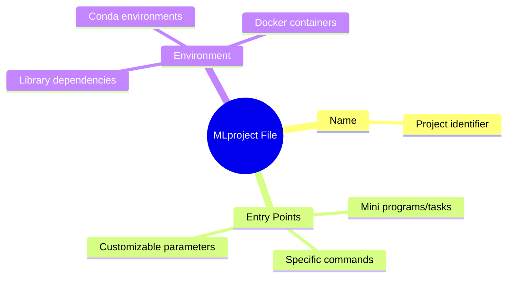
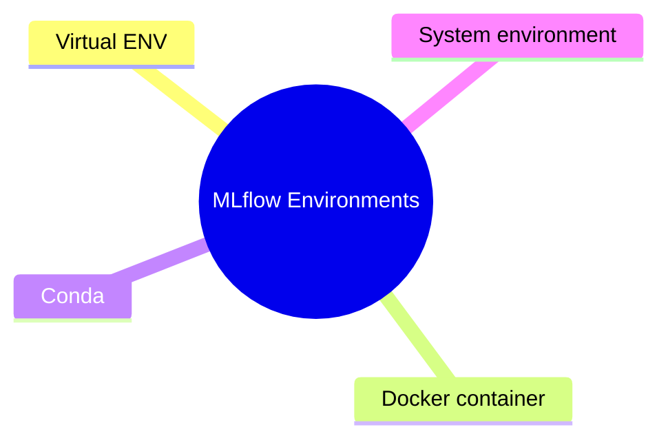
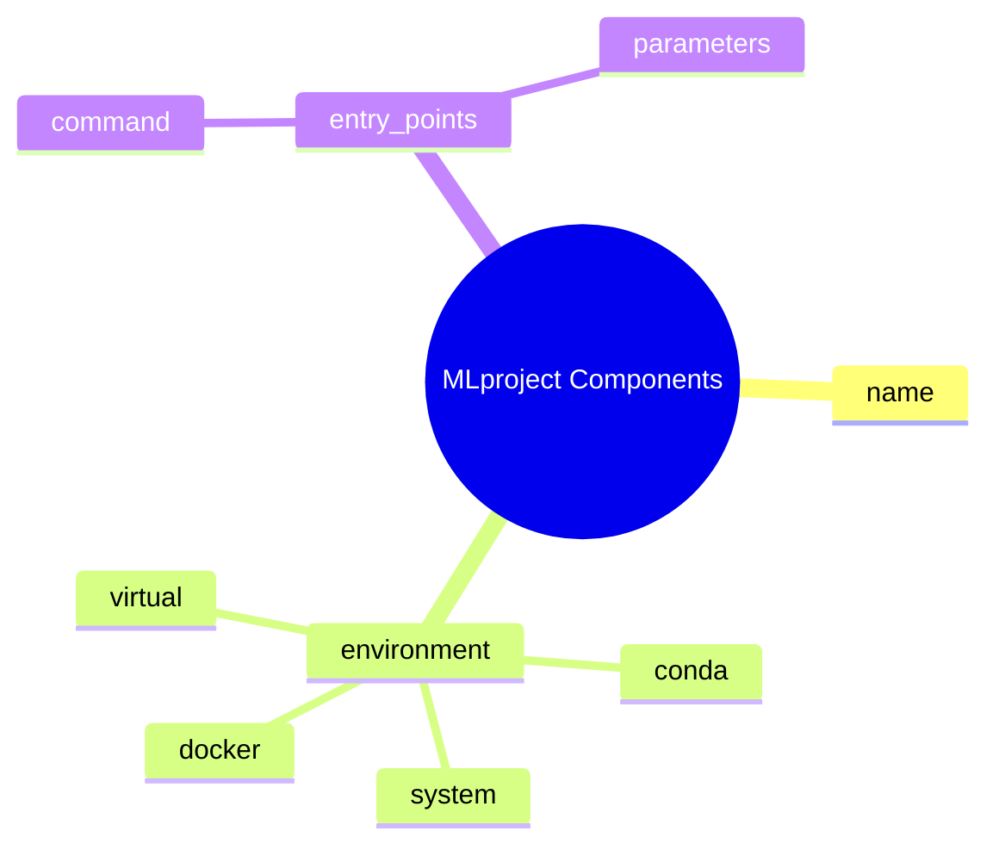
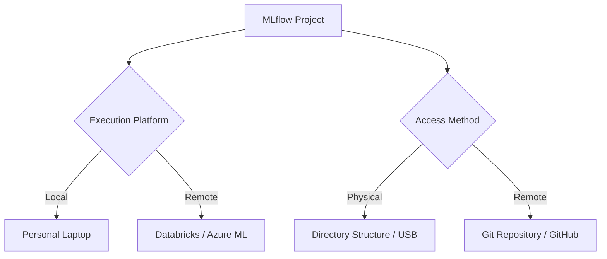
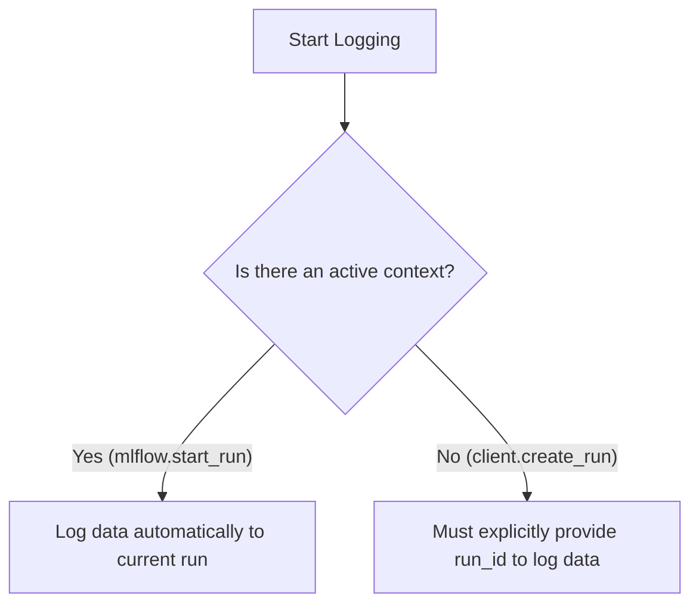

## MLflow Projects

- A tool used to organize and share machine learning code and models
- **[The Problem]** Data science projects often exist in "silos" where code cannot be easily used or modified by others due to differences in:
    - Dependencies
    - Environments
    - Operating systems
- **[The Solution]** MLflow Projects provides a simple way to define and manage:
    - Project dependencies
    - Environments
    - Entry points
- `MLProject` file
    - Explains the project structure
    - Defines which files are part of the project
    - Specifies required dependencies
    - Dictates how to execute the project
- Provides both API and CLI tools to run projects, facilitating the integration of various projects into a unified workflow

### MLflow Project Conventions

- A project is treated as a folder containing all files related to the code
    - This folder can reside on a local machine or in a cloud directory/machine
- MLflow uses specific conventions to recognize project components
    - For example, a `.yml` file can be treated as an environment definition
- **[The MLproject file]** Acts as a central "guidebook" for the project
    - It is a YAML-formatted text file
    - It specifies the project's:
        - Entry points
        - Dependencies
        - Associated parameters
    - This standardization makes it easier to manage and reproduce experiments across different environments

### MLflow Project vs. Single Model

- **[Distinction]** While a single model describes the nature of a specific model, an MLflow Project describes the overall workflow and execution steps of the entire project
    - It encompasses the complete project directory structure

### The MLproject File

- Acts as a "guidebook" for the machine learning project
- While a project can function without it, including this file is highly recommended for formalizing the workflow
- **[Purpose]** It serves as a central configuration file used to define:
        - Project name
        - Description
        - Entry points
        - Dependencies
        - Other organizational details to dictate the behavior of the machine learning code

### Practical Implementation: PyChamp Project

- **[Code Refactoring]** To prepare the script for MLflow, the code is encapsulated within a `main()` function
    - This ensures the logic is contained and can be explicitly called by the MLflow entry point
    - Example structure:

```python
def main():

# ... existing code logic ...
          pass

      if __name__ == "__main__":
          main()
```

- **Creating the MLproject File**
    - A new file is created in the project directory
    - **[Critical Naming Rules]**
        - The file must be named exactly `MLproject`
        - It must have **no file extension** (e.g., do not use `.yml` or `.txt`)
        - Spelling and capitalization are strict and must be exact

### MLproject File Structure

- The file uses the YAML format
- **[Core Characteristics]** The file is characterized by three primary components:
    - **Name**: The identifier for the project
    - **Entry points**: Definitions for different tasks or actions that can be executed within the project
        - These act like "mini programs" within the overall project
        - Each entry point is associated with a specific command and a set of parameters
        - **[Examples]** Tasks could include model training, performance evaluation, data pre-processing, or deployment
        - Users can customize settings or options for each entry point when running the code
    - **Environment**: Specifies the execution environment required for the entry points
        - This includes all library dependencies needed by the project code
        - MLflow supports managing these environments through:
            - Conda environments
            - Docker containers



### Writing the MLproject File

- **[Implementation]** Starting the actual creation of the file
    - The first configuration being defined is the project name

```yaml
name: "Elastic Regression project"
```

- **MLflow Project Environments**
    - These are the execution environments where the machine learning code runs
    - **[What they include]**
        - Necessary dependencies
        - Libraries
        - System configurations required for proper execution
    - **[Supported Environment Types]**
        - Virtual ENV
        - Docker container
        - Conda
        - System environment



### System Environment

- This is essentially the host operating system
    - It includes the installed version of Python and other required system-level dependencies

### Virtual Environment

- Acts as a separate, isolated workspace for a project
    - Uses tools like `virtualenv` and `pyenv` to prevent dependency conflicts between different projects on the same machine
    - **[How it works]** When specified, MLflow uses `pyenv` to download the required Python version and creates an environment containing the project's specific dependencies
    - The environment is automatically created and activated before the project code runs
- **[Configuration]** Defined in the MLproject file using the `python_env` entry
    - The value must be a relative path to a Python environment file within the project directory

```yaml
name: "Elastic Regression project"
python_env: files/config/python_env.yml
```

### Python Environment File Structure

- The `python_env.yml` file internally defines the required Python packages and their versions
- **[Structure]** A typical file includes:
    - The required Python version
    - Build dependencies (optional, required to build certain packages)
    - Dependencies to be installed via `pip`

```yaml

# Python version required to run the project.
python: "3.6.15"

# Dependencies required to build packages. This field is optional.
build_dependencies:
    pip:
        - setuptools
        - wheel=0.37.1

# Dependencies required to run the project.
dependencies:
    mlflow=2.3
    scikit-learn=1.0.2
```

### Conda Environment

- A highly popular and simple virtual environment option for Python
- **[Configuration]** Specified in the MLproject file using the `conda_env` entry
    - Requires a configuration file (typically `conda.yml`) that lists the necessary packages and versions

```yaml
name: "Elastic Regression project"
conda_env: files/config/conda.yml
```

- **[Pro-tip]** Instead of writing a `conda.yml` file from scratch, you can export your currently running Conda environment
    - Use the Conda export command to generate a `conda.yml` file directly from your active environment

### Exporting a Conda Environment

- Use the terminal to capture the current environment's configuration
    - Command: `conda env export --name <env_name> > <filename>.yml`
    - Example: `conda env export --name mlflow_demo1 > conda.yml`

### Structure of a `conda.yml` File

- The exported file contains the specific blueprint needed to recreate the environment
- **[Components]**
        - **name**: The name of the Conda environment
        - **channels**: The locations/repositories used to find packages
        - **dependencies**: The core packages required to build the Python kernel
        - **pip dependencies**: A sub-section for packages installed via `pip` within the Conda environment

### Integrating Conda with MLflow

- Once the `.yml` file is created, it must be referenced in the `MLproject` file
- **[Configuration]** Use the `conda_env` key followed by the path to the file

```yaml
name: "Elastic Regression project"
conda_env: conda.yml
```

- If the file is in the same directory as the `MLproject` file, only the filename is required; otherwise, a full path must be provided.

### Docker Environments

- Provides a self-contained environment for running MLflow projects
- **[Key Advantage]** Allows the inclusion of non-Python dependencies
    - Can manage system-level libraries like Java or C++ that are required for certain ML tasks
- MLflow can execute the project using a specific Docker image to ensure environment consistency

### Docker Environment Execution

- MLflow can run an existing Docker image as-is using parameters from the MLproject file
- Alternatively, the `--build-image` flag can be used with `mlflow run` to build a new image based on an existing one
    - This new image will include the project's contents located in the `mlflow/project/code` directory
- **[Data Persistence & Connectivity]** To ensure metrics, parameters, and artifacts are accessible:
    - Environment variables (such as `MLFLOW_TRACKING_URI`) are propagated inside the container
    - The host system's tracking directory is mounted inside the container

### Configuring Docker in MLproject

- Specify the environment using a top-level `docker_env` entry in the `MLproject` file
- The value must be the name of a Docker image that is accessible

#### Example: Image without a registry path

- This approach provides just the image name; Docker will look for it locally first and then attempt to pull it from Docker Hub if it is not found

```yaml
docker_env:
  image: mlflow-docker-example-environment
```

### Advanced Docker Configurations

Beyond just specifying an image, the `docker_env` entry can include parameters for volumes and environment variables to customize the container's behavior.

#### Mounting Volumes

- Use the `volumes` key to mount local directories from the host system into the container
    - This is useful for providing the container with access to specific datasets or files located on the host
    - **[Syntax]** The format follows `"[/host/path/directory/on/host/system:"/container/mount/path" ]`

#### Specifying Environment Variables

- Use the `environment` key to define variables within the container
- The value can be a single string or a list of strings:
    - **Single string**: Represents an existing environment variable from the host system that should be copied into the container
    - **List of strings**: Used to define new environment variables specifically for the Docker environment

```yaml
docker_env:
  image: mlflow-docker-example-environment
  volumes: ["/local/path:/container/mount/path"]
  environment: [["NEW_ENV_VAR", "new_var_value"], "VAR_TO_COPY_FROM_HOST_ENVIRONMENT"]
```

### Image in a Remote Registry

- Use the full registry path to point to images hosted outside of Docker Hub
    - This allows the use of private or cloud-specific registries like Amazon Elastic Container Registry (ECR)
    - **[Requirement]** The system executing the MLflow project must have the necessary credentials to access the remote registry

```yaml
docker_env:
  image: 012345678910.dkr.ecr.us-west-2.amazonaws.com/mlflow-docker-example-environment:7.0
```

### Building a New Image

- If a pre-built image is not available, MLflow can build a new one based on an existing base image and the files in the project directory
    - You specify the base image in the `docker_env` entry
    - To trigger this process, use the `--build-image` argument with the `mlflow run` command

#### Example: Building from a Python base image

```yaml
docker_env:
  image: python:3.8
```

```bash
mlflow run ... --build-image
```

### MLproject Entry Points

- Entry points define the specific tasks or operations that can be executed as part of a machine learning project
    - They essentially act as commands for "mini programs" within the project
- An MLproject file typically consists of three main properties:
        - `name`
        - `environment`
        - `entry_point`

### Project Functionalities and Workflows

- Specific functionalities or workflows can be defined to run within the project context
    - These are used for executing particular tasks or processes required by the project

### Components of an Entry Point

- Each entry point is composed of three key parts:
    - **Name**: Serves as a unique identifier for a specific task or action within the project
    - **Command**: Specifies the script or executable to be run for that task
        - This can be a Python script, a shell command, or any other executable
    - **Parameters**: Define the inputs or configurations required for executing the entry point
        - These provide flexibility and customization
        - They can be provided as command line arguments or within the MLproject file itself

### Entry Point Implementation Details

- **Environment Specification**
    - Each entry point can have its own specific execution environment
    - This allows for task-specific dependencies, Python versions, or configurations
    - Supported environment types:
        - Conda environments
        - Docker containers
- **Practical Use Cases**
    - A single Git repository can contain multiple feature engineering algorithms, each accessible via different entry points
    - Entry points can execute various file types, such as `.py` scripts or `.sh` shell files
- **Project Complexity**
    - While most projects contain at least one entry point, production-level projects often utilize multiple entry points to handle different stages of the machine learning lifecycle

### MLproject File Syntax

- The `MLproject` file uses a specific YAML-based structure to define entry points
- Each entry point is declared under the `entry_points` key in the file

### Entry Point Components (Continued)

- **Environment** (Optional)
    - Specifies the execution environment for the specific task
    - Includes necessary dependencies, Python versions, or additional configurations
    - Supported methods:
        - Conda environments
        - Docker containers

### Implementing an Entry Point

- **Example: ElasticNet Task**
    - The goal is to create an entry point to run the existing machine learning code
    - **Name**: `ElasticNet`
    - **Command**: Uses the standard Python CLI command to execute the script

```yaml
name: "Elastic Regression project"
conda_env: conda.yaml

entry_points:
  ElasticNet:
    command: "python main.py"
```

### Parameter Implementation in MLproject

- **Using Placeholders in Commands**
    - Instead of hardcoding values in the `command` field, use placeholders that get substituted at runtime
    - **[Security Note]**: MLflow automatically escapes parameter values using the `shlex.quote` function, so manual escaping (like adding quotes) is not required within the command field
    - Example command with placeholders:

```yaml
command: "python main.py --alpha ${alpha} --l1_ratio ${l1_ratio}"
```

- **Declaring Parameters**
    - Parameters are defined in the YAML configuration, similar to how one might define `argparse` arguments in a Python script
    - **MLflow Supported Parameter Types**:
    - `string`: A standard text string
    - `float`: A real number (MLflow validates that the input is a number)
    - `path`: A path on the local file system
        - MLflow automatically converts relative paths to absolute paths
        - It also handles downloading distributed URIs to local files
    - `uri`: A Uniform Resource Identifier

```yaml
name: "Elastic Regression project"
conda_env: conda.yaml

entry_points:
  ElasticNet:
    command: "python main.py --alpha ${alpha} --l1_ratio ${l1_ratio}"
    parameters:
      alpha:
        type: float
```

### MLflow Supported Parameter Types (Continued)

- **uri**
    - Used for data located in local or distributed storage systems
    - Similar to `path`, it can handle relative paths
    - Specifically intended for programs designed to read from distributed storage (e.g., Spark)

### Implementing the ElasticNet Entry Point

- **Parameter Configuration**
    - For this specific implementation, both `alpha` and `l1_ratio` are defined as `float` types

```yaml
name: "Elastic Regression project"
conda_env: conda.yaml

entry_points:
  ElasticNet:
    command: "python main.py --alpha ${alpha} --l1_ratio ${l1_ratio}"
    parameters:
      alpha:
        type: float
```

- **path**
    - Refers to a path on the local file system
    - MLflow handles several automation tasks for paths:
        - Converts relative paths to absolute paths
        - Downloads distributed URIs (such as from S3, DBFS, or GS) to local files
- **uri**
    - Used for data in local or distributed storage systems
    - Similar to `path`, it handles relative paths
    - **[Key Distinction]**: It is specifically intended for programs designed to read directly from distributed storage systems, such as Spark

### Implementing the ElasticNet Entry Point (Continued)

- **Parameter Implementation**
    - For this implementation, both `alpha` and `l1_ratio` are set to the `float` type
    - Default values can be assigned within the configuration

```yaml
name: "Elastic Regression project"
conda_env: conda.yaml

entry_points:
  ElasticNet:
    command: "python main.py --alpha ${alpha} --l1_ratio ${l1_ratio}"
    parameters:
      alpha:
        type: float
        default: 0.4
      l1_ratio:
        type: float
        default: 0.4
```

### MLproject Parameter and Command Rules

- **Parameter Declaration**
    - Parameters must be declared in the `parameters` field to be recognized as specific types
    - Parameters are substituted into the `command` string during execution
- **Undeclared Parameters**
    - Any parameter used in a command that is *not* explicitly declared in the `parameters` field is treated as a `string` type
- **Passing Additional Parameters**
    - You can pass parameters not listed in the `parameters` field using key-value syntax; MLflow will pass these directly to the entry point command
- **Entry Point Constraints**
    - Each entry point is limited to exactly **one** command
    - An entry point can have multiple parameters
    - **[Note]**: To run additional or different commands, you must define a separate entry point

### MLproject File Summary

- **Core Components**
    - `name`: The name of the project
    - `conda_env`: The environment configuration
    - `entry_points`: The executable commands and their parameters
- **Supported Execution Environments**
    - **System**: Does not require an entry in the project file (configured manually)
    - **Virtual**: Requires a Python environment entry
    - **Docker**: Requires a Docker environment entry
    - **Conda**: Requires a `conda_env` entry (e.g., `conda.yaml`)



## Running MLflow Project

- Two ways to run projects in a specified environment:
    - **CLI command**
        - `mlflow run` (used in the terminal)
    - **API function**
        - `mlflow.projects.run` (used within a script)

### MLflow Project Concept

- A packaged unit of work that can be shared and run by others
    - Projects can be uploaded to platforms like GitHub for easy distribution
- **[What it means to run a project]** Executing the defined entry points within a specified environment

### CLI Run Command

- Syntax for executing a project via terminal:

```bash
mlflow run [OPTIONS] URI
```

- **[The URI Parameter]** This is a required argument that points to the MLflow project you want to run
    - It can be a local file path
    - It can be a remote repository (e.g., GitHub)

### Project Execution and Sharing Context

- The specific options used in the `mlflow run` command depend on two main factors:
    - **The execution platform** (where the code runs)
    - **The access method** (how the code is provided)
- **Execution Platforms**
    - **Local machine**: Running the project on a personal laptop
    - **Remote machine**: Running the project on cloud platforms like Databricks or Azure Machine Learning
- **Code Access Methods**
    - **Directory structure**: Providing the code physically (e.g., via a USB drive or a local folder)
    - **Git repository**: Using tools like GitHub to run the code directly from a remote repository without needing the files physically on the machine



### MLflow Run Command Options

- `-e, --entry-point <NAME>`
    - Specifies the entry point to run within the project
    - Defaults to `main`
    - Example: `mlflow run -e <my_entry_point> <my_project_uri>`
- `-v, --version <VERSION>`
    - Used when running a project from a Git repository
    - Allows specifying a specific version, such as a Git commit reference
    - Example: `mlflow run -v <abc123> <my_project_uri>`
- `-P, --param-list <NAME=VALUE>`
    - Used to pass parameters to the run
    - **[Note on parameter handling]** Any parameters provided that are not listed in the MLproject file's entry points will be passed as command-line arguments to that entry point
    - Example: `mlflow run -P param1=value1 -P param2=value2 <my_project_uri>`
- `-A, --docker-args <NAME=VALUE>`
    - Used when the project is running in a Docker container
    - Allows passing Docker run arguments or flags directly to the `docker run` command
    - Example: `mlflow run -A gpus=all -A t <my_project_uri>`
- `--experiment-name <experiment_name>`
    - Specifies the name of the experiment under which to launch the run
    - Example: `mlflow run --experiment-name <my_experiment> <my_project_uri>`
- `--experiment-id <experiment_id>`
    - Specifies the specific ID of the experiment to use for the run
    - Example: `mlflow run --experiment-id <my_experiment_id> <my_project_uri>`
- `-b, --backend <BACKEND>`
    - Determines the execution backend to use
    - Supported values:
        - `local` (the default value)
        - `databricks` (launches the run against the specified workspace)
        - `kubernetes` (currently experimental)
    - Example: `mlflow run -b databricks <my_project_uri>`

### MLflow Run Command Options (Continued)

- `-c, --backend-config <FILE>`
    - Provides a path to a JSON file or a JSON string for backend configuration
    - Content must be specific to the chosen execution backend
    - Example: `mlflow run -c backend_config.json <my_project_uri>`
- `--env-manager <env_manager>`
    - Specifies the environment manager to use for the ML project
    - Supported values: `local`, `virtualenv`, and `conda`
    - If omitted, MLflow automatically selects an appropriate manager based on project configuration
    - Example: `mlflow run --env-manager conda <my_project_uri>`
- `--storage-dir <storage_dir>`
    - **[Note]** Only valid when the backend is set to `local`
    - MLflow downloads artifacts from distributed URIs into sub-directories of this specified directory
    - Example: `mlflow run --storage-dir <storage_dir> <my_project_uri>`
- `--run-id <RUN_ID>`
    - Allows specifying an existing run ID instead of creating a new run
    - Primarily used internally by MLflow project APIs and should not be manually specified
    - Example: `mlflow run --run-id <my_run_id> <my_project_uri>`
- `--run-name <RUN_NAME>`
    - Sets the name of the MLflow run associated with the project execution
    - If not specified, the run name is left unset
    - Example: `mlflow run --run-name <my_run_name> <my_project_uri>`
- `--build-image`
    - **[Note]** Only valid for Docker projects
    - If specified, MLflow builds a new Docker image based on the one specified in the `MLproject` file, including files in the project directory
    - Example: `mlflow run --build-image <my_project_uri>`

### MLflow Environment Variables

- **MLFLOW\_EXPERIMENT\_NAME**
    - Can be set to provide a default value for the `--experiment-name` option
    - Example: `export MLFLOW_EXPERIMENT_NAME=my_experiment`
- **MLFLOW\_EXPERIMENT\_ID**
    - Can be set to provide a default value for the `--experiment-id` option
    - Example: `export MLFLOW_EXPERIMENT_ID=<123>`
- **MLFLOW\_TMP\_DIR**
    - Can be set to provide a default value for the `--storage-dir` option when using the local backend
    - Example: `export MLFLOW_TMP_DIR=/path/to/storage`

### MLflow Environment Variables

- Setting these variables allows you to avoid specifying certain options every time you run the `mlflow run` command
- The values provided by these variables act as defaults and will be used unless overridden by explicit command-line options
- **Key Variables:**
    - `MLFLOW_EXPERIMENT_NAME`
        - Provides a default value for the `--experiment-name` option
        - Example: `export MLFLOW_EXPERIMENT_NAME=my_experiment`
    - `MLFLOW_EXPERIMENT_ID`
        - Provides a default value for the `--experiment-id` option
        - Example: `export MLFLOW_EXPERIMENT_ID=<123>`
    - `MLFLOW_TMP_DIR`
        - Provides a default value for the `--storage-dir` option when using the local backend
        - Example: `export MLFLOW_TMP_DIR=/path/to/storage`

### MLflow CLI Configuration and Execution

- **Setting the Tracking URI**
    - When using the CLI, the tracking URI is set by defining the `MLFLOW_TRACKING_URI` environment variable
    - Example: `export MLFLOW_TRACKING_URI=http://127.0.0.1:5000`
- **Executing an MLflow Project**
    - The `mlflow run` command is used to execute a project
    - **Specifying Entry Points and Parameters:**
        - The command follows the structure: `mlflow run <project_uri> --entry-point <entry_point_name> -p <param1> <value1> -p <param2> <value2>`
        - To specify multiple parameters, the `-p` flag must be used for each one individually
        - Example: `mlflow run --entry-point elastic_net -p alpha 0.5 -p l1_ratio 0.5`
    - **Specifying the Experiment:**
        - The `--experiment-name` option can be used to define which experiment the run belongs to
        - Alternatively, the `MLFLOW_EXPERIMENT_NAME` environment variable can be set as a default
        - Example: `mlflow run --entry-point elastic_net -p alpha 0.5 -p l1_ratio 0.5 --experiment-name "Project exp 1"`

### MLflow CLI Execution Completion

- **Executing from the Project Directory**
    - When running `mlflow run` from within the project directory, you can use `.` as the project URI because MLflow automatically searches the current directory
    - Example: `mlflow run . --entry-point elastic_net -p alpha 0.5 -p l1_ratio 0.5 --experiment-name "Project exp 1"`
- **Troubleshooting:&#32;`chcp`&#32;Error**
    - If you encounter an error stating `chcp is not recognized as an internal or external command`, it can be resolved by setting the appropriate environment variable in your system
- **Verifying Results**
    - Successful runs will pass the specified parameters to the model (e.g., `alpha=0.5`, `l1_ratio=0.5`)
    - Metadata and artifacts are saved and can be inspected via the MLflow UI

### MLflow Projects API

- **The&#32;`run`&#32;Function**
    - The `mlflow.projects.run` function provides a way to execute an MLflow project programmatically within a script, rather than using the command line interface (CLI)
- **Parameter Comparison with CLI**
    - Most parameters used in the CLI `mlflow run` command are identical when using this function
- **The&#32;`synchronous`&#32;Parameter**
    - A boolean parameter that determines how the execution behaves
    - **Synchronous Execution (`synchronous=True`):**
    - The program waits for the operation to complete before proceedingIt blocks further execution until the current operation finishes**Use Case:** Useful when immediate access to the results or errorsHoverNotes of the run is required
    - **Asynchronous Execution (`synchronous=False`):**
        - The operation is initiated without waiting for it to complete
        - Allows for concurrent or parallel execution
        - **Use Case:** Beneficial for long-running operations where progress can be monitored separately


[00:00:19](https://10pearls.udemy.com/course/mlflow-course/learn/lecture/40458036#learning-tools)

### MLflow Projects API Implementation

- **Synchronous vs. Asynchronous Behavior**
    - **`mlflow.projects.run`&#32;(API):**
        - Uses a `synchronous` parameter to control execution.
        - Defaults to `True`.
    - **`mlflow run`&#32;(CLI):**
        - Is synchronous by default.
        - Lacks a specific `synchronous` property but provides other customization options (e.g., skipping environment creation).
- **Programmatic Execution with Python**
    - To run a project within a Python script, you can define parameters and entry points directly in your code.
    - **Example Setup:**

```python
import mlflow

      parameters = {
          "alpha": 0.3,
          "l1_ratio": 0.3
      }
      experiment_name = "Project exo 1"
      entry_point = "Elasticnet"
```

## MLflow Client

- **Analogy to Modern Software Development**
    - **Backend (Server):** Responsible for heavy lifting, such as recording runs and artifacts
    - **Frontend (Client):** Interacts with the server by sending requests to read/write information or test specific actions
- **The MLflow Ecosystem Relationship**
    - The Tracking Server cannot record data on its own; it requires instructions from a client
    - The client provides commands and the specific data to be recorded, such as:
        - Metrics
        - Hyperparameters
        - Other artifacts
- **Definition**
    - "MLflow client encompasses a collection of tools and libraries that allow users to interact with the MLflow platform programmatically."
    - It serves as the interface for data scientists and machine learning engineers to communicate with various MLflow components

### MLflow Library vs. MLflow Client

- **MLflow Library (High-level API)**
    - Designed for easy interaction with the MLflow Tracking Server
    - Provides functions for common machine learning lifecycle tasks:
        - Tracking experiments
        - Packaging code into reproducible runs
        - Saving and loading models
- **MLflow Client (Low-level API)**
    - A module within MLflow that serves as a lower-level interface
    - Directly translates to MLflow REST API calls
    - Primarily used to interact with the core components of MLflow
    - Contains the `MLflowClient` class for programmatic communication with the tracking server

### MLflow Client Module Focus Areas

- **Experiment Management**
    - Using the client to create, retrieve, delete, and list experiments
- **Run Management and Tracking**
    - Using the `MLflowClient` class to:
        - Create runs
        - Fetch run details
        - Log run information
        - Search between runs
- **Model Versioning and Management**

### Model Versioning and Management Capabilities

- The `MLflowClient` class facilitates the management of models through several functions:
    - Creating registered models
    - Creating model versions
    - Listing registered models
- **Relationship with MLflow Library**
    - The client is intended to complement, not replace, the MLflow library
    - The library provides high-level convenience
    - The client provides specialized functionality and greater control over the tracking server
    - This allows users to choose the appropriate level of abstraction for their specific use case

### Experiment Management with MLflowClient

- Uses the `MLflowClient` class to perform tasks previously covered in the tracking section
- Available functions for managing experiments:
    - `create_experiment`
    - `set_experiment_tag`
    - `get_experiment`
    - `get_experiment_by_name`
    - `rename_experiment`
    - `delete_experiment`
    - `restore_experiment`
    - `search_experiments`

### Creating an Experiment with MLflowClient

- **Setup Process**
    - Create a new Python file (e.g., `mlflow_client.py`)
    - Import necessary packages: `mlflow` and `MLflowClient` from `mlflow.client`
    - Set the tracking URI using `mlflow.set_tracking_uri("http://127.0.0.1:5000")`
- **Initializing the Client**
    - Create a client object to interact with the server:

```python
from mlflow.client import MLflowClient
    import mlflow

    mlflow.set_tracking_uri("http://127.0.0.1:5000")
    client = MLflowClient()
```

- **Using&#32;`create_experiment`**
    - The function creates a new experiment and returns its unique `experiment_id`
    - **Parameters used in example:**
        - `name`: The name of the new experiment
        - `tags`: A dictionary of metadata to attach to the experiment
    - **Implementation:**

```python
experiment_id = client.create_experiment(
        name="my_experiment",
        tags={"type": "test"}
    )
```

### Completing Experiment Creation

- **Printing the Result**
    - To verify the creation, print the `experiment_id` returned by the client
    - **Implementation:**

```python
import mlflow
from mlflow.client import MLflowClient

mlflow.set_tracking_uri("http://127.0.0.1:5000")
client = MLflowClient()

experiment_id = client.create_experiment(
    name="Client exp",
    tags={"version": "v1", "priority": "P1"}
)

print("Experiment id", experiment_id)
```

### Verifying Experiment Creation

- After running the creation script, the experiment can be confirmed in the MLflow UI
    - The UI displays the experiment name (e.g., "Client exp")
    - The default artifact location is visible at the top of the experiment page
    - If no runs have been executed yet, the UI will show "No runs logged"

### Managing Experiment Tags

- **Using&#32;`set_experiment_tag`**
    - This function allows adding metadata to an experiment after it has already been created
    - **Parameters used in example:**
        - `experiment_id`: The unique ID of the target experiment
        - `key`: The name of the tag (e.g., "framework")
        - `value`: The value associated with the tag (e.g., "sklearn")
    - **Implementation:**

```python
client.set_experiment_tag(
    experiment_id,
    key="framework",
    value="sklearn"
)
```

- **[Constraint]** This function can only create or update one tag at a time
    - To add multiple tags, the function must be called multiple times for each key-value pair

### Retrieving Experiment Details

- **Using&#32;`get_experiment`**
    - Retrieves a complete experiment object from the backend store using its unique `experiment_id`
    - The returned object contains various metadata attributes that can be accessed
    - **Implementation:**

```python
experiment = client.get_experiment(experiment_id)

print(f"Name: {experiment.name}")
print(f"Experiment id: {experiment.experiment_id}")
print(f"Artifact location: {experiment.artifact_location}")
print(f"Tags: {experiment.tags}")
print(f"Lifecycle stage: {experiment.lifecycle_stage}")
```

- **Output Example**
    - Running the code above prints the retrieved metadata to the console:

```text
Name: Client exp
Experiment id: 12
Artifact location: file:///Users/user/PycharmProjects/mlflow_demo/mlflow_artifacts/12
Tags: {'version': 'v1', 'priority': 'P1', 'framework': 'sklearn'}
Lifecycle stage: active
```

- **Using&#32;`get_experiment_by_name`**
    - Retrieves the experiment object using the experiment's name as the input
    - **Behavior:**
        - If an experiment with the specified name exists, it returns the experiment entity
        - If the name does not exist, it returns `None`

### Renaming an Experiment

- **Using&#32;`rename_experiment`**
    - Renames an existing experiment identified by its ID
    - **Parameters used in example:**
        - `experiment_id`: The current ID of the experiment (e.g., `12`)
        - `new_name`: The new string name for the experiment (e.g., `"client exp sax"`)
    - **Behavior:**
        - This function does not return any value
        - It modifies the experiment in the backend store directly
    - **Implementation:**

```python
client.rename_experiment("12", "client exp sax")

# Verifying the change
experiment = client.get_experiment_by_name("client exp sax")
print(f"Name: {experiment.name}")
```

### Deleting an Experiment

- **Using&#32;`delete_experiment`**
    - Permanently removes an experiment from the MLflow tracking server
    - **Parameters used in example:**
        - `experiment_id`: The unique ID of the experiment to be deleted
    - **Implementation:**

```python
client.delete_experiment("12")
```

### Restoring an Experiment

- **Using&#32;`restore_experiment`**
    - Recovers an experiment that was previously deleted
    - **Implementation:**

```python
client.restore_experiment("12")
```

- **Verification:**
    - After running the command, refreshing the MLflow UI confirms the experiment (e.g., "Client exp new") is successfully restored.

### Searching Experiments

- **Using&#32;`search_experiments`**
    - Allows for quick, programmatic searching of experiments directly from code
    - **[Why use it?]** While the MLflow UI is useful for manual searches, programmatic searching is necessary for managing and navigating large numbers of experiments within automated machine learning workflows.

### Searching for Experiments

- **Using&#32;`search_experiments`**
    - Functions as a search engine to find experiments
    - Allows for filtering and sorting based on various criteria
- **Parameters of&#32;`search_experiments`**
    - The function accepts 5 parameters
    - **`view_type`**:
            - Specifies which experiments to include in the search results
            - Uses the following enum values:
                    - `ACTIVE_ONLY`: Returns only active experiments
                    - `DELETED_ONLY`: Returns only deleted experiments
                    - `ALL`: Returns all experiments

### Parameters of `search_experiments` continued

- **`max_results`**
    - Specifies the maximum number of experiments to retrieve
    - **[Note:]** Certain server backends have their own limits; you might not receive the full amount requested if it exceeds the backend's capacity
- **`filter_string`**
    - The core of the `search_experiments` function
    - Provides a query to filter out specific experiments using various comparators
    - **Identifiers used in queries:**
        - `name`: The experiment name
        - `creation_time`: The time the experiment was created
        - `last_update_time`: The time of the last update
        - `tags.<tag_key>`: An experiment tag
            - If the `tag_key` contains spaces, it must be wrapped in backticks (e.g., `tags.`extra key\`\`)
    - **Comparators:**
        - **String attributes and tags:**
            - `==`: Equal to
            - `!=`: Not equal to
            - `LIKE`: Case-sensitive pattern match
            - `ILIKE`: Case-insensitive pattern match
        - **Numeric attributes:**
            - `==`: Equal to
            - `!=`: Not equal to
            - `<`: Less than
            - `<=`: Less than or equal to
            - `>`: Greater than
            - `>=`: Greater than or equal to

### `filter_string` continued

- **Logical operators**
    - `AND`: Combines two sub-queries and returns True if both are True
- **Numeric attribute comparators**
    - `==`: Equal to
    - `!=`: Not equal to
    - `<`: Less than
    - `<=`: Less than or equal to
    - `>`: Greater than
    - `>=`: Greater than or equal to

### Remaining Parameters of `search_experiments`

- **`order_by`**
    - Specifies the field used to order the output list
    - Allows specifying ascending or descending order
    - **Default behavior**: Orders by `last_update_time` in descending order (`DESC`)
    - Can also order by `name` or `creation_time`
- **`page_token`**
    - Used for pagination when there are multiple pages of search results
    - Helps navigate through large result sets efficiently

### Function Output

- Returns a `PagedList` of Experiment objects

### Implementation Example

- To use the function, you must first import the necessary modules to provide correct types for the parameters:

```python
import mlflow
from mlflow.entities import ViewType

client = mlflow.MlflowClient()
```

### Using `search_experiments` in Code

- **Handling the output**
    - The function returns a `PagedList` object
    - Although it is a specific type, it can be treated like a standard list for iteration
- **Iterating through experiments**
    - To access specific details, you can loop through the results and access attributes on each experiment object

```python

# Example of iterating through search results
experiments = client.search_experiments(view_type=ViewType.ALL)

for exp in experiments:
    print(f"Experiment Name: {exp.name}, Experiment ID: {exp.experiment_id}")
```

- **Refining the search**
    - Parameters can be adjusted to change the scope and order of results
    - Example: changing `view_type` to `ViewType.ACTIVE_ONLY` to filter out deleted experiments
    - Example: using `order_by="exp.name"` or `order_by="exp.experiment_id"` to sort the list

```python

# Ordering by ascending experiment ID and filtering for active experiments only
experiments = client.search_experiments(
    view_type=ViewType.ACTIVE_ONLY,
    order_by="exp.experiment_id"
)
```

### Using `filter_string` to Refine Searches

- **Basic filtering**
    - The `filter_string` parameter can be used to narrow down the list of retrieved experiments based on specific criteria.
    - Example of a basic filter:

```python
experiments = client.search_experiments(
    view_type=ViewType.ALL,
    filter_string='"exp.name" = "Client exp name"',
    order_by="exp.experiment_id ASC"
)
```

- **Combining multiple conditions**
    - You can use logical operators like `AND` to combine multiple sub-queries within the `filter_string`.
    - This is useful for searching for experiments that meet several specific requirements simultaneously, such as having certain tags.
    - **[Example Pattern]**
    - Querying for specific tags:

        `filter_string = "tag.key = 'value' AND tag.other = 'something'"`

### Additional `search_experiments` Parameters

- **Pagination and Volume Control**
    - `max_results`: Used to limit the number of experiments returned in a single call
    - `page_token`: Used to handle pagination when dealing with large numbers of results

### Summary of Experiment Management

- **Core Capabilities covered**
    - Creating new experiments
    - Searching for experiments using specific tags
    - Querying the entire database of experiments using various filters and sorting criteria

## Run Management and Tracking

- **Lifecycle operations**
    - Creating runs
    - Deleting runs
    - Updating runs
    - Terminating runs
- **Data integrity with MFlock Lite**
    - Locking parameters
    - Locking metrics
    - Locking artifacts

### MFlockClient.create\_run

- A function used to create a run object without executing any code
    - This is useful when you want to prepare the run metadata before running the actual machine learning code
    - It is distinct from `projects.run` (which executes ML project entry points) and `mlflow.start_run` (which starts an active run context)
- **Parameters**
        - `experiment_id`: The ID of the experiment to include the run in
        - `tags`: A dictionary of tags to associate with the run
        - `run_name`: The name for the run
        - `start_time`: The timestamp for when the run should start
                - If not specified, the run starts at the current time step
- **Return Value**
        - Returns a run object containing metadata that can be extracted
- **Implementation Example**

```python
client = MFlockClient()
run = client.create_run(
    experiment_id="22",
    tags={
        "version": "v1",
        "Priority": "P1"
    }
)

print(f'run.tags: {run.data.tags}')
print(f'Experiment id: {run.info.experiment_id}')
print(f'Run id: {run.info.run_id}')
print(f'Run name: {run.info.run_name}')
print(f'Lifecycle stage: {run.info.lifecycle_stage}')
print(f'Status: {run.info.status}')
```

### Active Run Context vs. Manual Creation

- **`mlflow.start_run`**
    - Creates a run and establishes an **active run context**
    - Within this context, the specified run ID and name are applied automatically
    - Users do not need to explicitly specify the run ID when calling functions like `log_metrics`, `log_params`, or `log_artifacts`
- **`client.create_run`**
    - Creates a new run but **does not** set it as the active run
    - **[Consequence]** Subsequent logging calls will not automatically target this run
    - You must explicitly reference the `run_id` when logging data to this specific run

### Run Status and Lifecycle

- **Unfinished Status**
    - A run created via `client.create_run` will appear in the MLflow UI with a status of `UNFINISHED`
    - This occurs because the run was created but no code was executed and it hasn't been terminated
    - Runs must be manually terminated using dedicated status-setting functions to move them out of this state



### get\_run

- Fetches a run from the backend store using its `run_id` as the parameter
- Returns a run object identical in structure to the one returned by `create_run`

```python
run = client.get_run("063f6ea6dec4d3e3b345e04")

print(f'Run tags: {run.data.tags}')
print(f'Experiment id: {run.info.experiment_id}')
print(f'Run id: {run.info.run_id}')
print(f'Run name: {run.info.run_name}')
print(f'Lifecycle stage: {run.info.lifecycle_stage}')
print(f'Status: {run.info.status}')
```

### Integrating MLflow into Data Science Workflows

- The goal is to implement tracking within a standard data science script without using the high-level `mlflow` functions
- **[Methodology]** Use the `MFlockClient` to manually log the following components:
    - Parameters
    - Methods
    - Metrics
    - Artifacts
- The client-specific logging functions will behave identically to the standard MLflow logging functions in terms of parameters and behavior

### Implementing Manual Tracking

- **[Setup]** Initializing the `MFlockClient` to manage tracking manually within the data science workflow
- **Creating a Run with Metadata**
    - Use `client.create_run` to instantiate a new run
    - Pass `experiment_id` and a `tags` dictionary to provide context to the run

```python
mlflow.set_tracking_uri("http://127.0.0.1:5000")

client = MFlockClient()
run = client.create_run(
    experiment_id=25,
    tags={
        "version": "v1",
        "priority": "P1"
    }
)
```

### Completing Manual Tracking Implementation

- **[Requirement]** Every logging function must explicitly include the `run_id` as the first argument because there is no active run context
- **Logging Parameters**
    - Use `client.log_param(run_id, key, value)`
    - Example: logging hyperparameters like `alpha` and `l1_ratio`
- **Logging Metrics**
    - Use `client.log_metric(run_id, key, value)`
    - Requires a separate call for each individual metric being tracked
- **Logging Artifacts**
    - Use `client.log_artifact(run_id, local_path)`
    - Used to save files like the trained model or input datasets to the tracking server

```python

# Example of manual logging with client
client.log_param(run.info.run_id, "alpha", alpha)
client.log_param(run.info.run_id, "l1_ratio", l1_ratio)

client.log_metric(run.info.run_id, "mse", mse)
client.log_metric(run.info.run_id, "rmse", rmse)
client.log_metric(run.info.run_id, "r2", r2)

client.log_artifact(run.info.run_id, "linear_regression.pkl")
client.log_artifact(run.info.run_id, "not-wine-quality.csv")
```

### Verifying Results in MLflow UI

- After running the script, the MLflow UI displays the logged data organized by:
    - Parameters
    - Metrics
    - Tags
    - Artifacts (e.g., `.pkl` models and `.csv` datasets)

### Managing Run Lifecycle Status

- Even after training a model and logging all parameters, metrics, and artifacts, a run may still show a status of `unfinished` in the MLflow UI
- To move a run out of this state, you must use functions that change its status to reflect that the process is complete
- **[Function Comparison]**
    - `set_terminated()`: Used to change the status of the run
    - `update_run()`: A more versatile function that can change both the status and the name of the run

```python

# To finish a run and update its status
client.set_terminated(run_id)

# Or use update_run to change status and potentially the name
client.update_run(run_id, status="FINISHED", run_name="final_model_run")
```

### Demonstrating `update_run` for Status and Name Changes

- While `create_run` can set an initial name, `update_run` is used to modify an existing run's attributes
- **[Functionality]** `client.update_run` can change both the `status` and the `name` of a run
- In the implementation, `update_run` is called as the final statement to ensure the run is properly closed and renamed

```python

# Updating the run status and name
client.update_run(
    run.info.run_id,
    status="FINISHED",
    name="run for client updated"
)
```

### Verifying Run Updates in MLflow UI

- After executing the update, the MLflow UI reflects the changes immediately:
    - **Status**: Changes from `unfinished` to `FINISHED`
    - **Name**: Changes from the original name (e.g., `run from client 2`) to the new name (e.g., `run for client updated`)

| UI Field | Previous State | New State |
| --- | --- | --- |
| Status | unfinished | FINISHED |
| Name | run from client 2 | run for client updated |

### The `set_terminated` Method

- Used to finalize a run and change its status
- **[Default Behavior]** By default, it sets the run status to `FINISHED`
- **[Customization]** It can be used to set other terminal statuses, such as `FAILED`

```python

# Example of setting a specific terminal status
client.set_terminated(run.info.run_id, status="FAILED")
```

### Retrieving Run Data

- Transitioning from logging and managing runs to retrieving logged information

#### `get_metric_history` Function

- Used to retrieve the history of metrics that have been logged during a specific run
- **[Use Case]** Highly useful in deep learning to track the progression of metrics (like loss or accuracy) over multiple training steps or epochs
- **[Deep Learning Use Case]** While it can retrieve a single value for standard machine learning, it is primarily designed for deep learning to track metric progression over time
    - In deep learning, metrics are typically computed after every epoch rather than just once at the end of training
    - This allows for monitoring the model's behavior throughout the entire training process
- **[Implementation]** To retrieve history, you first need to identify the specific run using `get_run`, then call `get_metric_history` with the following parameters:
    - `run_id`: The unique identifier for the run
    - `metric`: The name of the specific metric to retrieve
- **[Return Value]** The function returns a list of metric objects, where each object represents a single logged value at a specific point in time

```python

# Retrieving metric history for a specific run
run = client.get_run("485db...run_id...")
metrics = client.get_metric_history(run.info.run_id, "rmse")
```

### Processing Metric History

- The `metrics` variable returned by `get_metric_history` is a list of full metric objects
- **[Why iterate?]** Printing the list directly yields objects that are not human-readable or useful for analysis
- To extract meaningful data, you must iterate through the list and access specific attributes of each object:
    - `step`: Represents the training step or epoch (e.g., in deep learning, this tracks progress across epochs)
    - `timestamp`: The time the metric was recorded
    - `value`: The actual numerical value of the metric (e.g., RMSE)

```python

# Iterating through metric history to extract useful data
for metric in metrics:
    print(f"step: {metric.step}, timestamp: {metric.timestamp}, value: {metric.value}")
```

### Retrieving Artifact Information

#### `list_artifacts` Function

- Used to retrieve a list of artifacts associated with a specific run
- **[Parameters]**
    - `run_id`: The unique identifier for the run
    - `path` (optional): The specific directory path within the artifacts. If omitted, it defaults to the root artifacts directory

```python

# Retrieving the list of artifacts for a run
artifacts = client.list_artifacts(run.info.run_id)
```

### Processing Artifact Information

#### Iterating through Artifacts

- The `list_artifacts` function returns a list of artifact objects
- **[Why iterate?]** Because the output is a list of objects, you must use a loop to access individual properties like the file path and size

```python

# Iterating through artifacts to get details
artifacts = client.list_artifacts(run.info.run_id)
for artifact in artifacts:
    print(f"artifact: {artifact.path}")
    print(f"size: {artifact.file_size}")
```

### Managing Run Lifecycle

#### `delete_run` Function

- Used to remove a specific run from the system using its unique ID
- **[Verification]** After calling `delete_run`, the run's `lifecycle_stage` will change from `active` to `deleted`

```python

# Deleting a specific run
client.delete_run(run.info.run_id)

# Verifying deletion by checking the lifecycle stage
run = client.get_run(run.info.run_id)
print(f"lifecycle_stage: {run.info.lifecycle_stage}")
print(f"status: {run.info.status}")
```

### Managing Run Lifecycle

#### `restore_run` Function

- Used to recover a run that has been previously deleted
- **[Parameters]**
    - `run_id`: The unique identifier of the run to be restored
- **[Effect]**
    - Restores the run and changes its lifecycle stage from `DELETED` back to `ACTIVE`

```python

# Restoring a deleted run
client.restore_run("49fca02da6a89331c38f48f76c1")
```

### Searching for Runs

#### `search_runs` Function

- Used to find specific runs within an experiment
- **[Functionality]**
    - It operates very similarly to `search_experiments`
    - It allows for searching using the same types of parameters used when searching for experiments

## MLflow CLI

- A set of command line tools used to perform operations via a terminal rather than programmatically through the Python library
- **[Capabilities]**
    - Running projects
    - Starting the tracking UI
    - Creating and listing experiments
    - Downloading run artifacts
    - Serving MLflow models

### `mlflow doctor` Command

- Used to diagnose and troubleshoot issues with the MLflow installation
- **[Functionality]**
    - Checks the environment and configuration to ensure everything is set up correctly
    - Performs a series of checks and reports any identified issues or warnings

### MLflow CLI Setup

#### Environment Configuration

- Before running CLI commands, the conda environment must be activated
- **[Why?]** Because the MLflow tools are installed within that specific environment
- The `MLFLOW_TRACKING_URI` environment variable must be set to point to the active server
    - This ensures that CLI commands interact with the correct tracking server rather than a default local instance

```bash

# Activating the environment
conda activate mlflow_demo

# Example of running the server (as context for the URI)
mlflow server --backend-store-uri sqlite:///mlflow.db --default-artifact-root ./mlflow-artifacts --host 127.0.0.1 --port 5000
```