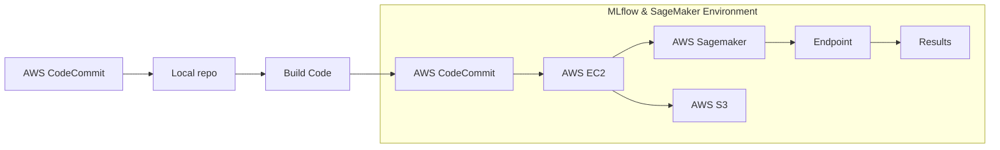
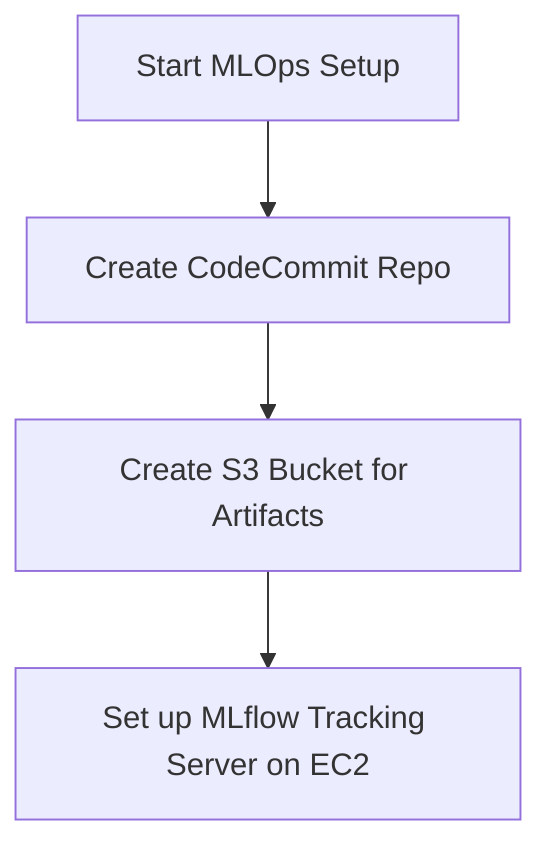
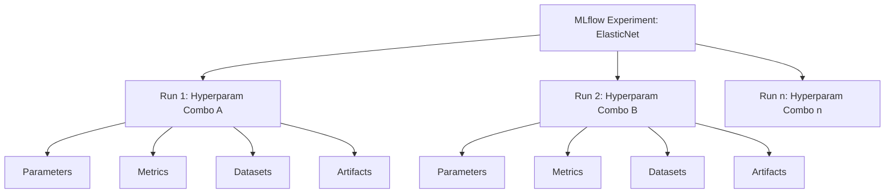
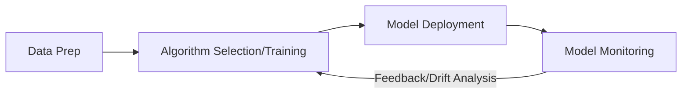
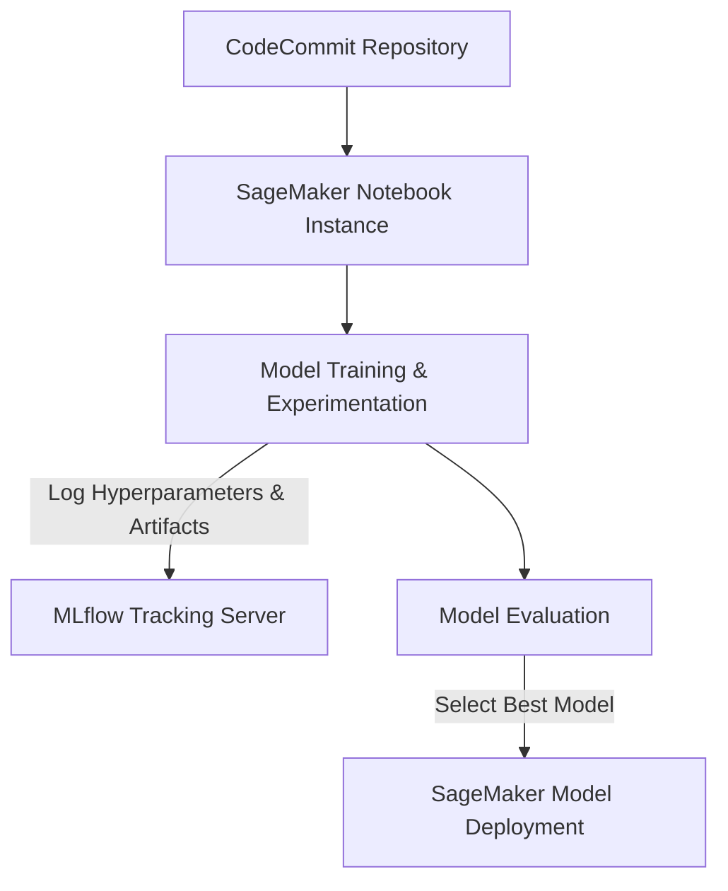
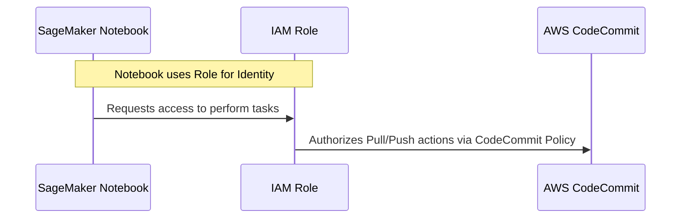
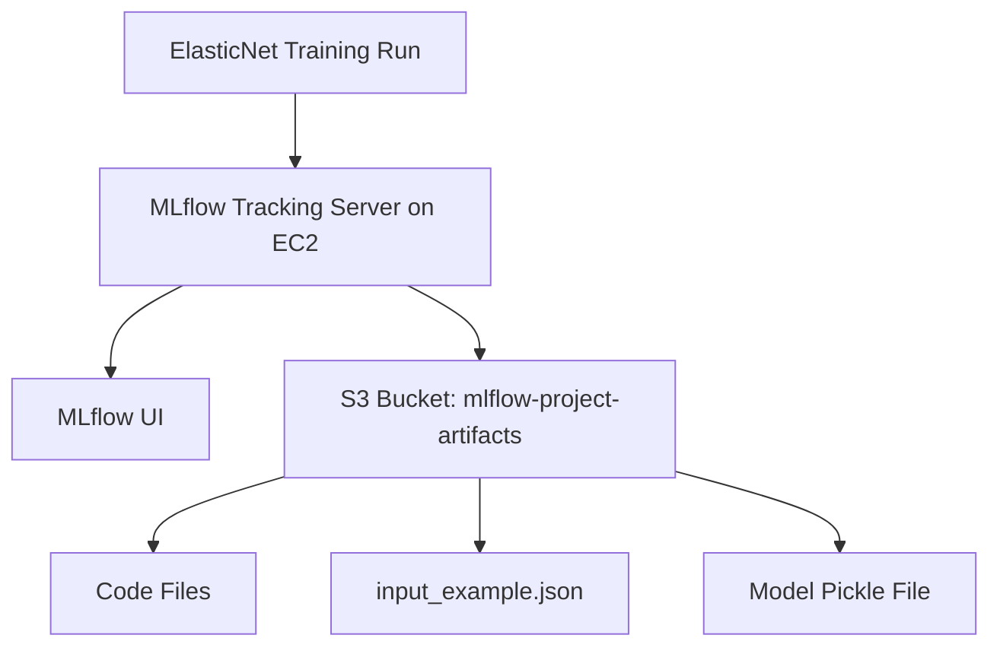
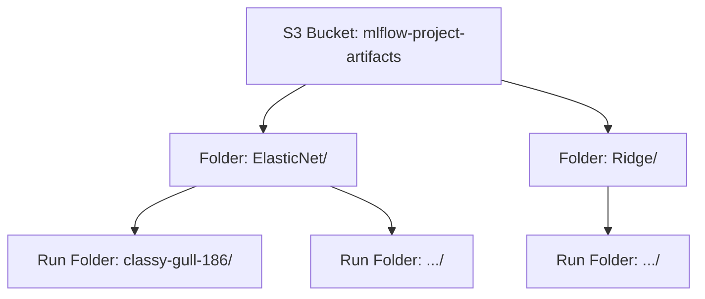
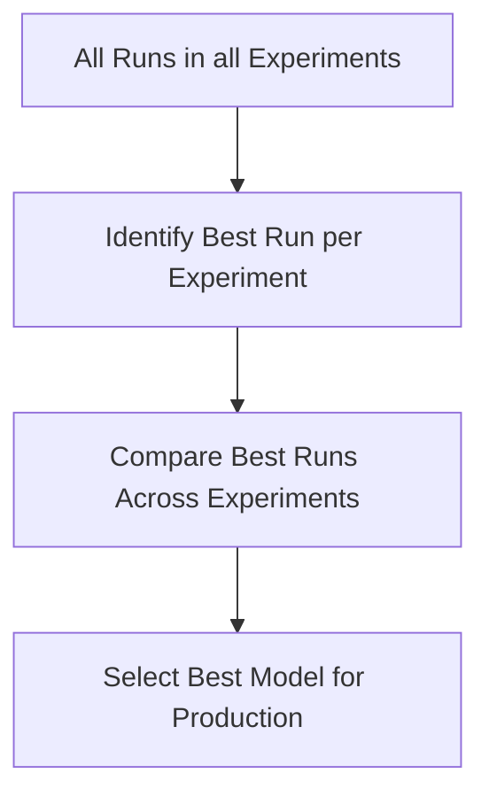
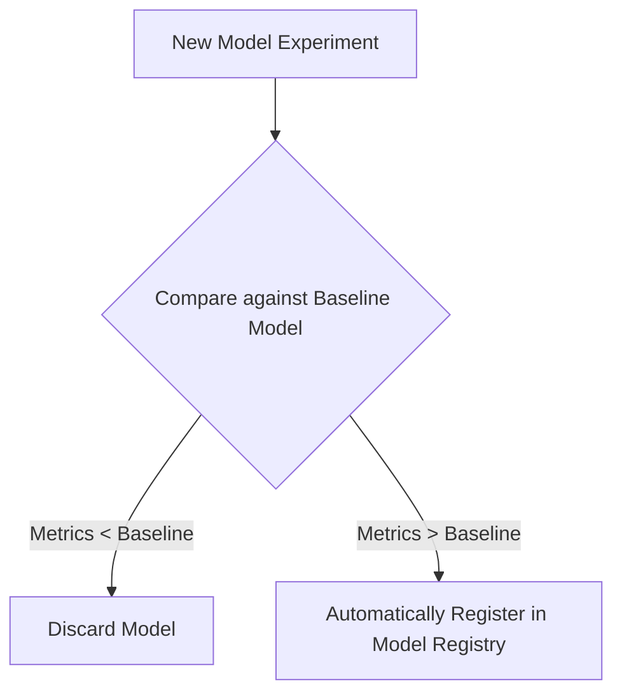

## MLflow and AWS SageMaker Integration

- Integrating MLflow's capabilities for experiment tracking and model packaging with AWS SageMaker's infrastructure
    - This allows for easy deployment of models tracked by MLflow directly into SageMaker

### Project Use Case

- House Price Prediction
    - A real-world data science regression problem

### MLOps Pipeline Architecture

- A subset of a full MLOps automation pipeline implemented on AWS cloud
- **Project Workflow**



- **Initial Step**: Creating a code repository in AWS CodeCommit to store project code
    - AWS CodeCommit is a native repository management service, though GitHub can also be used

### Local Development and Experimentation

- The process begins by cloning the repository to a local environment (e.g., using an IDE like PyCharm)
    - This mimics real-time project workflows where initial development happens locally
- Implementation steps include:
    - Writing code for data pre-processing
    - Running multiple experiments/runs with various algorithms and hyperparameters
- **[MLflow Integration]** The MLflow library is used throughout the training code to log essential data
    - One or two-liner commands are used to log parameters, metrics, and artifacts

### Transition to Cloud-Based MLOps

- Once code is ready and tested locally, it is pushed to AWS CodeCommit
- This enables experimentation and deployment directly within the AWS ecosystem
- **[Key Shift in Infrastructure]** Unlike previous local-only setups, the cloud workflow uses:
    - **AWS SageMaker**: Used for model training and experimentation with different models and hyperparameters
    - **Amazon EC2**: Used to host the MLflow Tracking Server
        - Instead of running the tracking server locally, an EC2 instance is spun up with MLflow installed to centralize the logging of parameters, metrics, and tags

### Model Comparison and Selection

- **[Data Storage]** The MLflow Tracking Server stores metadata (parameters, metrics, tags), while model artifacts are stored in an **AWS S3 bucket**
- **Model Selection Process**
    - After multiple experiments, the MLflow UI (Tracking Server) is used to compare models from different runs
    - The goal is to identify the best-performing model based on specific evaluation metrics

### Model Deployment and Inference

- Once the best model is selected, it is deployed using MLflow through a two-step process:

    1. **Build a Docker image** of the model code
    2. **Create a SageMaker endpoint** from that image

- **SageMaker Endpoint**: Acts as a serverless API running on SageMaker
- **Inference**: Once the endpoint is active, predictions can be made by running test scripts to verify the system is serving results correctly

### Complete MLOps Workflow Summary


### MLOps Implementation Setup

- The initial phase of the architecture consists of two primary setup tasks:
    - **Task 1**: Create an AWS CodeCommit repository for version control
    - **Task 2**: Launch an MLflow tracking server on an Amazon EC2 instance

### Prerequisites

- **AWS Account**: A functional AWS account is required to perform the setup tasks (CodeCommit and EC2/MLflow setup).

### AWS Security Best Practices

- **[Avoid Root User]** While the initial login is done with the root user (the account owner), it is highly recommended to create and work with \*\*IAM (Identity and Access Management) users
    - This allows you to assign specific roles and permissions to different users
    - It limits the potential impact of security breaches compared to using the root account for all development activities
- **Accessing Security Credentials**
    - From the AWS homepage, navigate to the profile dropdown in the top right corner
    - Select **Security credentials** to manage user access and permissions

### Creating a New IAM User

- Within the **Access management** section of the IAM dashboard, select **Users** and then **Create user**
- **User Configuration**
    - Provide a unique username
    - **Provide user access to the AWS Management Console**: Check this option to allow the user to log in via the web interface
    - **Password type**: Choosing a **Custom password** is recommended for controlled access
    - **[Tip]** You can uncheck the requirement to change the password on next sign-in to simplify the initial setup for testing purposes
- **Setting Permissions**
    - **[Principle of Least Privilege]** In an ideal environment, users should only be granted the minimum permissions necessary to perform their specific tasks
        - Providing extra permissions increases the account's vulnerability
        - Example: If a user only needs to manage EC2 and S3, only attach policies for those two services
    - **Permission Options**
        - **Add user to a group**: Recommends using groups to manage permissions by job function
        - **Copy permissions**: Allows copying permissions from an existing user or group
        - **Attach policies directly**: Attaches a managed policy directly to the specific user
    - **Implementation Choice**
        - For this project's simplicity, the `AdministratorAccess` policy is attached directly to the user, granting full access to all AWS services

### IAM User Permission Assignment

- If `AdministratorAccess` is not selected, you must manually attach the specific policies required for the user's intended tasks

### Finalizing IAM User Creation

- Once the user is created, download and save the credentials in a secure location
- **Signing In as an IAM User**
    - You can use the specific sign-in link provided by AWS after creation
    - Alternatively, use the generic AWS sign-in page
    - **[Crucial Distinction]** When using the generic page, select **IAM user** instead of the root user

### MLOps Implementation: CodeCommit Setup

- The first step in the implementation flow is creating a repository in AWS CodeCommit
- **Creating a Repository**
    - Search for **CodeCommit** in the AWS console
    - Select **Create repository**
    - Provide a unique **Repository name** (e.g., `mlflow-test-project`)

### MLOps Implementation: S3 Bucket Setup

- **Creating a Bucket**
    - Used to store project artifacts.
    - **Configuration Steps**:
        - **Region**: Select a region (e.g., `US East (N. Virginia)`).
        - **Bucket Name**: Must be a unique name within the global AWS namespace.
        - **Public Access Settings**:
            - To allow public access, uncheck the **Block all public access** option.
            - An acknowledgement must be checked to confirm the intention of allowing public access.



### MLOps Implementation: EC2 Setup for MLflow

- **Launching the Instance**
    - Navigate to the **EC2** service and select **Launch instance**
    - **Configuration Details**:
        - **Number of instances**: 1
        - **Instance type**: `t2.micro` (eligible for the Free Tier)
        - **Name**: `mlflow-server`
        - **OS (Amazon Machine Image)**: Ubuntu (chosen for familiarity, though others are available)
- **Security and Connectivity**
    - **Key pair**: Generate and download a key pair to allow connecting to the instance from a local terminal
    - **Security group**: Create a new security group and configure it to allow necessary traffic
- **Verification**
    - After launching, the instance will initially appear in a `pending` state before becoming active

### EC2 Instance Connection

- **Accessing the Instance**
    - Once the instance state is `Running`, select the instance and click **Connect**
- **Connection Options**
    - **EC2 Instance Connect**: Allows opening a terminal directly in the browser
        - Select **EC2 Instance Connect**
        - Click **Connect** to launch the terminal
    - **Local Connection**: Can be done from a local terminal using the previously downloaded key pair and the instance's public IP address
- **Instance Details for Connection**
    - **Public IPv4 address**: The address used to connect from outside the AWS network (e.g., `34.228.81.1`)
    - **Private IPv4 address**: The address used for communication within the VPC (e.g., `172.31.24.4`)

### MLflow Server Environment Setup

- **Initial Server Configuration**
    - The setup process is a one-time task performed once the instance is accessible
    - **Package Update**
        - Run `sudo apt update` to refresh the package list on the Ubuntu instance
    - **Python Installation**
        - The next step involves installing `python3-pip` to manage Python packages

### Python Environment Setup

- **Dependency Management Tools**
    - Install `pipenv` and `virtualenv` using the previously installed `pip`
    - **[Why?]** These tools help organize and maintain project-specific dependencies, ensuring a clean and isolated environment for MLflow
- **Project Directory and Installation**
    - Create a dedicated directory named `mlflow` and navigate into it
    - Install core dependencies using `pipenv`:
        - `mlflow`
        - `awscli`
        - `boto3`
        - `setuptools`
    - **[Why these extras?]** `awscli` and `boto3` are required for cloud storage integration (like S3) and general AWS functionality
- **Activating the Environment**
    - Run `pipenv shell` to activate the virtual environment created by pipenv

### AWS Configuration

- **Configuring AWS CLI**
    - Run `aws configure` to initiate the credential configuration process
    - This command prompts for the necessary AWS credentials to allow the EC2 instance to interact with other AWS services

### AWS Security Credentials Generation

- **[Why?]** To enable application code running on an EC2 instance to access AWS entities like S3 buckets
- **Generation Process**
    - Navigate to the **IAM** (Identity and Access Management) section in the AWS account
    - Locate the **Security credentials** tab
    - Scroll to the **Access keys** section
    - Select the option to create an access key that enables an application code running on EC2 to access your AWS account
- **Access Key Management**
    - **Access Key ID**: A unique identifier for the key pair
    - **Secret Access Key**: A sensitive string used for authentication
    - **[CRITICAL]** The Secret Access Key is only displayed once during creation
        - You must download, copy, and save it immediately
        - It cannot be retrieved later; if lost, a new access key must be created

### AWS CLI Configuration Completion

- **Finalizing Credentials**
    - Enter the **Access Key ID** and **Secret Access Key** when prompted
    - **Default Region**: Set to `us-east-1` and press enter
    - **Default Output Format**: Press enter to accept the default
- **[Result]** The EC2 instance is now fully configured with AWS credentials and ready to interact with AWS services like S3

### Launching the MLflow Tracking Server

- **Server Command Structure**
    - The tracking server is started using the `mlflow server` command with specific flags to define its storage and accessibility:

```bash
mlflow server --host 0.0.0.0 --backend-store-uri sqlite:///mlflow.db --default-artifact-root s3://<your-s3-bucket-name>
```

    - **Command Breakdown**:
        - `--host 0.0.0.0`: Makes the server accessible from external connections
        - `--backend-store-uri sqlite:///mlflow.db`: Uses a local SQLite database to store experiment metadata and parameters
        - `--default-artifact-root s3://<your-s3-bucket-name>`: Specifies the S3 bucket where all generated artifacts (like models, plots, and files) will be automatically stored

### Accessing the MLflow Server

- **Opening Network Traffic**
    - By default, the EC2 instance blocks external access to the MLflow server
    - To allow connection, you must modify the **Security Group** inbound rules
    - **Configuration Steps**:
        - Navigate to the **Security** tab of the EC2 instance
        - Open the active **Security Group**
        - Select **Edit inbound rules**
        - Add a new rule with the following settings:
            - **Type**: `Custom TCP`
            - **Port range**: `5000`
            - **Source**: `Anywhere IPv4` (`0.0.0.0/0`)
- **MLflow Tracking URI**
    - The URI is required in application code to direct logging to the remote server
    - **Format**: `[Public IPv4 DNS]:5000`
    - **Example**: `ec2-0c9594b83656419a.us-east-1.compute.amazonaws.com:5000`
    - **[Usage]** This URL must be set in your programs or during runtime to enable remote entity logging

### MLflow Server Status

- **Server Readiness**
    - The MLflow tracking server is now fully operational on the EC2 instance
    - It is configured to track experiments and individual runs
- **[Key Action] Connecting Applications**
    - To log data to this remote server, you must set the tracking URI in your code or runtime environment
    - **Required Format**: `[Public IPv4 DNS]:5000`
    - This ensures that all entities, parameters, and metrics are sent to the remote EC2 instance rather than a local instance.

### Cloning the Repository

- **Cloning via HTTPS**
    - To clone the repository to a local system, use the **HTTPS** option from the Clone URL dropdown
    - **[Requirement]** Before cloning, you must generate **HTTPS Git credentials** for AWS CodeCommit, as these are required for authentication during the cloning process
- **Generating Credentials**
    - Navigate to the **IAM** (Identity and Access Management) section
    - Switch to the **AWS CodeCommit credentials** tab
    - Use this section to create and manage the credentials needed for Git operations

### Managing HTTPS Git Credentials

- **[Crucial] Credential Security and Recovery**
    - When generating credentials, this is the **only time** you can view the password or download the credentials file
    - You cannot recover these credentials later if lost
    - **[Action]** Download and save the credentials in a safe, secure location immediately

### Cloning the Repository via Git Bash

- **Prerequisites**
    - Git software must be installed on your local system
- **Cloning Process**
    - Create a local directory where you want the project to reside
    - Open **Git Bash** in that directory (right-click and select "Git Bash Here")
    - Execute the clone command using the HTTPS URL from AWS CodeCommit:

```bash
git clone [HTTPS_CLONE_URL]
```

    - **[Authentication]** When prompted for credentials during the first run, provide the **HTTPS Git credentials** (username and password) generated in the IAM section

### Project Setup and Objective

- **Development Environment**
    - The project folder is opened in **PyCharm** to begin building the code from scratch
- **Project Goal**
    - Solve a **house price prediction regression problem**
    - **Technologies used**:
        - **STLN library** for modeling
        - **MLflow** for tracking capabilities

### Dataset Overview

- The project uses a dataset provided in two CSV files: `train.csv` and `test.csv`
- **Data Structure**
    - **`train.csv`**: Contains both features and labels
        - **Features**: House size, number of bedrooms, neighborhood, etc.
        - **Label**: Sale price of the house
    - **`test.csv`**: Contains only the features (used for making predictions)
- **[Organization]**
    - A `data` folder is created within the project directory to house these files

| Project Directory Structure |
| --- |
| project_folder/ |
| ├── data/ |
| │   ├── train.csv |
| │   └── test.csv |
| └── [project_code_files] |

### Real-World Data Sourcing vs. Project Setup

- **[Context]** While this project uses local CSV files for simplicity, real-world data management is more complex
    - Data may be fetched from multiple sources, such as:
        - Relational databases
        - Cloud storage
        - Various file formats
    - Mature projects often utilize dedicated **data pipelines** to automate these processes
- **Course Scope**
    - The focus is specifically on **MLflow integration with AWS**, rather than a holistic, end-to-end MLOps approach in AWS

### Initial Implementation Steps

- **Data Preparation**
    - The first stage of the machine learning workflow is preparing the data
- **[Action]** Creating the initial script for data handling:
    - File name: `data.py`

### Data Preparation Implementation

- **`data.py`&#32;Workflow**
    - Reads `train.csv` and `test.csv` to create prepared datasets for training, validation, and testing
    - **Data Cleaning & Transformation Steps**:

        1. **Split Data**: Divide the dataset into training and validation sets using `train_test_split`
        2. **Feature Separation**: Distinguish between numeric and non-numeric columns
        3. **Imputation**:

            - Use `KNNImputer` to fill missing values in numeric columns
            - Use the **mode** to fill missing values in categorical columns

        1. **Encoding**: Apply **OneHotEncoder** to handle categorical data

```python
import pandas as pd
import numpy as np
from sklearn.impute import KNNImputer
from sklearn.model_selection import train_test_split
from sklearn.preprocessing import OneHotEncoder

# Reading data
train = pd.read_csv("data/train.csv")
test = pd.read_csv("data/test.csv")

# Define features and target variable
X_train = train.drop("salePrice", axis=1)
y_train = train["salePrice"]
X_test = test.drop("salePrice", axis=1)
y_test = test["salePrice"]

# Split the data into training and validation sets
X_train, X_val, y_train, y_val = train_test_split(X_train, y_train, test_size=0.2, random_state=42)

imputer = KNNImputer()

# Separate numeric and non-numeric columns
numeric_cols = X_train.select_dtypes(include="float64").columns
non_numeric_cols = X_train.select_dtypes(exclude="float64").columns

# Impute missing values for numeric columns using KNNImputer
imputer.fit_transform(X_train[numeric_cols])
X_train[numeric_cols] = imputer.transform(X_train[numeric_cols])
X_val[numeric_cols] = imputer.transform(X_val[numeric_cols])
test[numeric_cols] = imputer.transform(test[numeric_cols])

# Impute missing values for non-numeric columns with the mode
for column in non_numeric_cols:
    X_train[column] = X_train[column].fillna(X_train[column].mode()[0])
    X_val[column] = X_val[column].fillna(X_val[column].mode()[0])
    test[column] = test[column].fillna(test[column].mode()[0])

# One-hot encoding
ohe = OneHotEncoder(drop='first', sparse_output=False)
X_train = ohe.fit_transform(X_train)
X_val = ohe.transform(X_val)
test = ohe.transform(test)
```

### Model Training Setup (`train.py`)

- Initializing a new script for model training and experiment tracking
- **Key Imports**:
    - `mlflow`: To enable tracking and workflow management capabilities
    - `numpy`: For numerical operations
    - Pre-processed datasets: `X_train`, `X_val`, `y_train`, `y_val`
    - Machine Learning algorithms and tools:
        - `Ridge`, `ElasticNet` (from `sklearn.linear_model`)
        - `XGBRegressor` (from `xgboost`)
        - `ParameterGrid` (from `sklearn.model_selection`)
- **[The Model Selection Strategy]** Because real-world data science requires experimentation, we don't just pick one model; we test a list of models and their hyperparameters
    - **The Trade-off**: We seek a balance between performance and complexity
    - **Avoid extremes**:
        - Too simple: Poor predictive performance
        - Too complex: Excessive training/inference time and risk of overfitting
    - **Goal**: Find the "sweet spot" where performance is high without compromising computational efficiency

```python
import mlflow
import numpy as np
from data import X_train, X_val, y_train, y_val
from sklearn.linear_model import Ridge, ElasticNet
from xgboost import XGBRegressor
from sklearn.model_selection import ParameterGrid
from params import ridge_params, elasticnet_params, xgb_params, svr_grid

# Loop through the hyperparameter combinations and log results in separate runs
for params in ParameterGrid(elasticnet_params, xgb_params, svr_grid):
    with mlflow.start_run():

# tr = ElasticNet(**params)

# tr.fit(X_train, y_train)

# y_pred = tr.predict(X_val)

# metrics = eval_metrics(y_val, y_pred)

# logging the inputs such as dataset

# mlflow.log_input(mlflow.data.from_numpy(X_train.toarray()), context="training dataset")

# mlflow.log_input(mlflow.data.from_numpy(X_val.toarray()), context="validation dataset")
```

### Model Selection and Hyperparameter Tuning

- **Target Models** for this regression use case:
    - `ElasticNet`
    - `Ridge`
    - `XGBRegressor` (XGBoost)
- **[The Challenge of Manual Tuning]** Manually testing every possible hyperparameter combination is too tedious and inefficient for real-world data science
- **Automated Exploration with&#32;`ParameterGrid`**:
    - Provided by `sklearn.model_selection`
    - Systematically explores the hyperparameter space to find the optimal combination for model performance
    - **[Benefit]** Simplifies the process by removing the need to write complex, nested loops to iterate through settings manually
- **Requirement**: To use `ParameterGrid`, you must first define a dictionary containing the hyperparameters you wish to test.

### Organizing Experimentation

- **`params.py`**: A dedicated file used to store dictionaries of hyperparameters for each algorithm
    - The keys are the hyperparameter names
    - The values are lists of different settings to be tested
- **`utils.py`**: A separate utility file used to store helper functions, such as evaluation metrics

### Hyperparameter Configuration Example

In `params.py`, dictionaries are defined for each model to be tested:

```python
ridge_params_grid = {
    'alpha': [0.1, 1, 10],
    'fit_intercept': [True, False]
}

elasticnet_params_grid = {
    'alpha': [0.1, 1, 10],
    'l1_ratio': [0.2, 0.5, 0.8],
    'fit_intercept': [True, False]
}

xgb_params_grid = {
    'n_estimators': [100, 200, 300],
    'learning_rate': [0.01, 0.1, 0.3],
    'max_depth': [3, 5, 7],
    'min_child_weight': [1, 3],
    'subsample': [0.6, 0.8, 1.0],
    'colsample_bytree': [0.6, 0.8, 1.0],
    'gamma': [0, 0.1, 0.2],
    'reg_alpha': [0, 0.1, 1],
    'reg_lambda': [0, 0.1, 1]
}
```

### Automated Training Loop with MLflow

- The training script uses a `for` loop to iterate through the combinations generated by `ParameterGrid`
- Each combination is wrapped in an `mlflow.start_run()` context to track parameters and metrics separately

```python

# Loop through the hyperparameter combinations and log results in separate runs
for params in ParameterGrid(elasticnet_params_grid):
    with mlflow.start_run():
        tr = ElasticNet(**params)
        tr.fit(X_train, y_train)
        y_pred = tr.predict(X_val)
        metrics = eval_metrics(y_val, y_pred)

# logging the inputs such as dataset
        mlflow.log_input(mlflow.data.from_numpy(X_train.toarray()), context="training dataset")
        mlflow.log_input(mlflow.data.from_numpy(X_val.toarray()), context="validation dataset")
```

### Implementation of the Training Loop

- The loop iterates through each parameter combination in the grid, starting a new MLflow run for every iteration
- Inside the `mlflow.start_run()` context, the following steps are performed:
    - Instantiate the model with the current set of parameters
    - Train the model on the training data
    - Generate predictions on the validation set
    - Calculate evaluation metrics
    - Log the training and validation datasets as inputs
    - Log the hyperparameters used for that specific run

```python

# Loop through the hyperparameter combinations and log results in separate runs
for params in ParameterGrid(elasticnet_params_grid):
    with mlflow.start_run():
        tr = ElasticNet(**params)
        tr.fit(X_train, y_train)
        y_pred = tr.predict(X_val)
        metrics = eval_metrics(y_val, y_pred)

# logging the inputs such as dataset
        mlflow.log_input(mlflow.data.from_numpy(X_train.toarray()), context="training dataset")
        mlflow.log_input(mlflow.data.from_numpy(X_val.toarray()), context="validation dataset")

# logging hyperparameters
        mlflow.log_params(params)
```

### Evaluation and Final MLflow Logging

- A custom `eval_metrics` function is used to calculate key performance indicators
    - This function is defined in a separate `utils.py` file to keep the training script clean
    - It returns a dictionary containing:
        - Mean Squared Error (MSE)
        - Mean Absolute Percentage Error (MAPE)
        - $R^2$ score

```python

# utils.py
import numpy as np
from sklearn.metrics import mean_squared_error, mean_absolute_percentage_error, r2_score

def eval_metrics(y_true, y_pred):
    metrics = {
        "MSE": mean_squared_error(y_true, y_pred),
        "MAPE": mean_absolute_percentage_error(y_true, y_pred),
        "R2": r2_score(y_true, y_pred)
    }
    return metrics
```

- After calculating metrics, the script performs comprehensive logging to MLflow to ensure the entire experiment state is captured
- The following components are logged within the `mlflow.start_run()` context:
        - **Datasets**: Both training and validation datasets are logged as inputs
        - **Hyperparameters**: The specific parameter combination used for the run is logged via `mlflow.log_params(params)`
        - **Metrics**: The evaluation results are logged via `mlflow.log_metrics(metrics)`
        - **Model**: The trained model object is saved using `mlflow.sklearn.log_model`
        - **Metadata/Context**: Additional context such as input examples and the training code itself are logged to facilitate debugging and reproducibility

```python

# logging metrics
mlflow.log_metrics(metrics)

# log the trained model
mlflow.sklearn.log_model(
    sk_model=tr,
    artifact_path="model",
    input_example=X_train.toarray(),
    registered_model_name="ElasticNet"
)
```

### MLflow Experiment Configuration Details

- **Tracking URI and Experiment Naming**:
    - Note that in this specific implementation, a tracking URI or a specific experiment name was not explicitly set (unlike in previous examples).
    - This means the run will default to the local MLflow tracking URI and the default experiment if not otherwise configured.

### Runtime Configuration and MLflow Projects

- **[Best Practice]** Keep training scripts as generic as possible
    - Avoid hardcoding dynamic details like:
        - Experiment names
        - Run names
        - Tracking URIs
    - These values change frequently, so they should be set at runtime
- **Running via MLflow Projects**
    - Use the `mlflow.projects.run` function to pass dynamic configurations
    - This function allows you to specify:
        - The `experiment_name`
        - The `tracking_uri`
        - The `entry_point` (the specific part of the project to execute)
- It is standard practice in real-time MLflow projects to execute the entry points defined in an `mlproject` file using a run function.

### MLflow Project File Structure

- The project is defined within an `mlproject` file
    - The filename must be exactly `mlproject` with no file extension
- **Key Configuration Fields**:
    - `name`: Sets the name of the project
    - `conda_env`: Specifies the environment to be used for the project
        - The value for this field points to a `conda.ml` file
- **Environment Setup**
    - A `conda.ml` file is used to define the environment requirements
    - This file can be created by exporting an existing conda environment using the `conda env export` command

### MLflow Project Configuration Caveats

- **Conda Environment Path**
    - While it is technically possible to provide the path of an exported conda file to the `conda_env` field, this approach does not work in practice.

### Creating Generic Conda Environments

- **[Problem]** Using a direct export of a local Conda environment can cause failures on other systems (like AWS SageMaker)
    - Exported files may contain packages that are native only to the local environment
    - Library versions might differ or be entirely absent on the target system
- **[Solution]** Create a generic and system-independent Conda file
    - Use the exported file as a reference to build a cleaner version
    - This ensures the project can run consistently across different environments (e.g., local testing $\rightarrow$ AWS SageMaker)
- **[Best Practice]** Preparing the environment before export
    - Ensure all required libraries are installed in the current environment *before* exporting/creating the generic file
    - If a library like `xgboost` is needed, run `pip install xgboost` first so the dependency is captured
    - Alternatively, dependencies can be added manually to the `conda.ml` file

```yaml
channels:
  - defaults
dependencies:
  - python=3.10
  - pip:
    - xgboost
    - scikit-learn
    - pandas

# ... other dependencies
```

### MLflow Project Entry Points

- **`entry_points`**: Defines the commands that can be run for the project
    - This project uses a single entry point consisting of a Python command

### MLflow Project Entry Point Details

- **Entry Point Configuration**
    - The entry point is given the name `Training`
    - The command associated with this entry point is `python train.py`

```yaml
name: "Housing price prediction"
conda_env: conda.yaml
entry_points:
  Training:
    command: "python train.py"
```

### Running an MLflow Project

There are two main methods to execute a project:

1. **CLI (Command Line Interface)**: Using the `mlflow run` command.
2. **Python API**: Using Python code to trigger the run

    - This method is often preferred for better integration with other Python workflows
    - Can be implemented by creating a dedicated script, such as `run.py`

### Running an MLflow Project via Python API

To execute a project using the Python API, a dedicated script (e.g., `run.py`) can be created to manage the run parameters programmatically.

- **Setup Requirements**
    - Import the `mlflow` library
    - Define variables for the `experiment_name` and the specific `entry_point` to be executed
- **Configuring the Tracking URI**
    - Use `mlflow.set_tracking_uri()` to direct where logs and artifacts are stored
    - **[Local vs. Remote]** Initially, set this to a local URI (e.g., `http://127.0.0.1:5000`) for testing. This can later be updated to a remote service like SageMaker.
- **Executing the Project**
    - Use the `mlflow.projects.run()` function to trigger the execution
    - **Required Parameters**:
        - `uri`: The path to the MLflow project
        - `entry_point`: The name of the entry point defined in the `mlproject` file
        - `experiment_name`: The name of the experiment to log results to
        - `conda_env`: The environment manager to use (e.g., `"conda"`)

```python
import mlflow

experiment_name = "Elasticset"
entry_point = "Training"

mlflow.set_tracking_uri("http://127.0.0.1:5000")

mlflow.projects.run(
    uri=".",
    entry_point=entry_point,
    experiment_name=experiment_name,
    conda_env="conda"
)
```

> **Note:** When first developing the script, running it locally serves as a "dummy run" to verify the code logic before deploying the actual training to AWS.

### Executing the Project Locally

- **Local Execution Steps**
    - Activate the appropriate Conda environment
    - Start the MLflow server using the previously learned command
    - Run the project script via the terminal

```bash
python run.py
```

> **Note:** This execution uses the parameters defined in `run.py` to trigger the training process.

### Observations During Project Execution

- **Execution Time**
    - Training may take a significant amount of time
    - This is because multiple models are often trained based on values provided in a hyperparameters dictionary
- **Potential Warnings**
    - You may encounter warnings regarding "setup tool libraries" during the project run
    - These are generally expected during the environment setup phase of the execution

### Verifying Results in MLflow Tracking Server

- **Experiment Organization**
    - Upon successful execution of a project (e.g., using the ElasticNet algorithm), MLflow automatically creates an experiment named after the algorithm.
    - Within that experiment, multiple runs are generated, each corresponding to a unique hyperparameter combination produced by a parameter grid.
- **MLflow UI Overview**
    - The tracking server displays the experiment name (e.g., `ElasticNet`) and a list of all associated runs.
    - **[Run Details]** Opening a specific run reveals the following logged components:
        - Training and validation datasets
        - Parameters (the specific hyperparameter values used)
        - Metrics (the resulting performance scores)
        - Artifacts (additional files produced during the run)



### Transitioning to AWS Cloud

- **Project Goal**
    - While additional experiments (like XGBoost) could be created locally, the ultimate objective is to perform all experimentation, model training, logging, and deployment on the AWS Cloud.
    - This necessitates pushing the local code to a remote AWS CodeCommit repository.

### Pushing Code to Remote Repository

- **Git Workflow**
    - **1. Stage Changes**: Use `git add .` to stage all modified or untracked files in the repository.
    - **2. Commit Changes**: Use `git commit -m "<message>"` to save the staged changes locally.
        - If it is the first time using Git, you may be prompted to configure your username and email.
    - **3. Push to Remote**: Use `git push` to send the local commits to the remote repository (e.g., AWS CodeCommit).
        - If prompted, provide the credentials (username and password) generated via HTTPS Git credentials.

```bash
git add .
git commit -m "add code"
git push
```

### AWS CodeCommit Integration

- **Code Deployment to AWS**
    - After local experimentation and committing code, the project is pushed to a remote AWS CodeCommit repository
    - This transition is necessary to move from local execution to the ultimate goal: performing experimentation, model training, logging, and deployment on the AWS Cloud
- **Verification of Push**
    - The AWS CodeCommit console can be refreshed to confirm the presence of the pushed files within the repository (e.g., the `housing-price` repository)

### AWS SageMaker

- A comprehensive, one-stop platform designed to accelerate the machine learning journey on AWS
- **Core Capabilities**
    - **Data Preparation & Training**: Helps prepare data and experiment with various algorithms
    - **Algorithm Options**: Provides a variety of built-in algorithms or allows for the creation of custom ones
    - **Model Deployment**: Offers managed services for scalable, fault-tolerant deployments and real-time inferencing
    - **Model Monitoring**: Provides real-time insights to ensure accuracy through anomaly detection and drift analysis



### AWS SageMaker Integrations

- SageMaker is designed to work seamlessly with other AWS services to support the ML lifecycle
    - **S3 (Simple Storage Service)**: Used for data storage
    - **IAM (Identity and Access Management)**: Used for managing security and permissions
    - **CloudWatch**: Used for monitoring performance and logs

### SageMaker and MLflow Integration Workflow

- **Objective**: To combine SageMaker's computational power with MLflow's tracking capabilities to create a robust MLOps ecosystem.
- **The Proposed Workflow**
    - **Code & Experimentation**: Use a SageMaker notebook instance linked to an AWS CodeCommit repository to write and run code.
    - **Experiment Tracking**: During training, log all hyperparameters and model artifacts to an MLflow tracking server.
    - **Evaluation**: Compare the evaluation metrics of the resulting models.
    - **Deployment**: Deploy the best-performing model using SageMaker services.



### Linking CodeCommit to SageMaker

- **Process**: Connect an existing AWS CodeCommit repository to the SageMaker Git repository list
    - Navigate to the **Notebook** section in SageMaker
    - Select **Git repositories**
    - Click **Add repository**
    - Choose **Add AWS CodeCommit**
- **Configuration Details**:
    - **Repository name**: The name of the existing repository (e.g., `housing-price`)
    - **Branch**: The specific branch to use (e.g., `master`)
    - **Amazon SageMaker repository name**: Should match the CodeCommit repository name for consistency

### Creating a SageMaker Notebook Instance

- **Objective**: Set up a managed notebook environment for development
- **Instance Selection**:
    - **Instance Type**: Choosing a larger instance (e.g., `p3.large`) is recommended to prevent the environment from being slow or causing code to fail during intensive tasks
    - **Default Settings**: Other fields can typically be left at their default values during initial setup

### Configuring IAM Role for SageMaker Notebook

- **Requirement**: The notebook instance must be assigned an IAM role that grants permissions to both SageMaker and AWS CodeCommit
    - This allows the notebook to perform operations like pulling and pushing code to the repository
- **Role Creation Process**
        - Navigate to the **IAM** service in the AWS console
        - Select **Roles** from the left panel and click **Create role**
        - **Select trusted entity**: Choose **AWS service**
        - **Use case**: Search for and select **SageMaker** (this provides the necessary SageMaker execution abilities)
        - **Naming**: Assign a descriptive name to the role (e.g., `house-price-role`)
- **Attaching Additional Permissions**
        - By default, the SageMaker role only has `AmazonSageMakerFullAccess`
        - To enable repository interaction, you must manually attach the CodeCommit policy
        - **Steps**:
                - Open the newly created role
                - Click **Add permissions** $\rightarrow$ **Attach policies**
                - Search for `AWSCodeCommitFullAccess`
                - Select the policy and click **Add permissions**



### Finalizing SageMaker Notebook IAM Role

- **Additional Permissions Required**:
    - **S3 Full Access**: Necessary because the notebook code will push artifacts (like trained models) to an S3 bucket
    - **AmazonEC2ContainerRegistryFullAccess**: Required to push Docker images of the code to the Amazon Elastic Container Registry (ECR)
- **Summary of Attached Policies for&#32;`house-price-role`**:
    - `AmazonSageMakerFullAccess`
    - `AmazonS3FullAccess`
    - `AWSCodeCommitFullAccess`
    - `AmazonEC2ContainerRegistryFullAccess` (or `EC2ContainerRegistryImageBuilderPolicy`)

### Completing Notebook Instance Creation

- **Configuration Steps**:
    - **IAM Role**: Select the newly created `house-price-role` and ensure it is enabled
    - **Git Repository**: In the Git repository section, select the default repository (e.g., `housing-price`) to link the notebook to the CodeCommit repo
    - **Validation**: AWS will verify that the selected IAM role has the necessary `pull` and `push` permissions for the chosen repository
- **Deployment**:
    - Click **Create notebook instance**
    - The instance status will initially show as `Pending` while AWS provisions the hardware and environment

### Accessing the SageMaker Notebook Environment

- **Instance Status**: After creation, the notebook instance moves through a `Pending` state before reaching `InService` status
- **Launching the Environment**:
    - Once `InService`, select the instance and click **Open JupyterLab**
- **Repository Access**:
    - Upon launching, the cloned Git repository (e.g., `housing-price`) is immediately available in the file browser
    - The existing folder structure from the repository is preserved, enabling direct experimentation on the instance

### Running ElasticNet Experiments with MLflow

- **Configuring the MLflow Tracking Server**
    - To track experiments from the notebook, the `mlflow` tracking URI must be updated to point to the MLflow instance running on EC2
    - The URI follows the format: `http://<public_ipv4_dns>:<port>`
- **Executing the Experiment via Terminal**
    - **Installing MLflow**: The `mlflow` library must be installed via the notebook terminal
        - **[Note]** This installation is only to enable the execution of the `run.py` orchestration script; it does not include all heavy dependencies required for actual model training
        - The actual training environment is managed automatically by MLflow using a `conda.yaml` file
    - **Triggering the Run**: Once the library is installed, the experiment is started by running the orchestration script:

```bash
python run.py
```

    - **Expected Outcome**: Running this script triggers the training of models (e.g., using the ElasticNet algorithm) on SageMaker

```python
import mlflow

experiment_name = "elasticnet"
mlflow_uri = "http://52.36.120.41:5000"
mlflow.set_tracking_uri(mlflow_uri)
mlflow.set_experiment(experiment_name)
```

### Reviewing Experiment Results in MLflow

- **Logged Components**: During the ElasticNet run, the following are automatically recorded to the MLflow tracking server on EC2:
    - Hyperparameters
    - Metrics
    - Artifacts
- **Training Time**: The duration of the training process depends on the chosen instance type
    - For a `t3.large` instance, training took approximately 4 to 5 minutes

### MLflow UI Observations

- **Experiment Details**: Within the MLflow UI, a specific run (e.g., `classy-gull-186`) displays organized sections for:
    - **Datasets**: Logs both the training and validation datasets
    - **Parameters**: Records the specific hyperparameters used
    - **Metrics**: Logs the performance results
    - **Tags**: Metadata associated with the run (none provided in this instance)
    - **Artifacts**: Files generated or used during the run
- **Artifact Storage and Contents**
    - **Storage Location**: Artifacts are stored in an S3 bucket defined during the MLflow server setup (e.g., `mlflow-project-artifacts`)
    - **Logged Artifacts**: The `log_module` function captures four key items:

        1. Code files
        2. `input_example.json`
        3. The model's `.pkl` (pickle) file



### Managing Multiple Experiments

- To train a different algorithm, such as Ridge regression, the existing training script must be modified
    - In `train.py`, update the model name and the save name to `Ridge`
    - In `run.py`, update the `experiment_name` to `Ridge` to ensure better management and separation in the MLflow UI
- **[Workflow]** After updating the scripts, re-run the orchestration script:

```bash
python run.py
```

- Once complete, the new experiment (e.g., `Ridge`) will appear as a separate entry in the MLflow UI with its own set of runs

### Artifact Organization in S3

- Artifacts are stored in a hierarchical structure within the S3 bucket
    - Each individual run has its own dedicated folder within the project directory
    - This ensures that code, configuration files, and model files for different runs do not overwrite each other



### Running XGBoost Experiments

- To implement XGBoost, the existing training and orchestration scripts must be updated
    - In `train.py`, update the parameter grid and model name:

```python

# Inside train.py
param_grid = xgb_param_grid
model_name = "XGB"
save_name = "XGB"
```

    - In `run.py`, update the `experiment_name` to ensure it is categorized separately in the MLflow UI:

```python

# Inside run.py
experiment_name = "XGB"
```

- **[Note]** XGBoost training may take longer than previous algorithms like ElasticNet or Ridge due to its complexity

### Scaling MLOps Maturity

- Manual experimentation (changing scripts for each algorithm) is a starting point, but can be automated
- **[Automation]** Instead of manual edits, one can write Python code to programmatically create various experiments with different algorithms and hyperparameter combinations in a single execution
- This progression toward automated, programmatic experiment management is a key way to increase maturity levels in MLOps

### Transition to Model Comparison

- **Experimentation Summary**: The experimentation phase in SageMaker is complete
    - Multiple models have been produced via different runs
    - Each run utilized different hyperparameters
    - All results are logged and accessible in the MLflow tracking server
- **Next Step: Model Selection**
    - The goal is to compare the results from the various experiments
    - This comparison is necessary to determine which model is the best candidate to deploy to production

### Evaluating and Comparing Model Runs

- **[Selection Strategy]** Because comparing every single run across all experiments can be overwhelming, a common approach is to:
    - Identify the single best run within each individual experiment (e.g., the best run in Ridge, the best in ElasticNet, etc.)
    - Compare only these top-performing runs against each other to find the overall winner
- **Using the MLflow Comparison Tool**
    - Within an experiment (such as 'Ridge'), multiple runs can be selected using the checkboxes in the run list
    - Clicking the **Compare** button opens a dedicated comparison panel
    - This panel provides visualizations, such as a **Parallel Coordinates Plot**, to help visualize how different parameters relate to metrics across the selected runs



### Visualizing and Quantifying Model Run Comparisons

- **[Visual Analysis]** The comparison panel provides several plotting options to slice and dice results from various axes and gain insights:
    - Parallel Coordinate Plots
    - Scatter Plots
    - Box Plots
    - Contour Plots
- **Using the Metrics Matrix**
    - For a precise numerical comparison, the **Metrics** section provides a table of all run metrics for the selected runs
    - This allows for direct identification of the best performing run based on specific values
    - **Example Evaluation**:
        - **R2 score**: Higher is better (e.g., 0.837)
        - **MAPE (Mean Absolute Percentage Error)**: Lower is better (e.g., 0.144)
        - **RMSE (Root Mean Square Error)**: Represents the square root of the mean of the squared differences between original house prices and predicted prices; lower is better (e.g., 35384)

| Metric | Run 1 | Run 2 | Run 3 | Run 4 | Run 5 | Run 6 |
| --- | --- | --- | --- | --- | --- | --- |
| MAPE | 0.142 | 0.141 | 0.144 | 0.144 | 0.145 | 0.146 |
| R2 | 0.829 | 0.833 | 0.835 | 0.832 | 0.835 | 0.836 |
| RMSE | 35204.4 | 35797.4 | 35590.8 | 35384.3 | 35573.8 | 35470.4 |

### Hyperparameter Inspection

- The interpretation of metric scales (like RMSE) is context-dependent and depends on the scale of the data being used
- **[Identifying Run Details]** By looking at the parameters section of a specific run, we can identify the specific hyperparameter settings used:
    - **alpha**: 1.0
    - **fit\_intercept**: True

### Registering Models

- Once the best run within an experiment is identified, it can be registered in the **Model Registry**
    - This allows for version control and centralized management of models
    - Registering multiple best models from different experiments into the same registry enables later comparisons (e.g., a "best collection")

### MLflow Model Registry: From Stages to Aliases

- MLflow has updated its UI and management concepts, moving away from the legacy "Stage" system
- **[The Change]** The rigid concept of Stages has been replaced by a more generic and flexible **Alias** concept

| Feature | Legacy Stages | Model Aliases |
| --- | --- | --- |
| Flexibility | Limited to predefined tags | Allows for custom, user-defined names |
| Available Options | Staging, Production, Archive | Any descriptive name (e.g., @Champion, @Challenger) |
| Primary Use | Basic lifecycle tracking | Flexible model deployment and management |

- **Model Aliases**
        - An alias is a custom name assigned to a particular version of a registered model
        - **[Why use them?]** They provide significantly more flexibility for deployment workflows
        - For example, you can assign a specific alias like `production` to a model version to indicate it is ready for live traffic, but you are not restricted to the three original stages.

### Registering Multiple Models for Comparison

- **[The Strategy]** Instead of registering models in isolation, you can register the best models from different experiments into the same registry
    - This creates a "best collection" that enables direct comparison between different modeling approaches later on

### Evaluating ElasticNet Experiment Results

- **[Identifying the Best Run]** By reviewing the metrics and parameters of the ElasticNet runs, a specific optimal configuration was identified:
        - **Metrics**:
                - **R2**: 0.823
                - **MAPE**: 0.143
                - **RMSE**: (visible in comparison table)
        - **Parameters**:
                - **alpha**: 0.1
                - **fit\_intercept**: True
                - **L1 ratio**: 0.8
- Once these optimal results are confirmed, the model can be registered under the same registry as the previous models for centralized management.

### Completing the Best Collection

- The registration process is applied to the remaining experiments to build a comprehensive collection for comparison:
    - **ElasticNet**: Registered with alias `staging 1`
    - **XGBoost**:
        - Evaluated using the comparison matrix
        - Identified the best run with an **R2 score of 0.875**
        - Registered as part of the collection

### Automating the Model Registry

- **[The Workflow]** The manual UI process serves as a starting point for human decision-making, but it can be integrated into the code
    - **Initial Phase**: Perform manual experiments and comparisons in the UI to decide on a baseline model
    - **Automated Phase**: Use programmatic logic to handle registration
        - Utilize **baseline models** and **validation thresholds** within the training code to automatically trigger registration when performance criteria are met

### Programmatic Model Validation

- **[The Baseline Approach]** A registered model can serve as a reference point for all future experiments
    - New models are validated against this baseline within the training code
- **[Automated Registration Logic]** Using the validation threshold in the `mlflow.evaluate` method, registration can be automated:
    - **Condition 1**: If the new model's metrics are worse than the baseline $\rightarrow$ Do not register
    - **Condition 2**: If the new model's metrics are better than the baseline $\rightarrow$ Automatically register

### Comparing Model Versions in the Registry

- The new MLflow Model Registry UI allows for direct comparison between multiple registered versions
- By selecting multiple versions and hitting "Compare", a matrix comparison view is generated
- **Comparison Matrix View Components**:
    - **Run Details**: Metadata for the selected runs
    - **Parameter Comparisons**: A side-by-side look at hyperparameters (e.g., `alpha`, `fit_intercept`, `L1 ratio`)
    - **Metrics Matrix**: A comparison of performance values (e.g., `R2`, `MAPE`, `RMSE`)

