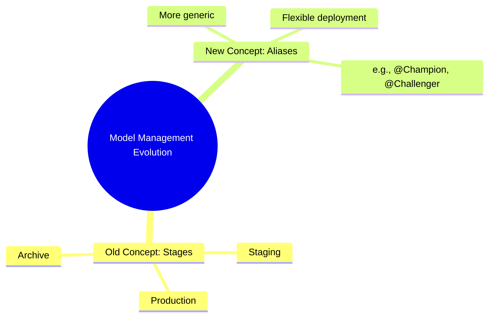

### MLflow Components Recap

- **MLflow Tracking**
    - Used to track experiments and runs
    - Records models, hyperparameters, and other files like ML code and training data
    - Provides a UI to compare and evaluate run outputs to find the best model
- **MLflow Models**
    - Provides a standard unit for packaging models so they can be deployed anywhere
    - Models are saved as distinct "flavors"
        - Supports common libraries
        - Allows for custom Python models or custom flavors for specific payload needs
- **The Workflow Progression**
    - 1. Perform experimentation and log models with specific flavors
    - 2. Log metadata (input data, hyperparameters) alongside the model
    - 3. Evaluate models from different runs to find the best fit
    - 4. Package the selected model
    - 5. Register the model (next step)

### MLflow Model Registry

- The next phase involves registering the packaged model to manage it centrally.

### Model Registry

- A centralized model store, set of APIs, and UI used to collaboratively manage the full lifecycle of an MLflow model
- Acts as a model management "command center" to organize, version, and control models
- **Key Capabilities**
    - **Centralized Model Repository**
        - Provides a single, secure location for storing and organizing models
        - Keeps track of model artifacts, metadata, training code, and data
    - **Model Versioning**
        - Brings software development versioning concepts to machine learning
        - Each new model or significant change can be registered as a new version
        - Allows for easy switching between different versions for evaluation or deployment
    - **Deployment Workflow**
        - Simplifies complex production deployments through a structured workflow
        - Enables management of different lifecycle stages:
            - Development
            - Staging
            - Production

### Model Registry Capabilities

- **Transition to Production**
    - Streamlines the move from experimentation to production
    - Allows transitioning a model from a staging environment to a production environment
    - Includes clear approval processes and auditing to ensure only well-tested models go live
- **Model Lineage and Audit Trails**
    - Essential for regulatory compliance and troubleshooting
    - Keeps track of the entire lineage of each model version
    - Tracks key details:
        - Who trained the model
        - When it was trained
        - All changes made to it over time
- **Summary**
    - Simplifies model management, version control, and deployment
    - Ensures collaboration and proper access controls
    - Acts like "Git" for machine learning models, managing the full lifecycle

### Registering Models in MLflow

- Models can be registered using either the **MLflow UI** or the **MLflow API**
- **Prerequisites for Model Registry**
    - **Database Backend Store**: An MLflow server must be running with a database backend
        - The registry requires a database to store centralized metadata
        - Metadata includes: model name, location, and input/output examples
    - **Logged Models**: A model must first be logged using the `log_model` methods of its corresponding framework (e.g., Scikit-learn, TensorFlow) before it can be added to the registry via the UI

### Registering Models via MLflow UI

- The registration process can be initiated through the MLflow user interface
- **[Workflow]**

    1. Start the MLflow tracking server
    2. Use the UI to select and register a previously logged model

- **Metadata vs. Model Artifacts**
    - Only the metadata is uploaded to the centralized registry store
    - The actual model files do not move; they stay in their default location
    - Metadata stored in the database includes:
        - Model name
        - Model location
        - Input and output examples
- **[Workflow] Initial Setup**
    - Before using the UI, ensure the tracking URI is set in your code to point to the tracking server
    - This ensures the code interacts with the correct server instance
    - Example configuration:

```python
mlflow.set_tracking_uri("http://127.0.0.1:5000")
      exp = mlflow.set_experiment_name("experiment_register_model")
```

- **Using the MLflow Interface**
    - Once the tracking server is running and models are logged, navigate to the MLflow UI
    - **Registration Steps**:

        1. Select the specific run whose model you wish to register
        2. Click the **Register Model** button
        3. A popup will appear to complete the registration process

### Completing Model Registration

- In the registration popup, you have two choices:
    - **Select an existing model**: Use this if the model is already registered and you simply want to add a new version to it.
    - **Create a new model**: Use this for the first time you register a specific model name (e.g., typing "ElasticNet")

### Viewing Registered Models

- You can view the centralized list of all registered models by navigating to the **Models** section in the MLflow UI.
- **[Registry Table Overview]**
    - **Name**: The name assigned to the registered model.
    - **Latest version**: The most recent version number registered under that name (e.g., version 1 for the first registration).
        - **[Note]** If you register a model with the same name again, it automatically increments to the next version (e.g., version 2).
    - **Staging**: Shows versions currently tagged as being in the staging phase.
    - **Production**: Shows versions currently tagged as being ready for production.
    - **Last modified**: The timestamp of the most recent update to that model entry.
- **[Production Workflow]**
    - In real-world projects, multiple versions of a model are registered and evaluated.
    - The best-performing version is then selected and tagged for production.

### Managing Model Metadata

- Within a specific registered model's page, you can add context to help teams understand its intended use.
- **Description**
    - Provides a high-level summary of the model's purpose, capabilities, and key features.
    - Helps clarify the functionality of a specific version.
- **Tags**
    - Used to provide additional information and context.
    - Extremely helpful for identifying the correct model and its specific attributes.
    - **[Example]** Adding a tag like `dataset: red wine` to specify which data was used for training.

#### Model Details View

- When viewing a specific model (e.g., `elastic_net`), the interface allows for managing its lifecycle and metadata:
    - **Description field**: An editable area to summarize the model.
    - **Tags section**: Allows users to define key-value pairs (e.g., Name: `dataset`, Value: `red wine`).
    - **Versions list**: Displays all registered versions of that specific model name.

### Model vs. Version Level Metadata

- Metadata can be applied at two different levels within the registry:
    - **Model Level**
        - Applies to the entire entity (the model name itself).
        - Used for tags and descriptions that are common to all registered versions.
    - **Version Level**
        - Applies to a specific version (e.g., Version 1) only.
        - **[Why use it?]** To distinguish between different iterations of the same model.
        - **[Example]** Adding tags for different hyperparameter values used during the training of that specific version.
- **[Recommended Tagging Content]**
    - Mathematical techniques or algorithms employed.
    - Dataset information: source, size, or specific characteristics.
    - Insights into training or performance metrics.

### Model Version Stages

- Model versions can be assigned to one of three distinct stages to define their current status:
    - **Staging**
        - The model is currently under consideration.
        - The team may be comparing it against other models or evaluating its performance before deciding on deployment.
    - **Production**
        - The model is considered ready and can be moved forward for deployment.
    - **Archive**
        - The model is outdated or no longer needed.
        - **[Benefit]** Archiving keeps the model in the registry for record-keeping without it being active, though it can still be deleted if desired.

### Transitioning Model Stages

- You can manually transition a model version from its current stage to a new one via a stage dropdown menu.
- **[Handling Multiple Staging Versions]**
    - When transitioning a new model version to the `Staging` stage, the interface provides an option to "Transition existing staging model versions to Archived".
    - **[Why use this?]** If you are introducing a new model for evaluation, you may want to automatically archive the previous versions that were in staging to ensure only the most recent candidate is being considered.

### Managing Staging Versions

- When transitioning a new model to the `Staging` stage, you are presented with the option to "Transition existing staging model versions to Archived".
    - **[Recommendation]** It is often better to leave this unchecked to avoid automatically archiving other models that might still be under consideration.

### Adding and Transitioning New Versions

- New versions can be added to an existing registered model (e.g., by training a model with different hyperparameters).
- Once a new version is registered, it can be transitioned to the `Production` stage if it is deemed ready for deployment.

### Deletion Restrictions

- **[Important Constraint]** Once a model version has been assigned to either the `Staging` or `Production` stage, it cannot be deleted from the registry.

### Deleting Model Versions

- To delete a registered model version, it cannot be in a restricted stage
    - You must first change its stage to `Archive`
    - Once it is archived, it can then be deleted

### Evolution of Model Management: From Stages to Aliases

- In newer versions of MLflow, the fixed "Stages" concept has been replaced by a more generic concept called **Aliases**
- **[Why the change?]** This allows for more flexibility in how models are managed and identified
- **[Conceptual Similarity]** While the terminology has changed, the underlying logic remains similar: assigning an alias to a model serves the same purpose as assigning a stage



### Advantages of Aliases over Stages

- **[Flexibility]** Unlike stages, which are restricted to predefined categories, aliases allow for custom name references
    - You can assign any name you want to a model version
    - This enables teams to use custom terminology (e.g., `@Champion`, `@Challenger`)
- **[Compatibility]** You can still use the traditional stage names as aliases if you prefer
    - You could simply name your aliases `Staging`, `Production`, and `Archive` to maintain the old workflow
- **[Implementation]** This feature is part of the new MLflow model registry UI
    - The UI currently includes a toggle to switch between the old and new interface

### Implementing Custom Aliases

- **[How to assign]** In the new model registry UI, you can add an alias by navigating to the aliases section and selecting **Add**.
- **[Use Case]** For example, if a team decides that all production-ready models should be referred to as `@Champion`, they can create that specific alias.
- **[Team Workflow]** The use of aliases relies on mutual understanding within a team; the alias serves as a custom dimension to define model status (e.g., `@Champion` = production-ready).
- **[Scalability]** Unlike the traditional stages, which limit you to three predefined references, aliases allow for an unlimited number of customized references tailored to a specific project's needs.

## Interacting with the Model Registry via API

- The Model API provides an alternative to the UI for managing models
    - You can use either the MLflow Model API or the Client Tracking API
    - This session focuses on the Model API
- **[Registration Timing]** Unlike the UI, where registration happens after experimentation is finished, the API allows for two different workflows:

        1. **During logging**: Using the `log_model` function
        2. **After logging**: Using a specific registration function

### Automatic Registration with `log_model`

- You can register a model at the same time it is being logged
    - This is achieved by using the `register_model_name` parameter within the `log_model` function
- **[Requirement]** To register a model to a centralized repository automatically, you must be using a tracking server

```python

# Example of parameters within log_model
log_model(
    sk_learn_model,
    artifact_path="model",
    conda_env="conda.yaml",
    code_paths=["mlflow_sideline.py", "mlflow_pyfunc.py"],
    registered_model_name="ModelSignature.ModelSignature",
    serialization_format="cloudpickle",
    signature=mlflow_models.ModelSignature,
    input_example=Union[pandas.core.DataFrame, numpy.ndarray, dict, list, csr_matrix, csc_matrix, str, bytes],
    await_registration=True,
    pip_requirements="pip_requirements",
    extra_pip_requirements="extra_pip_requirements",
    pyfunc_predict_fn="predict",
    metadata=None
)
```

- **[Key Parameter]** `await_registration`: Specifies the number of seconds to wait for the model version to finish being created and reach the `READY` status

### Registering via `log_model`

- To register a model during the logging step, provide the desired name to the `registered_model_name` parameter
- **[Example Implementation]**

```python

# Using log_model to both log and register
mlflow.sklearn.log_model(
    lr,
    "model",
    registered_model_name="ElasticNet_API"
)
```

- **[Versioning Behavior]** MLflow handles versioning automatically based on the provided name:
    - If the model name is new: Creates a new model with **Version 1**
    - If the model name already exists: Creates a **new version** of the existing model

### Registration Output Example

When a model is successfully registered, the terminal/logs will confirm the status and versioning:

| Metric | Value |
| --- | --- |
| Name | experiment_register_model_api |
| Experiment ID | 4 |
| Successfully registered model | elasticnet-api |
| Created version | 1 of elasticnet-api |

### Continuous Registration and Versioning

- Re-running the registration code with the same model name increments the version
    - For example, running the script a second time results in **Version 2** being registered
- **[Key Concept]** Every execution of the registration code for a specific model name creates a new, unique version in the registry

### Verifying Models in the MLflow UI

- **[Visual Indicator]** Registered models feature a slightly different icon in the experiment view, indicating they are part of the Model Registry
- To inspect registered models:

    1. Navigate to the specific experiment
    2. Select the **Models** section
    3. Click on the specific model name (e.g., `elasticnet-api`)

- **[Viewing Versions]** Within a model's page, you can see a list of all its versions (e.g., Version 1 and Version 2)

### Model Metadata and Stages

- Basic registration via `log_model` provides minimal information by default
    - A newly registered version may have no specific stage, tag, or description
- **[Enhancing Metadata]** You can enrich model information using two methods:
    - **MLflow UI**: Manually add tags, descriptions, or change stages directly in the browser
    - **MLflow Client API**: Programmatically add metadata (stages, tags, etc.) through code

### Registering via `mlflow.register_model()`

- This method registers a new model version in an existing model registry or creates a new model if one doesn't exist
    - Unlike `log_model`, which registers during the logging process, `register_model` is used **after** logging is complete
- **Function Signature**

```python
register_model(model_uri, name, await_registration_for=300, *, tags=None)
```

- **Parameters**
        - `model_uri`:
                - The URI or local path specifying the location of the model
                - You can prefix the URI with `runs:/` to record the specific run ID with the model
                - Note: `models:/` URIs are currently not supported
        - `name`:
                - The name of the registered model under which to create a new version
                - If the name does not exist, a new model is automatically created as **Version 1**
        - `await_registration_for`:
                - The number of seconds to wait for the model version to finish being created and reach a `READY` status
                - Defaults to 300 seconds (5 minutes)
                - Can be set to `0` or `None` to skip the waiting period
        - `tags`:
                - A dictionary of key-value pairs to provide metadata
                - These are converted into `mlflow.entities.model_registry.ModelVersionTag` objects

### Using `mlflow.evaluate()`

- **[Configuring Parameters]** To perform evaluation, several key parameters must be passed to the function
    - `model_uri`: Specifies the location of the model to evaluate
        - To reference the model from the current active run, use the format `runs:/<run_id>`
        - The run ID can be retrieved programmatically using `mlflow.active_run().info.run_id` or by providing a hardcoded ID
    - `name`: The name of the model that was previously logged (e.g., the name used in `mlflow.log_model()`)

```python
model.evaluate(
    model_uri=f"runs:/{mlflow.active_run().info.run_id}",
    name="elastic_model"
)
```

- **[Finalizing the Call]** After configuring the `model_uri` using the run ID, the model name must be provided to complete the registration
    - The `name` parameter should match the name used during the `log_model` step (e.g., `elastic-api-2`)

```python
mlflow.register_model(
    model_uri=f"runs:/{mlflow.last_active_run().info.run_id}",
    name="elastic-api-2"
)
```

- **Verifying in MLflow UI**
    - Upon successful execution, the MLflow UI will show the registered model name (e.g., `elastic-api-2`)
    - The model will be assigned a version number (e.g., `Version 1`)
    - The UI provides metadata including lifecycle stage, creation timestamp, and tags

### Loading Registered Models for Prediction

- **[Transitioning from Run URIs]** Previously, models were loaded using specific run URIs (e.g., `runs:/<run_id>`) because they were only saved locally
- **[Using the Registry]** Once a model is registered, it can be loaded directly via its registry name, providing a more permanent and organized way to manage and access model versions for prediction tasks

### Loading Models from the Registry

- **[Using Registry URIs]** Once a model is registered, it can be loaded using the `models:/` prefix instead of the `runs:/` prefix
    - The format follows: `models:/<model_name>/<version>`
    - This allows for more permanent model referencing that isn't tied to a specific, potentially ephemeral, run ID

```python

# Example of loading a registered model version 1
mlflow.pyfunc.load_model(
    model_uri="models:/elastic-api-2/1"
)
```

- **[Aligning the Tracking URI]** The `load_model` function attempts to locate the default tracking UI, which might differ from the current environment
    - To ensure the model is loaded from the correct server, explicitly set the tracking URI using `mlflow.set_tracking_uri()`

```python
mlflow.set_tracking_uri("http://127.0.0.1:5000")
```

- **[Using Registry URIs]** Once a model is registered, it can be loaded using the `models:/` prefix instead of the `runs:/` prefix
    - The format follows: `models:/<model_name>/<version>`
    - This allows for more permanent model referencing that isn't tied to a specific, potentially ephemeral, run ID

```python

# Example of loading a registered model version 1
mlflow.pyfunc.load_model(
    model_uri="models:/elastic-api-2/1"
)
```

- **[Aligning the Tracking URI]** The `load_model` function attempts to locate the default tracking UI, which might differ from the current environment
    - To ensure the model is loaded from the correct server, explicitly set the tracking URI using `mlflow.set_tracking_uri()`

```python
mlflow.set_tracking_uri("http://127.0.0.1:5000")

# Loading the registered model after setting the URI
model = mlflow.pyfunc.load_model(
    model_uri="models:/elastic-api-2/1"
)

# Performing predictions
predicted_qualities = model.predict(test_x)

# Printing results
print("RMSE test:", rmse)
print("MAE test:", mae)
print("R2 test:", r2)
```

- **[Verifying Results]** After loading a registered model (e.g., Version 2), you can perform predictions and verify the output in the terminal to ensure the model is functioning as expected.

---

### The MLflow Client

- The `MlflowClient` is a central component used across all four MLflow components (Tracking, Projects, Models, and Registry)
- Most functionalities available in the high-level APIs (like `mlflow.log_metrics` or `mlflow.register_model`) can also be performed using various functions within the `MlflowClient`

### MLflow-Created Models

- **[Context]** Previous discussions on model registration (via both UI and API) focused on models that were natively created within the MLflow workflow
    - This involves a single code execution where the model is first trained, then logged in MLflow format, and finally registered using the `log_model` function.

## Registering External & Unsupported Models

### The Problem: Models Outside the MLflow Domain

- Sometimes, models are created using pure data science code that contains no MLflow components
    - This means the model is trained and saved independently of the MLflow tracking server
    - Because there is no MLflow integration, the following are missing:
        - No artifacts stored in MLflow
        - No metadata recorded in the MLflow database
- **[Example Case]** A standard machine learning workflow:

        1. Load dataset
        2. Split data into training and testing sets
        3. Train a model (e.g., ElasticNet regression)
        4. Compute metrics (RMSE, MAE, R2)
        5. Save the model to a local directory using `pickle` format (e.g., `elasticnet_regression.pkl`)

### Registering External Models

- Even if a model exists only as a local file (like a `.pkl` file) outside the scope of MLflow, it can still be registered
- To bring these external models into the registry, you can adopt a similar approach to native models by using the `mlflow.log_model()` function.

### Registering the External Model

- **[Prerequisite]** Ensure the MLflow server is running (e.g., `mlflow server --backend-store-uri sqlite:///mlflow.db --default-artifact-root ./mlflow-artifacts`)
- Create a new Python script to bridge the gap between the local file and the MLflow server
- **Implementation Steps**:

    1. Import necessary libraries: `pickle`, `mlflow`, and `mlflow.sklearn`
    2. Define the filename of the existing model (e.g., `elasticnet-regression.pkl`)
    3. Load the model into memory using `pickle.load(open(filename, 'rb'))`
    4. Configure the MLflow tracking URI and set the experiment
    5. Start an MLflow run
    6. Use `mlflow.sklearn.log_model()` to upload the model

        - **[Key Parameter]** Set `register_model=True` to automatically add the model to the MLflow Model Registry during the logging process

```python
import pickle
import mlflow
import mlflow.sklearn

# Load the model into memory
filename = 'elasticnet-regression.pkl'
loaded_model = pickle.load(open(filename, 'rb'))

# Set tracking URI and experiment
mlflow.set_tracking_uri("http://127.0.0.1:5000")
exp = mlflow.set_experiment(experiment_name="experiment_register_outside")

# Start run and log/register model
with mlflow.start_run(experiment_id=exp.experiment_id):
    mlflow.sklearn.log_model(
        loaded_model,
        artifact_path="model",
        serialization_format="cloudpickle",
        registered_model_name="elastic-net-regression-outside-mlflow"
    )
```