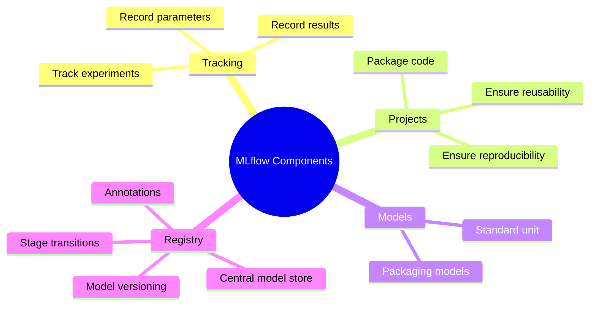
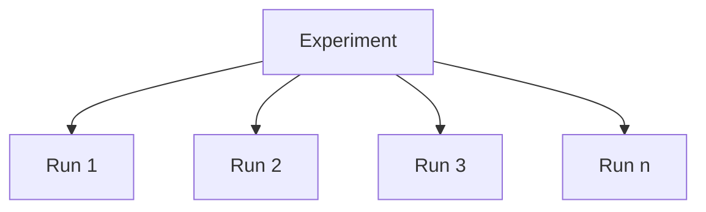
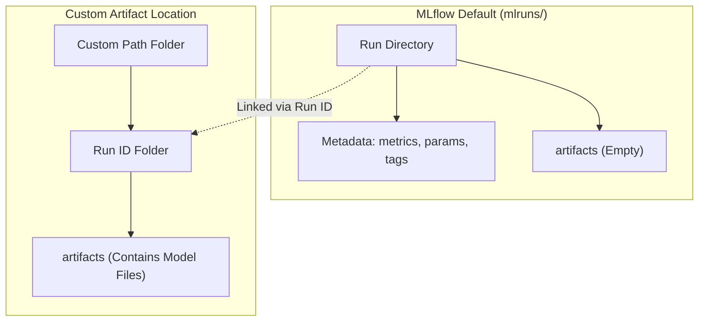
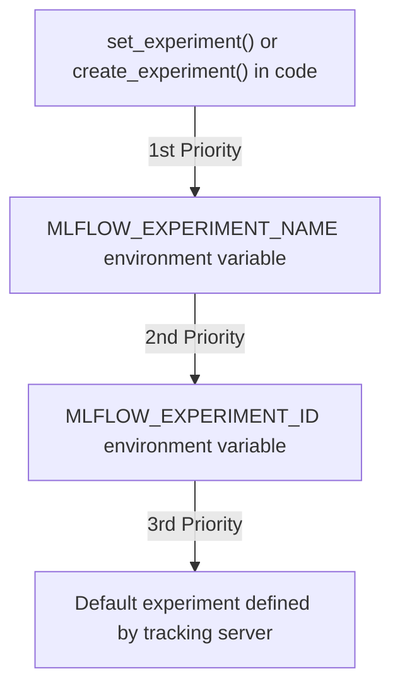
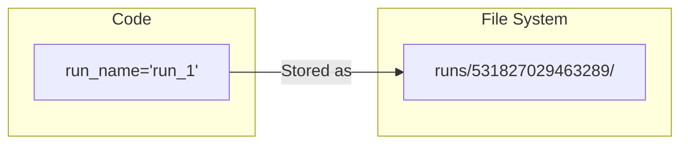

### MLflow Components

- Four key components that work together to simplify complex model deployment activities:
    - **Tracking**: Used to keep a record of all experiments, parameters, and outputs
    - **Projects**: Packages code to ensure reusability and reproducibility
    - **Models**: Provides a standard unit for packaging models into specific flavors
    - **Registry**: A centralized repository for model versioning, stage transitions, and annotations



### Implementing MLflow

- MLflow is implemented as an additional piece of code written within the core model-building code
- To demonstrate these concepts, a basic regression model using scikit-learn will be used as the base training code

### Wine Quality Dataset Use Case

- **Goal**: Train a linear regression model to predict wine quality.
- **Dataset Characteristics**:
    - It is a fundamental dataset for regression tasks.
    - Contains 11 features.
    - The label (target variable) is the quality of the wine.
- **Key Features**:
    - Acidity
    - Sugar
    - Chlorides
    - (and others)

| Feature Type | Description |
| --- | --- |
| Features | 11 attributes (e.g., acidity, sugar, chlorides) |
| Label | Wine quality (to be predicted) |

### ElasticNet Regression

- A regularized regression model that linearly combines L1 and L2 penalties
    - Acts as a middle ground between Lasso and Ridge
    - Inherits feature selection properties from Lasso
    - Maintains regularization properties from Ridge
    - Well-suited for linear regression tasks

### Command Line Argument Parsing

- The `argparse` library is used to pass parameters through the terminal during execution
- In this implementation, `alpha` and `l1_ratio` are defined as hyperparameters

```python

# Hyperparameter setup via argparse
parser = argparse.ArgumentParser()
parser.add_argument('--alpha', type=float, required=False, default=0.5)
parser.add_argument('--l1_ratio', type=float, required=False, default=0.5)
args = parser.parse_args()
```

- **[Parameter Details]**:
        - `alpha`: Hyperparameter for regularization strength
        - `l1_ratio`: Hyperparameter determining the mix between L1 and L2
        - Both are set with a default value of `0.5` and are optional (`required=False`)

### Model Evaluation and Execution Workflow

#### Evaluation Function

- A custom function `eval_metrics` is defined to calculate key performance indicators using actual and predicted values
    - **Metrics calculated**:
        - `mse`: Mean Squared Error
        - `mae`: Mean Absolute Error
        - `r2`: R-squared score

```python
def eval_metrics(actual, pred):
    mse = np.mean((actual - pred)**2)
    mae = np.mean(np.abs(actual - pred))
    r2 = r2_score(actual, pred)
    return mse, mae, r2
```

#### Main Execution Block

- The script follows a standard sequence for preparing data and training the model:

    1. **Environment Setup**: Ignores warnings and sets a random seed for reproducibility
    2. **Data Loading**: Reads the wine quality dataset using `pandas` from a remote URL
    3. **Data Splitting**: Uses `train_test_split` to divide the dataset into 75% training and 25% testing sets
    4. **Feature/Label Separation**: Extracts features and target labels from both sets
    5. **Model Initialization**: Creates the ElasticNet model using the hyperparameters (`alpha` and `l1_ratio`) parsed from the command line

```python
if __name__ == "__main__":
    warnings.filterwarnings("ignore")
    np.random.seed(240)

# Load the wine quality csv file from the web
    data = pd.read_csv("https://raw.githubusercontent.com/mwaskom/seaborn-data/master/winequality-red.csv")

# Split the data into training and test sets (75, 25) split
    train, test = train_test_split(data)

# The predictive column is "quality" which is a scalar (y)
    train_x = train.drop(["quality"], axis=1)
    train_y = train["quality"]
    test_x = test.drop(["quality"], axis=1)
    test_y = test["quality"]

    alpha = args.alpha
    l1_ratio = args.l1_ratio

    lr = ElasticNet(alpha=alpha, l1_ratio=l1_ratio, random_state=242)
    lr.fit(train_x, train_y)
```

### Model Training and Evaluation

- **Model Training**: The model is trained using the `.fit()` method
- **Prediction**: Predictions are generated for the test dataset using the `.predict()` method and stored in `predicted_qualities`
- **Evaluation**: The `eval_metrics` function is called to compare the true testing labels (`test_y`) against the model predictions (`predicted_qualities`)

```python
lr.fit(train_x, train_y)

predicted_qualities = lr.predict(test_x)

rmse, mae, r2 = eval_metrics(test_y, predicted_qualities)

print(f"Elasticnet model (alpha={alpha}, l1_ratio={l1_ratio}):")
print(f"RMSE: {rmse} % mae")
print(f"MAE: {mae} % r2")
print(f"R2: {r2} % r2")
```

- **Execution Results**: Running the script in the terminal produces the following performance metrics for the ElasticNet model:
    - `RMSE`: 0.79
    - `MAE`: 0.62
    - `R2 score`: 0

```text
C:\Users\newuser\mlflow\denli\python.exe C:\Users\newuser\PycharmProjects\mlflow\denli\main.py (alpha=0.50000, l1_ratio=0.50000)
Elasticnet model (alpha=0.50000, l1_ratio=0.50000):
RMSE: 0.791402719564
MAE: 0.620436997790
R2: 0.0

Process Finished with exit code 0
```

### Summary of ElasticNet Implementation

- **Current Status**: The ElasticNet regression model has been successfully trained using `scikit-learn`.
- **Model Performance**: The initial results showed an $R^2$ score of 0, which can be improved by tuning hyperparameters like `alpha` and `l1_ratio`.
- **Implementation Scope**: The current code is a pure machine learning script and does not yet include any MLflow components.
- **Next Steps**: The existing machine learning code will be wrapped with MLflow to enable experiment tracking.

### MLflow Tracking Fundamentals

- **Purpose of MLflow**: Used to track and log models to facilitate experiment reproducibility, comparison, and deployment
- **Core Concepts**: Tracking is built upon a hierarchy of Experiments and Runs

#### Experiments vs. Runs

- **Experiment**: A high-level grouping that can contain $n$ number of runs
- **Run**: A single execution of a piece of code or a machine learning model
    - Each run can record specific details including:
        - Code version
        - Hyperparameter values
        - Metrics
        - Tags
        - Artifacts



### Integrating MLflow into the Script

- To begin tracking, the `mlflow` library and its `sklearn` module must be imported

```python
import mlflow
import mlflow.sklearn
```

### MLflow Tracking Details

- **Run**: A single execution of a piece of code or a machine learning model
    - Captures specific metadata including:
        - Hyperparameter values
        - Data sources
        - Outcome artifacts
        - Code version
        - Metrics and tags
        - A unique ID and name for retrieval
- **Experiment**: A logical grouping of runs
    - Used to organize and compare groups of runs together
    - Typically represents a specific machine learning problem being solved

#### Metadata Hierarchy


### Implementing MLflow Tracking

- After importing `mlflow` and `mlflow.sklearn`, the first step in the code is to define the experiment name using `set_experiment`

```python
import mlflow
import mlflow.sklearn

# ... (other imports)

mlflow.set_experiment("experiment_name")
```

### Starting an MLflow Run

- To record the metadata of a specific execution, the model training code is wrapped using the `mlflow.start_run` method
- Using a `with` statement (context manager) ensures the run is properly managed
- **[How to associate with an experiment]**: Pass the `experiment_id` as an argument to `start_run` to link the run to a specific high-level experiment

```python

# Retrieve the experiment object and its ID
exp = mlflow.set_experiment("experiment_name")

# Start a run associated with that experiment
with mlflow.start_run(experiment_id=exp.experiment_id):

# Model training code goes here
    lr = ElasticNet(alpha=alpha, l1_ratio=l1_ratio, random_state=42)
    lr.fit(train_x, train_y)

    predicted_qualities = lr.predict(test_x)

# ... (other logging/metrics)
```

- **Purpose of&#32;`start_run`**: It captures the execution's metadata, which can be retrieved later using the unique `run_id` generated for that specific execution

### Logging Parameters and Metrics

- To enable comparison between different runs, various entities must be recorded within the MLflow run
    - Common entities include hyperparameters, metrics, printed data, and the model itself
- **[Logging Hyperparameters]**: Use the `mlflow.log_param` function to record configuration settings
    - Example of logging model parameters:

```python
mlflow.log_param("alpha", alpha)
mlflow.log_param("l1_ratio", l1_ratio)
```

- **[Logging Metrics]**: Use the `mlflow.log_metric` function to record performance measurements
    - Example of logging evaluation metrics:

```python
mlflow.log_metric("rmse", rmse)
```

### Logging Model Artifacts

- Beyond parameters and metrics, the trained model itself should be logged as part of the tracking process
- **[Logging the Model]**: Use `mlflow.sklearn.log_model` to save the model
    - The first argument is the trained model object (e.g., `lr`)
    - The second argument is the `artifact_path`, which defines the directory where the serialized model will be stored relative to the run's root artifact directory

```python

# Log the trained model to a directory named 'myModel'
mlflow.sklearn.log_model(lr, "myModel")
```

- **[What is an MLflow Artifact?]**: An artifact is essentially a file or a set of files output by an MLflow experiment run
    - Logging the model creates an artifact that stores the model in a format suitable for:
        - Model deployment
        - Scoring
        - Further experimentation

### MLflow Tracking Workflow Summary

The completed tracking process involves the following sequence:

1. **Setup Experiment**: Create or select an MLflow experiment
2. **Initialize Run**: Start a new run within that experiment
3. **Log Data**:

    - Record hyperparameters (`log_param`)
    - Record performance metrics (`log_metric`)

4. **Log Model**: Save the trained model as an artifact (`log_model`)

### Environment Setup

Before running the tracking code, the MLflow library must be installed in the active Conda environment.

- **Installation Steps**:

    1. Open the terminal
    2. Activate the desired Conda environment:

```bash
conda activate <env_name>
```

    1. Install MLflow:

```bash
conda install mlflow
```

- **Execution**:
    - Once installed, the Python script can be executed to perform the training and logging. The terminal will output the results (e.g., printed metrics) and MLflow will record the entities in the background.

### MLflow Local Storage

- **[The mlruns Directory]**: Executing MLflow tracking code automatically generates a directory named `mlruns` in the project folder
    - This directory acts as the storage location for all logged entities (parameters, metrics, artifacts, etc.)
- **Storage Locations**:
    - **Local Machine**: Used for simplicity during initial learning and development
    - **Remote Server**: Typically used in production/professional environments to centralize tracking across teams

### Inside the `mlruns` Directory

- The directory stores all metadata and artifacts related to MLflow runs, where each run represents a single execution of machine learning code
- **[Trash Folder]**: A directory used for storing deleted experiment runs or other deleted items
    - Functions similarly to a Recycle Bin or Trash on a computer OS
    - Items are marked for deletion but not immediately removed, allowing for a degree of recoverability if a run is accidentally deleted
    - **Note**: Actual behavior and retention period depend on the specific MLflow version and the configured file store backend
- **[Folder '0']**: The default experiment folder
    - This folder is automatically created if no specific experiment name is set in the code
    - If an experiment name is explicitly defined (e.g., `mlflow.set_experiment(experiment_name="experiment_1")`), this default folder should ideally not be present or used

### Experiment Folders in `mlruns`

- **[Experiment ID as Folder Name]**: Instead of using the human-readable name assigned in the code (e.g., `experiment_1`), MLflow uses a unique, long numeric ID as the folder name
    - This is an internal MLflow practice to ensure uniqueness
    - If no experiment name is explicitly set in the code, the experiment ID defaults to `0`
- **Relationship between Experiments and Runs**:
    - An experiment is a group of runs
    - Inside an experiment folder, there are sub-folders representing individual runs
    - Each run folder is named after its specific `run_id` and contains the metadata for that single execution

### Experiment Metadata

- **`meta.yaml`**: A file created within each experiment folder that contains metadata information for that specific experiment
    - Example metadata fields:
        - `artifact_location`: The file path where artifacts are stored
        - `creation_time`: Timestamp of when the experiment was created
        - `experiment_id`: The unique numeric identifier
        - `last_updated_time`: Timestamp of the last update
        - `lifecycle_stage`: The current stage (e.g., `active`)
        - `name`: The human-readable name assigned to the experiment (e.g., `experiment_1`)

### `meta.yaml` Content

- This file stores the descriptive metadata for an experiment
- **Key fields included in&#32;`meta.yaml`**:

```yaml
artifact_location: file:///Users/kawsar/PycharmProjects/mlflow_demo/mlruns/968070910257071453
    creation_time: 1649049484843
    experiment_id: 968070910257071453
    last_updated_time: 1649049484843
    lifecycle_stage: active
    name: experiment_1
```

### Run Folder Contents

Inside an experiment folder, individual runs are stored in sub-folders. Each run folder contains the specific data logged during that execution:

- **Log Items**:
    - Artifacts
    - Metrics
    - Parameters
    - Tags

#### Artifacts Folder

- This sub-folder contains the outputs generated by the run
- **`myModel`&#32;directory**: Contains the actual model file (e.g., `model.pkl`)
- **`conda.yml`**: A file containing all the dependencies required to recreate the execution environment
    - **[Why it matters]** It enhances experiment reproducibility
    - You can share this file with others so they can create an identical conda environment and run the exact same experiment

```yaml
name: mlflow-env
channels:
  - conda-forge
dependencies:
  - python=3.8.12
  - pip:
    - mlflow==2.2.1
    - numpy==1.25.1
    - scikit-learn==1.3.0
    - scipy==1.11.0
```

### Environment Reproducibility Files

Beyond `conda.yml`, MLflow generates other files to ensure the experiment can be run in different types of environments:

- **`conda.yml`**: Contains the requirements to reproduce the run specifically within a Conda environment
- **`requirements.txt`**: Used for reproducing the run in a standard virtual environment
- **`python_env.yml`**: Used for local Python setups utilizing `pip` commands

All these files serve the same purpose: capturing the exact packages and versions required to recreate the experiment's execution environment.

### Artifacts Folder Expansion

- While the current artifacts folder may only contain the model, it can also store other logged items
    - If images or other data types are logged during the run, they will appear as additional folders within the artifacts directory

### Run Folder Details

Beyond artifacts, a run folder contains several other key sub-folders and metadata files:

- **Metrics folder**: Stores all the metrics logged during the run in separate files
- **Parameters folder**: Contains the hyperparameters logged for the run
    - For example, if `alpha` and `alpha_ratio` were logged, they would be stored here
- **Tags folder**: Contains metadata files related to the run's tags
- **Run-specific&#32;`meta.yaml`**: A metadata file located directly within the run folder
    - **[Difference from Experiment&#32;`meta.yaml`]** While the experiment-level `meta.yaml` describes the entire experiment, this file describes the specific execution (the run)
    - It includes details such as:
        - `artifact_uri`
        - `experiment_id`
        - `run_id`
        - `run_name`

```yaml
artifact_uri: file:///C:/Users/Name/PycharmProjects/mlflow_demo/mlruns/968070910257071453/artifacts
end_time: 1649049484843
entry_point_name:
experiment_id: 968070910257071453
lifecycle_stage: active
run_id: 318bd8c84437ea28a5c0f0a2f
run_name: shivering-hiro-888
source_name:
source_version:
start_time: 1649049484843
status: X
tags: []
user_id: Name
```

### The Relationship Between Experiments and Runs

The MLflow directory structure reflects a hierarchical relationship between the core task and its individual iterations:

- **Experiment**: Represents the basic structure or the core code/task being performed
    - In this use case, the experiment is training a regression model on the wine quality dataset
- **Runs**: Represent variations of that core code executed within the experiment
    - Each run can test different variables to see how they affect performance
    - **[Examples of run variations]**
        - Different hyperparameter values
        - Different metrics
        - Different datasets

This structure allows for easy comparison, as the metadata for every run is stored and can be revisited to evaluate which variation performed best.

### Iterating on Hyperparameters

When an evaluation metric is unsatisfactory, the experiment can be updated by modifying the code and executing a new run. For example, changing the default hyperparameters:

```python

# Changing alpha and L1 ratio to new values for a new run
parser.add_argument('--alpha', type=float, required=False, default=0.78)
parser.add_argument('--l1_ratio', type=float, required=False, default=0.78)
```

Executing this updated code creates a new run within the same experiment, producing new evaluation metrics that can be compared against previous runs.

### Tracking New Runs with Different Hyperparameters

- A new run creates a new folder under the same experiment ID
    - The directory structure remains identical to previous runs
    - The logged entities (metrics, params, artifacts) are updated with the new values
- **[Verifying changes]** You can confirm the new hyperparameter values by checking the `params` folder within the specific run directory
    - Example: If `alpha` and `l1_ratio` were changed to 0.7, the `params` folder will reflect these specific values

### The Purpose of MLflow Tracking

- MLflow assists the experimentation process by maintaining a continuous record of all attempts
- **[What can be tracked?]**
        - Hyperparameters
        - Models
        - Metrics
        - Data, images, and other custom artifacts

### Efficient Experimentation via Command Line

- Instead of manually editing the Python source code to change hyperparameters for every run, you can use command-line arguments
- This is achieved by utilizing `argparse` within the script to accept values at runtime
- **[Example Workflow]**

        1. Define arguments in the code using `parser.add_argument`
        2. Execute the script from the terminal, passing the desired values as flags (e.g., `--alpha 0.7`)
        3. MLflow logs these passed values as the parameters for that specific run

### Experimenting via Command Line

- Use the terminal to pass arguments directly to the script, avoiding the need to manually edit the Python source code for every change
- **[Example Command]**

```bash
python main.py --alpha 0.4
```

- **[Resulting Behavior]**
    - The model trains using the specified hyperparameter (e.g., `alpha` set to 0.4)
    - MLflow automatically creates a new run folder on top of the previous run folders within the experiment directory
- **[Next Steps]**
    - Once runs are tracked, they can be visualized using the MLflow User Interface (UI) in a web browser

### Accessing the MLflow UI

- Launch the UI from the terminal using the command:

```bash
mlflow ui
```

- Once the server starts, copy the provided local link and paste it into a web browser to view the modern interface
- **[Purpose of the UI]** It provides a visual way to compare all runs and experiments to identify the best-performing model

### Navigating the MLflow Interface

- The interface is divided into two primary sections:
    - **Experiments**: Contains all recorded experiments and their associated runs
    - **Models**: Used for model management
- **Experiments Section Details**
    - **Left Panel**: Displays the list of all experiments (e.g., `Default` and user-created ones like `experiment_1`)
        - Experiment names can be modified using the edit button
    - **Top Metadata Area**: Displays specific information for the selected experiment, such as:
        - Experiment ID
        - Artifact location
    - **Main Content Area**: Shows a table of all runs associated with the selected experiment, including columns for:
        - Run Name
        - Created (timestamp)
        - Duration
        - Source
        - Models

### Managing and Comparing Runs in the UI

- **[View Modes]** The runs can be viewed in different ways using the view selector:
    - **Table view**: A spreadsheet-like view (the current default)
    - **Chart view**: For visual data representation
    - **Artifact view**: To focus on the files produced by the runs
- **[Sorting and Filtering]** The table can be organized to find specific data quickly:
    - Runs can be sorted by various criteria such as `Created` date, `Run Name`, `Source Version`, and more
    - Sorting can be applied in ascending or descending order
- **[Customizing Columns]** Users can show or hide specific columns to focus on relevant data
    - By default, columns like `Dataset`, `Source`, and `Models` might be visible
    - **[Pro-tip]** It is highly useful to enable the `Metrics` and `Parameters` columns
    - Enabling these allows for direct side-by-side comparison of scores (e.g., accuracy) and hyperparameters (e.g., alpha) across different runs
- **[Identifying the Best Run]** The primary goal of the table is to facilitate comparison so that the user can easily identify which run produced the best-performing model based on the displayed metrics

### Analyzing and Comparing Runs

- **[Manual Comparison]** The runs table allows for a quick, "naive" comparison of logged data to gain immediate insights
    - By looking at the `Metrics` and `Parameters` columns side-by-side, you can identify patterns
    - **Example**: If a specific combination of `alpha` and `L1 ratio` (e.g., 0.4) yields the best MAE and RMSE scores, it suggests exploring even lower values for those hyperparameters in future runs
- **[Advanced Comparison]** For a more sophisticated analysis of multiple runs, use the built-in comparison tool
    - **Process**:

        1. Select the specific runs you wish to compare from the table
        2. Click the **Compare** button

    - **[Comparison Experience]** This opens an immersive interface featuring various graphing options
        - These graphs allow for a calculated, statistical comparison of how different parameters affect metrics
- **[Drilling Down]** To see the full metadata and specific details of a single execution, you can click directly into any individual run from the table

### Individual Run Details

- **[Metadata]** When viewing a specific run, the UI displays key execution details:
    - **Run ID**: The unique identifier for the execution
    - **Run Name**: A human-readable name for the run
    - **Date**: When the run occurred
    - **Source**: The script or file that initiated the run
    - **Status**: The current state (e.g., `FINISHED` if the run completed successfully)
    - **Lifecycle Stage**: The stage of the run (e.g., `active`)
- **[Model Information]** The run view provides access to the logged model and suggestions for using it
    - **Model Schema**: Details the expected input and output formats
    - **Make Predictions**: Provides code snippets (e.g., for Spark or Pandas DataFrames) to demonstrate how to use the logged model for inference

### Logging vs. Registering Models

- **[Logging a Model]** Using `mlflow.log_model`
    - This simply records the model as an artifact within a specific run
    - It is used for tracking and reproducibility purposes within the experiment
- **[Registering a Model]** Using the **Register Model** button
    - This moves a model into a centralized **Model Registry**
    - **[Why register?]** Registration is used when a model is ready for production (PUA/production) and needs version control and centralized referencing

### MLflow Model Registry

- The **Models** section in the UI is the dedicated space for viewing and managing registered models
- If no models have been registered yet, this section will appear empty

### MLflow UI Summary

- The interface is intentionally simple and not overly elaborate
- **[Primary Utility]** It provides all the essential details required to effectively compare and evaluate different MLflow runs

## Logging Functions

Beyond basic parameter and metric tracking, MLflow provides a variety of functions to log different types of entities.

### Tracking URI Management

- `mlflow.set_tracking_uri()`
    - Used to set the default tracking URI of your choice for the current run
    - This defines the specific location where MLflow will keep tracks of your code and data
- `mlflow.get_tracking_uri()`
    - Used to retrieve the current tracking location path that was previously set

### `mlflow.set_tracking_uri()`

- Used to change the default tracking storage location
    - By default, MLflow logs metrics, artifacts, and metadata to a local directory named `mlruns`
- **Parameters**:
        - `<uri>`: The location where files shall be stored
- **Behavior with empty string**:
        - Passing an empty string causes MLflow to automatically create a folder named `mlruns` and store all tracks there

### `mlflow.set_tracking_uri()` Parameter Values

- **Empty string**
    - Behaves the same as not calling the function at all
    - MLflow automatically creates an `mlruns` folder in the current directory to store all tracks
- **Folder name**
    - Allows for a custom folder name instead of the default `mlruns`
    - Uses the format: `./<name_of_ur_choice>`
    - This creates the specified folder in the current directory for all runs and experiments
- **File path**
    - Used to store tracks at a specific location on your local system
    - Format: `file:/path/to/myfolder`
    - **Important Restriction**: You cannot specify disk names (like `D:` or `E:`) in the path
        - The URI must start with `file:/`
        - It will use the default disk (typically the `C` drive) automatically

### `mlflow.set_tracking_uri()` Parameter Values (Continued)

- **Remote path**
    - Used to connect to a remote tracking server
    - Format: `https://<my-tracking-server>:<port>`
- **Databricks workspace**
    - Used to provide a Databricks workspace as the tracking location
    - Format: `databricks://<profileName>`

### `mlflow.get_tracking_uri()`

- Used to retrieve the tracking URI that was previously set using `mlflow.set_tracking_uri()`
- **Parameters**:
    - `<None>`: This function takes no parameters
- **Output**:
    - Returns the specified tracking URI string
    - If no specific URI was set, it returns the default local directory

### Practical Application of Tracking URIs

- Tracking should be the first configuration step specified before any experiments or runs are initiated
- **Demonstration of default behavior**:
    - Setting the URI to an empty string `mlflow.set_tracking_uri("")` causes MLflow to use the default `mlruns` directory
    - Calling `mlflow.get_tracking_uri()` will return an empty string in this case, confirming the default location is being used
- **Customizing the tracking location**:
    - To use a specific folder instead of the default, pass the desired name to the function:

```python
mlflow.set_tracking_uri("my_tracks")
```

### Using a Local File Path

- Allows storing tracks in a specific directory of your choice
- **Requirement**: Must use the `file:/` prefix for the local file system
    - MLflow only accepts `file:/` for local paths and cannot specify different drives (e.g., you cannot switch from `C:` to `D:` via the URI)
- **Example Implementation**:

```python
mlflow.set_tracking_uri("file:/Users/Neusser/PycharmProjects/mlflow_demo")
print("The set tracking uri is", mlflow.get_tracking_uri())

mlflow.set_experiment(name="exp_for_uri")
with mlflow.start_run():

# ... experiment logic ...
```

- **Verification**:
    - After running the code, `mlflow.get_tracking_uri()` returns the full absolute path set.
    - The file system will show a new folder created at that location (e.g., `mlflow_demo`) containing the experiment data.

### `mlflow.create_experiment()`

- Used to create a fresh new experiment for managing and tracking machine learning workflows
- **Parameters**:
    - `name: str`: Specifies a custom name for the experiment
        - The name must be unique
        - The name is case sensitive
    - `artifact_location: Optional[str] = None`: An optional parameter to specify the location where the artifacts folder will be stored
    - `tags: Optional[Dict[str, Any]] = None`: (Details forthcoming)

### `mlflow.set_experiment()`

- Used to set an already existing experiment so that runs are recorded within it
- **Behavioral Note**:
    - If the experiment being set does not yet exist, it will behave like `create_experiment()` and create a new one

### `mlflow.create_experiment()` Parameters (continued)

- **artifact\_location** (Optional)
    - While `set_tracking_uri()` sets the location for the entire track (metrics, hyperparameters, tags, and artifacts), this parameter allows you to store the artifacts folder in a specific, different location
    - If left empty, artifacts will be stored in the same `mlruns` folder (or the custom tracking URI location)
- **tags** (Optional)
    - Takes a dictionary of key-value pairs
    - Used to categorize experiments to help with grouping and filtering later

### Return Value

- Returns a **String ID** of the created experiment
- **[Why it matters]**: This ID can be passed to `mlflow.start_run()` to ensure subsequent runs are recorded within this specific experiment

### Implementation Example

To move from setting an existing experiment to creating a new one, you can rename the function call and pass the required arguments:

```python

# Replacing mlflow.set_experiment(name="exp")
mlflow.create_experiment(name="exp")
```

### Using Tags in `create_experiment()`

- Tags are passed as a dictionary of key-value pairs
- **[Purpose]**: Helps in easily identifying or filtering experiments
- **Example**:

```python
exp_id = mlflow.create_experiment(name="exp_create_exp", tags={"version": "v1", "priority": "hi"})
```

### Managing Experiment IDs

- `mlflow.create_experiment()` returns an **Experiment ID** (a string, not an object)
- This ID should be stored in a variable (e.g., `exp_id`) to be passed into `mlflow.start_run()`
- **Implementation Example**:

```python
exp_id = mlflow.create_experiment(name="exp_create_exp", tags={"version": "v1", "priority": "hi"})
    with mlflow.start_run(experiment_id=exp_id):

# ... run logic ...
```

### `mlflow.get_experiment()`

- Used to retrieve all stored information related to a specific experiment
- **Argument**: Takes an `experiment_id` as its argument
- **Retrieved Data Includes**:
    - Experiment name
    - Experiment ID
    - Artifact location
    - Tags
    - Other associated metadata

### Inspecting Experiment Metadata

Using the `get_exp` object (retrieved via `mlflow.get_experiment(exp_id)`), you can access all stored metadata.

**Implementation Example**:

```python

# Retrieve the experiment object
get_exp = mlflow.get_experiment(exp_id)

# Print various attributes of the experiment
print(f"Name: {get_exp.name}")
print(f"Experiment ID: {get_exp.experiment_id}")
print(f"Artifact Location: {get_exp.artifact_location}")
print(f"Tags: {get_exp.tags}")
print(f"Lifecycle Stage: {get_exp.lifecycle_stage}")
print(f"Creation Timestamp: {get_exp.creation_timestamp}")
```

**[Output Details]**:

When running the code, the printed metadata includes:

- **Name**: The assigned name of the experiment
- **Experiment ID**: The unique string identifier
- **Artifact Location**: The directory path (defaults to the `mlruns` directory if not explicitly set)
- **Tags**: The dictionary of key-value pairs provided during creation
- **Lifecycle Stage**: (e.g., `active`)
- **Creation Timestamp**

### Experiment Directory Structure

- MLflow creates physical folders on the disk to store experiment data
- **[Note on Naming]**: These folders are named after the **Experiment ID**, not the experiment name
    - Currently, there is no way to force the folder names to match the experiment name
- **[Best Practice]**: Do not attempt to manually manage or rename these directories in the file system; instead, use the **MLflow UI** to navigate and manage experiments.

### Experiment Folder Structure

- Along with artifacts and metrics, MLflow stores metadata in a specific directory structure
- **Tags Storage**: Tags are stored in an additional `tags` folder
    - Each tag is represented by its own file (e.g., a file named `priority` and a file named `version`)
    - The contents of these files correspond to the values assigned to those tags

### Customizing Artifact Location

- You can specify a custom directory to store experiment artifacts instead of using the default location
- **[Implementation]**: To do this, use the `artifact_location` parameter in `mlflow.create_experiment()`
- **[Tooling]**: The `pathlib` library is useful for defining these paths relative to the current working directory

**Implementation Example**:

```python
from pathlib import Path

# Define a custom path for artifacts in the current working directory
custom_artifact_path = Path.cwd() / "my_artifacts"

# Create an experiment with the specified artifact location
exp_id = mlflow.create_experiment(
    name="exp_custom_location",
    artifact_location=str(custom_artifact_path)
)
```

### Custom Artifact Location Implementation

To ensure the path is compatible with MLflow's requirements, the `.as_uri()` method can be used on a `pathlib.Path` object.

**Implementation Example**:

```python
from pathlib import Path
import mlflow

# Define a custom path
custom_artifact_path = Path.cwd() / "my_artifacts"

# Create an experiment with the path converted to a URI
exp_id = mlflow.create_experiment(
    name="exp_custom_location",
    artifact_location=custom_artifact_path.as_uri()
)
```

### Artifact Storage Behavior

When a custom `artifact_location` is provided, the directory structure changes compared to the default setup.

- **Directory Separation**: The artifacts are no longer stored within the `mlruns` directory; instead, a new folder is created at the specified custom path.
- **MLflow Run Directory**: Inside the default `mlruns` directory, the specific run will still contain its metadata (metrics, params, tags), but its local `artifacts` folder will be empty.
- **Custom Artifact Folder Structure**: The custom directory maintains a link to the run through the Run ID.



- **[Key Insight]**: The folder inside the custom location is named after the **Run ID**, ensuring that artifacts from different runs are correctly isolated even when using a shared custom base directory.

### Benefits of Custom Artifact Locations

- Specifying a custom path for artifacts allows for better organization
- **[Use Cases]**
    - Memory management (storing large files on different drives)
    - Data backup purposes

### `set_experiment()`

- Utilizes an existing experiment to record runs
- **Parameters**
    - `experiment_name`: `Optional[str] = None`
        - The name of an already existing experiment into which new runs shall be launched
        - **[Behavior]**: If the specified name does not exist, MLflow will create a new experiment with that name
    - `experiment_id`: `Optional[str] = None`
        - The ID of an already existing experiment into which new runs shall be launched
        - **[Behavior]**: Unlike the name parameter, if the specified `experiment_id` does not exist, it will throw an exception instead of creating a new one
- **Return Value**
    - Returns an instance of `mlflow.entities.Experiment` representing the new active experiment
    - This entity contains all information related to the experiment, such as:
        - Experiment ID
        - Artifact location
        - Tags

### Using `set_experiment()` in Code

- You can specify an experiment by passing its name or ID as a string, or by using the returned `Experiment` object
- **[Pro-tip]**: Using the returned object is often cleaner as it provides direct access to all experiment metadata

```python

# Setting the experiment using a name string
exp = mlflow.set_experiment("experiment_1")

# Accessing metadata from the Experiment object
print(f"Experiment ID: {exp.experiment_id}")
print(f"Artifact location: {exp.artifact_location}")
print(f"Tags: {exp.tags}")
print(f"Lifecycle stage: {exp.lifecycle_stage}")
print(f"Creation timestamp: {exp.creation_time}")

# Using the experiment object to start a run
with mlflow.start_run(experiment_id=exp.experiment_id):

# ... run logic ...
    pass
```

- To work with a specific experiment, use `mlflow.set_experiment()` with the desired name
- **[Implementation Detail]**: Since the function returns an experiment object rather than just an ID, you can use the object's properties to start runs

```python

# Setting the experiment using the name 'experiment_1'
exp = mlflow.set_experiment("experiment_1")

# Using the experiment object to start a run
with mlflow.start_run(experiment_id=exp.experiment_id):

# ... run logic ...
    pass
```

### Experiment Metadata Verification

- After running the code, the terminal output confirms the properties of the experiment object returned by `set_experiment()`

| Property | Value |
| --- | --- |
| experiment_id | 46548201453218488 |
| artifact_location | file:///Users/PycharmProjects/mlflow_demo1/mlruns |
| tags | {'name': 'experiment_1'} |
| lifecycle_stage | active |
| creation_timestamp | 1690625173114 |

- **[Verification]**: The output matches the expected metadata for `experiment_1`, confirming that `exp.experiment_id` and other properties correctly reference the active experiment.

### Handling Runs

- MLflow provides four primary functions to manage runs:
    - `start_run()`
    - `end_run()`
    - `active_run()`
    - `last_active_run()`

### `mlflow.start_run()`

- Starts a new MLflow run in an experiment where all metrics, parameters, and artifacts will be logged
- **[Key Capability]**: This method can also be used to continue an existing run, which is particularly useful for deep learning tasks

#### Parameters

- `<run_id: Optional[str] = None>`
    - Used to specify an existing run that you want to utilize
    - If provided, the status of that run is set to "running," and new metrics/parameters are logged under it
    - **[Note]**: Attributes like `source_version` and `source_type` remain unchanged
    - If not specified, a new run is created
- `<experiment_id: Optional[str] = None>`
    - Specifies the ID of the experiment under which the run must be created
    - **[Constraint]**: This parameter can only be used if `run_id` is **not** specified
- `<run_name: Optional[str] = None>`
- `<nested: bool = False>`
- `<tags: Optional[Dict[str, Any]] = None>`
- `<description: Optional[str] = None>`

### `mlflow.start_run()` Parameters Continued

#### `experiment_id` Resolution

- If `experiment_id` is not specified, MLflow follows a specific precedence order to find or assign an experiment:



#### `run_name`

- Allows specifying a custom name for a new run
- **[Constraint]**: Can only be used if `run_id` is **not** specified
    - If a `run_id` is provided, you are resuming an existing run which already has its own name

### `mlflow.start_run()` Return Value

- Returns an `mlflow.ActiveRun` object
    - This object acts as a context manager that wraps the current run's state

#### Managing Run Lifecycles

- **Using a Context Manager (`with`&#32;statement)**
        - **[Benefit]**: Automatically closes the run once the block of code is completed
        - Similar to how Python handles file operations with `with open(...)` to ensure files are closed properly
- **Manual Management**
        - If the run is not wrapped in a `with` block, it must be closed manually
        - Use the `mlflow.end_run()` function to terminate the run

### `mlflow.start_run()` Implementation Example

- Using a context manager (`with` statement) avoids the need to manually call `mlflow.end_run()`
- **[Example]**

```python
with mlflow.start_run(experiment_id=exp.experiment_id, run_name="run_1"):

# ... training code ...
```

### MLflow Local Storage Structure

- MLflow stores data using unique identifiers (IDs) in the directory structure rather than the names provided in code
    - **Experiments**: Stored in the `experiments/` directory using their `experiment_id`
    - **Runs**: Stored in the `runs/` directory using their `run_id`
- **[Note]**: Because folder names are IDs, it is difficult to navigate the file system manually to find specific runs
- **[Recommendation]**: Use the MLflow UI to efficiently visualize experiments and runs in a human-readable form



### Resuming or Overwriting an Existing Run

- To reuse or overwrite a previously existing run, provide its specific `run_id` to the `start_run()` function
    - This prevents the creation of a new run and instead updates the existing one
- **[Example]**

```python
with mlflow.start_run(experiment_id=exp.experiment_id, run_id="531827029463289"):

# ... code to modify run details ...
    mlflow.sklearn.log_model(tr, "my_new_model")
```

- **[Overwriting Behavior]**
    - When a run is resumed with changes in the code, those changes are reflected in the existing run
    - For example, if the code is updated to save artifacts to a different directory (e.g., changing `"my_model"` to `"my_new_model"`), the run's artifacts will be updated to reflect this new directory
    - Any other details changed in the code will similarly overwrite the previous run's data

### The `mlflow.end_run()` Function

- Used to manually terminate an active MLflow run
- This is necessary when a run is started without a `with` statement (context manager), as the run will not automatically close
- **[Parameter]** `status`: Defines the final state of the run after execution
    - The status can be one of the following:
        - `RUNNING`
        - `SCHEDULED`
        - `FAILED`
        - `FINISHED`
        - `KILLED`
- **[Use Case]** Setting the status manually is useful for programmatically checking or ensuring the correct lifecycle stage is recorded for a run

**[Example]**

```python
mlflow.start_run()

# ... code logic ...

mlflow.end_run(status='FINISHED')
```

### Core Logging Functions

- **[Summary of functions]**
    - `mlflow.log_param()` / `mlflow.log_params()`: For logging hyperparameters
    - `mlflow.log_metric()` / `mlflow.log_metrics()`: For logging metrics
    - `mlflow.log_artifact()` / `mlflow.log_artifacts()`: For logging artifacts

### Hyperparameter Logging

- `mlflow.log_param()`
    - Logs a single hyperparameter as a key-value pair
    - **[Parameters]** `<key: str, value: Any>`
        - `key`: The name of the parameter (must be an alphanumeric string; can include underscores, dashes, periods, pluses, or slashes)
        - `value`: The value of the parameter used to train the model
    - **[Returns]** The value that was logged
- `mlflow.log_params()`
    - Logs multiple hyperparameters at once as key-value pairs
    - **[Parameters]** `<params: Dict[str, Any]>`
        - `params`: A dictionary where keys are parameter names (strings) and values are the corresponding parameter values

### Metric Logging Functions

- `mlflow.log_metric()`
    - Logs a single metric as a key-value pair
    - **[Parameters]** `<key: str, value: float, step: Optional[int] = None>`
        - `key`: The name of the metric to log
        - `value`: The numerical value of the metric
        - `step`: An optional single integer representing the training step or iteration
- `mlflow.log_metrics()`
    - Logs multiple metrics at once as key-value pairs
    - **[Use Case]** Efficiently logging a batch of metrics (e.g., RMSE, MAE, R2) in one call
- **[Note on Special Values]**
    - Certain values like plus/minus infinity may be modified depending on the backend store
    - For example, if using SQL Alchemy, $\pm\infty$ might be replaced by the maximum float value
- **[Storage Limits]**
    - All backend stores support values up to a length of 5000, though some may support more

### Metric Logging Details

- `mlflow.log_metric()`
    - **[Parameters]** `<key: str, value: float, step: Optional[int] = None>`
        - `key`: The name of the metric
        - `value`: The numerical value of the metric
        - `step`: An optional integer representing the training step or iteration
            - **[Why use it?]** Essential for tracking metrics over time, such as accuracy at each epoch in deep learning, rather than just the final value
            - Defaults to `0` if not specified
    - **[Returns]** None
- `mlflow.log_metrics()`
    - Logs multiple metrics at once as key-value pairs
    - **[Parameters]** `<metrics: Dict[str, float], step: Optional[int] = None>`
        - `metrics`: A dictionary where keys are metric names (strings) and values are the corresponding float values
        - `step`: An optional integer representing the training step or iteration
    - **[Returns]** None

### Refactoring Logging with Dictionaries

Instead of calling individual logging functions repeatedly, you can use the plural versions (`log_params` and `log_metrics`) to pass a dictionary of values. This makes the code cleaner and more efficient.

#### Before: Repetitive individual calls

```python
mlflow.log_param("alpha", 0.1)
mlflow.log_param("l1_ratio", 0.5)

mlflow.log_metric("rmse", 0.2)
mlflow.log_metric("mae", 0.1)
mlflow.log_metric("r2", 0.9)
```

#### After: Using dictionaries for efficiency

```python

# Logging multiple parameters at once
params = {"alpha": 0.1, "l1_ratio": 0.5}
mlflow.log_params(params)

# Logging multiple metrics at once
metrics = {"rmse": 0.2, "mae": 0.1, "r2": 0.9}
mlflow.log_metrics(metrics)
```

### Refactoring to Dictionary-Based Logging

Instead of logging each parameter and metric individually, you can group them into dictionaries and use the plural versions of the logging functions.

#### Refactoring Parameters

Replace individual `log_param` calls with a single `log_params` call using a dictionary.

```python

# Define parameters in a dictionary
params = {
    "alpha": state.alpha,
    "l1_ratio": state.l1_ratio
}

# Log all parameters at once
mlflow.log_params(params)
```

#### Refactoring Metrics

Similarly, group metrics into a dictionary and use `mlflow.log_metrics`.

```python

# Define metrics in a dictionary
metrics = {
    "rmse": rmse,
    "mae": mae,
    "r2": r2
}

# Log all metrics at once
mlflow.log_metrics(metrics)
```

### Setting the Experiment Name

To organize runs under a specific experiment, use `mlflow.set_experiment`.

```python

# Set the name of the experiment
mlflow.set_experiment("experiment_2")
```

### Verifying MLflow Logging

- After running the training script, the experiment data is stored locally in the `mlruns` directory
- **[Verification Steps]**
    - Check the `mlruns` directory for the new experiment folder
    - Confirm that parameters and metrics appear in the UI
- You can retrieve the most recent run ID programmatically using `mlflow.last_active_run()`

### Launching and Navigating the MLflow UI

To view experiments in a user-friendly interface, follow these steps:

1. Open your terminal
2. Activate your environment (e.g., `conda activate <env_name>`)
3. Run the command: `mlflow ui`
4. Open the provided URL in your browser

#### Exploring Experiments in the UI

- Once the UI is open, select the specific experiment from the left sidebar (e.g., `experiment_3`)
- The main view will display a table of runs containing:
    - **Run Name**: The identifier for the specific execution
    - **Parameters**: The hyperparameters used for that run
    - **Metrics**: The performance results (e.g., RMSE, R2) logged during the run

### Logging Artifacts

- Artifacts are files or directories associated with a run
    - Common examples include output models, training/test datasets, images, or videos
- **[Key Functions]**
        - `mlflow.log_artifact()`: Used to store a single artifact
        - `mlflow.log_artifacts()`: Used to store multiple artifacts at once

#### The `log_artifact()` Function

- **Parameters**:
        - `local_path`: The path to the specific file or entity on your local machine that you want to log
        - `artifact_path`: An optional parameter used to specify a custom destination path within the MLflow artifacts folder (defaults to the root if not provided)
- **Return Value**: `None`

### The `log_artifacts()` Function

- Used to log multiple artifacts at once, such as an entire directory of files
- **[Use Case]** Essential when dealing with a large number of files, such as thousands of images in a computer vision project, where logging each file individually is impractical
- **Parameters**:
    - `local_dir`: The path to the local directory containing the files to be logged
    - `artifact_path`: An optional parameter to specify a custom destination path within the MLflow artifacts folder

```python

# Example of logging a directory
mlflow.log_artifacts("local_dir_path", artifact_path="custom_folder")
```

#### Practical Implementation: Logging Multiple Files

To log multiple files efficiently (such as training and testing datasets), it is best practice to group them into a single directory before logging.

- **Workflow**:

    1. Use the `os` module to create a dedicated directory.
    2. Save all relevant files (e.g., CSVs) into that directory.
    3. Use `mlflow.log_artifacts()` to log the entire directory at once.

```python
import os

# Create a directory to hold multiple files
os.makedirs("data", exist_ok=True)

# Save files into that directory (e.g., training and testing CSVs)

# ... logic to save files to "data/" ...

# Log the entire directory to MLflow
mlflow.log_artifacts("data")
```

#### Verifying Artifacts in MLflow UI

After running the code to log a directory, the files can be verified through the MLflow user interface.

- **Verification Process**:
    - Open the MLflow UI.
    - Navigate to the specific experiment and the corresponding run.
    - Expand the **Artifacts** section to view the logged files.

```python

# Final implementation to log the directory of files

# This assumes the 'data' directory has been created and populated

mlflow.log_artifacts("data")
```

- **[Result]** In the UI, the directory (e.g., `data/`) will appear under the Artifacts folder, containing all individual files such as the training and testing CSVs.

### `mlflow.get_artifact_uri()`

- Returns the absolute URI of a specified artifact in the currently active run
- **Parameters**:
    - `artifact_path` (optional): The run-relative artifact path for which an absolute URI is to be obtained
    - If unspecified, the function returns the artifact root URI for the currently active run
- **Return**:
    - An absolute URI referring to the specified artifact OR the currently active run's artifact root directory (if no path is provided)

#### Example: Retrieving Root vs. Specific Artifact URI

To demonstrate, we log a file named `features.txt` inside a directory named `features`.

```python
with mlflow.start_run():

# Log the file
    mlflow.log_artifact("features.txt", artifact_path="features")

# 1. Fetch the artifact root directory URI
    artifact_uri = mlflow.get_artifact_uri()
    print("Artifact uri: {}".format(artifact_uri))

# 2. Fetch a specific artifact URI
    artifact_uri = mlflow.get_artifact_uri(artifact_path="features/features.txt")
    print("Artifact uri: {}".format(artifact_uri))
```

**[Example Output]**

| Call Type | Resulting URI |
| --- | --- |
| Without parameter | file://.../0a46a80f1c9644bd8f4e5dd5553fffce/artifacts |
| With artifact_path | file://.../0a46a80f1c9644bd8f4e5dd5553fffce/artifacts/features/features.txt |

### Dynamic Path Retrieval with `mlflow.get_artifact_uri()`

Instead of hardcoding the absolute path to the artifacts directory, you can use `mlflow.get_artifact_uri()` to retrieve it dynamically during a run.

- **[Why use it?]** It prevents errors when running code in different environments where the absolute file structure might differ.
- **Implementation Example**:

```python

# Retrieve the absolute path of the default artifacts root directory
    artifact_uri = mlflow.get_artifact_uri()
    print(artifact_uri)
```

**[Example Output]**

In the terminal, this returns the full absolute path to the run's artifact folder:

`Artifact Location: file:///Users/username/Projects/mlflow_demo1/runs/146985742829522/artifacts`

### MLflow Tags

- Tags are key-value pairs used to attach metadata to runs
    - They allow for quick identification, organization, filtering, and searching of specific runs
- **`mlflow.set_tag()`**: Sets a single tag under the current run
- **`mlflow.set_tags()`**: Sets multiple tags under the current run
    - If no active run exists, these functions will create a new active run and set the tags accordingly

#### `mlflow.set_tag()` Details

- **Parameters**:
        - `< key: str, value: Any >`
- **`key`**:
        - The name of the tag
        - Usually allows a length of up to 250 characters