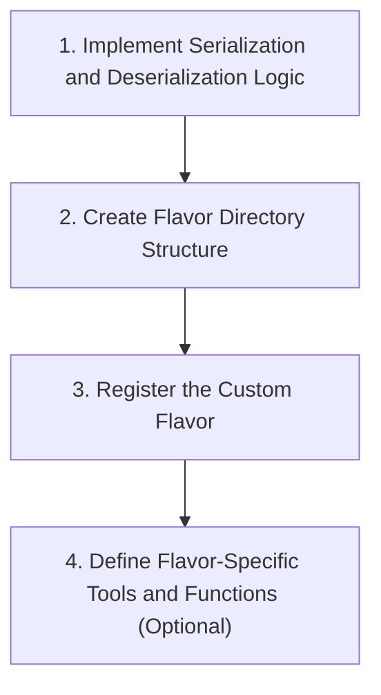

## Custom Flavor

- **[Custom Python Model vs. Custom Flavor]**
    - A custom Python model (created via the `pyfunc` module) is a way to handle libraries not natively supported by MLflow, but it still ultimately saves the model in the `python_function` flavor.
    - A **Custom Flavor** is a step further, allowing you to save a model in your own specific, unique format.
- **Practicality in Real-World Projects**
    - Creating a true custom flavor involves lengthy and advanced code.
    - For most objectives in real-time projects, the `pyfunc` module provides enough customization to get the job done without the complexity of a full custom flavor.

### Defining a Custom Flavor

- **High-Level Workflow**



- **Step 1: Implement Serialization and Deserialization Logic**
    - Define how to convert a specific model type into a serialized format for storage or transmission
    - Define the logic to reconstruct the model from that serialized format
- **Step 2: Create Flavor Directory Structure**
    - Build a directory containing all necessary files and metadata for serialization, deserialization, and serving
    - A common convention is to include an `MLmodel` file to define the flavor and its associated tools
- **Step 3: Register the Custom Flavor**
    - Create a unique sub-directory within the `mlflow/models/` directory
    - Place all relevant flavor files inside this sub-directory
- **Step 4: Define Flavor-Specific Tools and Functions (Optional)**
    - Include custom loading or serving logic
    - Add utility functions specifically designed for working with that custom flavor

### Example: Creating a custom "sktime" flavor

- **[sktime vs. Python Function Model]**
    - `sktime` is a library for time series analysis not natively supported by default MLflow flavors.
    - While you could use a custom Python model (inheriting `mlflow.pyfunc.PythonFunction`), a full custom flavor is used when you need to define specific serialization and deserialization logic.
- **Implementation Details**
    - **Required Imports**:
        - `sktime` library
        - Various `mlflow` utilities
        - `mlflow.pyfunc` (to add the Python specification to the MLflow model configuration)
    - **Key Variables**:
        - `FLAVOR_NAME = "sktime"`
        - `SERIALIZATION_FORMAT = "pickle"`
    - **Logging Process**:
        - Custom flavors use standard MLflow functions like `save_model` and `log_model` to log the model in MLflow format.

### Implementation of `save_model()`

- The `save_model()` function handles the complex task of organizing the model output directory
    - It allows for specifying directory structures and necessary configurations
    - It manages environment dependencies, automatically writing `requirements.txt` and `conda.yml` to the output directory
    - It provides flexibility to add additional parameters as flavor-specific attributes to the model configuration
- **[Flavor Composition]** The function leverages `add_flavor` and `model.save` to produce an `MLmodel` configuration file that can describe multiple flavors simultaneously (e.g., combining a custom flavor with the `python_function` flavor)

### Custom Model Output Structure

- When a custom model is saved, it produces a standardized directory containing the model artifacts and metadata

#### Directory Contents

- `my_model/` (Example output directory)
    - `conda.yml`: Defines the Conda environment
    - `mlmodel`: The YAML-formatted configuration file describing the flavors
    - `python_env.yaml`: Environment specification
    - `requirements.txt`: Pip dependency list
    - `sktime_model.pkl`: The serialized model file
    - `serialization_format.pkl`: Additional serialized data

#### The `MLmodel` File

- A YAML file that describes the flavors associated with the model
- Example structure for a model with two flavors:

```yaml
flavors:
  python_function:
    args:
      conda: conda.yml
      virtualenv: python_env.yaml
      loader_module: flavor
      model_path: model.pkl
      python_version: 3.9.5
  sktime:
    code: |
      pickle_model: model.pkl
      serialization_format: pickle
      sktime_version: 0.16.0
```

### Managing Dependencies and Logging

- **Dependency Management**
    - The `get_default_pip_requirements` function is used to define the set of pip dependencies produced by the flavor
    - While the example shows minimum requirements, in practice, this should include any dependencies needed for pre-processing or post-processing steps
    - A similar function, `get_default_conda_env`, handles conda environment requirements
- **The&#32;`log_model`&#32;Function**
    - Acts as a wrapper around the `mlflow.models.log` method
    - Enables logging the custom model as an artifact to the current MLflow run
    - **[Why it's simplified]** It does not require manual definition of directory structures, configurations, or pip requirements because it internally calls the `save_model` function to persist the model

```python
def get_default_pip_requirements(include_cloudpickle=False):
    pip_deps = ["sktime", "cloudpickle"]
    if include_cloudpickle:
        pip_deps.append("cloudpickle")
    return pip_deps

def get_default_conda_env(include_cloudpickle=False):
    additional_pip_deps = get_default_pip_requirements(include_cloudpickle)
    return {"channels": ["defaults"],
            "dependencies": additional_pip_deps}

def log_model(sktime_model, artifact_path, serialization_format=SERIALIZATION_FORMAT):
    mlflow.models.log(
        sktime_model,
        artifact_path,
        flavor_module=sktime_flavor,
        serialization_format=serialization_format)
```

### The `load_model()` Function

- Defines how a packaged custom model is loaded for subsequent inference
- Uses configuration attributes from the specified model directory to reconstruct the model from its serialized representation
- **[Implementation Detail]** The function retrieves necessary components (like the model path, configuration, and serialization format) from the `MLmodel` file to rebuild the object

```python
def load_model(path, serialization_format=SERIALIZATION_FORMAT):
    config = get_flavor_configuration(path)
    artifact_path = config.get("model_path")
    artifact_uri = artifact_path.join(path)
    sktime_model = sktime.load(artifact_uri)

    if serialization_format == SERIALIZATION_FORMAT_PICKLE:
        return pickle_model.load(artifact_uri)
    elif serialization_format == SERIALIZATION_FORMAT_CLOUDPIKLE:
        import cloudpickle
        return cloudpickle.load(artifact_uri)
```

### Creating an Inference Wrapper

- A wrapper class is created to define the `python_function` flavor
- The design of this class determines how the flavor's inference API is exposed when making predictions
- **[API Compatibility]** To match built-in MLflow flavors, the `predict` method of the wrapper class (e.g., `SKTimeWrapper`) is designed to accept a single-row Pandas DataFrame as its argument

```python
class SKTimeWrapper:
    def __init__(self, sktime_model):
        self.sktime_model = sktime_model

    def predict(self, dataframe, params=None) -> pd.DataFrame:

# Implementation details for inference...
        pass
```

### Summary of Custom Flavor Definition

- The process involves several complex implementation steps
- In most practical scenarios, writing a custom framework is unnecessary as built-in flavors cover the majority of use cases

## Model Evaluation

- Essential step before deployment to ensure only the best model is selected from multiple runs and experiments
- **[Purpose]** To assess how well a trained model performs on unseen data by measuring predictive accuracy and comparing it against baselines
- ### The `mlflow.evaluate()` API
    - Evaluates the performance of MLflow models
    - Automatically saves resulting evaluation metrics and graphs to the tracking server
    - Works by applying the trained model to a specified dataset

### Evaluation Capabilities of `mlflow.evaluate()`

- **Performance Metrics**
    - The specific metrics used depend on the type of machine learning task
    - **Classification tasks**: Accuracy, precision, recall, F1 score, and (AUC-ROC)
    - **Regression tasks**: Mean Squared Error (MSE) and Mean Absolute Error (MAE)
- **Model Performance Plots**
    - Generates visual representations to help understand behavior in different scenarios
    - Common plots include:
        - Confusion matrix
        - Precision-recall curve
        - ROC curve
- **Model Explanations**
    - Aims to explain predictions and identify the factors driving them
    - **[Purpose]** Crucial for understanding decision-making, identifying biases, or gaining data insights
    - Supported techniques include feature importance and SHAP values
- **Logging to MLflow Tracking**
    - All evaluation outputs are automatically logged to the tracking server:
        - Computed metrics
        - Generated plots
        - Model explanations

### MLflow Tracking Utility

- Used to organize and compare different model runs
- Enables tracking of experiment configurations
- Facilitates sharing results with team members

### Supported Model Flavors for Evaluation

- Currently supports models with the `python_function` (pyfunc) flavor
    - This is a generic flavor used for both classification and regression tasks

### Parameters of `mlflow.evaluate()`

```python
< model: str, data: *, model_type: str, targets=None, dataset_path=None, feature_names: Optional[list] = None, evaluators=None, evaluator_config=None, custom_metrics=None, custom_artifacts=None, validation_thresholds=None, baseline_model=None, env_manager='local' >
```

- **model**
    - Represents the model to be evaluated
    - Can be a `pyfunc` model instance or a URI referring to a model
- **data**
    - Specifies the evaluation data
    - Can be a numpy array or list of evaluation features (excluding labels)
    - Can be a Pandas or Spark DataFrame containing both features and labels
        - **Note**: For Spark DataFrames, only the first 10,000 rows are used for evaluation
    - Can be a Python class instance of `mlflow.data.dataset.Dataset` containing features and labels
- **model\_type**
    - Describes the type of model being evaluated
    - Supported types include:
        - `regressor`
        - `classifier`
        - `question-answering`
        - `text-summarization`
- **targets**
    - Contains the list of evaluation labels

### `mlflow.evaluate()` Parameters (Continued)

- **targets**
    - The value depends on the format of the `data` parameter:
        - If `data` is a numpy array or list: `targets` must be a numpy array or list of evaluation labels
        - If `data` is a DataFrame (Pandas or Spark): `targets` should be the column name in the DataFrame containing the labels
        - If `data` is a Python class instance: `targets` is optional
- **dataset\_path** (optional)
    - Represents the path where the data is stored
    - Used for lineage tracking and is logged to the `mlflow.datasets` tag
    - **Note**: This path must not contain any double quotes
- **feature\_names** (optional)
    - Behavior depends on the `data` parameter:
        - For numpy arrays or lists: provides a list of names for each feature
            - If not specified, names are generated as `feature_0`, `feature_1`, etc.
        - For Pandas or Spark DataFrames: provides a list of the feature column names
            - If not specified for a Spark DataFrame, all columns except the `labelColumn` are treated as features
- **evaluators**
    - Specifies a list of evaluator names to be used for the model evaluation
- **evaluators**
    - Specifies a list of evaluator names to be used for model evaluation
    - To see all available evaluators, use `mlflow.models.list_evaluators()`
    - If no evaluator is specified, MLflow automatically uses all evaluators capable of evaluating the specified model on the specified dataset
    - The default evaluator is identified by the name `default`
- **evaluator\_config**
    - A dictionary used to supply additional configurations to the specified evaluator(s)
    - If multiple evaluators are specified, use a nested dictionary where the evaluator name is the key
    - **Default Evaluator Options**:
        - `log_model_explainability`: A boolean specifying whether to log model explainability insights (default is `True`)
        - `explainability_samples`: The number of sample rows used for computing explainability insights (default is `2000`)
        - `metric_prefix`: An optional string prepended to the name of each metric and artifact produced during evaluation

### custom\_metrics

- An optional parameter that accepts a list of evaluation metric objects
- **[Why use it?]** Because MLflow allows you to define custom evaluation metrics that go beyond the standard metrics provided by default evaluators
- Uses the `EvaluationMetric` class to define these custom metrics

#### Example: Creating a custom RMSE metric

```python
import mlflow
import numpy as np

def root_mean_squared_error(eval_df, builtin_metrics):
    return np.sqrt(np.abs(eval_df["prediction"] - eval_df["target"]) ** 2).mean()

rmse_metric = mlflow.models.make_metric(
    eval_fn=root_mean_squared_error,
    greater_is_better=False,
)

mlflow.evaluate(..., custom_metrics=rmse_metric)
```

### custom\_artifacts

- An optional parameter that accepts a list of custom artifact functions
- **[Why use it?]** Because you can define custom functions to generate specific artifacts during evaluation
    - Examples include generating a `.json` artifact from a JSON object string
    - Or a `.csv` artifact from a pandas DataFrame
- Once defined, these functions are passed as arguments to the `custom_artifacts` parameter in `mlflow.evaluate()`

### validation\_thresholds

- An optional parameter that accepts a dictionary
- **[What it does]** It specifies custom thresholds for classification metrics
    - Specifically used for metrics like precision, recall, and F1 score

### Remaining `mlflow.evaluate()` Parameters

- `validation_thresholds` (optional)
    - Accepts a dictionary where keys are metric names and values are the threshold values
    - **[For Classification]**: Used to classify examples into classes based on output scores (e.g., if score > threshold, it is Class A; otherwise, Class B)
    - **[For Regression]**: Used to compare models against a specific metric value to decide acceptance
        - Example: Setting an MSE threshold of 0.5 means a new model is only accepted if its MSE is lower than 0.5
    - Note: Thresholds can be defined for any number of metrics within the dictionary
- `baseline_model` (optional)
    - Specifies a baseline model to use for performance comparison during the evaluation process
- `env_manager` (optional)
    - Specifies the execution environment for the model evaluation

### Summary of `mlflow.evaluate()`

- A versatile function for comprehensive model performance assessment
- **Key capabilities include:**
    - Using various built-in or custom evaluators
    - Implementing customized evaluation metrics
    - Comparing models against baseline models
    - Providing flexibility in handling different data types, feature names, and evaluation settings

### Constructing a Basic `mlflow.evaluate()` Call

To perform a basic evaluation, several key parameters must be passed to the function:

- **`model`**
    - The URI of the model to be evaluated
    - This can be retrieved using `mlflow.get_artifact_uri()`
- **`data`**
    - The test dataset to be used for evaluation (e.g., `test`)
- **`targets`**
    - The name of the label/target column in the dataset (e.g., `"quality"`)
- **`model_type`**
    - The category of the model, such as `"regressor"` or `"classifier"`
- **`evaluators`**
    - The specific evaluators to use; can be set to the default if no custom ones are needed

```python

# Example of a basic evaluation call
mlflow.evaluate(
    model=runs.run_id, # or an artifact URI
    data=test,
    targets="quality",
    model_type="regressor",
    evaluators="default"
)
```

### Default Evaluator and Model Explainability

- When using the `default` evaluator in `mlflow.evaluate()`, **SHAP (SHapley Additive exPlanations)** is used for model explainability by default
    - This generates graphs to help explain model predictions
    - **[Requirement]**: The `shap` library must be installed in the environment

```bash
pip install shap
```

- **[Observation]**: During execution, the terminal will indicate the evaluation process, for example:
    - `INFO mlflow.models.evaluation.base: Evaluating the model with the default evaluator.`
    - `INFO mlflow.models.evaluation.default_evaluator: Shap explainer Permutation is used.`

### Evaluator Configuration Options

When configuring the default evaluator in `mlflow.evaluate()`, several options can be adjusted via the `evaluator_config` parameter:

- **`explainability_algorithm`**
    - Specifies the algorithm used for generating explainability insights
    - Supported algorithms include:
        - `exact`
        - `partition`
        - `kernel`
    - **[Note]**: The default is typically the "auto" algorithm, which selects the best explainer based on the model.
- **Other available configurations include:**
    - `log_model_explainability`: A boolean specifying whether to log model explainability insights (default is `True`)
    - `explainability_samples`: The number of sample rows to use for computing model explainability insights (default value is `2000`)
    - `explainability_kernel`: The kernel function used by the SHAP kernel explainer (available values are `"identity"` and `"logit"`)
    - `max_classes_for_multiclass_roc`: The maximum number of classes to log for this per-class ROC curve and Precision-Recall curve
    - `metric_prefix`: An optional prefix to prepend to the name of each metric and artifact produced during evaluation
    - `log_metrics_with_dataset_info`: A boolean specifying whether or not to include information about the evaluation dataset in the name of each metric logged during evaluation (default is `True`)
    - `pos_label`: Specifies the positive label to use when comparing classification metrics (e.g., precision, recall, F1) for binary classification models
    - `average`: The averaging method to use when computing classification metrics (e.g., precision, recall, F1) for multiclass classification models (default is `"weighted"`)
    - `sample_weights`: Weights for each sample to apply when computing model performance metrics

### MLflow Evaluation Outputs in the UI

- **Artifacts Structure**
    - The evaluation process creates an `explainer` directory within the run artifacts
    - This directory contains explainability files (e.g., `explainer.shap`) and other necessary dependency files
    - Evaluation also generates various important plots for model analysis
- **Metrics in the UI**
    - The default evaluator automatically computes and logs several popular metrics depending on the task
    - **Regression Metrics Examples:**
        - Mean Absolute Error (MAE)
        - Mean Squared Error (MSE)
        - Root Mean Squared Error (RMSE)
        - $R^2$ Score
    - **[Note on Duplicate Metrics]**
        - If metrics like `rmse` or `r2` are explicitly logged in the code (e.g., in a dictionary passed to the evaluator), they may appear twice in the UI
        - This happens because both the manual logging and the default evaluator's automatic calculations are recorded as separate entries

### Comparing Multiple Runs in an Experiment

- **The Goal of Evaluation**
    - The evaluation process is designed to compare the metrics of different runs within an experiment
    - This comparison allows for selecting the best model based on performance data
- **Executing Comparative Runs**
    - To compare models, a second run is initiated with different hyperparameters
    - **Example: Impact of Hyperparameter Tuning**
        - Modifying parameters like `alpha` and `l1_ratio` (e.g., setting them to 0.7) allows for observing how these changes affect the resulting evaluation metrics

```python

# Example of modifying hyperparameters for a new run
lr.fit(train_x, train_y)

# Adjusting parameters to observe impact on metrics
lr = ElasticNet(alpha=0.7, l1_ratio=0.7, random_state=42)
lr.fit(train_x, train_y)
```

### Comparing Runs in the MLflow UI

- **Performing a Comparison**
    - Once multiple runs have been executed within an experiment, you can compare them directly in the UI
    - **Steps to compare:**

        1. Navigate to the **Experiments** tab in the MLflow UI
        2. Select the specific runs you want to compare
        3. Use the comparison view to evaluate metrics and parameters side-by-side

### The MLflow Comparison Report

- When comparing selected runs in the UI, a Comparison Report is generated to facilitate side-by-side analysis
- **Report Sections:**
    - **Visualizations:** Contains various plots to visualize differences between runs
    - **Run Details:** Provides specific details for each selected run
    - **Comparison Sections:** Dedicated views for comparing:
        - Parameters
        - Metrics
        - Tags
- **Visualization Plot Types:**
    - Parallel Coordinates Plot
    - Scatter Plot
    - Box Plot
    - Contour Plot

### Parallel Coordinates Plot

- A method for visualizing high-dimensional datasets in a two-dimensional space
    - Humans are generally limited to perceiving only three or four dimensions
    - This plot offers a way to see much higher dimensional spaces
- **How it works:**
    - Each variable or feature in the dataset is represented as a vertical axis
    - A line is drawn between the values of each variable for a single data point
    - The resulting plot consists of a set of parallel lines connected by lines representing individual data points
- **Key Uses:**
    - Identifying patterns of relationships between variables (e.g., correlations or clusters)
    - Detecting outliers or unusual observations

### Configuring Parallel Coordinates in MLflow

- To use the plot, specific parameters and metrics must be selected to be visualized as vertical axes
- **Example Configuration:**
        - **Parameters selected:**
                - `alpha`
                - `l1_ratio`
        - **Metrics selected:**
                - `R2`
                - `mean_absolute_error`

### Interpreting Parallel Coordinates Plots

- **How a single run is represented**
    - Each run is shown as a single continuous line that travels through the vertical axes
    - The line connects a dot on each vertical axis, where each dot represents the specific value for that parameter or metric
    - **Example of a run's path:**
        - A dot on the `alpha` axis connects to a dot on the `l1_ratio` axis
        - The line then shifts up or down to meet the value on the `R2` axis, and so on
- **Limitations and Strengths**
    - **Small datasets:** With only two runs, the plot provides very little information as there is no way to discern a pattern from just two lines
    - **Large datasets:** When many runs are plotted, the visualization becomes powerful for identifying:
        - Clusters of lines indicating similar model behaviors
        - Outliers that deviate from the general pattern

### Scatter Plots

- Used to plot points in pairwise coordinates to display the relationship between two variables
- Used to plot points in pairwise coordinates to display the relationship between two variables
    - Each data point is represented on a 2D coordinate system
    - One variable is assigned to the x-axis and the other to the y-axis
- **[Purpose]** To visually assess if there is a positive, negative, or no relationship between the two selected variables
- **MLflow Implementation**
    - Users can select any parameter or metric from a dropdown menu for both the x and y axes
    - **Example Comparison:**
        - **X-axis:** `alpha`
        - **Y-axis:** `mean_absolute_error`
        - In this configuration, a run with `alpha = 0.4` might result in a lower `mean_absolute_error` compared to a second run, indicating better performance for that specific parameter.
        - Changing the axes (e.g., `l1_ratio` on x-axis and `R2` on y-axis) allows for different performance insights, such as identifying which run achieves a higher `R2` score.

### Box Plot

- Also known as a **whisker plot**
- A technique that provides a visual summary of the distribution of a continuous variable
- **Key components:**
    - **Box:** Represents the interquartile range (IQR) of the data
    - **Whiskers:** Lines extending from the box that indicate the overall range of the data
- **[Purpose]** To summarize the location, spread, and skewness of a dataset
    - Useful for comparing distributions across multiple groups or variables
    - Effective for identifying outliers or extreme values
- **Note on small datasets:** When comparing only two runs, the box plot may not provide much helpful visualization

### Contour Plot

- Also known as a **level plot**
- A visualization used to represent three-dimensional (3D) data within a two-dimensional (2D) space
- **How it works:**
    - It displays contour lines of a 2D function of two variables
    - The height of these contour lines represents the function value
- **[Purpose]** To identify regions of high and low values, as well as to detect strengths and patterns in complex data
- **Note on small datasets:** Since it is designed to visualize complex 3D patterns, it is not useful when comparing only two data points

### Comparing Run Details

- Provides a side-by-side breakdown of specific metadata for the selected runs
- **Key attributes compared:**
    - **Run ID:** The unique identifier for the run
    - **Run Name:** The human-readable name assigned to the run
    - **Start Time & End Time:** Timestamps indicating when the run began and finished
    - **Duration:** The total time taken for the run to complete

### Comparison Sections

- **Parameters:** A list of the configuration settings used in each run
- **Metrics:** A section showing all tracked performance metrics for the selected runs
    - **[Note on&#32;`mlflow.evaluate`:]** Unlike previous methods where metrics were manually computed and logged in code, `mlflow.evaluate` automates the computation and comparison of these metrics.
- **Tags:** A section to compare metadata tags associated with the runs

### Customizing Evaluation

- The default `mlflow.evaluate` method uses a standard set of evaluators and metrics
- **[Limitation:]** The default set may not be sufficient for all personalized or complex use cases
- **[Solution:]** MLflow supports the creation of custom metrics and the evaluation of custom artifacts to provide deeper insights into model performance

### Model Threshold Validation

- Allows for assessing model quality by comparing it against a baseline model
- **Validation Thresholds:** A dictionary used to define passing criteria
    - **Keys:** Metric names (e.g., `accuracy`, `mse`, `r2_score`)
    - **Values:** `MetricThreshold` objects that specify requirements
- **Threshold Criteria:**
    - **Metric Values:** Defines the minimum or maximum values a metric must reach/stay within
    - **Gains:** Defines the absolute or relative improvement required compared to a baseline model
- **[Result of Failure:]** If the model fails to meet these criteria, a `ModelValidationError` is raised

### Performance Validation Implementation

- To compare an existing model (e.g., Elastic Net) against a baseline, a baseline model like `DummyRegressor` can be used
- **Initial Imports:**

```python
import warnings
import argparse
import pandas as pd
import numpy as np
from sklearn.metrics import mean_absolute_error, r2_score
from sklearn.model_selection import train_test_split
from sklearn.linear_model import ElasticNet
import mlflow
import mlflow.sklearn
import pathlib
as os
from mlflow.signature import ModelSignature, infer_signature
from mlflow.types.schema import Schema, ColSpec
import sklearn
import joblib
from cloudpickle import load
from mlflow.models import metric_threshold
import matplotlib.pyplot as plt
from sklearn.dummy import DummyRegressor
from mlflow.models import MetricThreshold

logging.basicConfig(level=logging.INFO)
logger = logging.getLogger(__name__)
```

### Training and Logging the Baseline Model

- The baseline model (e.g., `DummyRegressor`) must be trained and logged similarly to the primary model
- **[Workflow for Custom Python Models:]**

    1. Train the baseline model
    2. Perform predictions on the test dataset
    3. Compute and print evaluation metrics (e.g., `RMSE`, `MAE`, `R2`)
    4. Save the baseline model as a `.pkl` (pickle) file
    5. Create a baseline artifact for the pickle file
    6. Load the baseline as an artifact within the `mlflow.pyfunc` function

- **Code Implementation for Baseline Metrics:**

```python

# Training and evaluating the baseline DummyRegressor
baseline_model = DummyRegressor()
baseline_model.fit(train_x, train_y)

baseline_predicted_qualities = baseline_model.predict(test_x)

# Computing metrics for the baseline
bt_rmse = bt_rmse, mse, MSE, UL2 = eval_metrics(test_y, baseline_predicted_qualities)
print(f"Baseline RMSE: {bt_rmse}")
print(f"Baseline MAE: {bt_mae}")
print(f"Baseline R2: {bt_r2}")

# Logging metrics to MLflow
mlflow.log_metrics({
    "Baseline rmse": bt_rmse,
    "Baseline r2": bt_r2,
    "Baseline mae": bt_mae
})
```

### Adapting the Custom Model Wrapper

- The `SklearnWrapper` class must be modified to handle both the original model and the baseline model
- **[The Problem:]** Currently, the `load_context` method in the wrapper looks for a specific original model name in the pickle file
- **[The Requirement:]** The logic must be updated so that it can identify and load either the primary model or the baseline model from the provided artifacts

### Parameterizing the Custom Model Wrapper

- To prevent issues when comparing models with different names, the `artifacts_name` is added as a parameter to the `__init__` function
- The `load_context` method is updated to use this parameter instead of a hardcoded name to select the correct artifact

**Updated&#32;`SklearnWrapper`&#32;Implementation:**

```python
class SklearnWrapper(mlflow.pyfunc.PythonModel):
    def __init__(self, artifacts_name):
        self.artifacts_name = artifacts_name

    def load_context(self, context):
        self.sklearn_model = joblib.load(context.artifacts[self.artifacts_name])

    def predict(self, context, model_input):
        return self.sklearn_model.predict(model_input, values)
```

- Once the wrapper is updated, the baseline model can be logged to the tracking server using the `mlflow.pyfunc.log_model` function, similar to the primary model

### Defining Model Thresholds

- Defining the baseline model was a prerequisite for setting up threshold functionality
- The `artifacts_name` must be specified in the original `log_model` function call

**Updated&#32;`log_model`&#32;call with&#32;`artifacts_name`:**

```python
mlflow.pyfunc.log_model(
    artifact_path="sklearn_mlflow_pyfunc",
    python_model=SklearnWrapper(baseline_sklearn_model),
    artifacts="baseline_artifacts",
    code_path="main.py",
    conda_env="conda.env"
)
```

- Thresholds are defined using a dictionary where the key is the name of the threshold (e.g., "mean squared error") and the value is an instance of the `MetricThreshold` class
- **`MetricThreshold`&#32;Parameters:**
    - `threshold_value`: The specific value the metric must meet (e.g., 0.5 for MSE, where the score must be smaller than 0.5 to be acceptable)
    - `mean_absolute_change`: The minimum absolute improvement required compared to the baseline model
        - For regression metrics, a positive value indicates the candidate model must show an absolute improvement greater than the baseline

**Threshold configuration example:**

```python
thresholds = {
    "mean squared error": MetricThreshold(
        threshold_value=0.5,
        mean_absolute_change=0.05,
        greater_is_better=False
    )
}
```

#### `MetricThreshold` Parameters (Continued)

- **`min_relative_change`**: Specifies the minimum relative improvement required for a metric compared to the baseline model
    - For example, a value of `0.05` means the candidate model must perform at least 5% better than the baseline to be accepted
- **`greater_is_better`** (or `higher_is_better`):
    - These two parameters have the same meaning and are interchangeable
    - It defines whether a higher value of the metric is considered an improvement or a degradation

### Integrating Thresholds into `mlflow.evaluate()`

- To enforce model quality, the thresholds and the baseline model must be passed into the `mlflow.evaluate()` function
- **`baseline_model`**: The URI of the baseline model used for comparison
- **`validation_thresholds`**: The dictionary containing `MetricThreshold` objects

**Implementation of&#32;`mlflow.evaluate()`&#32;with validation:**

```python

# Retrieve the URI for the baseline model
baseline_model_uri = mlflow.pyfunc.get_artifact_uri("baseline_sklearn_pyfunc")

# Perform evaluation with thresholds
mlflow.evaluate(
    artifacts_uri,
    test,
    target="quality",
    model_type="regressor",
    evaluators=["default"],
    custom_metrics=squared_diff_plus_two_metric,
    custom_artifacts=["prediction_target_scatter"],
    validation_thresholds=thresholds,
    baseline_model=baseline_model_uri
)
```

- This setup allows for an automated comparison between a candidate model (e.g., an Elastic Net model) and a baseline model (e.g., a `DummyRegressor`)

### Handling Threshold Violations

- If a candidate model fails to meet the defined thresholds, MLflow will raise an exception
- **Example Failure Scenario:**
    - **Threshold set:** MSE must be less than `0.5` (`greater_is_better=False`)
    - **Candidate Model Result:** MSE is `0.59`
    - **Outcome:** An exception is thrown because the performance did not meet the required standard

```text
INFO mlflow.models.evaluation.base: Validating model metrics
...
Exception: Metric mean_squared_error value threshold check failed: candidate model mean_squared_error = 0.594472351440022, mean_squared_error threshold = 0.5
```

### Adjusting Thresholds for Successful Validation

- If a validation fails because the candidate model's performance is not significantly better than the baseline, the threshold can be adjusted to facilitate a pass
- **Example Adjustment:**
    - **Original Threshold:** `0.5` (caused failure because candidate MSE was higher)
    - **New Threshold:** `0.6` (allows validation to pass)
    - **Context:** The baseline model's MSE was approximately `0.71`, so a threshold of `0.6` is more achievable for demonstration purposes

```python

# Adjusting threshold for demonstration
thresholds = {
    "mean_squared_error": MetricThreshold(
        threshold=0.6,
        min_relative_change=0.0,
        greater_is_better=False
    )
}
```

### Verifying Results in MLflow UI

- Once validation passes, the runs are recorded in the MLflow experiment
- **Artifact Availability:**
    - Upon opening a successful run in the UI, you can access the artifacts for both the **baseline model** and the **original (candidate) model**
    - This allows for direct inspection of the models and their associated evaluation outputs