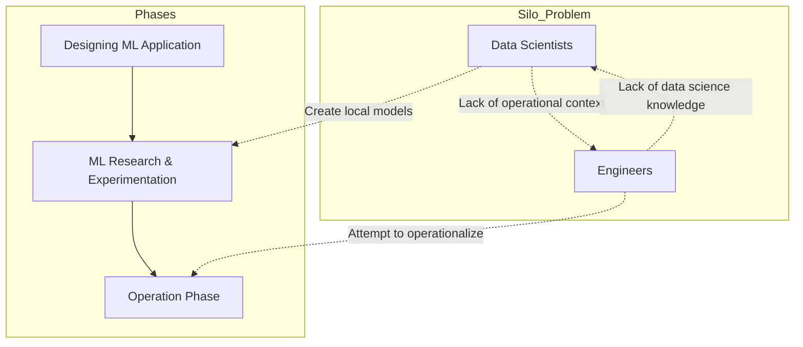
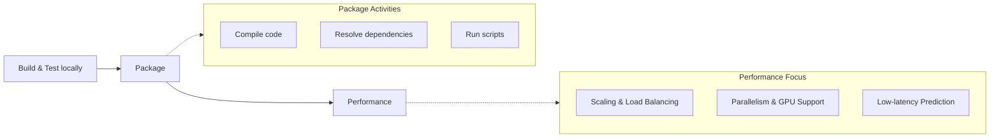
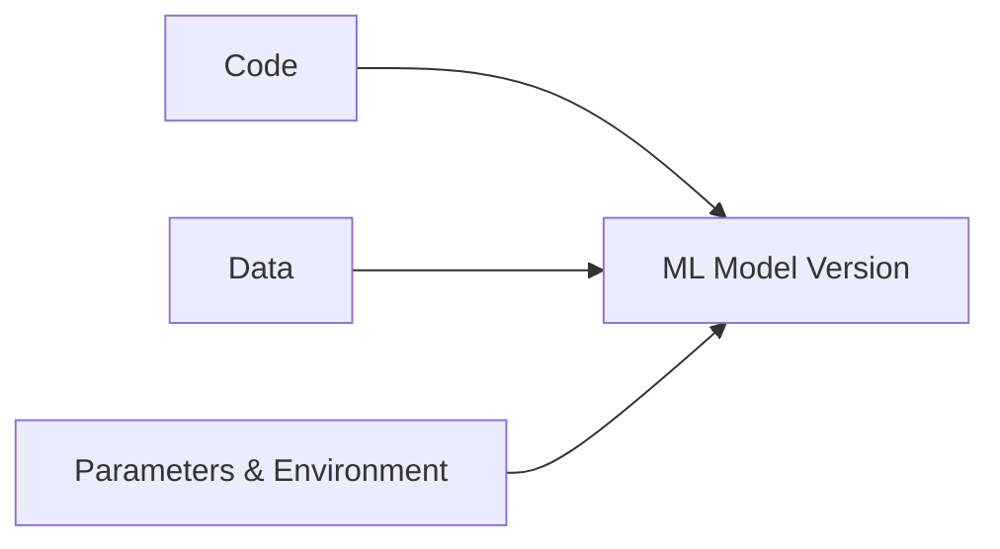
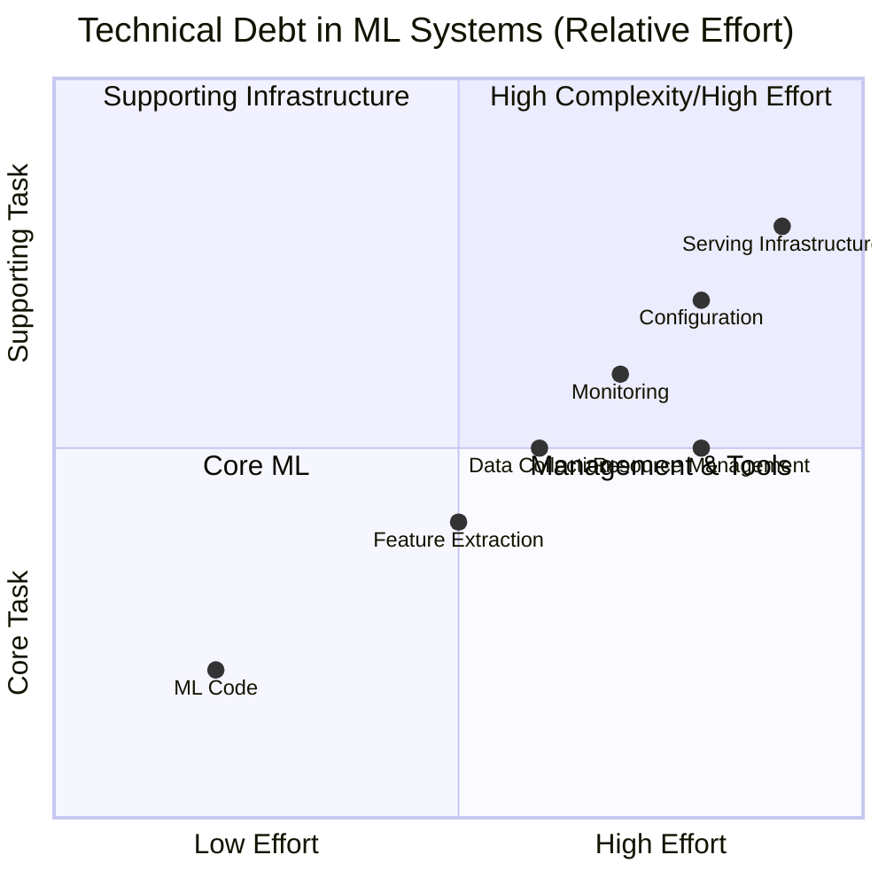

## What is MLOps?

- MLOps = Machine Learning + Operations
    - **ML**: Core model development
    - **Ops**: Productionizing and deploying code
- It is the integration of these two previously separate phases
- **[Core Definition]** A set of principles and practices to standardize and streamline the machine learning lifecycle management
    - It is not a new technology or tool, but a culture
    - It uses guidelines to seamlessly integrate and automate development with operational deployment
- It is an iterative, incremental process involving collaboration between:
    - Data Scientists
    - Data Engineers
    - Operations teams
- The goal is to build, automate, test, and monitor machine learning pipelines, similar to a DevOps project

### MLOps as DevOps for Machine Learning

- MLOps can be viewed as DevOps applied to machine learning projects
    - The lifecycle of building and deploying a model follows a similar pattern to standard DevOps
    - **[The Difference]** MLOps introduces higher complexity due to ML iterations and the involvement of data scientists
- MLOps builds upon DevOps principles by adding a third component to the pipeline:
    - Continuous Integration (CI)
    - Continuous Delivery (CD)
    - **Continuous Training (CT)**: An additional layer applied to ML processes to enable faster development, experimentation, and deployment, which increases workflow efficiency

### The ML Process Phases and the Silo Problem

- The complete ML process is divided into three broad phases:

    1. Designing the ML application
    2. ML research and experimentation
    3. Operation phase

- **[The Challenge: Siloed Teams]** Historically, these phases were handled by independent teams without a holistic view:
    - **Data Scientists**: Often created local models on their own systems without understanding the difficulties of operationalizing them for production
    - **Engineers**: Often lacked deep data science knowledge, making it difficult to operationalize the specific models provided by scientists

### Bridging the Gap with MLOps

- **[The Problem: Siloed Teams]** Without a streamlined system, teams often work in isolation
    - Data scientists and engineers may use different "languages" with minimal communication
    - This lack of integration causes ML models to stagnate as basic academic projects that never reach production
- **[The Solution: Interconnected Teams]** MLOps principles facilitate a shared platform
    - Teams become interconnected and can influence each other's workflows
    - While teams work collaboratively, their specific roles within the project remain clearly defined

### Traditional Machine Learning Lifecycle

- The upcoming investigation into why MLOps is necessary begins by revisiting the steps of the conventional machine learning lifecycle.

### Activities to Productionize a Model

- **[The Gap]** Building and training a model is only the first step in a much longer list of activities required to move it into a production environment.

#### Package

- After model building, the code must be prepared for deployment through several steps:
    - Compiling the code
    - Resolving dependencies
    - Running necessary scripts

#### Performance

- **Training Performance**: Training on massive datasets is time-intensive (hours or even days), requiring optimizations such as:
    - Scaling out for huge data
    - Implementing load balancing
    - Data partitioning for better management
    - Tuning code via parallelism, caching, or GPU support
- **Model (Inference) Performance**: The model must be capable of making predictions on production data (batch or stream) within strict time constraints.
    - **[Example: Fraud Detection]** In a credit card transaction use case, the model must be robust and highly available to provide predictions in milliseconds
    - Even a few milliseconds of delay is significant when a customer is waiting at a payment counter

### Instrument

- Once performance is addressed, the focus shifts to instrumentation aspects:
    - Versioning
    - Repository management
    - Security
    - Monitoring

#### Machine Learning Versioning

- **[The Complexity]** Unlike traditional software development where a version of the code produces a version of the software, ML versioning requires tracking multiple moving parts to achieve reproducibility.
- To produce a specific version of an ML model, you must version:
    - Code
    - Data
    - Algorithms
    - Feature parameters
    - Training environment (because models can behave differently in different environments)
- While tools like Git handle code versioning, additional layers are needed to manage the combination of all these variables.

#### The Importance of Versioning

- **[The Risk of Poor Versioning]** Without a streamlined mechanism, it becomes nearly impossible to quickly redeploy a specific historical model version that was found to be more accurate than the current one.
- **[Staff Turnover]** The risk of losing all model versions is highest when key contributors leave a company without a proper handover of the specific combinations of data, algorithms, and parameters used.

#### Monitoring in ML Systems

- **[Beyond System Health]** ML monitoring requires more than just traditional system-wide metrics; it must specifically address the data itself.
- **Data Monitoring**
    - **Quality and Drift**: Monitoring if the statistical properties of incoming data remain the same as the training data
    - **[Consequence]** If data drift occurs, the model's accuracy will inevitably be hampered.
- **System-Wide Monitoring**
    - Latency when calling machine learning API endpoints
    - General system health
    - Memory, CPU, and disk utilization
- **[The Feedback Loop Problem]** In many cases, model degradation is a manual discovery process. Without proper automated monitoring, the first sign of failure is often negative feedback from end-users.

### Automation in the ML Lifecycle

- **[The Problem with Manual Processes]** Many critical tasks in the ML lifecycle are currently performed manually, which is time-consuming and inefficient
    - Data versioning
    - Scalable model training
    - Model testing and validation
- **[The Inevitability of Retraining]** Models are not "set and forget"; they work over long periods and will eventually require retraining to maintain accuracy
    - Accuracy degrades as new patterns emerge in the data
    - Retraining is a recurring necessity, not a one-time event
- **[The Risk of Manual Retraining Cycles]** If the retraining process follows the full manual development and operations lifecycle, it can take weeks to redeploy a model
    - **[Business Impact]** During these weeks of inaccurate predictions, significant damage can occur, including financial loss and loss of management confidence

### Technical Debt in Machine Learning

- **[The Hidden Reality]** A significant amount of technical debt is involved in ML systems because the core ML code is only a tiny portion of the overall process.
- **[The Ecosystem]** Most of the effort and time spent by data scientists and engineers is directed toward the surrounding ecosystem:
    - Serving infrastructure
    - Configurations
    - Resourcing
    - Monitoring
- **[Impact of Manual Processes]** If these supporting activities are not standardized or are performed manually, they significantly impact project timelines.

### Challenges in Conventional ML Approaches

- **[Lack of Generalization]** There is no single, mature, managed solution or standardized paradigm for ML production.
- **[Absence of Standardized Practices]** There are currently no universally listed principles or practices to follow.
- **[Fragmented Methodologies]** Teams often follow their own unique paths to build and deploy models, which may work for small use cases but struggles to scale as industry demands grow.

### The Scalability Bottleneck in ML

- **[The Deployment Imbalance]** There is a massive disparity between the time taken to build a model and the time taken to deploy it
    - A model might be developed in a few weeks, yet deployment can be pending for a year
- **[The Need for Automation]** Scaling to manage tens or hundreds of models is impossible without streamlining and automating the deployment process
- **[The Core Pain Point]** The transition from model development to deployment is the primary bottleneck in enterprise-grade machine learning projects

## MLOps: A Cultural Integration

- **[Definition]** A culture comprising a set of principles and guidelines designed to seamlessly integrate and automate the development phase with the operational deployment phase
    - The goal is to ensure that as soon as a model is created, it is ready for deployment
- **[Breaking Silos]** MLOps aims to unify disparate roles into a single ecosystem:
        - Data Engineers
        - Data Scientists
        - Operations Teams
- **[Interconnected Phases]** Development and operations are not isolated; they are interconnected and influence one another

### Reducing Transition Friction

- **[The Problem]** Friction often occurs during the transition from a data scientist's notebook to an ML engineer's production code
- **[The Solution: Define Standards/Principles]** Establishing protocols to bridge the gap:
        - **Use notebook templates** to define common functionality
                - Examples include templates for database connections, fetching data, or running jobs on an ML engine
        - **Proper documentation**

#### Standardizing Processes and Tools

- **[Agnostic Code]** Create code that is understandable to both data scientists and ML engineers
    - Data scientists should prepare documentation files listing all dependencies and action items
    - ML engineers use these files as a reference to include all necessary packages and libraries in their code
- **[Version Control System]** Standardize version control for code, data, environments, and artifacts
    - **[Benefits of Versioning]**
        - **Experiment Tracking**: Allows comparison of different model versions, data versions, and algorithms to see how they impact accuracy
        - **Reproducibility**: Ensures that a model can be redeployed at any time by selecting the exact desired versions of code and datasets
        - **Knowledge Transfer**: Allows new team members to quickly get up to speed even if key contributors leave, because all metadata is saved in source control
- **[Performance and Deployment]** Leverage distributed computing and containerization tools
    - Containerization (e.g., Docker) is the standard solution for managing dependency issues during model deployment

### Automation through CI/CD

- **[The Shift]** Move from a model-centric approach to a pipeline-centric approach
    - **Model-centric**: Efforts are focused on creating a single model and manually transitioning it through steps like ingestion, preparation, validation, training, deployment, and monitoring
    - **Pipeline-centric (MLOps)**: Efforts are focused on building a CI/CD pipeline that encompasses all creation phases
- **[Benefits of CI/CD]** By putting the entire model creation code into production as a pipeline, the complete ML workflow is automated without manual intervention
    - Training and deployment can be triggered by schedules or specific events

### Monitoring

- **[Purpose]** Implement powerful, innovative tools to track the health and performance of the system
- **[What to monitor]**
    - Data and features
    - Model accuracy
    - Distribution
    - Latency
    - Uptime
    - Memory utilization
- **[Common Tools]**
    - Prometheus
    - Grafana

### Continuous Training

- **[Definition]** The process of continuously re-training models using the existing deployed pipeline
- **[Triggers]** Retraining can be initiated by:
    - Specific triggers (e.g., performance degradation or data drift)
    - Regular time intervals/schedules

---

## MLflow

- **[Overview]** An open-source platform designed to address the challenges of deploying machine learning models in production environments
- **[Purpose]** Helps organizations automate the building, training, and deploying of machine learning models by providing specialized tools and services

### MLflow End-to-End Lifecycle

- **[Definition]** An open-source platform for managing the entire machine learning lifecycle
    - Includes experimentation, reproducibility, deployment, and a central model registry

### MLflow Primary Components

| Component | Purpose |
| --- | --- |
| MLflow Tracking | Used to track experiments by recording and comparing parameters and results |
| MLflow Projects | Packages code used in data science projects to ensure reusability and reproducibility |
| MLflow Models | Provides a standard unit for packaging and reusing models from various ML libraries across different serving and inference platforms |
| MLflow Model Registry | A central model store for collaboratively managing the full lifecycle, including versioning, state transitions, and annotations |

### MLflow Key Characteristics

#### Language Agnostic

- **Modular API-first approach**
    - Allows easy integration with existing ML code without significant changes
    - Functions are accessible via REST API and CLI
- **Language and Library Independence**
    - Not tied to any single library
    - Compatible with various programming languages (e.g., Python, R)

#### Compatibility

- Works with numerous libraries, development tools, and frameworks
- **Integrated with major ML frameworks:**
    - TensorFlow
    - PyTorch
    - Keras
    - Apache Spark
    - Scikit-learn

#### Integration and Deployment

- Supports the full workflow: building models, logging metrics/parameters/artifacts, packaging code, sharing with teammates, registering models, and production deployment
- **Deployment targets include:**
    - Docker containers
    - Kubernetes clusters
    - Apache Spark

#### Creation and History

- **Created by Databricks**
    - Founded by the original creators of Apache Spark
    - Development is sponsored by Databricks but supported by global contributors
- **Release History**
    - First version released in June 2018

### MLflow Adoption and Availability

- **[Open Source vs. In-house]** Unlike the MLOps platforms used internally by companies like Facebook, Uber, and Google, MLflow is available as an open-source platform
- **[Industry Adoption]** Used by a wide range of organizations, from small to large, to put models into production
    - Examples include Microsoft, Facebook, Toyota, and Booking.com

### MLflow Component Deep Dive

Each of the four MLflow components is purpose-built to address specific lifecycle challenges:

- **MLflow Tracking**: Manages experimentation and recording of training sessions
- **MLflow Projects**: Handles code packaging for reusability and reproducibility
- **MLflow Models**: Provides standardized packaging for various ML libraries
- **MLflow Registry**: Acts as a central store for versioning and managing model states

#### MLflow Tracking

- **[Purpose]** To record and manage model training sessions
- **[The Need for Tracking]** Machine learning is heavily reliant on experimentation
    - Data scientists must test numerous combinations of:
        - Data
        - Hyperparameters
        - Features
        - Code
    - Tracking is necessary to identify which specific combination produced a successful model

#### The Problem with Manual Tracking

- **[Current Inefficient Approach]** Data scientists often track experiments by saving files in local folders
    - This leads to disorganized file naming conventions, such as:
        - `Classifier_model.ipynb`
        - `Classifier_model_v1.ipynb`
        - `Classifier_model_v2_final.ipynb`
        - `Classifier_model_v2_latest.ipynb`
    - **[The Risk]** This makes it difficult to know exactly which code, data, or hyperparameter values were used for a specific model, preventing colleagues from accurately reproducing results.

#### MLflow Tracking

- **[Definition]** A component that allows you to track experiments by recording specific metadata
- **[Key Capabilities]** Enables efficient experimentation and hassle-free comparison by recording:
    - Parameters
    - Code versions
    - Metrics
    - Results

#### MLflow Tracking Implementation

- **[Centralized Logging]** Allows users to log and track experiments in one place using several APIs:
    - Python API
    - REST API
    - R API
    - Java API
- **[Web-based User Interface]** Provides a visual way to interact with data rather than relying solely on terminals
    - Used for exploring runs
    - Visualizing metrics and parameters
    - Comparing different experiments
- **[Scalability]** Supports different types of tracking servers to facilitate sharing across teams:
    - Local servers
    - Remote servers

### MLflow Projects

- **[Purpose]** Addresses the packaging problem in machine learning
    - Designed to simplify the packaging, reproducibility, and sharing of ML code
    - Enables users to bundle code and dependencies into a reproducible format
    - Facilitates running the same experiments across different environments
- **[Project Structure]** Each project consists of a directory containing an `MLproject` file
    - **[MLproject file]** A simple file used to describe:
        - The project environment
        - Parameters
        - Entry points
        - A set of files containing the machine learning code and data

### MLflow Projects Details

- **[MLproject File Purpose]** Provides a standardized and reproducible way to define machine learning projects
    - Creates a self-contained package encapsulating code, data, and dependencies
    - Specifies project dependencies, entry points, and other configurations
- **[Command Line Interface (CLI)]** Enables users to create, run, and share projects through a terminal
    - Supports different project templates for quick starts
- **[Execution Environments]** Projects can be run locally or remotely using various environments:
    - Docker
    - Conda
    - Virtual environments

### MLflow Models

- **[Purpose]** Designed to streamline and simplify the process of deploying machine learning models to different environments
- **[Addressing the Deployment Gap]** Solves the traditional challenge of moving a trained model into production
    - Reduces the friction during the handover from data scientists to engineers
    - Minimizes the need for manual explanations regarding how a model should be invoked

### MLflow Models Details

- **[Standardized Packaging]** Reduces the operational overhead of moving models from data scientists to engineers
    - Packages trained models into a standard format supported by various downstream tools
    - Supports different deployment use cases, such as:
        - Real-time serving via a REST API
        - Batch inference processes
- **[Model Flavors]** Uses a protocol to save models in distinct "flavors" based on the library used
    - **[Why use flavors?]** To ensure the model can be understood and used by the specific downstream tools required for a particular use case
    - Examples of supported libraries/flavors:
        - Scikit-learn
        - TensorFlow (e.g., TensorFlow SavedModel format)
        - PyTorch (e.g., PyTorch state format)
        - Keras
        - Spark MLlib

### MLflow Models Deployment

- **[Deployment Options]** Models can be deployed using various methods:
    - REST APIs
    - Docker containers
    - Serverless functions
- **[Model Serving Frameworks]** Supports integration with specialized frameworks:
    - TensorFlow Serving
    - SageMaker
    - Azure ML

### MLflow Model Registry

- **[Purpose]** Acts as a centralized repository for managing machine learning models, their versions, and associated metadata
- **[Addressing Scalability Issues]** Replaces manual, non-scalable communication methods (like emails or spreadsheets) used to track models
    - **[The Problem]** As teams grow, managing models via email or sheets becomes impossible when handling hundreds or thousands of models
    - **[The Solution]** A single location where models can be easily uploaded, tagged, and discovered
- **[Key Capabilities]**
    - Provides a versioned repository that tracks changes to models over time
    - Enables collaboration on models among different team members
    - Allows for distinguishing between different model stages (e.g., production-ready vs. experimentation models)

### MLflow Model Registry Capabilities

- **[Lifecycle Management]** Provides a set of APIs and a user interface to collaboratively manage the entire lifecycle of a model
- **[Search Interface]** Enables users to search for specific models using various criteria:
    - Model name
    - Associated metadata
    - Other specific criteria
    - **[Benefit]** Allows for quick discovery of the correct model without manual browsing through large collections
- **[Metadata Attachment]** Users can add descriptive information to each model version to aid in identification:
    - Creator's name
    - Creation date
    - Brief description of changes made since the previous version

### Development Environment

- **[Tools Used]** The course utilizes specific software to work with MLflow:
    - PyCharm IDE
    - Anaconda distribution
- **[Anaconda]** A Python package distribution system that provides a convenient way to manage Python environments and packages