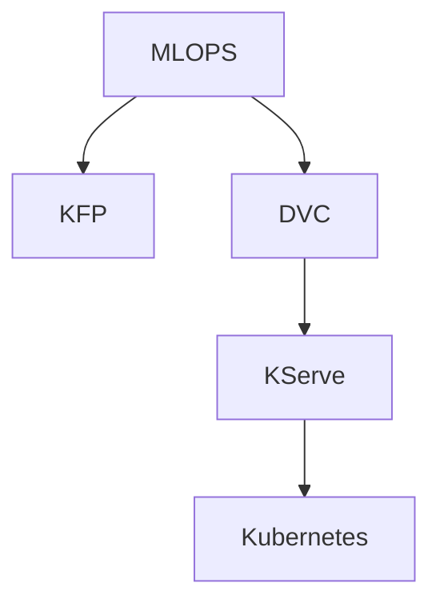
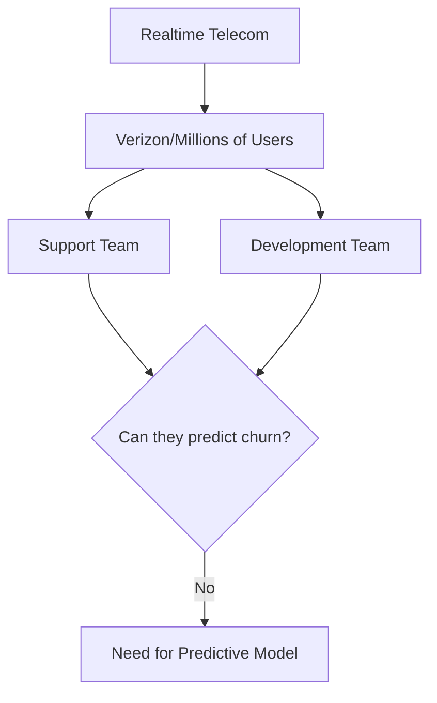
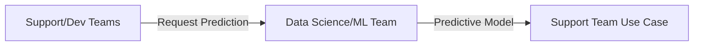
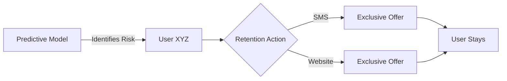
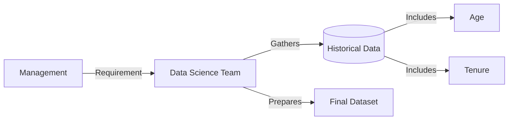
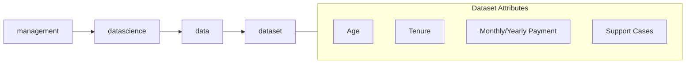
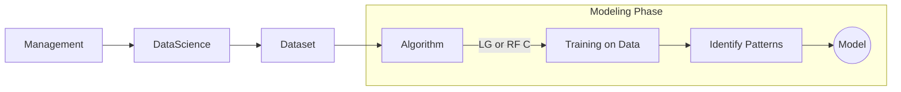
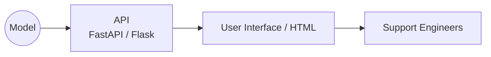
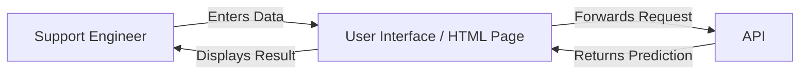
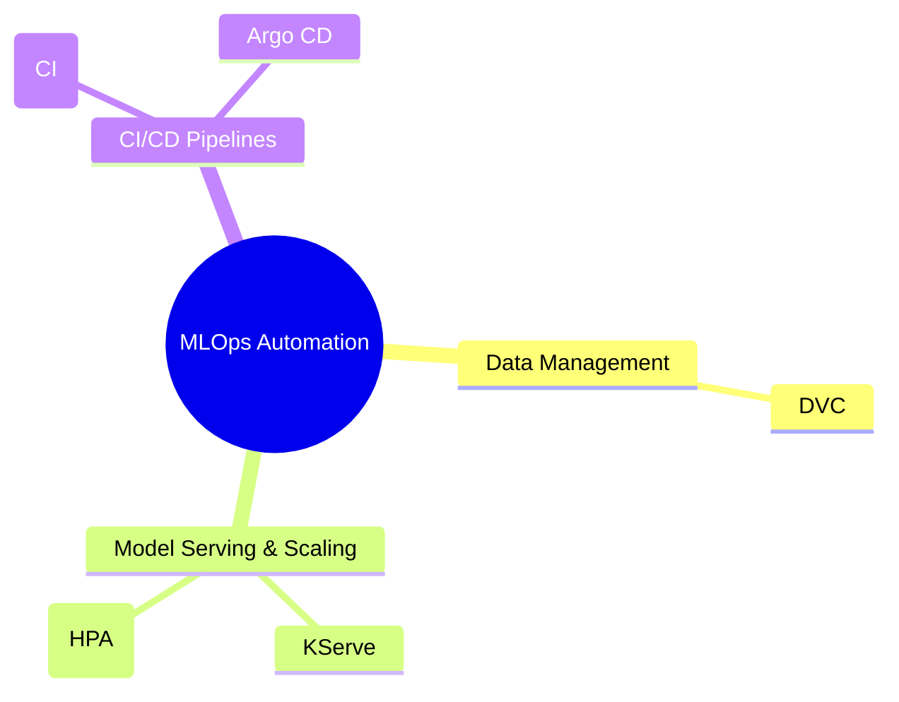

### Open Source MLOps Stack

- Transitioning from Kubeflow Pipelines to a modular open-source approach
- **Core Components**:
    - **DVC**: Used for data version control
    - **KServe**: Used for model serving and inference
    - **Kubernetes**: The target platform for deployment
- **[Why KServe + Kubernetes?]** Because KServe introduces HPA (Horizontal Pod Autoscaler) for efficient model serving



### Open Source MLOps Stack Expansion

- **[Expanded Stack]**
    - **GitHub Actions**: Used for automating data scientist activities, such as the training process
    - **Argo CD**: Used to deploy KServe or manifests to Kubernetes
- **[Why this stack?]**
    - It is easy to scale the model in the future for both performance and user load
    - This specific stack is gaining significant popularity in industry job descriptions

### Real-time Use Case: Customer Churn

- **Industry**: Telecom (e.g., AT&T, Verizon)
- **Context**: Service providers managing millions of users
- **Goal**: Use MLOps to improve the model and manage the scale of user data

### The Business Problem: Customer Churn

- **Market Dynamics**: Increased competition allows users to switch telecom providers easily if they are unsatisfied
- **Objective**: Companies need to identify and retain potential customers who are likely to leave
- **[The Limitation]** Neither support teams nor development teams can manually predict churn:
    - **Support Teams**: Usually come from non-technical backgrounds and cannot perform complex predictive analysis
    - **Development Teams**: Can implement logic and conditions, but they cannot inherently predict human behavior or dissatisfaction



### The Role of Data Science in Churn Prediction

- **Definition of Churn**: The act of a user leaving or terminating a particular subscription
- **The Solution**: Data Scientists and ML Engineers are brought in to build predictive models
    - These models allow support teams to query specific users (e.g., "Is user XYZ happy with the service?")
    - The output provides a percentage or likelihood of churn
- **[Why DS/ML?]** Because predicting human behavior and calculating probabilities is their core expertise, bridging the gap between support's needs and development's logic-based systems



### Taking Action on Churn Predictions

- **[The Goal]** To prevent users from switching to competitors or alternatives
- **Proactive Retention Strategies**: Once the support team identifies a high-risk user (e.g., "XYZ user"), the company can intervene with targeted incentives
    - **SMS**: Sending an exclusive offer directly to the user's phone
    - **Website/App**: Displaying lucrative offers when the user logs in
- **[The Result]** These personalized offers aim to persuade the user to stick with their current provider rather than churning



### Project Lifecycle and Data Preparation

- **Project Initiation**: The process begins at the management level
    - Management identifies the need for a solution (e.g., a churn model)
    - This decision triggers the formal project requirement
- **Data Science Responsibility**: Once the requirement is passed to the DS/ML team, their primary task is gathering and preparing the dataset
    - They rely on historical information to train the model
    - **[Data Sources]** They look back at users who have already churned over the last 3, 5, or 10 years
- **Feature Engineering Examples**: The dataset is built using specific customer attributes, such as:
    - **Age**: The age of the customer
    - **Tenure**: How many years the customer has been with the platform



### Dataset Features and Predictive Value

- **[Feature Selection]** Data scientists build the dataset using various customer attributes to capture patterns in behavior
    - **Payment Details**: Monthly and yearly payment amounts
    - **Support Engagement**: The number of support calls or tickets raised by a user
- **[Why these features matter]**: Certain data points provide high predictive power because they correlate with user stability or dissatisfaction
    - **Age**: Acts as a proxy for flexibility
        - Younger customers (e.g., 19-year-olds/Gen Z) are often more flexible and can switch providers easily due to less brand loyalty or information
        - Older customers (e.g., 70-year-olds) are statistically less likely to switch providers once established
    - **Tenure**: Reflects established trust
        - Long-term customers (e.g., 10+ years) have built trust with the provider, making them less likely to churn
    - **Support Cases**: Serves as a signal for dissatisfaction
        - A high volume of support tickets in a short period (e.g., 15 cases in a month) is a critical indicator that a user is at risk



### From Dataset to Machine Learning Model

- **[The Workflow]** Once the dataset is prepared, the data science process moves into modeling
    - **Step 1: Algorithm Selection**: Choosing a mathematical approach, such as:
        - Logistic Regression (LG)
        - Random Forest Classifier (RF C)
    - **Step 2: Training**: The algorithm is trained using the prepared dataset
    - **Step 3: Pattern Recognition**: During training, the algorithm identifies patterns within the data points that might not be obvious to human developers
    - **Step 4: Model Development**: The result of identifying these patterns is a mathematical function, which is defined as the "model"



- **[Transition to MLOps]** After the model is prepared by the data scientist, the process hands off to MLOps (Machine Learning Operations) to manage the model's lifecycle.

### The Role of ML Engineers

- **[Model Deployment]** Once the model is ready, ML engineers take over to make it functional for the organization
    - They develop an **API** (Application Programming Interface) for the model
    - Common tools for this include:
        - `FastAPI` (widely used currently)
        - `Flask` (a traditional option)
- **[Optimization]** ML engineers also focus on the performance and scaling of the models
    - Using platforms like `KServe` can assist with these operational requirements

### Bridging the Gap: API to User Interface

- **[Why an API is necessary]** The API acts as the middle layer between the raw model and the end user
    - Support engineers and business users typically do not use terminals or manual code requests (like `curl`)
    - The API allows the model to be integrated into a user-friendly interface
- **[The User Interface (UI)]** To make the model actionable for non-technical staff, the development team builds a UI
    - This UI binds to the API, allowing support teams to interact with model predictions through standard web elements (like HTML files/pages)



### End-to-End Project Flow

- **[User Interaction]** Support engineers interact with the model via a web interface (UI)
    - Users provide input data (e.g., age, tenure, month, year, and support history) on a webpage
    - The UI forwards this information as a request to the API
    - The API processes the request through the model and returns the prediction back to the UI



### The Role of MLOps Engineers

- **[Core Responsibility]** Automating manual activities and the deployment process
- **[Key Technologies & Focus Areas]**
    - **Data Version Control (DVC)**: Managing data lineage and versions
    - **KServe**: Implementing automatic scaling for models
    - **Kubernetes (HPA)**: Setting up namespaces, controllers, and Horizontal Pod Autoscaling (HPA)
    - **GitHub Actions (CI)**: Automating the continuous integration pipeline
    - **Argo CD**: Managing continuous deployment and manifests



### Project Repository Structure

- The project is organized within the `mlops-zero-to-hero` repository
- **[CI/CD for Models]** Located in the `10-cicd-for-models` directory
    - This directory contains two primary sub-folders:
        - `01-kubeflow`: Focused on Kubeflow-based pipelines
        - `02-Realtime-MLOps-Project`: Focused on the real-time implementation
- **[Real-time MLOps Implementation]** The `02-Realtime-MLOps-Project` folder contains the core scripts and configurations, including:
    - Training scripts
    - MLOps automation scripts
    - CI/CD related scripts
- **[Note on Implementation]** Within the project directory, specific files (like `.md` files) act as entry points containing links to the full GitHub repositories required for the training and deployment steps.

```text
mlops-zero-to-hero/
└── 10-cicd-for-models/
    ├── 01-kubeflow/
    └── 02-Realtime-MLOps-Project/
        ├── 02-dvc-docker-kserve-argocd.md
        └── [Links to training/MLOps/CI scripts]
```