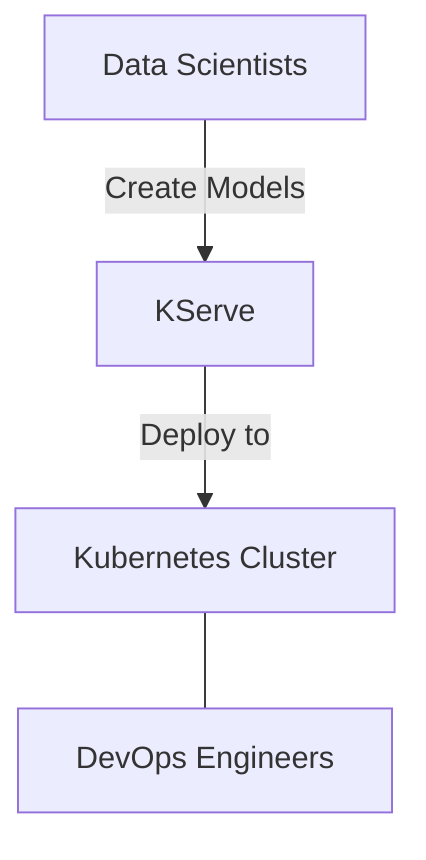
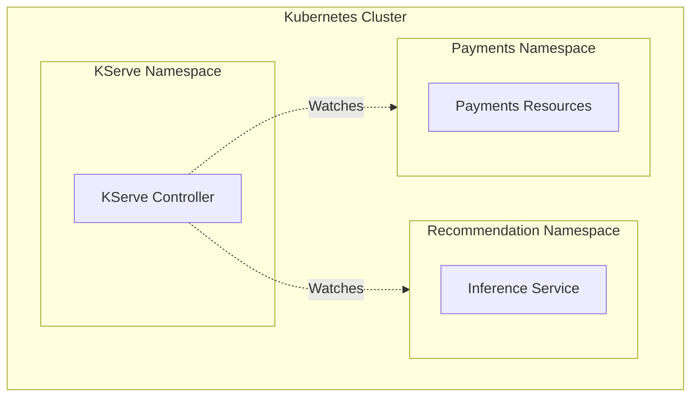
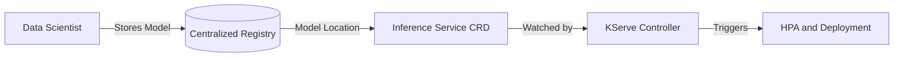
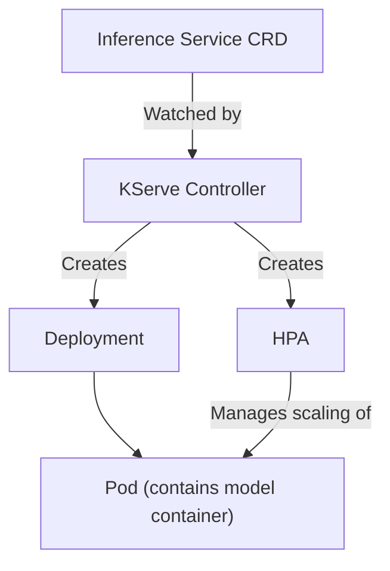
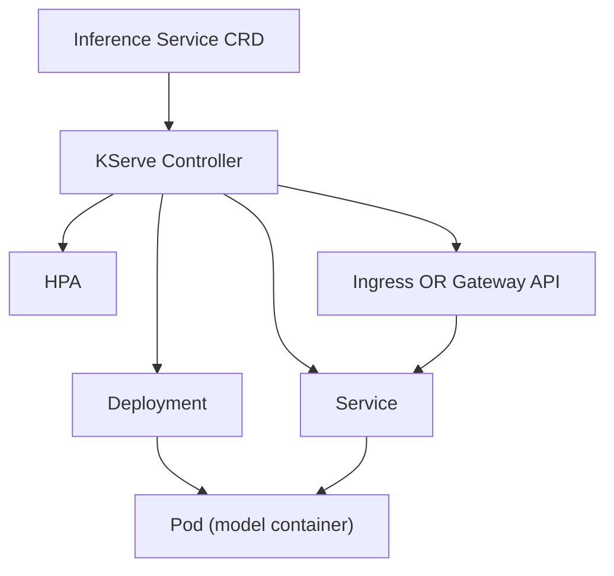
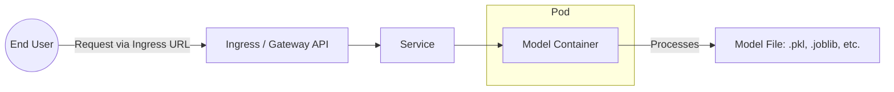
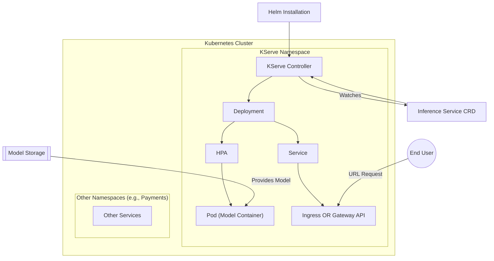

[00:00:28](https://10pearls.udemy.com/course/mlops-zero-to-hero/learn/lecture/53846869#search)

## KServe Architecture

- **[Purpose]** To enable faster shipping of recommendation models from data scientists to production
- **Deployment Workflow**
    - Data scientists create recommendation models (e.g., for movie recommendations)
    - MLOps engineers deploy these models using KServe
- **Infrastructure Requirements**
    - Requires a Kubernetes cluster
    - MLOps engineers can reuse existing clusters or share them with DevOps engineers



### KServe Initial Setup

- **Namespace Creation**
    - MLOps engineers create a dedicated namespace (e.g., `kserve-namespace`) within the Kubernetes cluster
- **KServe Controller Installation**
    - The KServe controller is an open-source component installed into the namespace
    - It can be deployed using Helm charts or Kubernetes manifests
    - This follows a similar pattern to other controllers like Argo CD, Istio, or Prometheus
- **Resource Scope**
    - The KServe controller is a cluster-scoped resource

### KServe Controller Scope and Inference Service

- **Cluster-wide Visibility**
    - Because the controller is cluster-scoped, it can watch all namespaces within the cluster
    - Example: It can monitor both a `recommendation` namespace and a `payments` namespace simultaneously
- **Inference Service**
    - A Custom Resource Definition (CRD) provided by the KServe project
    - It is the resource created by MLOps engineers within a specific namespace to manage model deployment



### Using the Inference Service (CRD)

- **Linking the Model**
    - The MLOps engineer uses the CRD to provide the specific location of the model file
    - This model is typically stored in a centralized registry created by the Data Scientist
- **Automated Orchestration**
    - As soon as the CRD is created, the KServe controller detects it
    - The controller reads the model location and automatically triggers the creation of resources like the Horizontal Pod Autoscaler (HPA)



### Automated Deployment Workflow

- **Orchestration Chain**
    - Once the KServe controller watches and reads the model location from the Inference Service CRD, it triggers the following sequence:
        - Creation of a **Deployment**
        - Configuration of a **Horizontal Pod Autoscaler (HPA)**
        - Provisioning of **Pods**
- **The Role of the Pod**
    - The Pod serves as the runtime environment that contains the actual **model container**



### Extended Automated Deployment

- **Networking Resources**
    - Beyond the compute layer, KServe automatically provisions:
        - A **Service** for the pod
        - An **Ingress** resource to manage external access
- **Gateway API Support**
    - KServe is capable of using the **Gateway API** instead of a standard Ingress
    - **[How to configure]** The choice between Ingress and Gateway API is determined during the KServe controller installation using Helm
    - This is managed by providing the desired setting in the `values.yaml` file



### End-to-End Request Flow

- **Request Path**
    - End users interact with the system via the **Ingress URL**
    - Requests sent to the Ingress are routed to the **Pod** where the model container is actively running
- **Model Framework Compatibility**
    - KServe supports various machine learning frameworks
    - **[Compatibility]** The model container can run diverse file types because KServe provides compatible model servers
        - Examples include `.pkl` files or `.joblib` files

### Summary of MLOps Responsibilities

- **Cluster Management**
    - The primary responsibility is to ensure a Kubernetes cluster is available (either by creating a new one or using an existing one)
    - Within that cluster, the engineer must set up the necessary namespaces to host the services



### KServe End-to-End Architecture

- **Deployment Lifecycle**
    - The MLOps engineer sets up the environment by:
        - Creating or using an existing Kubernetes cluster
        - Creating a dedicated namespace for KServe
        - Installing the KServe controller (typically via Helm)
    - Once the controller is running, it does not sit idle; it actively "watches" for specific resources
    - **[Trigger]** When an Inference Service (CRD) is created, the controller orchestrates the following:
        - Creates a **Deployment**
        - Configures a **Horizontal Pod Autoscaler (HPA)**
        - Provisions a **Pod** containing the model container
        - Sets up networking via a **Service** combined with either **Ingress** or **Gateway API**
- **Accessing the Model**
    - End users interact with the model through the provided **URL** (via the Ingress or Gateway API)



- **Resources and Documentation**
    - As an open-source project, configuration details and documentation are available via:
        - Official open-source documentation
        - The project's GitHub repository

### KServe Practical Demo Roadmap

- **Implementation Objectives**
    - Installing KServe on a Kubernetes cluster
    - Configuring the KServe environment
    - Observing the KServe controller's mechanism for watching Inference Service resources

### Cluster Setup and Verification

- **Prerequisites**
    - `kind` (Kubernetes in Docker)
    - `helm`
    - `trivy` (for security scanning/vulnerability detection)
- **Creating a local cluster with Kind**
    - Use the following command to create a cluster specifically named for the demo:

```bash
kind create cluster --name mlops-kserve-demo
```

    - This process typically takes between 60 seconds and 2 minutes
- **[Crucial Step] Verifying the active cluster**
    - Because MLOps engineers often manage multiple clusters, always verify that `kubectl` is pointing to the correct context before running deployment commands
    - Use `kubectl config current-context` to check the active cluster

### KServe Installation Prerequisites

- **[Safety Check] Context Verification**
    - Before installing any resources, verify which cluster `kubectl` is targeting
    - **[Why?]** In professional environments, engineers often manage both `dev` and `prod` clusters; accidentally deploying to `prod` can have severe consequences
    - Use the following command to confirm the active context:

```bash
kubectl config current-context
```

    - In this demo, the active context is `kind-mlops-kserve-demo`
- **Installing cert-manager**
    - A mandatory prerequisite for KServe installation
    - **[Why use it?]** KServe is used for model serving, and real-world applications require secure communication via HTTPS rather than unencrypted HTTP
    - cert-manager automates the process of:
        - Issuing SSL/TLS certificates
        - Managing certificate lifecycles
        - Eliminating the need to manually create or maintain self-signed certificates

### Cert-manager Installation

- Install cert-manager using the command provided in the project's GitHub repository
    - Example command structure:

```bash
kubectl apply -f https://github.com/cert-manager/cert-manager/releases/latest/download/cert-manager.yaml
```

- **[Crucial Check] Verify Pod Status**
    - After running the installation, you must verify that the cert-manager pods are in the `Running` state
    - **[Why?]** The KServe controller depends on cert-manager; if you attempt to install the controller before cert-manager is fully operational, the process may fail
    - Use the following command to check the status:

```bash
kubectl get pods -n cert-manager
```

### KServe CRDs Installation

- **[Mandatory Step] Install Custom Resource Definitions (CRDs)**
    - CRDs must always be installed *before* the controller itself
    - This is a universal requirement for Kubernetes controllers, including:
        - KServe
        - Istio
        - Rook
- The installation command for KServe CRDs follows this pattern:

```bash
helm install kserve-crd oci://ghcr.io/kserve/charts/kserve-crd --version v0.16.0
```

### KServe Controller Installation

- **[Step 1] Create a dedicated namespace**
    - It is best practice to isolate KServe resources within their own namespace
    - Command:

```bash
kubectl create namespace kserve
```

- **[Step 2] Install the KServe controller**
    - Once the CRDs are installed and the namespace is ready, use Helm to install the controller
    - The command specifies the OCI registry location and the desired version
    - Example command:

```bash
helm install kserve oci://ghcr.io/kserve/charts/kserve-crd --version v0.16.0 --namespace kserve
```

- **[Note on Startup Time]**
    - A Kubernetes controller runs as a pod and must transition to a `Running` state
    - This process typically takes between 60 seconds and 2 minutes to complete

### Deploying Inference Service

- **[Step 1] Create a dedicated MLOps namespace**
    - To isolate the inference services, create a new namespace (e.g., `ml`)
    - Command:

```bash
kubectl create namespace ml
```

- **[Step 2] Deploy the InferenceService Custom Resource**
    - Once the namespace is ready, deploy the `InferenceService` manifest to define the model serving instance
    - Command:

```bash
kubectl apply -n ml -f <EOF_file>
```

- **InferenceService Manifest Breakdown**
    - The manifest defines how the model is served, including its location and resource constraints
    - Key fields in the YAML structure:
    - `apiVersion`: `serving.kserve.io/v1beta1`
    - `kind`: `InferenceService`
    - `metadata`: Contains the name of the service (e.g., `sklearn-iris`)
    - `spec`:
        - `predictor`:
            - `model`:
                - `modelFormat`: The type of model being used (e.g., `sklearn`)
                - `storageUri`: The cloud storage path where the model artifacts are located
                    - Example: `gs://kfserving-examples/models/sklearn/1.0/model`
                - `resources`:
                    - `requests`:
                        - `cpu`: Amount of CPU requested (e.g., `100m`)
                        - `memory`: Amount of memory requested (e.g., `512Mi`)
                    - `limits`:
                        - `cpu`: Maximum CPU allowed (e.g., `1`)
                        - `memory`: Maximum memory allowed (e.g., `1Gi`)

```yaml
apiVersion: serving.kserve.io/v1beta1
kind: InferenceService
metadata:
  name: sklearn-iris
spec:
  predictor:
    model:
      modelFormat:
        name: sklearn
      storageUri: gs://kfserving-examples/models/sklearn/1.0/model
      resources:
        requests:
          cpu: "100m"
          memory: "512Mi"
        limits:
          cpu: "1"
          memory: "1Gi"
```

### Model Format and Storage

- The `modelFormat` field specifies the type of model being served
    - This must match the actual model type stored in the `storageUri` (e.g., `sklearn`, `TensorFlow`, `MLflow`, or `PyTorch`)
    - In this example, `sklearn` is used because the artifacts in `gs://kfserving-examples/models/sklearn/1.0/model` are scikit-learn models

### Deploying and Verifying the Service

- **[Step 3] Apply the manifest**
    - Execute the command to create the `InferenceService` in the `ml` namespace
    - Command:

```bash
kubectl apply -n ml -f <EOF_file>
```

- **[Step 4] Verify controller activity**
    - Once the resource is created, the KServe controller identifies the request and begins provisioning resources
    - You can observe the controller's response by checking the pods in the `kserve` namespace
    - Command:

```bash
kubectl get pods -n kserve
```

- **[Step 5] Inspect container logs**
    - To see the detailed operational logs of the controller, use the `logs` command with the specific pod name
    - Command:

```bash
kubectl logs <pod_name> -n kserve --all-containers
```

> Note: The logs will show the controller reconciling the `InferenceService` resource, which includes steps like resolving the container, checking resources, and managing the deployment mode.

### KServe Controller Reconciliation

- By inspecting the controller logs, you can see the reconciliation process in action for the `sklearn-iris` service
- **[What is reconciled?]** The controller identifies the `InferenceService` and automatically manages the following resources:
    - Deployment
    - Service
    - Horizontal Pod Autoscaler (HPA)

```text
reconciling inference service, apiVersion:serving.kserve/v1beta1, msg:Inference service deployment mode: "Standard"
reconciling inference service, apiVersion:serving.kserve/v1beta1, msg:Reconciling inference service
reconciling inference service, apiVersion:serving.kserve/v1beta1, msg:CubandConfigMapReconciler, msg:Reconciling CubandConfigMap
reconciling inference service, apiVersion:serving.kserve/v1beta1, msg:PredictorReconciler, msg:Resolved container, "name": "sklearn-iris", "model": "v0.18", "limits": {"cpu": "100m", "memory": "512Mi"}, "capabilities": {"drop": ["ALL"], "privileged": false, "runAsNonRoot": true}}
```

### Accessing the Service Locally

- **[Verify the Service]** Check that the service has been created in the `ml` namespace
    - Command:

```bash
kubectl get svc -n ml
```

- **[Local Access via Port-Forward]** Because this is a local cluster, standard Ingress is not used for external access
    - Instead, use `kubectl port-forward` to map the service to a local port
    - Command (mapping local port 8080 to the service):

```bash
kubectl port-forward svc/sklearn-iris-predictor 8080:80
```